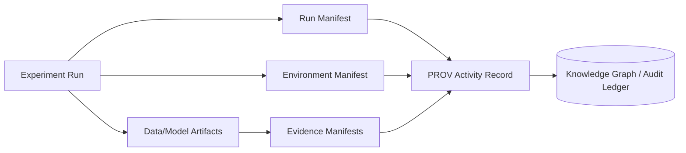

# 🌱 Environment Manifest (Reproducibility + Provenance)


This folder documents the **exact compute + software environment** used to generate an experiment’s artifacts.  
In the MCP/dev_prov experiment report flow, this is the **“Methods → Reproducibility backbone”**: without it, you can’t reliably re-run, audit, or compare results across time, machines, or CI runners.  [oai_citation:0‡Kansas-Frontier-Matrix_ Open-Source Geospatial Historical Mapping Hub Design.pdf](file-service://file-BJN3xmP44EHc9NRCccCn4H)  [oai_citation:1‡Additional Project Ideas.pdf](file-service://file-Pc2GNivcrHBeKjBQksLC3T)

---

## 🎯 Why this exists

KFM’s core philosophy is **provenance-first**: nothing is “a black box,” and results should be traceable and reproducible from the moment they’re created.  [oai_citation:2‡📚 Kansas Frontier Matrix (KFM) Data Intake – Technical & Design Guide.pdf](file-service://file-EbUCdsJMbu5KwpoKMrLrgj)

That same standard applies to **experiments** (modeling, AI analyses, ETL runs, simulations, dashboards): if we can’t describe the environment, we can’t defend the output.  [oai_citation:3‡🌟 Kansas Frontier Matrix – Latest Ideas & Future Proposals.docx.pdf](file-service://file-SQ3f7ve8SGiusT6ThZEuCe)

> ⚠️ **Hard rule:** this directory must contain **no secrets** (API keys, tokens, passwords). KFM design docs explicitly emphasize secrets-management and policy enforcement; follow that here too.  [oai_citation:4‡Kansas Frontier Matrix (KFM) – Comprehensive Architecture, Features, and Design.pdf](file-service://file-4Umt1yHoGKicdmLWzFJ9sC)  [oai_citation:5‡🌟 Kansas Frontier Matrix – Latest Ideas & Future Proposals.docx.pdf](file-service://file-SQ3f7ve8SGiusT6ThZEuCe)

---

## 🧭 Where this fits in the report tree

In the **MCP universal experiment template** (hypothesis → methods → results), the environment manifest is part of the *Methods* evidence, and it supports downstream provenance + governance checks.  [oai_citation:6‡Kansas-Frontier-Matrix_ Open-Source Geospatial Historical Mapping Hub Design.pdf](file-service://file-BJN3xmP44EHc9NRCccCn4H)

```text
📁 (example_report_tree)/
└─ 📁 artifacts/
   └─ 📁 manifest/
      └─ 📁 environment/
         ├─ ✅ README.md   (you are here)
         ├─ 📄 environment.manifest.json        (recommended)
         ├─ 📄 environment.manifest.sig         (optional: signature)
         ├─ 📁 sbom/                            (optional)
         │  └─ 📄 sbom.spdx.json                (optional)
         └─ 📁 lockfiles/                       (optional, if you snapshot them)
            ├─ 📄 poetry.lock / requirements.txt
            └─ 📄 package-lock.json / pnpm-lock.yaml
```

---

## ✅ What to include (minimum viable environment)

At minimum, the environment snapshot must answer:

1. **What platform?** (OS, kernel, arch, container vs host)
2. **What hardware?** (CPU/GPU/RAM; especially for ML + geospatial)
3. **What runtimes?** (Python/Node/etc)
4. **What dependencies?** (lockfiles + resolved versions)
5. **What services?** (DBs like PostGIS/Neo4j; versions & configs at a high level)
6. **What repo state?** (commit SHA, dirty flag, submodules)
7. **What policies were in force?** (policy pack / gates version)
8. **What was the “AI stack”?** (model names/versions; retrieval index snapshot IDs; prompt/policy versions)

This mirrors KFM’s broader design: **standardized, auditable “boundary artifacts”** and policy-gated publishing where missing provenance is a failure condition.  [oai_citation:7‡Kansas Frontier Matrix (KFM) – Comprehensive Architecture, Features, and Design.pdf](file-service://file-4Umt1yHoGKicdmLWzFJ9sC)  [oai_citation:8‡📚 Kansas Frontier Matrix (KFM) Data Intake – Technical & Design Guide.pdf](file-service://file-EbUCdsJMbu5KwpoKMrLrgj)

---

## 🧾 Recommended manifest file

**Filename:** `environment.manifest.json`  
**Format:** JSON (machine-friendly), optionally paired with copied lockfiles.

### Suggested schema (human-oriented)

> This is intentionally aligned with the “run manifest” pattern discussed in KFM docs: *structured, schema-driven, and hashable* to support audit trails and reproducibility.  [oai_citation:9‡Additional Project Ideas.pdf](file-service://file-Pc2GNivcrHBeKjBQksLC3T)

```json
{
  "schema_version": "1.0.0",
  "generated_at": "YYYY-MM-DDThh:mm:ssZ",
  "generator": {
    "tool": "kfm-env-collect",
    "tool_version": "x.y.z"
  },

  "platform": {
    "execution_mode": "host|container|ci",
    "os": { "name": "Ubuntu|macOS|Windows", "version": "…", "kernel": "…" },
    "arch": "x86_64|arm64",
    "container": {
      "engine": "docker|podman",
      "image_ref": "ghcr.io/org/image@sha256:…",
      "image_digest": "sha256:…"
    }
  },

  "hardware": {
    "cpu": { "model": "…", "cores": 0 },
    "ram_gb": 0,
    "gpu": [
      { "model": "…", "vram_gb": 0, "driver": "…" }
    ]
  },

  "runtimes": {
    "python": { "version": "3.x.y", "implementation": "CPython" },
    "node": { "version": "vXX.Y.Z", "package_manager": "npm|pnpm|yarn" }
  },

  "dependencies": {
    "python": {
      "resolver": "pip|poetry|conda",
      "lockfile": "lockfiles/poetry.lock",
      "freeze": "lockfiles/pip-freeze.txt"
    },
    "node": {
      "lockfile": "lockfiles/package-lock.json"
    },
    "system": {
      "packages": [
        { "name": "gdal", "version": "…" },
        { "name": "proj", "version": "…" }
      ]
    }
  },

  "services": {
    "postgis": { "version": "…", "notes": "spatial db for KFM" },
    "neo4j": { "version": "…", "notes": "knowledge graph" }
  },

  "kfm_stack": {
    "frontend": {
      "framework": "React",
      "map_2d": "MapLibre GL JS",
      "map_3d": "CesiumJS"
    },
    "backend": {
      "api": "FastAPI",
      "query": "GraphQL"
    }
  },

  "ai_stack": {
    "llm": { "provider": "…", "model": "…", "model_version": "…" },
    "embeddings": { "model": "…", "model_version": "…" },
    "retrieval_index": { "snapshot_id": "…", "digest": "sha256:…" },
    "policy": { "prompt_gate_version": "…", "policy_pack_digest": "sha256:…" }
  },

  "repo": {
    "url": "…",
    "commit": "…",
    "dirty": false
  },

  "integrity": {
    "canonicalization": "RFC8785",
    "manifest_digest_sha256": "sha256:…",
    "signature": "environment.manifest.sig"
  }
}
```

### Why we hash/sign it 🔏

KFM’s proposed approach for run manifests includes **JSON canonicalization (RFC 8785) + SHA-256 self-fingerprinting** to produce stable audit identifiers. Applying the same pattern to environment manifests enables:

- deduplication (“same env” across runs)
- attestation (“this output came from this environment”)
- policy gating (“block if env digest missing / untrusted”)

 [oai_citation:10‡Additional Project Ideas.pdf](file-service://file-Pc2GNivcrHBeKjBQksLC3T)  [oai_citation:11‡🌟 Kansas Frontier Matrix – Latest Ideas & Future Proposals.docx.pdf](file-service://file-SQ3f7ve8SGiusT6ThZEuCe)

---

## 🧩 What to capture for the KFM stack

KFM explicitly uses a multi-layer architecture (UI + API + data stores + AI services). This manifest should capture versions for the parts you touched.

### 🗺️ Frontend / UI (geospatial + storytelling)

Capture versions for:
- React / TypeScript toolchain
- MapLibre GL JS (2D)
- CesiumJS (3D)
- story rendering libs (Markdown renderer, sanitizer)
- browser if relevant (WebGL behavior can be browser-dependent)

KFM UI implementation details reference React + MapLibre + Cesium and story_nodes authored in Markdown/JSON.  [oai_citation:12‡Kansas Frontier Matrix (KFM) – Comprehensive Technical Documentation.pdf](file-service://file-AkqwUuYPp5zePf7pv5SMxi)  [oai_citation:13‡Kansas Frontier Matrix – Comprehensive UI System Overview.pdf](file-service://file-KcBQruYcoFVDEixzzRHTwt)

### 🧠 AI + “Focus Mode” provenance rules

If your experiment involves Focus Mode / AI outputs, capture:
- model name/version/provider
- embedding model
- retrieval index snapshot/digest
- “prompt gate” / policy pack version (since policies can change answers)
- cite/trace rules in force (because “no citations = refuse” is a hard gate)

KFM design emphasizes evidence citations and policy enforcement for AI outputs.  [oai_citation:14‡Kansas Frontier Matrix (KFM) – AI System Overview 🧭🤖.pdf](file-service://file-Pv8eev6RWvCKrGCXyzY7zg)  [oai_citation:15‡Kansas Frontier Matrix (KFM) – AI System Overview 🧭🤖.pdf](file-service://file-Pv8eev6RWvCKrGCXyzY7zg)  [oai_citation:16‡📚 Kansas Frontier Matrix (KFM) Data Intake – Technical & Design Guide.pdf](file-service://file-EbUCdsJMbu5KwpoKMrLrgj)

### 🗃️ Backend + data stores

Capture versions for:
- FastAPI REST layer
- GraphQL layer
- PostGIS (spatial DB)
- Neo4j (knowledge graph)

KFM architecture docs describe this stack explicitly.  [oai_citation:17‡📚 Kansas Frontier Matrix (KFM) Data Intake – Technical & Design Guide.pdf](file-service://file-EbUCdsJMbu5KwpoKMrLrgj)  [oai_citation:18‡Kansas Frontier Matrix (KFM) – Comprehensive Technical Documentation.pdf](file-service://file-AkqwUuYPp5zePf7pv5SMxi)

---

## 🛠️ How to generate it (repeatable collection)

> Use whatever is appropriate for your runner; the goal is **deterministic capture**, not heroics.

### OS + hardware
```bash
uname -a
python -c "import platform; print(platform.platform())"
lscpu || sysctl -a | head
free -h || vm_stat
nvidia-smi || rocminfo || true
```

### Python
```bash
python --version
pip --version
pip freeze > lockfiles/pip-freeze.txt
# if using poetry
poetry --version
poetry show --tree > lockfiles/poetry-tree.txt
```

### Node / Web
```bash
node --version
npm --version
npm ls --depth=0 > lockfiles/npm-top-level.txt
```

### Containers (pin by digest!)
```bash
docker --version
docker image inspect <image> --format '{{json .RepoDigests}}'
```

KFM docs emphasize supply-chain rigor (SBOMs, dependency integrity, and provenance attestations).  [oai_citation:19‡Kansas Frontier Matrix (KFM) – Comprehensive Architecture, Features, and Design.pdf](file-service://file-4Umt1yHoGKicdmLWzFJ9sC)  [oai_citation:20‡🌟 Kansas Frontier Matrix – Latest Ideas & Future Proposals.docx.pdf](file-service://file-SQ3f7ve8SGiusT6ThZEuCe)

---

## 🔐 Security, privacy, and governance (non-negotiables)

KFM governance direction bakes in **FAIR + CARE** rules, sensitivity flagging, and policy-as-code enforcement. Treat environment data with the same caution:  [oai_citation:21‡🌟 Kansas Frontier Matrix – Latest Ideas & Future Proposals.docx.pdf](file-service://file-SQ3f7ve8SGiusT6ThZEuCe)

- **Do not store secrets** (keys, tokens, connection strings).
- If you must reference configs, store **only non-sensitive descriptors** (e.g., “PostGIS enabled” + version).
- If the experiment touched sensitive/culturally restricted data, note **policy constraints** and access controls (roles, gating).  [oai_citation:22‡🌟 Kansas Frontier Matrix – Latest Ideas & Future Proposals.docx.pdf](file-service://file-SQ3f7ve8SGiusT6ThZEuCe)
- Assume CI runs **“fail closed”**: missing required provenance/metadata should block promotion.  [oai_citation:23‡Kansas Frontier Matrix (KFM) – Comprehensive Architecture, Features, and Design.pdf](file-service://file-4Umt1yHoGKicdmLWzFJ9sC)

Also align with classification propagation: if inputs are restricted, outputs (and the environment artifacts describing them) must not “downgrade” sensitivity.  [oai_citation:24‡📚 Kansas Frontier Matrix (KFM) Data Intake – Technical & Design Guide.pdf](file-service://file-EbUCdsJMbu5KwpoKMrLrgj)

---

## 📦 SBOM + supply chain (recommended)

If this experiment produces distributable artifacts (builds, containers, published datasets):

- generate an SBOM (SPDX/CycloneDX)
- attach provenance attestations (SLSA style)
- consider signing (Sigstore/cosign)

KFM documentation explicitly calls out SBOMs and SLSA/Sigstore-style attestations as planned best practices.  [oai_citation:25‡🌟 Kansas Frontier Matrix – Latest Ideas & Future Proposals.docx.pdf](file-service://file-SQ3f7ve8SGiusT6ThZEuCe)  [oai_citation:26‡Kansas Frontier Matrix (KFM) – Comprehensive Architecture, Features, and Design.pdf](file-service://file-4Umt1yHoGKicdmLWzFJ9sC)

---

## 🧊 Storage and distribution (optional but powerful)

KFM proposes using OCI registries + ORAS + cosign to store artifacts (not just container images), including provenance attachments. This environment manifest can be distributed the same way:

- push `environment.manifest.json` as an OCI artifact
- sign it
- attach SBOM + PROV JSON-LD as referrers

 [oai_citation:27‡Additional Project Ideas.pdf](file-service://file-Pc2GNivcrHBeKjBQksLC3T)

---

## 🔎 Validation checklist (copy/paste into PR)

- [ ] `environment.manifest.json` exists and parses (strict JSON)
- [ ] includes OS + arch + runtime versions
- [ ] includes dependency locks (or references to where they are stored)
- [ ] includes container image digests (if containerized)
- [ ] includes DB/service versions (if used)
- [ ] includes AI model + retrieval snapshot IDs (if AI involved)
- [ ] includes manifest digest (sha256) and canonicalization method
- [ ] **contains no secrets** (no tokens/keys/passwords)
- [ ] classification/sensitivity constraints respected

---

## 🧠 Design alignment notes (why this matches KFM)

- KFM’s “provenance-first” + “nothing is a black box” stance motivates environment capture as a first-class artifact.  [oai_citation:28‡📚 Kansas Frontier Matrix (KFM) Data Intake – Technical & Design Guide.pdf](file-service://file-EbUCdsJMbu5KwpoKMrLrgj)  [oai_citation:29‡Kansas Frontier Matrix (KFM) – AI System Overview 🧭🤖.pdf](file-service://file-Pv8eev6RWvCKrGCXyzY7zg)  
- KFM’s policy gates + “fail closed” approach motivates making environment presence/quality enforceable.  [oai_citation:30‡Kansas Frontier Matrix (KFM) – Comprehensive Architecture, Features, and Design.pdf](file-service://file-4Umt1yHoGKicdmLWzFJ9sC)  
- KFM’s run manifest pattern (canonicalization + hashing) motivates digesting environment manifests for stable identity & audit.  [oai_citation:31‡Additional Project Ideas.pdf](file-service://file-Pc2GNivcrHBeKjBQksLC3T)  
- KFM’s supply chain direction (SBOM + SLSA/Sigstore) motivates optional SBOM/signature attachments here.  [oai_citation:32‡🌟 Kansas Frontier Matrix – Latest Ideas & Future Proposals.docx.pdf](file-service://file-SQ3f7ve8SGiusT6ThZEuCe)  [oai_citation:33‡Additional Project Ideas.pdf](file-service://file-Pc2GNivcrHBeKjBQksLC3T)  

---

## 📚 Project files referenced (for this template)

> Listed to keep the template consistent with the broader KFM/MCP documentation set.

- Kansas Frontier Matrix (KFM) – Comprehensive Technical Documentation.pdf  [oai_citation:34‡Kansas Frontier Matrix (KFM) – Comprehensive Technical Documentation.pdf](file-service://file-AkqwUuYPp5zePf7pv5SMxi)  
- Kansas Frontier Matrix (KFM) – AI System Overview 🧭🤖.pdf  [oai_citation:35‡Kansas Frontier Matrix (KFM) – AI System Overview 🧭🤖.pdf](file-service://file-Pv8eev6RWvCKrGCXyzY7zg)  
- Kansas Frontier Matrix – Comprehensive UI System Overview.pdf  [oai_citation:36‡Kansas Frontier Matrix – Comprehensive UI System Overview.pdf](file-service://file-KcBQruYcoFVDEixzzRHTwt)  
- Kansas Frontier Matrix (KFM) – Comprehensive Architecture, Features, and Design.pdf  [oai_citation:37‡Kansas Frontier Matrix (KFM) – Comprehensive Architecture, Features, and Design.pdf](file-service://file-4Umt1yHoGKicdmLWzFJ9sC)  
- 📚 Kansas Frontier Matrix (KFM) Data Intake – Technical & Design Guide.pdf  [oai_citation:38‡📚 Kansas Frontier Matrix (KFM) Data Intake – Technical & Design Guide.pdf](file-service://file-EbUCdsJMbu5KwpoKMrLrgj)  
- 🌟 Kansas Frontier Matrix – Latest Ideas & Future Proposals.docx.pdf  [oai_citation:39‡🌟 Kansas Frontier Matrix – Latest Ideas & Future Proposals.docx.pdf](file-service://file-SQ3f7ve8SGiusT6ThZEuCe)  
- Innovative Concepts to Evolve the Kansas Frontier Matrix (KFM).pdf  [oai_citation:40‡Additional Project Ideas.pdf](file-service://file-Pc2GNivcrHBeKjBQksLC3T)  
- Additional Project Ideas.pdf  [oai_citation:41‡Additional Project Ideas.pdf](file-service://file-Pc2GNivcrHBeKjBQksLC3T)  
- AI Concepts & more.pdf (PDF portfolio)  [oai_citation:42‡Scientific Method _ Research _ Master Coder Protocol Documentation.pdf](file-service://file-HTpax4QbDgguDwxwwyiS32)  
- Maps-GoogleMaps-VirtualWorlds-Archaeological-Computer Graphics-Geospatial-webgl.pdf (PDF portfolio)  [oai_citation:43‡Scientific Method _ Research _ Master Coder Protocol Documentation.pdf](file-service://file-HTpax4QbDgguDwxwwyiS32)  
- Various programming langurages & resources 1.pdf (PDF portfolio)  [oai_citation:44‡Scientific Method _ Research _ Master Coder Protocol Documentation.pdf](file-service://file-HTpax4QbDgguDwxwwyiS32)  
- Data Managment-Theories-Architures-Data Science-Baysian Methods-Some Programming Ideas.pdf (PDF portfolio)  [oai_citation:45‡Kansas-Frontier-Matrix_ Open-Source Geospatial Historical Mapping Hub Design.pdf](file-service://file-64djFYQUCmxN1h6L6X7KUw)  

---

## 🧪 (Optional) Mermaid: how manifests connect


