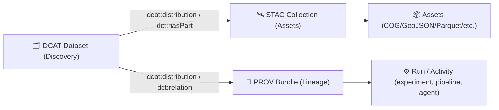

# 🗂️ DCAT Metadata — `dcat/` (Experiment Report Tree) 📚


> **Purpose 🎯**: This folder contains **DCAT** records describing the *datasets used and produced* by this experiment report.  
> DCAT is the **discovery layer**: what the dataset *is*, who made/published it, what it’s about, and where it can be accessed.  
> In KFM terms: **no “mystery layers”** — every dataset needs discoverable metadata + links to evidence. ✅

---

## 🧭 How this fits in KFM’s “Evidence Triplet”

KFM treats **DCAT + STAC + PROV** as the metadata backbone:

- **DCAT** = *Discovery & catalog view* (dataset-level metadata)
- **STAC** = *Spatiotemporal/asset view* (files, footprints, time ranges, items/collections)
- **PROV** = *Lineage view* (inputs, activities/runs, agents, reproducibility)



---

## 📁 What’s in this folder

This is a **template-friendly** layout (keep it small + portable). Adjust names if your repo uses different conventions.

```text
📁 dcat/
├─ 📄 README.md                     ← you are here
├─ 🧾 catalog.jsonld                ← (optional) a mini dcat:Catalog for this experiment report
└─ 📁 datasets/
   ├─ 🧾 dataset__input__<slug>.jsonld
   ├─ 🧾 dataset__output__<slug>.jsonld
   └─ 🧾 dataset__artifact__<slug>.jsonld
```

### 🔁 “Template tree” vs “KFM canonical catalog”
In the full KFM repo, DCAT entries may ultimately be merged into the canonical catalog location (e.g., a central `data/catalog/dcat/` feed).  
In this **experiment report template**, we keep DCAT records **co-located** with the report so the report can travel as a standalone “evidence bundle.” 📦✅

---

## ✅ What you must create (minimum)

Create **at least one** `dcat:Dataset` record:

- ✅ **Inputs** (what you used)
- ✅ **Outputs** (what you produced)
- ✅ **Evidence artifacts** (models, derived datasets, intermediate outputs worth reusing)

If you have multiple datasets, either:
- Create **multiple dataset JSON-LD files**, or
- Create a single **`catalog.jsonld`** that references multiple datasets.

---

## 🧱 Required fields (KFM-friendly baseline)

> If you’re unsure: **start with “Required”**, then fill “Recommended” as time allows.  
> Policy gates may enforce the required set, depending on environment.

| Category | Field (DCAT / DCTerms) | JSON-LD key | Required | Why it matters |
|---|---|---:|:---:|---|
| Identity | Dataset ID | `@id` | ✅ | Stable reference for graph/UI/AI |
| Type | Dataset type | `@type` (`dcat:Dataset`) | ✅ | RDF typing |
| Human discovery | Title | `dct:title` | ✅ | Search + UI display |
| Human discovery | Description | `dct:description` | ✅ | What it is + context |
| Governance | License | `dct:license` | ✅ | “No data without known license” |
| Publisher | Publisher org/person | `dct:publisher` | ✅ | Attribution + accountability |
| Topic | Keywords | `dcat:keyword` | ✅ | Faceted search + discovery |
| Distribution | Where to access it | `dcat:distribution` | ✅ | Links to files/APIs/STAC/PROV |
| Temporal | Coverage | `dct:temporal` | ⚠️ | Strongly recommended for time-travel UI |
| Spatial | Coverage | `dct:spatial` | ⚠️ | Strongly recommended for map discovery |
| Dates | Issued/Modified | `dct:issued`, `dct:modified` | ⚠️ | Versioning + freshness |
| Contact | Contact point | `dcat:contactPoint` | 🟡 | Support + stewardship |
| Conformance | Profile/schema | `dct:conformsTo` | 🟡 | Contract-first validation |
| Provenance pointer | Related lineage | `dct:relation` (or distribution to PROV) | 🟡 | Makes auditing easy |

### 🧩 KFM extensions (when applicable)
KFM commonly extends base standards. If your project defines these fields, include them:

- `kfm:dataset_id` (canonical ID)
- `kfm:version`
- `kfm:classification` (public/internal/restricted/etc.)
- `kfm:sovereignty` / Indigenous knowledge restrictions (if relevant)
- `kfm:quality` indicators (optional)

> 📌 Rule of thumb: **extend the profile, don’t invent random fields**. If you need new fields, add them to the *project profile* (and version it).

---

## 🔗 Linking rules: STAC + PROV (don’t skip this)

DCAT should **not** be isolated metadata. It should “point outward” to:

- 🛰️ **STAC Collection** (asset catalog)
- 🧬 **PROV bundle** (lineage and run evidence)
- 📦 **Artifacts** (files, APIs, registries)

### Recommended patterns
Use **either** (or both):

- `dcat:distribution` entries that link to:
  - STAC Collection JSON
  - PROV JSON-LD
  - Downloads / API access
- `dct:hasPart` if you want to model sub-datasets / components

---

## 📦 Distributions: what “good” looks like

A dataset usually has **multiple** distributions:

- **Download URL**: static file (GeoJSON/COG/Parquet/CSV/etc.)
- **Access URL**: API endpoint (query service, tiles, STAC API, etc.)
- **STAC distribution**: link to STAC Collection
- **PROV distribution**: link to provenance record
- **OCI artifact distribution (optional)**: for signed, versioned artifact storage (ORAS/Cosign workflows)

> ✅ Keep distributions explicit. The UI, the graph importer, and Focus Mode can all use them.

---

## 🧬 Versioning & IDs (make future-you happy)

### Dataset IDs
Use IDs that are:
- **Stable** across runs (when representing the same logical dataset)
- **Versioned** when content changes

Example styles:
- `urn:kfm:dataset:<domain>:<name>:v<semver>`
- `urn:kfm:experiment:<run_id>:dataset:<slug>` (experiment-scoped)

### “What counts as a new version?”
Version bump when:
- data content changes (rows/features/geometry)
- processing logic changes materially
- classification changes (public → restricted)
- license/attribution changes (yes, that’s important)

---

## 🛡️ Governance & Policy Gates (aka: why missing DCAT breaks builds)

KFM’s policy philosophy is **fail closed**:

- Missing **license** → 🚫 block publication
- Missing **classification** or wrong propagation → 🚫 block
- Missing **DCAT/STAC/PROV completeness** → 🚫 block
- Missing **citations** for AI outputs → 🚫 refuse / block

**Practical implication:** if this folder is empty, your experiment report is incomplete for dev_prov standards. ✅

---

## 🤖 UI + Focus Mode integration (why DCAT is “user-facing infrastructure”)

DCAT powers:

- 🔎 **Dataset search** and keyword discovery
- 🧩 **Faceted filtering** (topic/time/data type)
- 🧾 **Source attribution** in legends/tooltips
- 🧠 **Focus Mode citations** (answers should point back to datasets + provenance)

> If a user (or reviewer) asks “Where did this come from?” → DCAT is the front door, PROV is the audit trail.

---

## ⚡ Real-time feeds & simulations (yes, DCAT still applies)

Even “live” data should have a DCAT identity:

- Use DCAT to describe the **feed** as a dataset
- Link distributions to:
  - API endpoint (latest reading)
  - time-series endpoint (history)
  - PROV that logs the ingestion activity
  - STAC if you produce itemized snapshots

Simulations (e.g., scenario runs) are also datasets:
- Give each simulation output a DCAT record
- Link to the run parameters (PROV) and output assets (STAC/files)

---

## 🧾 Example: `dcat:Dataset` (JSON-LD template)

> Copy/paste, then replace `TODO_*`.  
> Keep it readable — humans will review this in PRs.

```json
{
  "@context": {
    "dcat": "http://www.w3.org/ns/dcat#",
    "dct": "http://purl.org/dc/terms/",
    "prov": "http://www.w3.org/ns/prov#",
    "xsd": "http://www.w3.org/2001/XMLSchema#",
    "kfm": "https://kansasfrontiermatrix.org/ns#"
  },
  "@id": "urn:kfm:experiment:TODO_RUN_ID:dataset:TODO_SLUG",
  "@type": "dcat:Dataset",

  "dct:title": "TODO_TITLE",
  "dct:description": "TODO_DESCRIPTION (what it is, why it exists, key limitations)",

  "dct:publisher": { "@id": "urn:kfm:org:TODO_PUBLISHER" },
  "dct:license": { "@id": "TODO_LICENSE_URI_OR_ID" },

  "dcat:keyword": ["TODO", "TODO_DOMAIN_TAG"],

  "dct:issued": { "@value": "TODO_YYYY-MM-DD", "@type": "xsd:date" },
  "dct:modified": { "@value": "TODO_YYYY-MM-DD", "@type": "xsd:date" },

  "dct:spatial": {
    "@type": "dct:Location",
    "dct:description": "TODO_SPATIAL (e.g., Kansas, county list, bbox link, etc.)"
  },
  "dct:temporal": {
    "@type": "dct:PeriodOfTime",
    "dcat:startDate": { "@value": "TODO_START", "@type": "xsd:date" },
    "dcat:endDate":   { "@value": "TODO_END",   "@type": "xsd:date" }
  },

  "kfm:dataset_id": "TODO_CANONICAL_DATASET_ID",
  "kfm:version": "TODO_SEMVER",
  "kfm:classification": "TODO_PUBLIC|INTERNAL|RESTRICTED",

  "dcat:distribution": [
    {
      "@type": "dcat:Distribution",
      "dct:title": "Primary data file",
      "dcat:downloadURL": "TODO_REL_OR_ABS_URL_TO_ARTIFACT",
      "dcat:mediaType": "TODO_MIME (e.g., application/geo+json)",
      "dct:format": "TODO_FORMAT_LABEL (e.g., GeoJSON, GeoParquet)"
    },
    {
      "@type": "dcat:Distribution",
      "dct:title": "STAC Collection",
      "dcat:accessURL": "../stac/collection.json",
      "dcat:mediaType": "application/json",
      "dct:conformsTo": { "@id": "https://stacspec.org/" }
    },
    {
      "@type": "dcat:Distribution",
      "dct:title": "PROV Lineage Bundle",
      "dcat:accessURL": "../prov/lineage.prov.jsonld",
      "dcat:mediaType": "application/ld+json",
      "dct:conformsTo": { "@id": "https://www.w3.org/TR/prov-o/" }
    },
    {
      "@type": "dcat:Distribution",
      "dct:title": "API Access (optional)",
      "dcat:accessURL": "TODO_API_ENDPOINT",
      "dcat:mediaType": "application/json"
    },
    {
      "@type": "dcat:Distribution",
      "dct:title": "OCI Artifact (optional, signed)",
      "dcat:accessURL": "oci://TODO_REGISTRY/TODO_REPO:TODO_TAG",
      "dct:format": "OCI Artifact",
      "dct:description": "Use for ORAS/Cosign-based artifact distribution."
    }
  ]
}
```

---

## 🧾 Example: `dcat:Catalog` (optional mini-catalog for the report)

If your report contains **many datasets**, create a `catalog.jsonld`:

```json
{
  "@context": {
    "dcat": "http://www.w3.org/ns/dcat#",
    "dct": "http://purl.org/dc/terms/"
  },
  "@id": "urn:kfm:experiment:TODO_RUN_ID:catalog",
  "@type": "dcat:Catalog",
  "dct:title": "Experiment Catalog — TODO_RUN_ID",
  "dct:description": "Datasets used/produced by this experiment report.",
  "dcat:dataset": [
    { "@id": "datasets/dataset__input__TODO.jsonld" },
    { "@id": "datasets/dataset__output__TODO.jsonld" }
  ]
}
```

---

## ✅ Definition of Done (DoD) 🧾

- [ ] Every dataset referenced in the experiment report has a DCAT record ✅  
- [ ] Each DCAT record includes **license + publisher + title + description** ✅  
- [ ] Each DCAT record links to **STAC** and **PROV** (or clearly explains why not) ✅  
- [ ] Classification (if used) is present and correct ✅  
- [ ] Distributions resolve (paths/URLs are valid in this report tree) ✅  
- [ ] Records are reviewable (clean formatting, no giant blobs) ✅

---

## 🔗 Related folders in the experiment report tree

- 🛰️ `../stac/` — asset catalogs (collections/items)
- 🧬 `../prov/` — lineage bundles and run provenance
- 📦 `../artifacts/` — actual files produced (if stored locally)
- 📊 `../metrics/` — evaluation outputs (optional)

---

## 📚 Reference docs (project library) 📖

These project docs informed the structure + rules used in this template:

- 📘 **Kansas Frontier Matrix (KFM) – Comprehensive Technical Documentation**
- 🧭 **Kansas Frontier Matrix (KFM) – Comprehensive Architecture, Features, and Design**
- 🤖 **Kansas Frontier Matrix (KFM) – AI System Overview 🧭🤖**
- 🧑‍💻 **Kansas Frontier Matrix – Comprehensive UI System Overview**
- 📚 **Kansas Frontier Matrix (KFM) Data Intake – Technical & Design Guide**
- 🚀 **Innovative Concepts to Evolve the Kansas Frontier Matrix (KFM)**
- 🌟 **Kansas Frontier Matrix – Latest Ideas & Future Proposals**
- 💡 **Additional Project Ideas**
- 🧠 **AI Concepts & more** *(reference bundle)*
- 🗺️ **Maps / Google Maps / Virtual Worlds / Archaeological / Geospatial WebGL** *(reference bundle)*
- 🧰 **Various programming languages & resources** *(reference bundle)*
- 🗄️ **Data Management / Theories / Architectures / Bayesian Methods** *(reference bundle)*

> 🧩 Tip: If you add new metadata rules, update the project’s profile docs and bump the profile version (metadata is treated like code).
