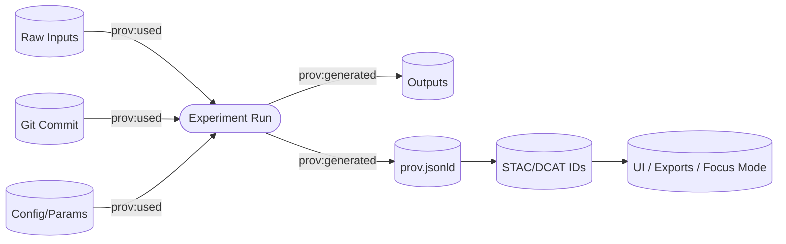

# 🧾 PROV Bundle — Experiment Lineage (dev_prov)


> [!IMPORTANT]
> **Provenance-first publishing ⛓️**  
> If an artifact exists (dataset, model, chart, answer, story output), it must be traceable to: **inputs → process → agent → outputs**.  
> Any change to outputs **requires** updating PROV + manifests + checksums **in the same PR**.

---

## 🧭 Quick Navigation

- [🎯 What this folder is](#-what-this-folder-is)
- [🧱 Folder contract](#-folder-contract)
- [✅ Minimum required artifacts](#-minimum-required-artifacts)
- [🧬 How to model an experiment in PROV](#-how-to-model-an-experiment-in-prov)
- [🔗 Cross-layer linkage](#-cross-layer-linkage)
- [🤖 AI & LLM experiment provenance](#-ai--llm-experiment-provenance)
- [🛡️ Policy gates, waivers, and “fail closed”](#️-policy-gates-waivers-and-fail-closed)
- [🔁 Reproducibility checklist](#-reproducibility-checklist)
- [🧩 Templates](#-templates)
- [✅ Definition of Done](#-definition-of-done)

---

## 🎯 What this folder is

This `/prov` directory is the **audit trail** for this experiment report template.

It is intended to answer questions like:

- “Which exact inputs were used?” 📥  
- “What pipeline/code/config produced these outputs?” 🧰  
- “Who/what executed the run (human, CI, agent)?” 👤🤖  
- “What policies were enforced (and were any waivers applied)?” 🛡️  
- “Can we reproduce this result (or explain why not)?” 🔁  

In KFM terms, this folder is the **chain-of-custody bundle** that keeps the UI, graph, exports, and AI outputs tied to “the map behind the map.” 🗺️🧾

---

## 🧱 Folder contract

### ✅ Put here
- Small, diff-friendly provenance artifacts (JSON / YAML / MD) 📄
- Hash receipts & manifests (checksums, input/output inventories) 🔐
- Policy outputs + waivers (OPA/Conftest results, exception metadata) 🧯
- Repro instructions and environment locks (container digests, pip/conda locks) 🧪

### ❌ Do NOT put here
- Large binaries (GeoTIFFs, tiles, model weights, huge CSVs) 🧱  
  - Store those elsewhere and reference them by **content digest**.
- Secrets (API keys, tokens, credentials) 🚫🔑  
  - If it’s sensitive: redact, aggregate, or store privately with proper access controls.

> [!TIP]
> Keep `/prov` “reviewable.” A maintainer should be able to code review provenance changes like they review code.

---

## 🗂️ Suggested tree

> This is a recommended layout. If the surrounding template already defines names, follow the local tree and adapt these ideas.

```text
prov/ 📎
├─ 🧭📄 README.md                 # 🧭 You are here 📌 What this provenance bundle proves + how to verify it end-to-end
├─ ⛓️🧬🧾 prov.jsonld              # W3C PROV-O graph (JSON-LD): entities/activities/agents + derivations + timestamps
├─ 🧾🔐 run_manifest.json          # One-run receipt: commands, params, tool versions, inputs/outputs, counts, hashes pointers
├─ 📥🧾 inputs.manifest.json       # Structured input list: ids, URIs/paths, sizes, checksums, licenses/classification refs
├─ 📤🧾 outputs.manifest.json      # Structured output list: paths/URIs, digests, media types, roles, metadata pointers
├─ 🔐📄 checksums.sha256           # sha256 hashes for files referenced by this report (tamper detection)
├─ 🛡️ policy/                     # Policy evidence (CI/runtime): what rules ran and what they concluded
│  ├─ 🧪🧾 conftest.results.json    # Conftest/OPA evaluation output (pass/fail + findings + policy ids)
│  └─ 🧯🧾 waivers.yml              # Time-bound exceptions (stable ids, scope, expiry, rationale, approvals)
├─ 🧰 env/                         # Repro environment locks (optional but recommended for reproducibility)
│  ├─ 📦🧾 container.ref.txt        # Container reference (image@sha256:… or digest-pinned tag)
│  ├─ 🐍🧾 pip.freeze.txt           # Pinned Python dependencies (pip freeze output)
│  └─ 🖥️🧾 system.txt               # System notes: OS/CPU/GPU, kernel, drivers (as needed)
├─ 🤖 ai/                          # Optional AI-specific provenance (only when an LLM/agent is involved)
│  ├─ 🗣️📝 prompt.md                # Prompts/instructions actually used (sanitized; no secrets)
│  ├─ 🔎🧾 retrieval.json           # Retrieved context/source list + ids/URIs + selection rationale (no sensitive leakage)
│  └─ 📏🧾 evaluation.json          # QA metrics: citation coverage, factuality checks, regression scores, failure notes
└─ ✍️ signatures/                  # Optional supply-chain attachments (verification artifacts)
   ├─ 📦🧾 sbom.spdx.json           # SBOM for build/toolchain or produced artifact bundle
   └─ 🔏🧾 cosign.bundle.json       # Cosign signature/attestation bundle (subjects + digests + signers)
```

---

## ✅ Minimum required artifacts

| Artifact | Required | Why it exists |
|---|---:|---|
| `prov.jsonld` ⛓️ | ✅ | Machine-readable lineage graph (entities, activities, agents) |
| `run_manifest.json` 🧾 | ✅ | Human-friendly + machine-checkable “receipt” for the run |
| `inputs.manifest.json` 📥 | ✅ | Explicit input inventory (IDs, URIs, digests, licenses, classification) |
| `outputs.manifest.json` 📤 | ✅ | Explicit output inventory (paths, digests, formats, sensitivity) |
| `checksums.sha256` 🔐 | ✅ | Tamper-evident hashes for any file referenced by the report |
| `policy/…` 🛡️ | ✅ | Evidence that policy gates were enforced (and how) |
| `env/…` 🧰 | ◻️ | Strong reproducibility (pin tool versions / container digests) |
| `signatures/…` ✍️ | ◻️ | Supply-chain grade integrity (SBOM/attestations/signatures) |
| `ai/…` 🤖 | ◻️ | Required if the run uses an LLM/AI assistant or produces AI-derived outputs |

> [!NOTE]
> If your experiment produces an “evidence artifact” (simulation output, OCR corpus, AI-predicted layer), treat it like a first-class dataset: **inventory it, checksum it, and capture the producing activity in PROV**.

---

## 🧬 How to model an experiment in PROV

### 🧩 Core PROV objects
- **Entity** 📦  
  Something that exists: a raw file, a dataset, a config, a container digest, a model checkpoint, a plot.
- **Activity** ⚙️  
  Something that happens: an ETL run, a training run, a query, a tile build, a report export.
- **Agent** 👤🤖  
  Something responsible: a person, a CI runner, a Watcher/Planner/Executor agent, or a service account.

### 🏷️ Recommended identifiers
Use stable URIs (pick one style and stick to it):

- `urn:kfm:run:<RUN_ID>`
- `urn:kfm:dataset:<DATASET_ID>@<VERSION>`
- `urn:kfm:artifact:<NAME>@sha256:<DIGEST>`
- `urn:kfm:git:commit:<SHA>`
- `urn:kfm:ci:<PIPELINE_RUN_ID>`

> [!TIP]
> If you need idempotency: compute a digest over a canonicalized `run_manifest.json` and reuse it as the run’s stable fingerprint.

---

## 🔗 Cross-layer linkage

KFM’s “no black boxes” rule is enforced by **cross-linking**:

- **PROV ⇄ STAC/DCAT**  
  - PROV should reference dataset catalog IDs (STAC Item/Collection IDs, DCAT Dataset IDs).
  - Catalog records should link back to PROV bundles (where appropriate).
- **PROV ⇄ Graph**  
  - Graph nodes should carry references to catalog/prov identifiers (not duplicate payloads).
- **PROV ⇄ UI / exports**  
  - When something is shown or exported, it should carry attribution like “source + license + processed by + date.”  
  - This folder is where the export can find the provenance bundle to cite.



---

## 🤖 AI & LLM experiment provenance

If an LLM/AI assistant is involved, provenance must capture:

- **Model identity** (model name/version, deployment, provider) 🧠
- **Prompt & constraints** (instructions, system rules, templates) 🗣️
- **Retrieved context** (which datasets/docs/entities were used) 🔎
- **Citation coverage** (did the output include citations or provenance links?) 🧾
- **Human review** (if required, who approved?) ✅

Suggested pattern:
- Store prompt + retrieval manifests under `ai/`
- Represent the AI call as a PROV **Activity**
- Represent the answer/report/story output as a PROV **Entity**
- Link answer → sources via `prov:used` (with roles if helpful)

> [!WARNING]
> If an AI-generated output cannot be supported by sources, it must be marked as uncertain or refused.  
> Do **not** allow “clean-looking” text to bypass provenance.

---

## 🛡️ Policy gates, waivers, and “fail closed”

This template assumes governance is enforced via policy-as-code (OPA/Conftest style):

- **Fail closed**: missing license, missing provenance, missing classification → CI fails 🚫  
- **Stable policy IDs** (ex: `KFM-PROV-001`) make issues auditable and waivers explicit 🧾  
- **Waivers are time-bound** and must include: `id`, `reason`, `owner`, `expires_at` 🧯

Suggested `policy/waivers.yml` structure:

```yaml
waivers:
  - id: "KFM-PROV-001"
    reason: "Backfilling provenance for legacy artifact; will be fixed in follow-up PR."
    owner: "@maintainer_handle"
    expires_at: "2026-03-01"
    scope:
      paths:
        - "prov/outputs.manifest.json"
```

---

## 🔁 Reproducibility checklist

To make this experiment rerunnable:

1. **Pin inputs** 📥  
   - Use immutable identifiers + checksums (or content-addressed storage).
2. **Pin code** 🧰  
   - Record git commit SHA (and PR if relevant).
3. **Pin environment** 🧪  
   - Record container image digest or dependency locks.
4. **Record parameters** 🎛️  
   - Include seeds, bounding boxes, dates, filters, thresholds.
5. **Record outputs** 📤  
   - Inventory + digests; don’t rely on “whatever is on disk.”
6. **Record policy results** 🛡️  
   - Store Conftest outputs + any waivers used.
7. **Record known non-determinism** 🌪️  
   - If a step is inherently non-deterministic, explain it and capture the variance.

---

## 🧩 Templates

### `run_manifest.json` (skeleton)

```json
{
  "run_id": "<RUN_ID>",
  "title": "Experiment run — <short description>",
  "timestamp_utc": "2026-01-22T00:00:00Z",

  "code": {
    "repo": "<repo>",
    "commit_sha": "<git sha>",
    "dirty": false
  },

  "activity": {
    "kind": "etl|training|inference|analysis|export",
    "command": "<exact command>",
    "parameters": {
      "seed": 42
    }
  },

  "inputs": [
    {
      "id": "urn:kfm:dataset:<DATASET_ID>@<VERSION>",
      "uri": "<path or URL>",
      "sha256": "sha256:<digest>",
      "license": "<SPDX or license id>",
      "classification": "public|restricted|confidential",
      "care_label": "Public|Restricted · Tribal Sensitive|..."
    }
  ],

  "outputs": [
    {
      "id": "urn:kfm:artifact:<NAME>@sha256:<digest>",
      "path": "<relative path or URI>",
      "sha256": "sha256:<digest>",
      "format": "parquet|geojson|cog|pmtiles|md|json",
      "classification": "public|restricted|confidential"
    }
  ],

  "tool_versions": {
    "python": "3.11.x",
    "gdal": "x.y.z",
    "postgis": "x.y.z"
  },

  "summary_counts": {
    "records_in": 0,
    "records_out": 0,
    "errors": 0,
    "warnings": 0
  },

  "policy": {
    "conftest_results": "policy/conftest.results.json",
    "waivers": "policy/waivers.yml"
  },

  "notes": "Anything a reviewer needs to know."
}
```

### `prov.jsonld` (minimal pattern)

```json
{
  "@context": {
    "prov": "http://www.w3.org/ns/prov#",
    "xsd": "http://www.w3.org/2001/XMLSchema#",
    "kfm": "urn:kfm:"
  },
  "@graph": [
    {
      "@id": "kfm:activity:run/<RUN_ID>",
      "@type": "prov:Activity",
      "prov:startedAtTime": { "@value": "2026-01-22T00:00:00Z", "@type": "xsd:dateTime" },
      "prov:endedAtTime": { "@value": "2026-01-22T00:00:00Z", "@type": "xsd:dateTime" },
      "prov:used": [
        { "@id": "kfm:entity:input/<INPUT_1>" },
        { "@id": "kfm:entity:code/<GIT_SHA>" },
        { "@id": "kfm:entity:file:run_manifest.json" }
      ],
      "prov:wasAssociatedWith": { "@id": "kfm:agent:<HUMAN_OR_BOT>" }
    },

    {
      "@id": "kfm:entity:file:run_manifest.json",
      "@type": "prov:Entity",
      "prov:atLocation": "prov/run_manifest.json"
    },

    {
      "@id": "kfm:entity:output/<OUTPUT_1>",
      "@type": "prov:Entity",
      "prov:atLocation": "<path/or/uri>",
      "prov:wasGeneratedBy": { "@id": "kfm:activity:run/<RUN_ID>" }
    },

    {
      "@id": "kfm:agent:<HUMAN_OR_BOT>",
      "@type": "prov:Agent",
      "prov:label": "<name or service account>"
    }
  ]
}
```

---

## ✅ Definition of Done

**Mark this `/prov` bundle as “done” only when:**

- [ ] `prov.jsonld` exists and reflects the current inputs/outputs
- [ ] `run_manifest.json` includes exact command, versions, parameters, and inventories
- [ ] `inputs.manifest.json` + `outputs.manifest.json` are complete (no “mystery files”)
- [ ] `checksums.sha256` matches all referenced local artifacts
- [ ] Policy evaluation output exists (`policy/…`) and is clean **or** waivers are explicit & time-bound
- [ ] Any AI/LLM output is clearly marked + includes citations/provenance links (if applicable)
- [ ] Classification / sensitivity tags are present and do not downgrade from inputs
- [ ] Repro steps are documented (even if not perfectly deterministic)

---

## 🧠 Bonus: rollback & provenance repair (optional, but recommended)

If you must retract or rollback outputs:
- Create a new PROV activity describing the rollback
- Mark affected outputs as invalidated/retracted (project-specific profile)
- Keep the history visible—**even undo has provenance** 🔁🧾
