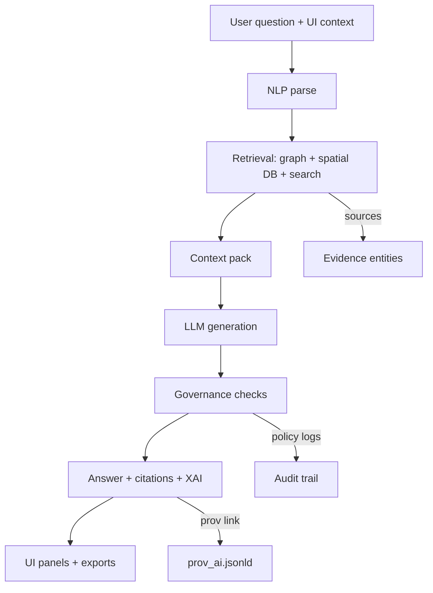

# 🤖 AI Provenance Pack


**Folder:** `prov/ai/` 🧾  
**Mission:** make every AI-generated insight **replayable, reviewable, and disputable** — with a complete, verifiable chain of custody ⛓️

> 🧠 **Mantra:** *If it’s not logged, it didn’t happen.*

---

## 🧭 Why this folder exists

This directory captures **AI-specific provenance** for an experiment run, including:

- 🧩 **Prompts & context** (system + developer + user + UI/map context)
- 🧠 **Model identity & settings** (provider, model version, sampling params, safety configs)
- 🔎 **Retrieval evidence** (graph queries, spatial/temporal filters, search hits, embedding configs)
- 🧾 **Citations map** (claim → source)
- 🛡️ **Governance results** (prompt-security, policy-as-code, redactions, approvals)
- 🧪 **Evaluation** (metrics, error analysis, drift/bias checks)
- 📦 **Attestations** (optional but recommended: SBOM, signatures, SLSA-style provenance)

This is **KFM-aligned provenance** (evidence-first, audit-first, policy-gated), but the structure is general enough for any RAG + tool-using AI system.

---

## ⚡ Quick start

1. 🏷️ Create a run folder under `prov/ai/runs/<RUN_ID>/`
2. 🧾 Fill `manifest.ai-run.json`
3. 🧠 Save **exact prompts** (including rendered prompt)
4. 🔎 Save **retrieval pack** (queries + returned source list)
5. 📝 Save **outputs** (answer + structured output + citations map)
6. 🛡️ Save **policy results** (prompt security + OPA decisions + redactions)
7. 🧪 Save **eval artifacts** (metrics + error analysis + drift snapshot)
8. 📦 Optionally sign/attest (OCI/ORAS + cosign + SBOM)

---

## 🗂️ Recommended layout

```text
prov/ai/
  README.md

  runs/
    <RUN_ID>/
      manifest.ai-run.json
      manifest.ai-run.sha256

      prompts/
        system.md
        developer.md
        user.md
        ui_context.json
        retrieved_context.jsonl
        prompt.rendered.txt
        prompt.rendered.sha256

      model/
        model.json
        sampling.json
        safety.json

      retrieval/
        search_queries.json
        graph_queries.cypher
        sql_queries.sql
        sources.retrieved.jsonl
        embeddings.json
        retrieval_report.md

      output/
        answer.md
        answer.json
        citations.json
        xai_audit.json

      governance/
        prompt_security.json
        policy_eval.json
        redactions.json
        classification_trace.json
        approvals.md

      eval/
        eval_plan.md
        metrics.json
        error_analysis.md
        drift_snapshot.json

      telemetry/
        usage.json
        latency.json
        trace.ndjson

      attestations/
        prov_ai.jsonld
        sbom.spdx.json
        signature.cosign
        oci_ref.txt

  templates/
    manifest.ai-run.schema.json
    citations.schema.json
    prov_ai.context.json
```

### 🏷️ Run IDs

Use stable, sortable IDs:

- `YYYY-MM-DDTHHMMSSZ_<short_slug>`
- or `YYYYMMDD_<slug>_<short_hash>`

Example: `2026-01-22T190000Z_focus_douglas_county`

---

## 🧩 How this connects to the bigger provenance graph

KFM treats **metadata, lineage, and auditability** as first-class. Your AI provenance pack should link to the global provenance universe:

- 📦 **STAC** for assets and spatiotemporal items  
- 🗃️ **DCAT** for dataset-level discovery  
- ⛓️ **W3C PROV** for lineage and activities  
- 🧠 **AI run** as a PROV Activity that *uses* evidence Entities and *generates* answer Entities



---

## 🧾 Minimum artifact contract

These are the **minimum required** files for a valid AI run provenance pack.

| Artifact | Path | Required | Why it matters |
|---|---|---:|---|
| Run manifest | `manifest.ai-run.json` | ✅ | Canonical “run header” for replay + audit |
| Rendered prompt | `prompts/prompt.rendered.txt` | ✅ | Captures the exact input to the model |
| Model identity | `model/model.json` | ✅ | Reproducibility and version trace |
| Retrieval list | `retrieval/sources.retrieved.jsonl` | ✅ | Evidence chain for every claim |
| Answer | `output/answer.md` | ✅ | The produced narrative |
| Citations map | `output/citations.json` | ✅ | Claim → evidence mapping |
| Policy decisions | `governance/policy_eval.json` | ✅ | Proof it passed guardrails |
| Redactions | `governance/redactions.json` | ✅ | Transparency about removed/hidden data |
| Metrics | `eval/metrics.json` | ✅ | Quality + drift monitoring |
| Hashes | `*.sha256` | ✅ | Tamper-evidence |

---

## 🧾 Run manifest fields

Your `manifest.ai-run.json` should be **small, strict, and link-heavy**. Keep bulky payloads in separate files referenced by path and hash.

Recommended top-level fields:

- `run_id`, `created_at`, `actor` (human + agent)
- `experiment` (hypothesis, baseline, variant)
- `model` (provider, name, version, endpoint region)
- `sampling` (temperature, top_p, max_tokens, seed)
- `tools` (MCP servers, tool schemas, versions)
- `ui_context` (viewport bbox, active layers, timeline state)
- `retrieval` (queries, filters, evidence set hash)
- `governance` (policy pack version, decisions, approvals)
- `outputs` (answer hash, citations hash, xai hash)
- `environment` (git SHA, container digest, lockfile hashes)
- `telemetry_summary` (token usage, latency, cost)

> 🔐 **No secrets**: manifests must never contain API keys, tokens, or private endpoints. Use redacted placeholders.

---

## 🔎 Retrieval and evidence logging

KFM-style AI is **RAG by default**. That means provenance must capture:

### Evidence inputs

- 🔗 Neo4j traversals (Cypher queries + params)
- 🗺️ Spatial queries (PostGIS / tiles / bbox)
- 🧾 Search results (keyword + semantic/embedding retrieval)
- 🧠 Embedding model identity and version
- ⏱️ Temporal filters (timeline slider, selected epoch, date range)

### Required logging

- `retrieval/search_queries.json`: exact query text, filters, ranking params
- `retrieval/graph_queries.cypher`: query text + param record
- `retrieval/sources.retrieved.jsonl`: one evidence row per source item

**Source rows should include**: stable ID, title, URI/path, license, checksum, time range, geo bounds, and a “why included” note.

---

## 📝 Citations that are actually auditable

AI answers should be **footnote-style** and machine-checkable.

`output/citations.json` should map:

- **claim spans** or **answer paragraphs**
- to **evidence entities** (dataset IDs, document IDs, station readings, story node IDs)
- with **roles** (supporting, illustrative, counter-evidence)

Example structure:

```json
{
  "answer_file": "output/answer.md",
  "citation_style": "footnote",
  "citations": [
    {
      "cite_id": "C1",
      "answer_spans": [{"start": 120, "end": 245}],
      "evidence": [
        {"entity_id": "kfm.dataset.usgs_river_gauges", "role": "supporting"},
        {"entity_id": "kfm.station.06752000.latest@2026-01-22T20:00:00Z", "role": "supporting"}
      ]
    }
  ]
}
```

> ✅ **Policy target:** every factual claim has a citation, or is explicitly labeled as conjecture/interpretation.

---

## 🛡️ Governance and safety logging

This pack must prove the run complied with governance rules:

### Prompt security

Log sanitization and defenses against prompt injection:

- user input normalization
- tool call allowlists
- sensitive term screening
- “do not reveal restricted data” enforcement

### Policy as code

Record OPA/Conftest evaluations:

- policy pack version (git SHA or semantic version)
- pass/fail, rule IDs, messages
- remediation actions (redactions, refusal, escalation)

### Sensitivity and CARE alignment

If any evidence includes sensitive data:

- store the **classification trace** (how labels propagate)
- store **generalization decisions** (e.g., blurred coordinates)
- store **approval records** where required

> 🧑‍⚖️ Human-in-the-loop is not optional for high-stakes outputs. Save approvals in `governance/approvals.md`.

---

## 🧪 Evaluation and drift monitoring

AI provenance isn’t complete without quality signals:

### Metrics to include

- 📊 Accuracy vs goldens (when applicable)
- 🧾 Citation coverage (percent of claims cited)
- 🧨 Hallucination rate (manual or automated rubric)
- ⚖️ Bias flags and fairness checks
- 🧭 Drift snapshot (compare to baseline run)

### Why this belongs here

KFM designs assume **continuous monitoring** — if citation coverage slips or outputs drift, the system must surface it and enable rollback.

---

## 🧠 Explainable AI artifacts

When the UI provides “why this answer” panels, capture:

- `output/xai_audit.json`: factors, evidence weights, top entities
- links back to evidence entity IDs and queries
- any user-context prioritization signals (viewport weighting, layer preference)

This supports the “map behind the map” principle: every visualization and narrative traces back to sources.

---

## 🗺️ Multimodal and geospatial outputs

Many experiments are **not just text**. If the AI run outputs map scenes or story experiences:

### Log map and render artifacts

- map style JSON (MapLibre), layer configs, tile package IDs
- 3D scene config (Cesium camera, 3D Tileset IDs)
- projection / CRS identifiers and reprojection steps
- offline pack manifests if used (bundled tiles, stories, indexes)

**Store these as Entities** linked by hash in the run manifest.

---

## 📦 Packaging and attestations

Optional, but strongly recommended for “serious science” runs:

### OCI artifact packaging

Package the entire `runs/<RUN_ID>/` folder as an OCI artifact:

- `attestations/oci_ref.txt`: registry reference
- attach referrers: `prov_ai.jsonld`, `sbom.spdx.json`, policy report

### Signatures and provenance

- cosign signature for the artifact digest
- SBOM for the toolchain and dependencies
- SLSA-style provenance for CI-produced runs

> 🔏 Goal: anyone can verify what ran, when, with what dependencies — and that it wasn’t tampered with.

---

## 📚 Story Nodes and narrative automation

If AI drafts Story Nodes or narrative alerts:

- store the **draft output**
- store the **human edit** as a separate version
- store a provenance link explaining what evidence supported each step

If you’re using “Pulse Threads” or narrative pattern detection:

- log severity/confidence
- log whether it auto-published or required review
- log the governance ledger entry ID

---

## 🧾 Templates

<details>
<summary><strong>Template: manifest.ai-run.json</strong> 🧾</summary>

```json
{
  "run_id": "<RUN_ID>",
  "created_at": "2026-01-22T19:00:00Z",
  "actor": {
    "human": {"id": "user:<handle_or_id>", "role": "reviewer"},
    "agent": {"id": "ai:<agent_name>", "role": "generator"}
  },
  "experiment": {
    "experiment_id": "<EXP_ID>",
    "hypothesis": "<what_you_expect>",
    "baseline": "<baseline_run_or_model>",
    "variant": "<what_changed>"
  },
  "model": {
    "provider": "<openai|local|other>",
    "name": "<model_name>",
    "version": "<provider_version_or_snapshot>",
    "endpoint_region": "<region_or_zone>"
  },
  "sampling": {
    "temperature": 0.2,
    "top_p": 1.0,
    "max_tokens": 1200,
    "seed": 123456
  },
  "tools": {
    "mcp_servers": [
      {"name": "<server>", "version": "<ver>", "schema_hash": "<sha256>"}
    ]
  },
  "ui_context": {
    "viewport_bbox": [-97.0, 38.0, -94.5, 39.5],
    "active_layers": ["<layer_id_1>", "<layer_id_2>"],
    "timeline": {"mode": "range", "start": "1930-01-01", "end": "1939-12-31"}
  },
  "retrieval": {
    "evidence_pack": "retrieval/sources.retrieved.jsonl",
    "evidence_pack_sha256": "<sha256>",
    "queries": [
      {"type": "cypher", "path": "retrieval/graph_queries.cypher"},
      {"type": "search", "path": "retrieval/search_queries.json"}
    ]
  },
  "governance": {
    "policy_pack_version": "<git_sha_or_tag>",
    "policy_eval_path": "governance/policy_eval.json",
    "redactions_path": "governance/redactions.json",
    "approval_required": false
  },
  "outputs": {
    "answer_path": "output/answer.md",
    "answer_sha256": "<sha256>",
    "citations_path": "output/citations.json",
    "citations_sha256": "<sha256>",
    "xai_path": "output/xai_audit.json"
  },
  "environment": {
    "git_commit": "<sha>",
    "container_image": "<image_digest>",
    "lockfiles": [
      {"path": "<path>", "sha256": "<sha256>"}
    ]
  },
  "telemetry_summary": {
    "tokens_in": 0,
    "tokens_out": 0,
    "latency_ms": 0,
    "cost_usd_estimate": 0
  }
}
```

</details>

<details>
<summary><strong>Template: prov_ai.jsonld</strong> ⛓️</summary>

```json
{
  "@context": [
    "https://www.w3.org/ns/prov.jsonld",
    "templates/prov_ai.context.json"
  ],
  "@id": "kfm:ai-run/<RUN_ID>",
  "@type": "prov:Activity",
  "prov:startedAtTime": "2026-01-22T19:00:00Z",
  "prov:endedAtTime": "2026-01-22T19:00:12Z",
  "prov:wasAssociatedWith": [
    "kfm:agent/human/<USER_ID>",
    "kfm:agent/model/<MODEL_ID>"
  ],
  "prov:used": [
    "kfm:entity/prompt/<PROMPT_SHA256>",
    "kfm:entity/evidence-pack/<EVIDENCE_SHA256>"
  ],
  "prov:generated": [
    "kfm:entity/answer/<ANSWER_SHA256>",
    "kfm:entity/citations/<CITATIONS_SHA256>"
  ]
}
```

</details>

---

## ✅ Run completion checklist

- [ ] Prompt saved exactly as rendered (with hash)
- [ ] Model version and sampling settings recorded
- [ ] Retrieval sources list includes IDs, bounds, timestamps, licenses
- [ ] Answer includes citations, and citations map is machine-checkable
- [ ] Policy checks recorded, with versions and outcomes
- [ ] Redactions are transparent and justified
- [ ] Metrics recorded, including citation coverage
- [ ] Hashes generated for prompt/evidence/answer
- [ ] Optional: OCI package + signature + SBOM

---

## 🧠 Design alignment notes

This template assumes the following platform principles:

- **Evidence-first**: metadata and provenance are as important as the data itself
- **Traceability**: every search hit and graph traversal links back to a source entity
- **Policy-gated outputs**: governance checks are mandatory before publishing
- **Explainability**: UI and exports should surface provenance, not hide it
- **Human oversight**: high-stakes narratives require review and explicit approval
- **Reproducibility**: deterministic logs, hashes, and environment capture

If you follow the contract above, your AI runs become **portable scientific artifacts** — not “screenshots of a chatbot.” ✅
