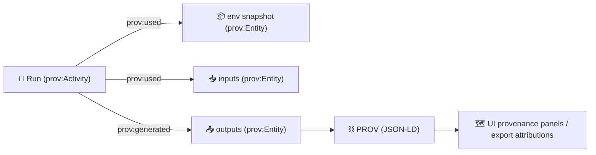

[⬅️ Back to `prov/`](../README.md)

# `prov/env/` — Environment Provenance Snapshot 📦🧪

    

> 🧭 **Goal:** Capture *everything needed to reproduce* an experiment run (software + hardware + build context) — without leaking secrets.  
> In KFM/MCP terms: **no black boxes**. If the map/story/AI output exists, the environment that produced it must be auditable too. ⛓️

---

## ✨ Why this folder exists

This folder is the **environment “snapshot”** for the experiment report template.

KFM’s broader architecture is built around *provenance-first* + *evidence-first* workflows (STAC/DCAT/PROV), where **derived artifacts never lose chain-of-custody**. That means a run is only “real” when the system can later answer:

- **What ran?** (code + configuration + toolchain)
- **Where did it run?** (machine/container/runtime)
- **With what dependencies?** (lockfiles + versions)
- **Can we reproduce it?** (deterministic pipeline assumptions + pinned env)

This `prov/env/` snapshot is designed to support:
- ✅ **Reproducibility** (re-run the same pipeline and get the same outputs)
- ✅ **Auditability** (prove “what produced what” in governance and review)
- ✅ **UI transparency** (provenance panels / export attributions can reference env digests)
- ✅ **Supply-chain integrity** (SBOM + attestations for trusted builds)

---

## ✅ What belongs in `prov/env/` (and what doesn’t)

### ✅ Put this here
- 🖥️ **OS + kernel + architecture** (Linux/macOS/Windows + versioning)
- 🧠 **CPU/RAM/GPU + drivers** (esp. important for GIS, ML, WebGL/3D, simulations)
- 🧰 **Language runtimes** (Python/Node/Java/etc.) + exact versions
- 📦 **Dependency locks** (pip/poetry/conda, npm/pnpm/yarn, system packages)
- 🐳 **Container image identifiers** (prefer **digests**, not mutable tags)
- 🧾 **SBOMs and attestations** (optional but strongly recommended)
- 🔐 **Hash manifest** (checksums for everything in this folder)

### 🚫 Never put this here
- 🔑 Secrets (API keys, tokens, private keys, `.env` contents)
- 🧑 Personal identifiers (real names, emails, IP addresses) unless required and redacted
- 📦 Large raw artifacts (store elsewhere; reference by **digest** + URI)
- 🗃️ Datasets themselves (those belong in data trees + STAC/DCAT + PROV links)

---

## 📁 Recommended layout (template-friendly)

> You can use the structure below *as-is* or adapt it, but keep it **machine-readable** and **diff-friendly**.

```text
prov/
└── env/ 📦
    ├── README.md  👈 you are here
    ├── env.json   🧾 (canonical summary “index” file)
    ├── checksums.sha256 🔐 (integrity for everything in env/)
    │
    ├── system/ 🖥️
    │   ├── os_release.txt
    │   ├── uname.txt
    │   ├── cpu.txt
    │   ├── memory.txt
    │   ├── gpu.txt              (nvidia/rocm/apple/etc.)
    │   └── drivers.txt          (optional)
    │
    ├── git/ 🌿
    │   ├── commit.txt
    │   ├── status.txt
    │   └── diffstat.txt         (optional; DO NOT include secrets)
    │
    ├── python/ 🐍
    │   ├── python_version.txt
    │   ├── pip_freeze.txt
    │   └── lockfiles/           (poetry.lock / requirements.lock / conda-lock.yml)
    │
    ├── node/ 🟩
    │   ├── node_version.txt
    │   ├── package-lock.json    (or pnpm-lock.yaml / yarn.lock)
    │   └── build_tool_versions.txt
    │
    ├── containers/ 🐳
    │   ├── image.txt            (name + digest)
    │   ├── image_inspect.json
    │   └── runtime.txt          (docker/podman/containerd versions)
    │
    ├── geospatial/ 🗺️
    │   ├── gdal_version.txt
    │   ├── proj_version.txt
    │   ├── geos_version.txt
    │   └── postgis_version.txt  (if applicable)
    │
    └── supply_chain/ 🧷 (optional but recommended)
        ├── sbom.spdx.json       (or CycloneDX)
        ├── provenance.intoto.jsonl
        └── signatures.txt       (cosign refs, etc.)
```

---

## 🧾 `env.json` (canonical “index” file)

Keep one **human-and-machine-readable** file that points to everything else.

✅ **Design goals**
- diffable
- deterministic ordering (if possible)
- references other files by relative path + hash
- safe to publish (redacted)

### Example schema (minimal)
```json
{
  "snapshot_id": "env-<run_id>",
  "captured_at": "YYYY-MM-DDTHH:MM:SSZ",
  "platform": {
    "os": "…",
    "arch": "…",
    "kernel": "…"
  },
  "hardware": {
    "cpu": "…",
    "ram_gb": 0,
    "gpu": "…"
  },
  "runtimes": {
    "python": "…",
    "node": "…"
  },
  "containers": [
    {
      "name": "…",
      "digest": "sha256:…"
    }
  ],
  "deps": {
    "python_lock": "python/lockfiles/…",
    "node_lock": "node/package-lock.json"
  },
  "geospatial": {
    "gdal": "…",
    "proj": "…",
    "geos": "…",
    "postgis": "…"
  },
  "integrity": {
    "checksums_file": "checksums.sha256"
  },
  "notes": ""
}
```

---

## 🛠️ How to capture the environment (copy/paste recipes)

> 📌 **Best practice:** write capture outputs into files (not screenshots) so CI/policies can parse them.

### 🖥️ System capture (Linux-ish example)
```bash
mkdir -p prov/env/system prov/env/git

uname -a > prov/env/system/uname.txt

# If available:
cat /etc/os-release > prov/env/system/os_release.txt 2>/dev/null || true
lscpu > prov/env/system/cpu.txt 2>/dev/null || true
free -h > prov/env/system/memory.txt 2>/dev/null || true

# GPU (choose what fits your stack)
nvidia-smi -q > prov/env/system/gpu.txt 2>/dev/null || true
```

### 🌿 Git capture
```bash
git rev-parse HEAD > prov/env/git/commit.txt
git status --porcelain=v1 > prov/env/git/status.txt
git diff --stat > prov/env/git/diffstat.txt
```

### 🐍 Python capture
```bash
mkdir -p prov/env/python prov/env/python/lockfiles

python -V > prov/env/python/python_version.txt

pip freeze > prov/env/python/pip_freeze.txt

# If you use a lockfile manager, copy the lockfile(s) into python/lockfiles/
# e.g., poetry.lock, requirements.lock, conda-lock.yml
```

### 🟩 Node / Web UI build capture (React / WebGL / tooling)
```bash
mkdir -p prov/env/node

node -v > prov/env/node/node_version.txt
npm -v  >> prov/env/node/node_version.txt

# Capture lockfile(s) from repo root:
# - package-lock.json / pnpm-lock.yaml / yarn.lock
```

### 🐳 Container capture (prefer digests)
```bash
mkdir -p prov/env/containers

# Example (Docker):
docker --version > prov/env/containers/runtime.txt 2>/dev/null || true
# Record your runtime image reference + digest
# docker image inspect <image> > prov/env/containers/image_inspect.json
```

### 🗺️ Geospatial + data stores capture (KFM-relevant)
```bash
mkdir -p prov/env/geospatial

gdalinfo --version > prov/env/geospatial/gdal_version.txt 2>/dev/null || true
proj 2>&1 | head -n 1 > prov/env/geospatial/proj_version.txt 2>/dev/null || true

# If running PostGIS:
# psql --version > prov/env/geospatial/postgis_version.txt
# psql -c "SELECT PostGIS_Version();" >> prov/env/geospatial/postgis_version.txt
```

---

## 🔐 Integrity: `checksums.sha256`

When the snapshot is complete, generate a checksum file for everything inside `prov/env/`.

```bash
# From repo root
(cd prov/env && find . -type f ! -name "checksums.sha256" -print0 \
  | sort -z \
  | xargs -0 sha256sum) > prov/env/checksums.sha256
```

✅ This supports:
- governance gates (“env changed but PROV didn’t”)
- diffable verification
- supply-chain attestation linking

---

## 🧩 How this maps to PROV (conceptual)

In provenance terms, the environment snapshot is typically modeled as:

- **prov:Entity** → `EnvironmentSnapshot` (this folder)
- **prov:Activity** → the experiment run (pipeline execution)
- **prov:Agent** → who/what executed it (human + CI runner + pipeline service)

Mermaid sketch (for report writers):


---

## ✅ Reproducibility checklist (MCP/KFM aligned)

- [ ] **Inputs pinned** (files/URIs + checksums; no “latest”)
- [ ] **Config captured** (all parameters & versions)
- [ ] **Environment pinned** (this folder is complete)
- [ ] **Random seeds recorded** (if applicable; store in run manifest or params)
- [ ] **Deterministic steps documented** (no manual “mystery edits”)
- [ ] **Policies satisfied** (FAIR+CARE + provenance-required + security checks)
- [ ] **Export carries provenance** (attribution + env digest where needed)

---

## 🔒 Safety, ethics, and privacy notes (FAIR+CARE friendly)

- 🧼 **Redact** hostnames/usernames/home paths if they reveal identity.
- 🧯 **Never commit secrets** — treat environment snapshots as public by default.
- 🧭 If the run involved sensitive datasets or restricted layers, store only **policy-safe** metadata and link to protected artifacts via digest + access-controlled URI.
- 🧩 If running privacy mechanisms (aggregation, redaction, fuzzing), record:
  - method name
  - parameters
  - library version
  - policy/rule version

---

## 🌟 “Nice-to-have” upgrades (high-assurance mode)

If you want KFM-grade “trustable automation”:
- 🧾 SBOM (SPDX/CycloneDX)
- 🧷 SLSA / in-toto provenance attestation
- 🔏 Cosign signatures for artifacts + env snapshots
- 📦 OCI registry references for reproducible distribution (data artifacts + PROV as attachments)

---

## 🧠 Quick reminder

> If someone can’t recreate the run with **inputs + config + env snapshot**, it’s not done yet. ✅  
> Reproducibility is a feature — and in KFM, it’s also a *policy*. ⛓️
