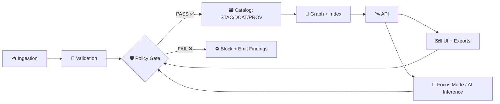

# 🛡️ Provenance Policy Pack (🗂️ `prov/policy/`)


> ✅ This folder exists so every experiment run is **publishable by proof**, not by vibes.  
> It contains the **policy-as-code bundle** (snapshot) and the **policy evaluation results** that validate provenance, governance, security, and reproducibility.

---

## 🧭 Where this fits in the experiment report tree

This `prov/policy/` directory is part of the **experiment report artifact**. A typical report tree looks like:

```text
(example_report_tree)/
├─ 📄 report.md (or README.md)
└─ 🧬 prov/
   ├─ 🧾 manifest.json                  # run + environment metadata (canonicalized + hashed)
   ├─ 🗺️ stac/                          # STAC collections/items
   ├─ 🧱 dcat/                          # DCAT dataset/distributions (JSON-LD)
   ├─ 🧾 prov/                          # W3C PROV-O bundles (JSON-LD)
   └─ 🛡️ policy/
      ├─ 📄 README.md                   # (this file)
      ├─ 📦 bundle/                     # snapshot of policy pack used for this run (OPA bundle)
      ├─ 📥 input/                      # compiled “facts” used by the policy engine
      ├─ 📤 results/                    # machine + human-friendly outputs
      └─ 🧾 waivers/                    # (optional) signed/approved exceptions
```

> ✍️ Template rule: **policy evaluation is reproducible** only if the report includes *both*:
> - the **inputs** (facts), and  
> - the **policy bundle digest/version** used to evaluate them.

---

## 🎯 What “policy” means here

KFM treats governance as a **first-class, testable interface**:

- **Policy-as-code** 🧩 — rules are written in OPA/Rego and run via Conftest (CI) and/or runtime gates.  
- **Evidence-first** 🧾 — policies evaluate against explicit artifacts (STAC/DCAT/PROV, run manifests, SBOMs, signatures…).  
- **Fail-closed by default** 🚦 — if evidence is missing or invalid, the gate blocks publication/use until fixed or waived.  
- **No mystery layers** 🧱 — nothing reaches UI/AI without a data contract + provenance trail.

---

## 🚦 Policy gates (when enforcement happens)

KFM’s governance model uses **checkpoints** (a.k.a. “policy gates”) throughout the lifecycle:



**Minimum gate intent** (baseline for v13+):
- Schema validity ✅
- STAC/DCAT/PROV completeness 🧾
- License presence 📜
- Sensitivity labeling + handling 🏷️
- Provenance completeness 🔗
- AI answers require citations 📌

---

## 🧾 Policy inputs (facts) evaluated by this pack

The policy engine reads from a **compiled input set** (“facts”) built from this report’s provenance artifacts. At minimum, expect:

| Evidence artifact 🧾 | Why it exists 🧠 | Typical location 📍 |
|---|---|---|
| Run Manifest (`run_id`, tool versions, inputs/outputs, counts, errors) | Reproducibility + audit trail | `prov/manifest.json` or `prov/audits/<run_id>/run_manifest.json` |
| Canonical digest + idempotency key | Guarantees stable identity of the run | inside manifest (`canonical_digest`, `idempotency_key`) |
| STAC collections/items | Spatial/temporal extents + discoverability | `prov/stac/` |
| DCAT dataset/distributions (JSON-LD) | Publishing + licensing + distribution refs | `prov/dcat/` |
| PROV-O bundles (JSON-LD) | Machine-queryable lineage graph | `prov/prov/` |
| Data contracts / metadata contracts | “No mystery layers” guarantee | referenced from STAC/DCAT/manifest |
| Artifact references (OCI digests, PMTiles/COGs/GeoParquet) | Immutable retrieval + verification | referenced from DCAT distributions |
| Supply chain evidence (SBOM / signatures) | Trust + tamper resistance | `prov/policy/input/` or referrers in OCI |
| AI transcripts + citations (if AI was used) | Accountability + source traceability | `prov/ai/` (recommended) |

---

## 📤 Policy outputs (what you should look at first)

Inside `prov/policy/results/`, you should find at least one of:

- `summary.md` ✅ human-friendly “PASS/FAIL + findings”
- `results.json` / `results.ndjson` 🧾 machine-readable findings (best for CI + dashboards)
- `junit.xml` 🧪 test-style output (best for CI UIs)
- `policy_bundle.lock` 🔒 bundle digest/version pin

> 🔎 If you’re reviewing a report: start with `results/summary.md`, then inspect the underlying `results.json` for control IDs and evidence pointers.

---

## 🧱 Control catalog (baseline)

Below is a suggested **control inventory** for this template. Your repository may implement more or fewer controls; keep the IDs stable.

| Control ID | Gatepoint | What it enforces | Severity | Evidence |
|---|---|---|---|---|
| **KFM-POL-SCHEMA-001** | Ingest | Data + metadata schemas validate (no malformed STAC/DCAT/PROV) | ❌ Deny | STAC/DCAT/PROV files |
| **KFM-POL-PROV-001** | Catalog | Every published entity has PROV lineage (inputs + activities) | ❌ Deny | PROV bundle |
| **KFM-POL-CAT-001** | Catalog | STAC/DCAT/PROV completeness for every dataset | ❌ Deny | STAC + DCAT + PROV |
| **KFM-POL-LIC-001** | Publish | License present + approved SPDX/known value | ❌ Deny | DCAT license + data contract |
| **KFM-POL-SENS-001** | Publish | Sensitivity classification present; if sensitive, proper handling | ❌ Deny | sensitivity fields + policy config |
| **KFM-POL-CARE-001** | Publish | CARE governance flags for community/indigenous data where applicable | ⚠️ Warn/❌ Deny | governance fields |
| **KFM-POL-GEO-OBF-001** | UI/Export | Sensitive locations are generalized/obfuscated per policy | ❌ Deny | geometry + obfuscation proof |
| **KFM-POL-RUN-001** | Ingest | Run manifest exists (inputs/outputs/versions/counts/errors) | ❌ Deny | run manifest |
| **KFM-POL-RUN-002** | Ingest | Manifest canonical digest + idempotency key present | ❌ Deny | manifest fields |
| **KFM-POL-SUPPLY-001** | Publish | Artifacts referenced by immutable digest; signed where required | ❌ Deny | OCI digest + signature |
| **KFM-POL-SECRETS-001** | CI | No obvious secrets/API keys committed | ❌ Deny | repo scan findings |
| **KFM-POL-AI-CITE-001** | AI | Focus Mode outputs must include citations; otherwise refuse | ❌ Deny | AI transcript + citations |
| **KFM-POL-DEVPROV-001** | CI/Publish | Dev provenance links run → commit/PR/reviewer chain | ⚠️ Warn | PR/commit PROV JSON-LD |
| **KFM-POL-EXP-001** | Report | Experiment protocol completeness (question → method → results) | ⚠️ Warn | protocol section in report |

---

## 🧪 Re-running policy checks (local)

> This template supports **two equivalent modes**: Conftest (recommended for CI) and raw OPA evaluation.

### Option A — Conftest ✅
```bash
# From the report root:
conftest test \
  --policy ./prov/policy/bundle \
  --input  ./prov/policy/input/input.json \
  ./prov
```

### Option B — OPA eval 🧠
```bash
# Example: evaluate deny rules
opa eval \
  -b ./prov/policy/bundle \
  -i ./prov/policy/input/input.json \
  "data.kfm.deny"
```

> 🧩 Tip: keep the compiled policy input stable. If you regenerate `input.json`, pin and record the generator + version in the run manifest.

---

## 🧾 Waivers (exceptions) — how to do them safely

Sometimes you need an exception. Waivers must be **explicit**, **time-bounded**, and **auditable**.

✅ Recommended structure (`prov/policy/waivers/waivers.yaml`):

```yaml
waivers:
  - waiver_id: "WVR-2026-001"
    control_id: "KFM-POL-LIC-001"
    scope:
      dataset_ids: ["kfm.dataset.example"]
    justification: "License under review; dataset restricted to internal use only."
    mitigations:
      - "Do not publish publicly"
      - "Access restricted to role:admin"
    expires_on: "2026-03-01"
    approved_by:
      - name: "Maintainer Name"
        role: "Data Governance"
    evidence:
      - "prov/policy/results/finding-KFM-POL-LIC-001.json"
```

🚫 Anti-patterns:
- “Temporary” waivers with no expiration
- Waivers with no scope (too broad)
- Waivers with no mitigations

---

## 🔒 Security + privacy notes (why policy cares)

Policy isn’t just “lint for metadata.” It’s how we prevent harm:

- **Sensitive data controls** 🏷️: classification + access restrictions + UI warnings  
- **Location protection** 🗺️: generalization/obfuscation for protected sites  
- **Query auditing** 🔍: prevent inference attacks from aggregate outputs  
- **Supply chain verification** 📦: signed artifacts + immutable digests  
- **Prompt / output governance** 🤖: AI answers must cite sources; unsafe outputs are blocked

---

## 🗺️ UI + export behavior (provenance is visible)

KFM’s UI philosophy is “🗺️ the map behind the map”:

- Every visible layer should expose **source, license, provenance summary**  
- Exports should include **credits/attribution** automatically  
- “Story” experiences should carry an **evidence manifest** that points to the exact supporting sources

If you don’t see provenance surfaced in the UI, treat it like a **policy failure** (even if the map “works”).

---

## ✅ Reproducibility checklist (report reviewer edition)

Use this quick checklist when reviewing a run:

- [ ] The run has a **stable `run_id`** and **canonical digest**  
- [ ] The report includes **inputs + outputs** (or immutable references to them)  
- [ ] Tool versions are recorded (libraries, containers, pipelines)  
- [ ] STAC/DCAT/PROV artifacts exist and cross-link correctly  
- [ ] Licensing is explicit and compatible with intended publication  
- [ ] Sensitivity policies are honored (especially geospatial points)  
- [ ] Any AI-generated content has citations (or is blocked)  
- [ ] If exceptions exist, waivers are **scoped + expiring + justified**  
- [ ] (Optional) Dev provenance ties outputs back to commits/PR reviews

---

## 📚 Project reference pack (design inputs)

This template is grounded in the project’s architecture, ingestion, UI, AI, and governance documentation:

- 📘 **KFM – Comprehensive Technical Documentation**
- 🏗️ **KFM – Comprehensive Architecture, Features, and Design**
- 🤖 **KFM – AI System Overview**
- 🖥️ **KFM – Comprehensive UI System Overview**
- 📥 **KFM Data Intake – Technical & Design Guide**
- 💡 **Innovative Concepts to Evolve KFM**
- 🌟 **Latest Ideas & Future Proposals**
- 🧠 **Additional Project Ideas**
- 📦 **AI Concepts & more** (portfolio)
- 🧰 **Various programming languages & resources** (portfolio)
- 🗺️ **Maps / Virtual Worlds / Geospatial WebGL** (portfolio)
- 🗃️ **Data Management / Architectures / Bayesian / Data Science** (portfolio)

> 🧷 Keep this README in sync with policy pack versions.  
> When policies evolve, update: control catalog, evidence requirements, waiver rules, and rerun outputs.

---
