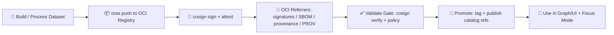

# 🔐 cosign verify — Registry Integrity Gate


> ✅ **Goal:** Before any experiment artifact is **used**, **promoted**, or **referenced** by the KFM graph/UI, prove:
> 1) you’re using the **exact content** (pinned **digest**), and  
> 2) it was produced by an **approved identity** (CI/workflow/person) via **Cosign signatures / attestations**.

---

## 🧭 Where this doc lives

```text
📦 mcp/dev_prov/examples/10_experiment_report_template/(example_report_tree)/
└─ 📁 registry/
   ├─ 🧾 cosign_verify.md          👈 you are here
   ├─ 🧾 (optional) cosign_sign.md
   ├─ 🧾 (optional) oras_push.md
   └─ 📁 receipts/                (recommended outputs live here)
```

---

## 🧠 KFM context (why this exists)

KFM treats **data like code**: artifacts (tilesets, rasters, tables, model bundles) are stored in an **OCI registry** (via ORAS) so they’re versioned, reproducible (digest-addressed), and securable.  
✅ Cosign signatures (stored as **OCI referrers**) are a core part of the **evidence-first** stack: even large binaries can carry a certificate of origin and provenance trail.  
✅ Policy gates (OPA/Conftest) are **fail-closed**; one common gate is: **“No artifact is used unless signed by an approved identity.”**  

This document is the **repeatable verification procedure** + the **receipt format** to include in the experiment report.

---

## ✅ Verification checklist (copy into your report)

- [ ] I used an **immutable digest** (`@sha256:...`) — no floating tags.
- [ ] `cosign verify` succeeded against the **expected identity / issuer** (or public key).
- [ ] (If required) `cosign verify-attestation` succeeded for **SLSA / in-toto**.
- [ ] (If required) I confirmed referrers (signature / SBOM / PROV JSON-LD) exist via `oras discover`.
- [ ] I saved machine-readable receipts under `registry/receipts/`.
- [ ] I recorded the verified digest(s) in the experiment’s artifact table.

---

## 🧰 Prereqs

| Need | Why |
|---|---|
| `cosign` | Verify signatures + attestations |
| `oras` | Resolve digests + discover referrers + pull attachments |
| Registry auth | If artifacts live in private repos |
| `jq` (optional) | Parsing JSON outputs for receipts |

> 💡 Tip: For CI, install Cosign + ORAS in the **Validate** stage of the Detect → Validate → Promote pipeline.

---

## 🧾 Inputs you must know (fill this out)

| Field | Example | Notes |
|---|---|---|
| Registry ref (tag) | `ghcr.io/<org>/<repo>/<artifact>:v2026.01.22` | Tags are human-friendly but mutable |
| Digest | `sha256:...` | **The** identity of the content (immutable) |
| Verification mode | `keyless` or `public-key` | Prefer keyless for CI identity binding |
| Expected issuer | `https://token.actions.githubusercontent.com` | GitHub Actions keyless (example) |
| Expected identity | `https://github.com/<org>/<repo>/.github/workflows/<wf>.yml@refs/heads/main` | Pin your workflow identity |
| Policy allow-list | `org/repo + wf path + ref` | Align with your OPA/Conftest rules |

---

## 🧩 What KFM expects you to verify

### Artifact types you’ll commonly see 📦
- 🗺️ **PMTiles**: `application/vnd.pmtiles`
- 🌍 **GeoParquet**: `application/vnd.geo+parquet`
- 🛰️ **COG / GeoTIFF**: `image/tiff` (or COG-specific conventions)
- 🤖 **Model bundle**: e.g. `application/zip` or an OCI artifact type your project defines

### Referrers you’ll commonly see 🧷
- 🔏 Cosign signature(s)
- 🧾 SBOM (e.g., SPDX/CycloneDX predicate types)
- 🧬 Provenance / attestation (SLSA, in-toto)
- 🧭 PROV JSON-LD attachment (KFM-specific lineage)

---

## 1) 🔎 Resolve the digest (pin the content)

**Always verify + consume by digest.**  
Tags can be re-pointed; digests cannot.

### Option A (recommended): ORAS resolve ✅

```bash
# Example:
# oras resolve ghcr.io/<org>/<repo>/<artifact>:v2026.01.22

oras resolve <REGISTRY>/<REPO>:<TAG>
```

Record the output digest into your report and receipts.

### Option B: If you already have the digest
Skip resolution and proceed to verification.

---

## 2) 🔏 Verify signature (choose ONE path)

### Path A: Keyless verification (OIDC identity) ✅ (preferred)

Use this when artifacts are signed by CI (or a verified identity provider).

```bash
OCI_REF="ghcr.io/<org>/<repo>/<artifact>"
TAG="v2026.01.22"
DIGEST="sha256:<paste_digest_here>"

OIDC_ISSUER="https://token.actions.githubusercontent.com"
CERT_IDENTITY="https://github.com/<org>/<repo>/.github/workflows/<workflow>.yml@refs/heads/main"

cosign verify "${OCI_REF}@${DIGEST}" \
  --certificate-oidc-issuer "${OIDC_ISSUER}" \
  --certificate-identity "${CERT_IDENTITY}" \
  --output json | tee "registry/receipts/cosign_verify.${TAG}.json"
```

✅ **Pass condition:** command exits `0` and output shows verified payload(s).

> 🧠 KFM governance angle: this binds the artifact to the identity that produced it (CI/workflow), which supports audit trails and “never break chain of custody”.

---

### Path B: Public-key verification 🔑 (offline-friendly)

Use this when you have a stable org key and distribute the public key.

```bash
OCI_REF="ghcr.io/<org>/<repo>/<artifact>"
DIGEST="sha256:<paste_digest_here>"

cosign verify --key ./cosign.pub "${OCI_REF}@${DIGEST}" \
  --output json | tee "registry/receipts/cosign_verify.pubkey.json"
```

✅ **Pass condition:** exit `0` and at least one signature verifies.

---

## 3) 🧾 Verify attestations (if required by policy)

If your policy requires provenance/SBOM attestations, verify them explicitly.

### Provenance (SLSA / in-toto) 🧬

```bash
OCI_REF="ghcr.io/<org>/<repo>/<artifact>"
DIGEST="sha256:<paste_digest_here>"

OIDC_ISSUER="https://token.actions.githubusercontent.com"
CERT_IDENTITY="https://github.com/<org>/<repo>/.github/workflows/<workflow>.yml@refs/heads/main"

# Example predicate type shown as a URI (adjust to your pipeline)
PREDICATE_TYPE="https://slsa.dev/provenance/v0.2"

cosign verify-attestation "${OCI_REF}@${DIGEST}" \
  --certificate-oidc-issuer "${OIDC_ISSUER}" \
  --certificate-identity "${CERT_IDENTITY}" \
  --type "${PREDICATE_TYPE}" \
  --output json | tee "registry/receipts/cosign_attestation.provenance.json"
```

✅ **Pass condition:** exit `0` and the predicate(s) match what your policy expects.

> 🧩 Tip: Keep your policy “fail-closed”. If provenance is missing or doesn’t match expectations, treat the artifact as **not usable**.

---

## 4) 🧷 Discover & inspect referrers (signatures / SBOM / PROV)

Cosign signatures and other attachments live as **referrers** to the subject manifest.

```bash
OCI_REF="ghcr.io/<org>/<repo>/<artifact>"
DIGEST="sha256:<paste_digest_here>"

oras discover "${OCI_REF}@${DIGEST}" --format tree \
  | tee "registry/receipts/oras_discover.tree.txt"
```

If you need machine-readable output (for CI/policy tooling), use:

```bash
oras discover "${OCI_REF}@${DIGEST}" --format json \
  | tee "registry/receipts/oras_discover.json"
```

✅ **What you’re looking for:**
- At least one **signature** referrer
- Optional but recommended: **SBOM**, **provenance**, and (KFM) **PROV JSON-LD** attachments

---

## 5) 🧾 Save a “verification receipt” (KFM-style evidence)

To keep experiment reports reproducible and auditable, store a small receipt that captures:
- the **artifact digest**
- **who/what** was trusted (identity/issuer or pubkey)
- **commands + outputs**
- optional: policy decision

### Recommended receipt file 🧾
Save as:

```text
registry/receipts/verification_receipt.<artifact_slug>.json
```

### Template: `verification_receipt.json`

```json
{
  "schema": "kfm.dev_prov/verification_receipt@v1",
  "artifact": {
    "ref": "ghcr.io/<org>/<repo>/<artifact>:<tag>",
    "digest": "sha256:<digest>",
    "media_types_expected": [
      "application/vnd.pmtiles",
      "application/vnd.geo+parquet"
    ]
  },
  "verification": {
    "mode": "keyless",
    "cosign_version": "<cosign version>",
    "oras_version": "<oras version>",
    "certificate_oidc_issuer": "https://token.actions.githubusercontent.com",
    "certificate_identity": "https://github.com/<org>/<repo>/.github/workflows/<workflow>.yml@refs/heads/main",
    "commands": [
      "oras resolve ...",
      "cosign verify ...",
      "cosign verify-attestation ..."
    ],
    "outputs": {
      "cosign_verify_json": "registry/receipts/cosign_verify.<tag>.json",
      "cosign_attestation_json": "registry/receipts/cosign_attestation.provenance.json",
      "oras_discover_json": "registry/receipts/oras_discover.json"
    },
    "result": "pass"
  },
  "policy": {
    "gate": "artifact_signature_required",
    "decision": "allow",
    "notes": "Fail-closed: deny if missing signature/provenance."
  },
  "recorded_at": "2026-01-22T00:00:00Z",
  "recorded_by": {
    "agent": "CI",
    "run_id": "<pipeline_run_id_or_job_url>"
  }
}
```

---

## 6) 🧪 Add to the Experiment Report (template snippet)

Paste something like this into your experiment report under **Artifacts & Provenance**:

```markdown
### 📦 Registry Artifact Verification

| Artifact | Tag | Digest | Verified? | Verification Receipt |
|---|---:|---|---:|---|
| <artifact_name> | <tag> | `sha256:...` | ✅ | `registry/receipts/verification_receipt.<slug>.json` |

Notes:
- Verified with cosign (keyless identity: `<CERT_IDENTITY>`, issuer: `<OIDC_ISSUER>`).
- Referrers (oras discover) include: signature ✅, provenance ✅, SBOM ⬜, PROV JSON-LD ⬜.
```

---

## 🧯 Troubleshooting (common failure modes)

<details>
<summary>❌ “no signatures found”</summary>

- You’re verifying the wrong digest (tag moved).
- The artifact was pushed but never signed.
- Registry doesn’t support referrers API (or needs a fallback mode).
- Your access token can pull the artifact but not list referrers.

**Fix:** resolve digest again, then `oras discover`, then ensure signing step executed.
</details>

<details>
<summary>❌ “certificate identity mismatch”</summary>

- The signer identity is different than expected (workflow path/ref changed, reusable workflow, fork, etc.).

**Fix:** update allow-list policy carefully (prefer pinning to exact workflow + ref).
</details>

<details>
<summary>❌ Verification passes but artifact is “wrong” (semantic mismatch)</summary>

- Signatures prove integrity + origin, not that the dataset is conceptually correct.

**Fix:** pair cosign verification with your **data validation gates** (schema checks, ranges, spatial QA) and provenance requirements.
</details>

---

## 🔒 Security notes (KFM defaults)

- ✅ **Verify by digest** for reproducibility and to avoid tag attacks.
- ✅ Prefer **policy allow-lists** (identity/issuer or key fingerprints) and keep gates **fail-closed**.
- ✅ Store receipts (JSON) so audits can replay decisions.
- ✅ Consider attaching **PROV JSON-LD** as a referrer so lineage can be fetched with the artifact.

---

## 🗺️ Mini-diagram (how this fits the pipeline)



---

## 📚 Reference pointers

- Cosign: https://docs.sigstore.dev/cosign/
- ORAS: https://oras.land/docs/
- (Project) Provenance-first artifact storage + policy gates + evidence-first principles are described across KFM architecture + intake + proposals docs. 🔎

<!-- Project source anchors for this template (conversation-local): -->
<!--  [oai_citation:0‡Innovative Concepts to Evolve the Kansas Frontier Matrix (KFM).pdf](file-service://file-G71zNoWKxsoSW44iwZaaCC) -->
<!--  [oai_citation:1‡Additional Project Ideas.pdf](file-service://file-Pc2GNivcrHBeKjBQksLC3T) -->
