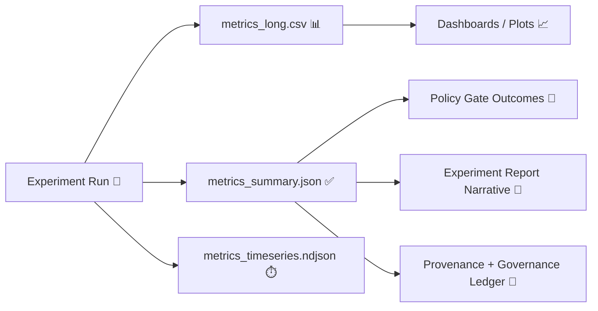

# 📊 Results — Metrics


Quantitative, machine-readable outputs for this experiment live here ✅  
Think: **quality**, **performance**, **reliability**, **governance**, **AI**, and **UX** measurements — all tied back to a **run ID + config hash + provenance chain**.

> [!IMPORTANT]
> In KFM, metrics are not “nice-to-have.” They’re part of the **audit trail** (telemetry + provenance-first + policy gates).  
> If you can’t trace a metric back to its inputs and method, treat it as **non-compliant**.

---

## 🧭 What belongs in `/results/metrics/`

**Put here:**
- 📈 **Summary metrics** (KPI-style, per-run aggregates)
- 🧪 **Evaluation metrics** (model, retrieval, classification, geospatial accuracy, etc.)
- 🧱 **Data intake & validation metrics** (completeness, schema/PROV checks, failures)
- 🕸️ **Graph health metrics** (node/edge deltas, orphan nodes, schema drift)
- ⚡ **Performance telemetry snapshots** (latency, runtime, memory, energy usage)
- 🧑‍💻 **UI & map rendering metrics** (tile generation time, FPS, interaction latency)
- 🔐 **Governance metrics** (policy gate pass/fail counts, sensitivity handling status)

**Do _not_ put here:**
- ❌ Raw datasets (those belong in `data/raw` / `data/processed`)
- ❌ Charts-only without underlying numbers (charts go to `results/figures/`, but back them with metrics here)
- ❌ Anything containing sensitive or restricted data at record-level granularity

---

## 🗂️ Recommended directory layout

```text
results/
  metrics/
    README.md
    metric_spec.yaml              # optional but strongly recommended 📐
    metrics_summary.json          # required ✅ (human-friendly + machine-readable)
    metrics_long.csv              # recommended (tidy/long format) 📊
    metrics_wide.csv              # optional (one row per run)
    metrics_timeseries.ndjson     # optional (append-only event/time-series) ⏱️
    metrics_checks.json           # optional (policy + gate outcomes)
    plots/                        # optional (generated visuals)
      *.png
      *.svg
```

> [!TIP]
> Prefer **one canonical summary file** (for reports + dashboards) and **one canonical long-format file** (for slicing + comparisons).

---

## 🔁 How metrics flow through the report



---

## 🧩 MetricSpec (recommended): make metrics “contract-first”

Create **`metric_spec.yaml`** to define:
- metric IDs + meaning
- units + direction (higher/lower is better)
- required segmentation (by county/time/layer/model/etc.)
- expected ranges / thresholds (for CI + policy checks)

Example:

```yaml
schema_version: kfm.metric_spec.v1
experiment_id: "<EXP_ID>"
owner: "<TEAM_OR_PERSON>"
metrics:
  - id: kfm.qa.metadata_completeness
    display_name: "Metadata completeness (required fields present)"
    unit: ratio
    direction: higher_better
    thresholds:
      - type: min
        value: 0.95
    tags: [qa, intake, governance]

  - id: kfm.ai.citation_coverage
    display_name: "Focus Mode citation coverage"
    unit: ratio
    direction: higher_better
    thresholds:
      - type: min
        value: 0.90
    tags: [ai, focus_mode, provenance]

  - id: kfm.perf.pipeline_runtime_seconds
    display_name: "Pipeline runtime"
    unit: s
    direction: lower_better
    tags: [perf, etl]
```

> [!NOTE]
> This aligns with KFM’s **policy-gated** mindset: schema validation, STAC/DCAT/PROV completeness, license presence, sensitivity classification, and provenance completeness — plus AI outputs requiring citations. ✅

---

## ✅ Required file: `metrics_summary.json`

This should be the “front door” to your metrics.

### Required keys (minimum contract)
- `schema_version`
- `experiment_id`
- `run.run_id`
- `run.config_hash` (or equivalent)
- `run.git.commit` (or equivalent)
- `provenance.inputs[]` (what was measured)
- `provenance.outputs[]` (what was generated)
- `metrics[]` (the actual measurements)

Example:

```json
{
  "schema_version": "kfm.metrics.v1",
  "experiment_id": "EXP-010",
  "run": {
    "run_id": "run_2026-01-22T19-12-00Z_6f8a",
    "started_at": "2026-01-22T19:12:00Z",
    "ended_at": "2026-01-22T19:15:03Z",
    "config_hash": "sha256:...",
    "git": { "commit": "abcdef1", "dirty": false }
  },
  "provenance": {
    "inputs": [
      { "asset_id": "data/processed/<dataset>.parquet", "sha256": "..." }
    ],
    "outputs": [
      { "path": "results/metrics/metrics_long.csv", "sha256": "..." }
    ],
    "governance_ledger_ref": "govlog:<optional>"
  },
  "metrics": [
    {
      "id": "kfm.qa.metadata_completeness",
      "value": 0.97,
      "unit": "ratio",
      "direction": "higher_better"
    },
    {
      "id": "kfm.ai.citation_coverage",
      "value": 0.92,
      "unit": "ratio",
      "direction": "higher_better"
    },
    {
      "id": "kfm.perf.pipeline_runtime_seconds",
      "value": 183.4,
      "unit": "s",
      "direction": "lower_better"
    }
  ],
  "gate_outcomes": [
    { "gate": "schema_validation", "status": "pass" },
    { "gate": "prov_completeness", "status": "pass" },
    { "gate": "focus_mode_citations", "status": "pass" }
  ]
}
```

---

## 📄 Recommended file: `metrics_long.csv` (tidy format)

Use **one row per metric observation**, so you can slice by scope and segment.

Suggested columns:
- `experiment_id`
- `run_id`
- `metric_id`
- `value`
- `unit`
- `direction`
- `scope_type` (global / dataset / layer / county / graph / ui / ai)
- `scope_id` (e.g., dataset_id, layer_id, county_fips, graph_subgraph_id)
- `time_start`, `time_end` (if applicable)
- `notes` (short, optional)

---

## ⏱️ Optional file: `metrics_timeseries.ndjson` (append-only)

Use this when:
- your pipeline emits events (ingestion gates, retries, failures)
- you track latency over time
- you store “telemetry-like” stream data snapshots

Format: **NDJSON**, one event per line (easy to append + audit).

Example line:
```json
{"ts":"2026-01-22T19:12:10Z","run_id":"run_...","metric_id":"kfm.perf.api_latency_ms","value":243,"unit":"ms","scope_type":"api","scope_id":"/tiles/{z}/{x}/{y}.pbf"}
```

> [!TIP]
> This mirrors KFM’s ingestion telemetry approach: append-only logs that feed dashboards/audits.

---

## 🧰 Suggested metric catalog (KFM-aligned)

### 1) 📥 Data intake & catalog QA
- `kfm.qa.metadata_completeness` (required fields present)
- `kfm.qa.license_presence_rate`
- `kfm.qa.checksum_verified_rate`
- `kfm.qa.schema_validation_failures`
- `kfm.qa.prov_missing_count`
- `kfm.ingest.bytes_processed`
- `kfm.ingest.records_processed`
- `kfm.ingest.failures_by_stage` (gate / transform / load)

### 2) 🕸️ Knowledge graph health checks
- `kfm.graph.node_count_total`
- `kfm.graph.edge_count_total`
- `kfm.graph.node_count_delta`
- `kfm.graph.orphan_node_count`
- `kfm.graph.property_schema_drift_count`
- `kfm.graph.top_degree_p95`

> [!NOTE]
> Graph health routines should flag “silent” breakage (orphans, drift, constraint failures) before it hits UI/AI.

### 3) 🤖 AI / Focus Mode evaluation & governance
- `kfm.ai.citation_coverage` ✅ (policy-critical)
- `kfm.ai.refusal_rate` (healthy if policy triggers)
- `kfm.ai.answer_latency_ms`
- `kfm.ai.model_energy_wh` (or joules)
- `kfm.ai.hallucination_flags_count` (if you have a checker)
- `kfm.ai.retrieval_hit_rate_at_k`
- `kfm.ai.mrr_at_k`

> [!WARNING]
> If AI output cannot cite sources, the correct behavior is **refusal/uncertainty** — not guessing.

### 4) 🗺️ UI + mapping performance (2D/3D/WebGL)
- `kfm.ui.time_to_interactive_ms`
- `kfm.ui.tile_request_p95_ms`
- `kfm.ui.webgl_fps_median`
- `kfm.ui.layer_toggle_latency_ms`
- `kfm.ui.story_playback_drop_rate`
- `kfm.ui.accessibility_score` (if using automated checks)

### 5) 🔐 Security, privacy, and sensitivity handling
- `kfm.gov.sensitive_records_redacted_count`
- `kfm.gov.coordinate_generalization_applied_rate`
- `kfm.gov.policy_gate_failures_by_type`
- `kfm.gov.audit_log_events_count`

> [!IMPORTANT]
> When working with sensitive cultural/archaeological data, store only **aggregated** metrics (counts, rates), never raw coordinates or identifying fields.

### 6) 🌐 Federation / multi-region readiness (optional)
- `kfm.fed.cross_catalog_query_latency_ms`
- `kfm.fed.schema_compatibility_score`
- `kfm.fed.remote_hub_availability_rate`

---

## 🧪 Model evaluation metrics quick reference (if applicable)

If your experiment involves classification/retrieval, include:
- Precision / Recall / F1 (macro + weighted when relevant)
- Confusion matrix (as data, not just an image)
- Calibration / confidence metrics (if using probabilistic outputs)
- Segment metrics (by county/time/layer/domain)

---

## 🔍 Validation & CI hooks (recommended)

Automate checks so metrics don’t drift into chaos:

- ✅ `metric_spec.yaml` exists (for serious experiments)
- ✅ `metrics_summary.json` matches schema
- ✅ all metrics have units + direction
- ✅ all metrics reference a `run_id`
- ✅ provenance references exist for the inputs (dataset/model/config)
- ✅ policy gates outcomes recorded (pass/fail)
- ✅ no sensitive data leakage in metrics artifacts

---

## ✅ Checklist (copy into your PR)

- [ ] `metrics_summary.json` added/updated  
- [ ] `metrics_long.csv` added/updated (or Parquet equivalent)  
- [ ] Run metadata included (`run_id`, `config_hash`, code version)  
- [ ] Provenance pointers included (inputs + outputs)  
- [ ] Policy/gate outcomes recorded (especially citations for AI outputs)  
- [ ] No sensitive data leaked (only aggregated stats)  
- [ ] Figures (if any) backed by numbers in this folder  

---

## 📚 Related docs (design intent)

This template is aligned with KFM’s broader principles:
- provenance-first + evidence-backed UX 🧾
- policy gates + “fail closed” quality bar 🔐
- telemetry/observability with run IDs + config hashes 📡
- Focus Mode citations + governance ledger 🤖
- federation-ready schemas + reusable UI architecture 🌐
- community & governance maturity over time 🤝
