# 🛰️ STAC for Experiment Reports


> [!IMPORTANT]
> This folder is where **geospatial experiment outputs** become **discoverable + replayable + UI-ready** by shipping a **STAC Collection + Item(s)** that cross-link to **DCAT + PROV** (KFM’s “evidence triplet”).[^evidence-triplet]

---

## ✨ What this folder is for

This `stac/` directory is the **geospatial catalog slice** of an experiment report.

Use it when your experiment produces **anything with a footprint and/or time**:
- 🗺️ vector layers (GeoJSON / GeoParquet / FlatGeobuf)
- 🛰️ raster products (COGs, NDVI, drought index, etc.)
- 🧱 tiles (PMTiles / MVT / MBTiles)
- 🌎 3D & terrain assets (3D Tiles, point clouds)
- 📡 streaming observations (each observation as an Item)
- 🧪 simulation outputs (scenario runs with uncertainty metadata)

STAC answers: **“What is this output, where/when does it apply, and where are the files?”**[^stac-purpose]

---

## 🧭 How STAC fits the KFM pipeline

KFM’s ingestion + publishing rule-of-thumb:

- **PostGIS stores geo truth** (vectors/rasters),
- **Catalogs describe assets** (STAC/DCAT),
- **Graph links the context** (Neo4j).[^geo-truth]

And data must follow the canonical sequence:

```mermaid
flowchart LR
  RAW["🧱 Raw Data"] --> WORK["🧪 Work / ETL"]
  WORK --> PROC["✅ Processed Data"]
  PROC --> CATS["📦 Catalogs (STAC/DCAT/PROV)"]
  CATS --> GRAPH["🕸️ Graph (Neo4j)"]
  GRAPH --> API["🔐 Governed API"]
  API --> UI["🖥️ UI"]
  UI --> STORY["📖 Story Nodes"]
  UI --> FOCUS["🧠 Focus Mode"]
```



No stage is allowed to skip the previous (e.g., UI can’t bypass API; data can’t be shown without catalogs + provenance).[^pipeline-order]

---

## 🗂️ Folder contract

Use this structure (or keep it isomorphic to it):

```text
📁 stac/
├─ 📄 README.md
├─ 📄 collection.json
├─ 📁 items/
│  ├─ 📄 item__<kfm_dataset_id>__<run_id>.json
│  └─ 📄 item__<kfm_dataset_id>__<run_id>__<part>.json   (optional split)
└─ 📁 assets/
   ├─ 🗺️ data/          (optional: local copies or small artifacts)
   ├─ 🧱 tiles/         (optional)
   ├─ 🖼️ previews/      (thumbnails, quicklooks)
   └─ 📄 reports/       (exported PDFs, charts, etc.)
```

> [!NOTE]
> In “real” KFM publishing, STAC typically lives under `data/stac/` (repo-backed catalogs), but this template keeps STAC **co-located with the experiment report** so it can be promoted later via PR. The pipeline can automate packaging outputs + STAC/DCAT/PROV and open a PR for promotion.[^sandbox-promotion]

---

## 🧩 KFM-STAC profile fields

KFM extends base STAC with project-required fields (see `KFM_STAC_PROFILE.md`). The minimum custom fields typically include:

- `kfm:dataset_id` ✅ (stable identifier)
- `kfm:version` ✅
- `kfm:classification` ✅ (public / restricted / private)
- `kfm:provenance_ref` ✅ (pointer to PROV bundle)
- `kfm:uncertainty` (recommended for simulation/model outputs)
- `kfm:quality` / `kfm:qa_gates` (recommended)
- `kfm:run_id` (recommended for experiment tracking)
- `kfm:git_commit` / `kfm:pr` (recommended for dev provenance)

These profile expectations are explicitly validated in CI and are part of KFM’s required STAC/DCAT/PROV alignment rules.[^kfm-profiles]

---

## 🔗 Linkage patterns

KFM expects **cross-layer linkage** so catalog, graph, UI, and narratives stay in sync.[^cross-layer]

### STAC → assets
STAC Items must point to the **actual outputs** (stable storage, or repo paths for small assets).[^stac-links-to-data]

### STAC ↔ DCAT
DCAT is the “discovery layer”; it should link to STAC (and/or direct downloads) via distributions.[^cross-layer]

### STAC ↔ PROV
PROV records the lineage chain (raw → derived), run/config identifiers, and responsible agents.[^cross-layer]  
STAC Items should include a link (and/or custom field) to the corresponding PROV bundle.[^stac-purpose]

### STAC ↔ Graph
The graph should store references (IDs/DOIs/STAC IDs), not bulky payloads.[^cross-layer]

### STAC ↔ UI / Story Nodes / Focus Mode
- UI is **read-only** with respect to data; stories are **versioned content** (Markdown/JSON) that point to dataset IDs.[^ui-readonly]
- Focus Mode **must cite sources**, and those citations are drawn from STAC/DCAT/PROV IDs and URLs.[^focus-mode-cites]

---

## 🧠 Governance and sensitivity

### Classification and redaction
KFM supports sensitivity-aware handling (classification tags, differential access, coordinate fuzzing, and policy-driven omission/redaction).[^sensitivity]

For streaming layers, classification can prevent certain stations/points from being shown unless authorized, and that classification is enforced at API/query time.[^streaming-classification]

### CARE + Indigenous data sovereignty
KFM explicitly considers CARE principles, community consent, and cultural protocols for certain datasets.[^care]

> [!TIP]
> If an asset is sensitive, don’t “just hide it in UI.” Instead:
> - classify it (`kfm:classification`)
> - generalize/fuzz geometry (if allowed)
> - ensure API policy enforcement + provenance of the redaction transformation

---

## 🧪 Experiments, simulations, and uncertainty

Simulation work is treated as **sandbox → promotion**:
- Workbench outputs are **experimental** until reviewed and promoted to processed/cataloged data.[^sandbox-promotion]
- Promotion checklist includes creating STAC/DCAT/PROV, stable IDs, sensitivity review, and **no direct UI links** to sandbox outputs.[^sandbox-promotion]

Reproducibility rules emphasize:
- pin inputs (hashes), capture parameters/config, pin environment/lockfiles, record seeds
- run regression/unit tests and verification & validation
- include uncertainty quantification and sensitivity analysis deliverables (means/variance/ensembles, instability notes).[^sim-repro]

Because KFM treats geospatial modeling as decision-support, uncertainty is not optional “nice-to-have”—it’s part of trust and scientific rigor.[^uq-motivation]

---

## 📡 Real-time and streaming data pattern

A practical KFM pattern is “streaming is many small datasets over time,” with:
- Items created per observation (or rolling window checkpoints)
- append-only philosophy (no silent rewrites)
- at least stub provenance before UI display (“provenance-first publishing”).[^streaming-prov]

Example (transit): a GTFS-RT watcher can create a STAC Item for each vehicle observation (with route + timestamp), plus a DCAT Dataset entry.[^gtfsrt]

---

## 🧭 UI integration hooks

KFM’s UI is designed so **every visualization links back to source data + metadata** (“the map behind the map”).[^ui-provenance]

Key UI surfaces that benefit from strong STAC records:
- 🧱 Layer panel “info” buttons (source, license, time coverage, spatial coverage)
- ⏳ Timeline slider interactions (Items with temporal properties)
- 🖱️ Popups/feature inspection (Item/asset attribution)
- 🧠 Focus Mode citations + audit panel governance flags[^focus-mode-audit]
- 🧪 Scenario visualization for simulation outputs (with uncertainty metadata).[^ui-sim]

---

## ✅ What “good” looks like

Use this checklist before marking your experiment report “ready”:

- [ ] `collection.json` exists and validates
- [ ] 1+ `Item` exists per output (or per observation/window)
- [ ] Each Item has `kfm:dataset_id`, `kfm:classification`, `kfm:provenance_ref`
- [ ] Assets include stable `href`s + checksums + media types
- [ ] STAC links to DCAT + PROV (and vice versa)
- [ ] Sandbox outputs are not referenced by production UI
- [ ] Sensitivity reviewed (and redaction/fuzzing provenance recorded)
- [ ] Simulation runs include UQ/Sensitivity outputs when applicable

---

## 📦 Example JSON templates

> [!NOTE]
> These are intentionally “copy/paste then fill” templates. Keep them minimal first, then add extensions.

<details>
<summary><strong>🗃️ collection.json</strong> (template)</summary>

```json
{
  "stac_version": "1.0.0",
  "type": "Collection",
  "id": "{{kfm_dataset_id}}",
  "title": "{{human_title}}",
  "description": "{{what_this_collection_represents}}",
  "license": "{{license_id_or_proprietary}}",
  "extent": {
    "spatial": { "bbox": [[[{{minLon}}, {{minLat}}, {{maxLon}}, {{maxLat}}]]] },
    "temporal": { "interval": [[ "{{start_datetime_iso}}", "{{end_datetime_iso_or_null}}" ]] }
  },
  "keywords": [
    "kfm",
    "experiment",
    "{{theme}}",
    "{{region}}"
  ],
  "providers": [
    {
      "name": "Kansas Frontier Matrix",
      "roles": ["processor", "host"]
    }
  ],
  "links": [
    { "rel": "self", "href": "./collection.json", "type": "application/json" },
    { "rel": "root", "href": "../", "type": "text/markdown", "title": "Experiment report root" },

    { "rel": "describedby", "href": "../dcat/dataset.jsonld", "type": "application/ld+json", "title": "DCAT Dataset" },
    { "rel": "via", "href": "../prov/prov.jsonld", "type": "application/ld+json", "title": "PROV bundle" }
  ],

  "kfm:dataset_id": "{{kfm_dataset_id}}",
  "kfm:version": "{{v_semver_or_int}}",
  "kfm:classification": "{{public|restricted|private}}",
  "kfm:provenance_ref": "../prov/prov.jsonld"
}
```

</details>

<details>
<summary><strong>🧩 item__&lt;kfm_dataset_id&gt;__&lt;run_id&gt;.json</strong> (template)</summary>

```json
{
  "stac_version": "1.0.0",
  "type": "Feature",
  "id": "{{kfm_dataset_id}}__{{run_id}}",
  "collection": "{{kfm_dataset_id}}",

  "geometry": {{geojson_geometry_or_null_if_sensitive}},
  "bbox": [{{minLon}}, {{minLat}}, {{maxLon}}, {{maxLat}}],

  "properties": {
    "datetime": "{{datetime_iso}}",
    "start_datetime": "{{optional_start}}",
    "end_datetime": "{{optional_end}}",

    "kfm:dataset_id": "{{kfm_dataset_id}}",
    "kfm:version": "{{v_semver_or_int}}",
    "kfm:classification": "{{public|restricted|private}}",
    "kfm:provenance_ref": "../prov/prov.jsonld",

    "kfm:run_id": "{{run_id}}",
    "kfm:git_commit": "{{git_sha}}",
    "kfm:pr": "{{optional_pr_number_or_url}}",

    "kfm:experiment": {
      "hypothesis": "{{optional}}",
      "method": "{{pipeline_or_notebook_or_model_name}}",
      "parameters_ref": "../manifests/run_manifest.json"
    },

    "kfm:uncertainty": {
      "method": "{{optional_uq_method}}",
      "summary_asset": "uq_summary",
      "notes": "{{optional}}"
    }
  },

  "links": [
    { "rel": "self", "href": "./items/item__{{kfm_dataset_id}}__{{run_id}}.json", "type": "application/json" },
    { "rel": "collection", "href": "../stac/collection.json", "type": "application/json" },

    { "rel": "describedby", "href": "../dcat/dataset.jsonld", "type": "application/ld+json" },
    { "rel": "via", "href": "../prov/prov.jsonld", "type": "application/ld+json" },

    { "rel": "related", "href": "../story_nodes/{{optional_story_id}}/README.md", "type": "text/markdown" }
  ],

  "assets": {
    "data": {
      "href": "{{stable_href_to_primary_output}}",
      "type": "{{mime_type}}",
      "roles": ["data"],
      "title": "Primary output",
      "description": "{{what_this_asset_is}}",
      "kfm:sha256": "{{sha256}}",
      "kfm:byte_size": {{bytes}}
    },

    "preview": {
      "href": "{{href_to_thumbnail_or_quicklook}}",
      "type": "image/png",
      "roles": ["thumbnail", "overview"],
      "title": "Preview"
    },

    "report": {
      "href": "../outputs/report.pdf",
      "type": "application/pdf",
      "roles": ["report"]
    },

    "notebook": {
      "href": "../notebooks/analysis.ipynb",
      "type": "application/x-ipynb+json",
      "roles": ["notebook"]
    },

    "run_manifest": {
      "href": "../manifests/run_manifest.json",
      "type": "application/json",
      "roles": ["metadata"],
      "title": "Run manifest"
    },

    "uq_summary": {
      "href": "../outputs/uq_summary.json",
      "type": "application/json",
      "roles": ["metadata", "analysis"],
      "title": "Uncertainty quantification summary"
    }
  }
}
```

</details>

---

## 🔐 Checksums, manifests, and artifact storage

For high-trust, reproducible experiments:
- include a `run_manifest.json` (inputs, parameters, outputs, hashes)
- canonicalize where possible and compute a stable digest
- store artifacts in stable storage (repo for small files; external/OCI for large) and reference them from STAC assets.[^run-manifest]

KFM also explores using OCI registries for immutable artifact blobs, with metadata profiles (STAC/DCAT/PROV) and signing/verification (e.g., cosign), so catalogs can reference content-addressed artifacts.[^oci-artifacts]

---

## 🔎 Validation and CI expectations

Recommended validations (locally + in CI):
- schema validation against KFM profiles (STAC/DCAT/PROV)
- link integrity (STAC↔DCAT↔PROV)
- asset existence + checksum integrity
- governance checks (classification rules, citation requirements)

KFM enforces “evidence-first narrative,” including runtime policy checks (e.g., ensuring AI outputs contain citations).[^opa-citations]

---

## 🧵 Dev provenance helpers

If you’re using Pulse Threads (NDJSON “ledger per run”) or PR-based promotion:
- link your `run_id` across STAC `id`, PROV activity IDs, and Pulse Thread events
- include PR/commit references in STAC properties for traceability.[^pulse-threads]

This also supports “rollback runbooks” by letting maintainers trace exactly which artifacts and catalog entries were introduced by a run.[^rollback]

---

## 📚 Project references used by this template

- **STAC/DCAT/PROV alignment policy + KFM profile expectations**: MARKDOWN_GUIDE_v13.md.gdoc[^kfm-profiles]
- **Pipeline sequence, evidence triplet, PostGIS/Neo4j roles, streaming + simulations**: KFM Data Intake – Technical & Design Guide[^pipeline-order]
- **UI provenance-first experience, story nodes, scenario visualization**: KFM UI System Overview[^ui-provenance]
- **Focus Mode citations + auditability**: KFM AI System Overview[^focus-mode-cites]
- **Sensitivity-aware design, CARE principles, digital twin & simulation vision**: Innovative Concepts to Evolve KFM[^sensitivity]
- **Story node evidence manifests + provenance graph links; artifact ideas**: Additional Project Ideas[^story-evidence]
- **Pulse Threads, watcher/planner/executor PR flows, GTFS-RT STAC items**: Latest Ideas & Future Proposals[^gtfsrt]
- **Geospatial processing & PostGIS workflows**: Python Geospatial Analysis Cookbook[^geospatial-cookbook]
- **Data-driven optimization + privacy patterns**: Data Mining Concepts & Applications[^uq-motivation]
- **Reference libraries (PDF portfolios)**: AI Concepts & more; Data Management; Maps/WebGL; Various programming languages[^portfolios]

---

## 🧷 Footnotes

[^evidence-triplet]: KFM requires STAC + DCAT + PROV records for every dataset/evidence artifact (the “evidence triplet”) and validates against KFM profiles.  [oai_citation:0‡MARKDOWN_GUIDE_v13.md.gdoc](file-service://file-UYVruFXfueR8veHMUKeugU) [oai_citation:1‡📚 Kansas Frontier Matrix (KFM) Data Intake – Technical & Design Guide.pdf](file-service://file-EbUCdsJMbu5KwpoKMrLrgj)

[^pipeline-order]: Canonical pipeline order is enforced (Raw → Work → Processed → Catalogs → Graph → API → UI → Story/Focus).  [oai_citation:2‡📚 Kansas Frontier Matrix (KFM) Data Intake – Technical & Design Guide.pdf](file-service://file-EbUCdsJMbu5KwpoKMrLrgj)

[^geo-truth]: “PostGIS stores geo truth (vectors/rasters), Catalogs describe the assets, Graph links the context.”  [oai_citation:3‡📚 Kansas Frontier Matrix (KFM) Data Intake – Technical & Design Guide.pdf](file-service://file-EbUCdsJMbu5KwpoKMrLrgj)

[^kfm-profiles]: KFM profiles are referenced as extensions to base standards and validated in CI.  [oai_citation:4‡MARKDOWN_GUIDE_v13.md.gdoc](file-service://file-UYVruFXfueR8veHMUKeugU) [oai_citation:5‡Innovative Concepts to Evolve the Kansas Frontier Matrix (KFM).pdf](file-service://file-G71zNoWKxsoSW44iwZaaCC)

[^cross-layer]: Cross-layer linkage expectations across STAC/DCAT/PROV/Graph are explicitly described in the KFM Markdown guide.  [oai_citation:6‡MARKDOWN_GUIDE_v13.md.gdoc](file-service://file-UYVruFXfueR8veHMUKeugU)

[^stac-links-to-data]: STAC Items must point to the actual assets and carry attribution/license information.  [oai_citation:7‡MARKDOWN_GUIDE_v13.md.gdoc](file-service://file-UYVruFXfueR8veHMUKeugU)

[^stac-purpose]: STAC’s role and KFM’s use of properties/links/assets (including pointers to provenance and WGS84 geometry conventions) are described in the KFM data intake guide.  [oai_citation:8‡📚 Kansas Frontier Matrix (KFM) Data Intake – Technical & Design Guide.pdf](file-service://file-EbUCdsJMbu5KwpoKMrLrgj)

[^ui-readonly]: UI is read-only for data; story nodes are versioned Markdown/JSON with pointers to dataset IDs for governance and auditability.  [oai_citation:9‡📚 Kansas Frontier Matrix (KFM) Data Intake – Technical & Design Guide.pdf](file-service://file-EbUCdsJMbu5KwpoKMrLrgj)

[^focus-mode-cites]: Focus Mode is evidence-backed and always cites sources; it refuses to answer without support.  [oai_citation:10‡Kansas Frontier Matrix (KFM) – AI System Overview 🧭🤖.pdf](file-service://file-Pv8eev6RWvCKrGCXyzY7zg) [oai_citation:11‡📚 Kansas Frontier Matrix (KFM) Data Intake – Technical & Design Guide.pdf](file-service://file-EbUCdsJMbu5KwpoKMrLrgj)

[^focus-mode-audit]: Focus Mode includes explainability/audit panel ideas and governance flags surfaced with answers.  [oai_citation:12‡Kansas Frontier Matrix (KFM) – AI System Overview 🧭🤖.pdf](file-service://file-Pv8eev6RWvCKrGCXyzY7zg)

[^ui-provenance]: UI design emphasizes provenance and “the map behind the map,” and surfaces source attribution and citations.  [oai_citation:13‡Kansas Frontier Matrix – Comprehensive UI System Overview.pdf](file-service://file-KcBQruYcoFVDEixzzRHTwt) [oai_citation:14‡Kansas Frontier Matrix – Comprehensive UI System Overview.pdf](file-service://file-KcBQruYcoFVDEixzzRHTwt)

[^ui-sim]: UI plans include simulation results & scenario visualization, and handling uncertainties for scenario-specific data.  [oai_citation:15‡Kansas Frontier Matrix – Comprehensive UI System Overview.pdf](file-service://file-KcBQruYcoFVDEixzzRHTwt)

[^sandbox-promotion]: Simulation workflows emphasize sandbox vs promotion and require STAC/DCAT/PROV + review before data becomes official/used by UI.  [oai_citation:16‡📚 Kansas Frontier Matrix (KFM) Data Intake – Technical & Design Guide.pdf](file-service://file-EbUCdsJMbu5KwpoKMrLrgj)

[^sim-repro]: Simulation reproducibility rules include pinning inputs, parameters, environment, seeds; tests; V&V; calibration separation; and minimum UQ deliverables.  [oai_citation:17‡📚 Kansas Frontier Matrix (KFM) Data Intake – Technical & Design Guide.pdf](file-service://file-EbUCdsJMbu5KwpoKMrLrgj)

[^uq-motivation]: Data-driven optimization under uncertainty and privacy-preserving data release concepts inform why KFM should encode uncertainty + sensitivity metadata.  [oai_citation:18‡📚 Kansas Frontier Matrix (KFM) Data Intake – Technical & Design Guide.pdf](file-service://file-EbUCdsJMbu5KwpoKMrLrgj) [oai_citation:19‡📚 Kansas Frontier Matrix (KFM) Data Intake – Technical & Design Guide.pdf](file-service://file-EbUCdsJMbu5KwpoKMrLrgj)

[^streaming-classification]: Streaming/real-time layer example includes classification enforcement and DCAT source labeling surfaced in UI.  [oai_citation:20‡📚 Kansas Frontier Matrix (KFM) Data Intake – Technical & Design Guide.pdf](file-service://file-EbUCdsJMbu5KwpoKMrLrgj)

[^streaming-prov]: Streaming policy requires provenance-first publishing and at least stub provenance before display; append-only/windowing patterns are described.  [oai_citation:21‡📚 Kansas Frontier Matrix (KFM) Data Intake – Technical & Design Guide.pdf](file-service://file-EbUCdsJMbu5KwpoKMrLrgj) [oai_citation:22‡📚 Kansas Frontier Matrix (KFM) Data Intake – Technical & Design Guide.pdf](file-service://file-EbUCdsJMbu5KwpoKMrLrgj)

[^gtfsrt]: GTFS-RT watcher example producing STAC Items for observations is described in KFM proposals.  [oai_citation:23‡KFM- python-geospatial-analysis-cookbook-over-60-recipes-to-work-with-topology-overlays-indoor-routing-and-web-application-analysis-with-python.pdf](file-service://file-2gpiGDZS8iw6EdxGswEdHp)

[^sensitivity]: Sensitivity-aware data handling (classification tags, differential access, coordinate fuzzing, redaction) is described in KFM innovation proposals.  [oai_citation:24‡📚 Kansas Frontier Matrix (KFM) Data Intake – Technical & Design Guide.pdf](file-service://file-EbUCdsJMbu5KwpoKMrLrgj)

[^care]: CARE principles and data sovereignty considerations are explicitly called out in KFM data intake design.  [oai_citation:25‡Innovative Concepts to Evolve the Kansas Frontier Matrix (KFM).pdf](file-service://file-G71zNoWKxsoSW44iwZaaCC)

[^run-manifest]: Run manifest concept includes canonicalization and sha-256 digest expectations for verifiable artifacts.  [oai_citation:26‡Additional Project Ideas.pdf](file-service://file-Pc2GNivcrHBeKjBQksLC3T)

[^oci-artifacts]: OCI artifact storage/signing concept and metadata profiles (STAC/DCAT/PROV) are described as part of KFM evolution ideas.  [oai_citation:27‡Additional Project Ideas.pdf](file-service://file-Pc2GNivcrHBeKjBQksLC3T)

[^opa-citations]: KFM describes runtime policy checks (e.g., OPA) ensuring AI outputs have citations and governance logging.  [oai_citation:28‡📚 Kansas Frontier Matrix (KFM) Data Intake – Technical & Design Guide.pdf](file-service://file-EbUCdsJMbu5KwpoKMrLrgj)

[^pulse-threads]: Pulse Threads are proposed as NDJSON ledgers per run and tie into PR/commit provenance workflows.  [oai_citation:29‡Additional Project Ideas.pdf](file-service://file-Pc2GNivcrHBeKjBQksLC3T) [oai_citation:30‡Additional Project Ideas.pdf](file-service://file-Pc2GNivcrHBeKjBQksLC3T)

[^rollback]: Rollback runbook concept is described in KFM proposals (trace artifacts back to the run/PR).  [oai_citation:31‡Additional Project Ideas.pdf](file-service://file-Pc2GNivcrHBeKjBQksLC3T)

[^story-evidence]: Evidence manifests + PROV linking elevate story nodes to queryable provenance graph artifacts.  [oai_citation:32‡Additional Project Ideas.pdf](file-service://file-Pc2GNivcrHBeKjBQksLC3T) [oai_citation:33‡Additional Project Ideas.pdf](file-service://file-Pc2GNivcrHBeKjBQksLC3T)

[^geospatial-cookbook]: Geospatial workflow references include PostGIS usage patterns, projections, and tooling helpful for experiment outputs.  [oai_citation:34‡KFM- python-geospatial-analysis-cookbook-over-60-recipes-to-work-with-topology-overlays-indoor-routing-and-web-application-analysis-with-python.pdf](file-service://file-2gpiGDZS8iw6EdxGswEdHp) [oai_citation:35‡KFM- python-geospatial-analysis-cookbook-over-60-recipes-to-work-with-topology-overlays-indoor-routing-and-web-application-analysis-with-python.pdf](file-service://file-2gpiGDZS8iw6EdxGswEdHp)

[^portfolios]: Several provided PDFs are PDF portfolios containing multiple documents; their presence and “portfolio” nature is reflected in their cover metadata. 

<!-- Internal tool citation markers (do not remove):
 [oai_citation:36‡Kansas Frontier Matrix – Comprehensive UI System Overview.pdf](file-service://file-KcBQruYcoFVDEixzzRHTwt)  [oai_citation:37‡📚 Kansas Frontier Matrix (KFM) Data Intake – Technical & Design Guide.pdf](file-service://file-EbUCdsJMbu5KwpoKMrLrgj)  [oai_citation:38‡Innovative Concepts to Evolve the Kansas Frontier Matrix (KFM).pdf](file-service://file-G71zNoWKxsoSW44iwZaaCC)  [oai_citation:39‡Additional Project Ideas.pdf](file-service://file-Pc2GNivcrHBeKjBQksLC3T)
 [oai_citation:40‡Kansas Frontier Matrix (KFM) – AI System Overview 🧭🤖.pdf](file-service://file-Pv8eev6RWvCKrGCXyzY7zg)  [oai_citation:41‡Kansas Frontier Matrix – Comprehensive UI System Overview.pdf](file-service://file-KcBQruYcoFVDEixzzRHTwt)  [oai_citation:42‡Kansas Frontier Matrix – Comprehensive UI System Overview.pdf](file-service://file-KcBQruYcoFVDEixzzRHTwt)  [oai_citation:43‡Kansas Frontier Matrix (KFM) – AI System Overview 🧭🤖.pdf](file-service://file-Pv8eev6RWvCKrGCXyzY7zg)  [oai_citation:44‡Kansas Frontier Matrix – Comprehensive UI System Overview.pdf](file-service://file-KcBQruYcoFVDEixzzRHTwt)  [oai_citation:45‡📚 Kansas Frontier Matrix (KFM) Data Intake – Technical & Design Guide.pdf](file-service://file-EbUCdsJMbu5KwpoKMrLrgj)  [oai_citation:46‡Additional Project Ideas.pdf](file-service://file-Pc2GNivcrHBeKjBQksLC3T)  [oai_citation:47‡Additional Project Ideas.pdf](file-service://file-Pc2GNivcrHBeKjBQksLC3T)  [oai_citation:48‡Kansas Frontier Matrix (KFM) – Comprehensive Technical Documentation.pdf](file-service://file-AkqwUuYPp5zePf7pv5SMxi)  [oai_citation:49‡📚 Kansas Frontier Matrix (KFM) Data Intake – Technical & Design Guide.pdf](file-service://file-EbUCdsJMbu5KwpoKMrLrgj)  [oai_citation:50‡Kansas Frontier Matrix – Comprehensive UI System Overview.pdf](file-service://file-KcBQruYcoFVDEixzzRHTwt)  [oai_citation:51‡Kansas Frontier Matrix (KFM) – Comprehensive Technical Documentation.pdf](file-service://file-AkqwUuYPp5zePf7pv5SMxi)  [oai_citation:52‡📚 Kansas Frontier Matrix (KFM) Data Intake – Technical & Design Guide.pdf](file-service://file-EbUCdsJMbu5KwpoKMrLrgj)  [oai_citation:53‡📚 Kansas Frontier Matrix (KFM) Data Intake – Technical & Design Guide.pdf](file-service://file-EbUCdsJMbu5KwpoKMrLrgj)  [oai_citation:54‡📚 Kansas Frontier Matrix (KFM) Data Intake – Technical & Design Guide.pdf](file-service://file-EbUCdsJMbu5KwpoKMrLrgj)  [oai_citation:55‡Kansas Frontier Matrix (KFM) – Comprehensive Technical Documentation.pdf](file-service://file-AkqwUuYPp5zePf7pv5SMxi)  [oai_citation:56‡Kansas Frontier Matrix – Comprehensive UI System Overview.pdf](file-service://file-KcBQruYcoFVDEixzzRHTwt)
 [oai_citation:57‡📚 Kansas Frontier Matrix (KFM) Data Intake – Technical & Design Guide.pdf](file-service://file-EbUCdsJMbu5KwpoKMrLrgj)  [oai_citation:58‡📚 Kansas Frontier Matrix (KFM) Data Intake – Technical & Design Guide.pdf](file-service://file-EbUCdsJMbu5KwpoKMrLrgj)  [oai_citation:59‡MARKDOWN_GUIDE_v13.md.gdoc](file-service://file-UYVruFXfueR8veHMUKeugU)  [oai_citation:60‡📚 Kansas Frontier Matrix (KFM) Data Intake – Technical & Design Guide.pdf](file-service://file-EbUCdsJMbu5KwpoKMrLrgj)  [oai_citation:61‡📚 Kansas Frontier Matrix (KFM) Data Intake – Technical & Design Guide.pdf](file-service://file-EbUCdsJMbu5KwpoKMrLrgj)  [oai_citation:62‡📚 Kansas Frontier Matrix (KFM) Data Intake – Technical & Design Guide.pdf](file-service://file-EbUCdsJMbu5KwpoKMrLrgj)  [oai_citation:63‡📚 Kansas Frontier Matrix (KFM) Data Intake – Technical & Design Guide.pdf](file-service://file-EbUCdsJMbu5KwpoKMrLrgj)  [oai_citation:64‡KFM- python-geospatial-analysis-cookbook-over-60-recipes-to-work-with-topology-overlays-indoor-routing-and-web-application-analysis-with-python.pdf](file-service://file-2gpiGDZS8iw6EdxGswEdHp)  [oai_citation:65‡📚 Kansas Frontier Matrix (KFM) Data Intake – Technical & Design Guide.pdf](file-service://file-EbUCdsJMbu5KwpoKMrLrgj)  [oai_citation:66‡📚 Kansas Frontier Matrix (KFM) Data Intake – Technical & Design Guide.pdf](file-service://file-EbUCdsJMbu5KwpoKMrLrgj)  [oai_citation:67‡📚 Kansas Frontier Matrix (KFM) Data Intake – Technical & Design Guide.pdf](file-service://file-EbUCdsJMbu5KwpoKMrLrgj)  [oai_citation:68‡KFM- python-geospatial-analysis-cookbook-over-60-recipes-to-work-with-topology-overlays-indoor-routing-and-web-application-analysis-with-python.pdf](file-service://file-2gpiGDZS8iw6EdxGswEdHp)  [oai_citation:69‡📚 Kansas Frontier Matrix (KFM) Data Intake – Technical & Design Guide.pdf](file-service://file-EbUCdsJMbu5KwpoKMrLrgj)  [oai_citation:70‡KFM- python-geospatial-analysis-cookbook-over-60-recipes-to-work-with-topology-overlays-indoor-routing-and-web-application-analysis-with-python.pdf](file-service://file-2gpiGDZS8iw6EdxGswEdHp)  [oai_citation:71‡📚 Kansas Frontier Matrix (KFM) Data Intake – Technical & Design Guide.pdf](file-service://file-EbUCdsJMbu5KwpoKMrLrgj)  [oai_citation:72‡📚 Kansas Frontier Matrix (KFM) Data Intake – Technical & Design Guide.pdf](file-service://file-EbUCdsJMbu5KwpoKMrLrgj)
-->
