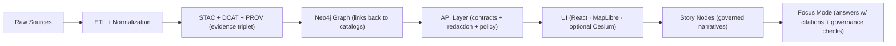

# 🎛️ UI — Experiment Evidence & Artifacts (dev_prov)


-orange)
-ff69b4)

> [!IMPORTANT]
> If a user can **see it**, **click it**, or **be influenced by it**, this folder is where we **prove it** with artifacts + metrics + provenance. 🧾✅

---

## 🧭 Purpose

This `ui/` folder is the **evidence bundle** for user-facing work in this experiment report template:
- 🖼️ **What changed** visually/interaction-wise (before/after)
- 🗺️ **What state** the map/timeline/story was in when evidence was captured
- ♿ **Whether it’s accessible**
- ⚡ **Whether it performs**
- 🧬 **Whether it preserves provenance & governance rules**
- 🤖 **Whether AI-facing UX is traceable and clearly labeled**

---

## 🧱 How UI fits the KFM pipeline (why evidence matters)



> [!NOTE]
> **UI is downstream of governance.** If you’re presenting data, the UI must be able to surface: **source → license → processing → classification → citations** (direct DB access is a no-go).

---

## 🗂️ Recommended folder structure

Use this as a **default** layout. Keep it lean; add folders only when you have artifacts to justify them.

```text
ui/
├─ README.md
├─ summary.md                      # 1–2 page UI change summary (human readable)
├─ manifests/
│  ├─ ui_evidence_manifest.yaml    # index of evidence files + hashes + map-state refs
│  ├─ map_state_*.json             # reproducible view-state snapshots
│  └─ event_schema_notes.md        # telemetry events added/changed (if any)
├─ screenshots/
│  ├─ before/
│  └─ after/
├─ recordings/                     # short GIF/MP4 captures for interaction changes
├─ flows/                          # user-flow diagrams (PNG/SVG/mermaid)
├─ a11y/
│  ├─ checklist.md                 # keyboard, screen reader, focus order, contrast
│  └─ reports/                     # axe/lighthouse exports if used
├─ perf/
│  ├─ metrics.json                 # LCP/CLS/FID, tile timings, FPS notes, memory
│  └─ notes.md
└─ copy/
   ├─ microcopy.md                 # labels/tooltips/dialog text changes
   └─ error_states.md              # empty states + failure modes
```

> [!TIP]
> Treat `ui/manifests/ui_evidence_manifest.yaml` like your **UI “table of contents”**. If it’s not listed there, it’s probably not reproducible.

---

## 📸 Screenshots & recordings

### What we expect (minimum)
- ✅ **Before + After** for each meaningful screen (or a diff)
- ✅ **One interaction recording** for changes that are movement-based:
  - timeline scrubbing
  - layer toggles
  - story node playback
  - Focus Mode Q&A + citation drill-down
- ✅ **One “state screenshot”** showing map + timeline + active layers + story context

### Naming convention
Keep it boring and searchable:

```text
YYYYMMDD_pr-<id>_<feature>_<view>_<before|after>.png
YYYYMMDD_pr-<id>_<feature>_<interaction>.mp4
```

Example:
```text
20260122_pr-184_timeline_slider_map_after.png
20260122_pr-184_focus_mode_citations_drilldown.mp4
```

---

## 🗺️ Map/Timestamp reproducibility (Map State Snapshot)

Any map/timeline screenshot **must** have an accompanying map state JSON in `ui/manifests/`.

### Minimal `map_state_*.json` fields (recommended)

```json
{
  "ui": {
    "route": "/explore",
    "panel_open": ["layers", "timeline"],
    "selected_story_node_id": "story:ks:river:floods:1908"
  },
  "map": {
    "engine": "maplibre",
    "style_id": "kfm:basemap:v3",
    "center_lonlat": [-95.689, 39.055],
    "zoom": 8.5,
    "bearing": 0,
    "pitch": 0,
    "bounds_lonlat": [[-97.2, 38.3], [-94.2, 39.9]]
  },
  "time": {
    "mode": "range",
    "start": "1908-01-01",
    "end": "1908-12-31",
    "slider_value": "1908-06-01"
  },
  "layers": [
    {
      "layer_id": "kfm:hydrology:gauge_maxima",
      "visible": true,
      "opacity": 0.85,
      "classification": "public",
      "provenance_ref": "prov:kfm:activity:merge_gauges_2025-01-02"
    }
  ],
  "build": {
    "commit_sha": "<fill>",
    "build_id": "<fill>",
    "env": "local|staging|prod"
  }
}
```

> [!IMPORTANT]
> If a visualization can be misread without context, **capture the legend + scale + time-range + active layers** in the screenshot (or in a paired screenshot).

---

## 🧬 Provenance & governance UI evidence (must-have)

When UI changes touch **data display** or **AI output**, include evidence that we:
- 🧾 show **source + license + processing summary** somewhere discoverable (e.g., Layer Info)
- 🧷 surface **stable IDs** (dataset IDs, STAC/DCAT links, PROV activity refs)
- 🧯 respect **classification/sensitivity** (including blur/generalization where required)
- 🚫 do **not** bypass the governed API layer (UI should not hit DBs directly)

**Evidence examples to include**
- Screenshot of **Layer Info / Provenance panel**
- Screenshot of **redaction/generalization** working at the relevant zoom(s)
- Recording of **Focus Mode citations** being drillable (“View Evidence” / footnotes)
- Copy snippet showing **AI text is labeled as AI** (if AI-drafted content appears)

---

## 🤖 Focus Mode UI experiments (traceable AI UX)

If your experiment touches Focus Mode (or any AI assistant surface), document:
- ✅ How the UI communicates **“this is AI-generated”**
- ✅ How the user can **open citations** / evidence sources
- ✅ How governance failures appear:
  - missing citations
  - restricted content
  - sensitive layer redaction
- ✅ How the UI handles uncertainty:
  - confidence labels
  - “insufficient evidence” states
  - “multiple plausible interpretations” states

**Artifacts to include**
- `ui/recordings/*focus_mode*.mp4`
- `ui/copy/microcopy.md` with the exact strings used
- `ui/screenshots/after/*citations*.png`

---

## 🧵 Story Nodes & “Evidence Manifest” UX

KFM Story Nodes are meant to be **machine-ingestible storytelling**:
- markdown content + structured metadata (front-matter / config)
- explicit citations
- an evidence manifest index (YAML) + PROV linkage

If your UI experiment modifies Story Node playback, include:
- Screenshot showing the **citation block under a node**
- Recording showing **“View Evidence”** opens a structured list
- Evidence manifest reference(s) in `ui/manifests/ui_evidence_manifest.yaml`

> [!TIP]
> Treat Story Node evidence like a mini scientific paper: claims ↔ citations ↔ manifest entries.

---

## ♿ Accessibility evidence (A11y)

### Minimum A11y checklist (attach evidence in `ui/a11y/`)
- [ ] Keyboard-only navigation works (tab order, skip links if needed)
- [ ] Visible focus rings on all interactive elements
- [ ] Color is not the only carrier of meaning (especially for map layers)
- [ ] ARIA labels on icon-only controls (layer toggles, timeline buttons, etc.)
- [ ] Modal dialogs trap focus and can be dismissed without a mouse
- [ ] Content is usable on small screens (mobile “field mode” expectations)

> [!NOTE]
> Map UIs are notorious for a11y gaps. If we can’t make something fully accessible (yet), document the limitation + mitigation.

---

## ⚡ Performance & UX quality evidence

### What to capture (choose what matches your experiment)
- 📈 Web vitals (LCP/CLS/INP) where relevant
- 🧊 Tile load timing (cold cache vs warm cache)
- 🎞️ FPS notes during:
  - timeline scrubbing
  - rapid layer toggles
  - 3D mode (if Cesium is enabled)
- 🧠 Memory growth (any obvious leaks during long sessions)
- 🌐 Bandwidth-heavy UI (offline packs, PMTiles/MBTiles, large overlays)

Store metrics as:
- `ui/perf/metrics.json`
- `ui/perf/notes.md` (interpretation + caveats)

---

## 📊 Telemetry & analytics (only if the experiment adds/changes events)

If you introduce telemetry:
- Define event names + properties in `ui/manifests/event_schema_notes.md`
- Document privacy constraints (no PII, no sensitive coordinates)
- Add at least one screenshot of the UI behavior that triggers the event

---

## 🧪 Quick UI write-up template (copy into `ui/summary.md`)

```markdown
# UI Summary — <experiment_id>

## 🎯 Hypothesis
<What do we believe will improve and why?>

## 👥 Audience / User Story
<Who benefits? What task are they doing?>

## ✨ Change Summary
- <bullet 1>
- <bullet 2>

## 🧾 Evidence
- Screenshots: `ui/screenshots/before/...`, `ui/screenshots/after/...`
- Recording: `ui/recordings/...`
- Map-state: `ui/manifests/map_state_*.json`

## ♿ Accessibility Notes
<What changed? Any known gaps?>

## ⚡ Performance Notes
<What changed? Any regressions?>

## 🧬 Provenance / Governance Notes
<How are citations, licensing, classification handled?>

## ✅ Result / Decision
- Outcome: win / mixed / fail
- Next step: ship / iterate / rollback
```

---

## 📚 Project reference map (useful when writing UI evidence)

These project docs inform what “good UI evidence” looks like in KFM:

- 🧱 **Architecture & design**  
  - *Kansas Frontier Matrix (KFM) – Comprehensive Architecture, Features, and Design.pdf*
- 🧠 **AI & Focus Mode**  
  - *Kansas Frontier Matrix (KFM) – AI System Overview 🧭🤖.pdf*
- 🎨 **UI patterns & components**  
  - *Kansas Frontier Matrix – Comprehensive UI System Overview.pdf*
- 🗃️ **Evidence-first data publishing** (STAC/DCAT/PROV, ingestion gates, telemetry)  
  - *📚 Kansas Frontier Matrix (KFM) Data Intake – Technical & Design Guide.pdf*
- 🧭 **Roadmap / future UI features** (timeline slider, offline packs, AR ideas)  
  - *🌟 Kansas Frontier Matrix – Latest Ideas & Future Proposals.docx.pdf*
- 🚀 **Big expansion ideas** (AR overlays, 4D “time travel”, hybrid storytelling)  
  - *Innovative Concepts to Evolve the Kansas Frontier Matrix (KFM).pdf*
- 🧩 **Evidence manifests & story provenance UX**  
  - *Additional Project Ideas.pdf*
- 📦 **Reference libraries (PDF portfolios)**  
  - *AI Concepts & more.pdf*  
  - *Data Managment-Theories-Architures-Data Science-Baysian Methods-Some Programming Ideas.pdf*  
  - *Maps-GoogleMaps-VirtualWorlds-Archaeological-Computer Graphics-Geospatial-webgl.pdf*  
  - *Various programming langurages & resources 1.pdf*

<details>
<summary>📦 PDF Portfolio tip: extracting embedded documents (optional)</summary>

Some project PDFs are *portfolios* containing many embedded references. You can open them in Acrobat **or** extract attachments locally.

Example (Python):
```bash
python - <<'PY'
from pypdf import PdfReader
p = "AI Concepts & more.pdf"
r = PdfReader(p)
print("attachments:", len(list(r.attachment_list)))
for a in list(r.attachment_list)[:10]:
    print("-", a.name)
PY
```
</details>

---

## ✅ Definition of Done (UI folder)

Before you call the experiment “documented”, check:

- [ ] `ui/summary.md` exists and is readable by non-devs
- [ ] Before/after screenshots exist (or a justified exception)
- [ ] Every screenshot has a corresponding `map_state_*.json` (when map/timeline is involved)
- [ ] A11y notes exist (even if “no change”)
- [ ] Performance notes exist (even if “not measured”, explain why)
- [ ] Provenance/governance behavior is captured for any data/AI surfaces
- [ ] `ui/manifests/ui_evidence_manifest.yaml` indexes the evidence files (recommended)
- [ ] Sensitive data is not leaked in images/recordings (blur/redact as needed)

---

### 🧠 Reminder
> KFM’s UI is not just “pretty maps.” It’s a **trust interface**: provenance, citations, classification, and reproducibility are features. 🧭🗺️🧾
