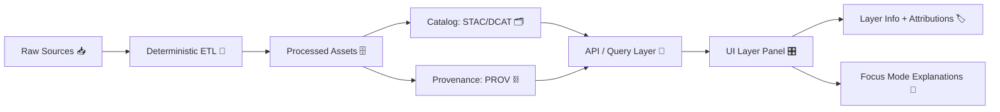

# UI Layers 🗺️🧩  


**Folder:** `.../ui/layers/` 📁  
This directory captures **exactly what “layers” were visible/available in the UI during an experiment**, *and how to reproduce that state* — including **sources, licenses, provenance, styling, legends, and UI evidence**.

> [!IMPORTANT]
> **No “mystery layers.”** If a layer can’t be traced to a source + license + provenance record, it should not appear in experiments or user-facing UI. (This aligns with KFM’s contract-first / provenance-first design and “fail closed” policy gating.)

---

## Table of contents 🧭
- [What counts as a “Layer”](#what-counts-as-a-layer)
- [What belongs in this folder](#what-belongs-in-this-folder)
- [Layer Manifest](#layer-manifest)
- [Layer Card template](#layer-card-template)
- [UI Evidence capture](#ui-evidence-capture)
- [Provenance + Metadata wiring](#provenance--metadata-wiring)
- [Focus Mode layer explainers](#focus-mode-layer-explainers)
- [Licensing + sensitivity](#licensing--sensitivity)
- [Offline packs](#offline-packs)
- [Definition of Done checklist](#definition-of-done-checklist)
- [Reference library](#reference-library)

---

## What counts as a layer 🧠
In KFM terms, a “layer” is **anything the UI can toggle/compose to change what the user sees** — not just classic map tiles.

Common layer categories:
- **Basemaps** 🗺️ (vector/raster)
- **Data overlays** 🧱 (vector tiles, raster tiles, WMS/WMTS, GeoJSON, COG-backed rasters, etc.)
- **Time-aware layers** ⏳ (appear/disappear based on timeline selection)
- **Narrative layers** 📖 (Story Nodes, highlights, annotations)
- **Pulse / live event overlays** ⚡ (Geo-tagged “Pulse Threads” or real-time feeds)
- **Analysis & simulation layers** 🧪 (model outputs, scenario maps, dashboards-as-layers)

> [!NOTE]
> The UI system is designed around **Layer Info** (source + license + prep summary) and a proposed **Layer Provenance panel** that lists *all active layers with citations & metadata* as toggles change. This folder is where your experiment report stores the *evidence and manifests* to support those behaviors.

---

## What belongs in this folder 📦
Keep it reproducible + reviewable. Prefer **small files** and **pointers** to larger assets.

### Recommended structure 🧱
```text
ui/
  layers/
    README.md                         👈 you are here
    layers.manifest.yaml              ✅ canonical layer list for this experiment
    ui_state.json                     🧭 order/opacity/time settings used during the run

    layer_cards/                      🗂️ one Markdown per layer (human-friendly)
      kfm.<layer_id>.md

    styles/                           🎨 style specs (MapLibre JSON, SLD, etc.)
      <layer_id>.style.json

    legends/                          🧾 exported legends (png/svg) + text
      <layer_id>.legend.png
      <layer_id>.legend.md

    popups/                           💬 popup templates + examples
      <layer_id>.popup.md

    screenshots/                      📸 UI evidence (small, compressed)
      00_layer_panel.png
      01_legend_open.png
      02_feature_popup.png
      03_attribution_footer.png
```

> [!TIP]
> If a “layer” is backed by large artifacts (PMTiles/MBTiles/COGs/3D tiles), store those **outside** the report tree (e.g., `data/` or an artifact registry) and reference them here via **hash/digest + URI**.

---

## Layer Manifest ✅
**`layers.manifest.yaml`** is the *source of truth* for what layers existed/were used in the experiment.

### Minimal manifest rules 📌
Each layer entry should include:
- **Stable ID** (doesn’t change across runs)
- **Human title**
- **Type/category** (basemap/overlay/narrative/realtime/simulation)
- **Data access** (URL(s) + format)
- **License + attribution**
- **Metadata hooks** (STAC/DCAT IDs/URIs where applicable)
- **Provenance hooks** (PROV bundle URI + pipeline run reference)
- **UI hooks** (style ref, legend ref, popup ref)
- **Sensitivity classification** (public/restricted/confidential) + handling

### Suggested schema (practical) 🧾
| Field | Required | Example | Why it matters |
|---|---:|---|---|
| `id` | ✅ | `kfm.hydro.usgs_nwis_stations.v1` | Stable key for reproducibility |
| `title` | ✅ | `USGS NWIS Stations` | Human-readable |
| `kind` | ✅ | `realtime` \| `overlay` \| `basemap` | Drives UI grouping & controls |
| `render` | ✅ | `vector-tile` / `raster-tile` / `geojson` / `3d-tiles` | Rendering path |
| `sources.*` | ✅ | `stac_collection`, `dcat_dataset`, `upstream_url` | “Map behind the map” |
| `license` | ✅ | `CC-BY-4.0` / `Public Domain` | Required for publish/export |
| `provenance.prov_bundle` | ✅ | `data/provenance/...jsonld` | Chain-of-custody |
| `ui.style_ref` | ✅ | `styles/<id>.style.json` | Recreate visuals |
| `ui.legend_ref` | ⚠️ | `legends/<id>.legend.png` | Explain symbology |
| `ui.popup_ref` | ⚠️ | `popups/<id>.popup.md` | Explain interactions |
| `sensitivity.level` | ✅ | `public` / `restricted` | Governance + safety |
| `temporal.*` | ⚠️ | `start/end` | Timeline behavior |

### Example `layers.manifest.yaml` 🧪
```yaml
experiment_id: EXP-UI-LAYERS-001
generated_at_utc: "2026-01-22T00:00:00Z"

layers:
  - id: kfm.basemap.osm_light.v1
    title: "OSM Light Basemap"
    kind: basemap
    render: vector-tile
    sources:
      upstream_url: "https://example.com/tiles/osm-light/{z}/{x}/{y}.pbf"
      dcat_dataset: "dcat:basemap-osm-light"
    license: "ODbL-1.0"
    attribution: "© OpenStreetMap contributors"
    provenance:
      prov_bundle: "data/provenance/basemaps/osm_light.v1.prov.jsonld"
      pipeline_run_id: "pipeline:basemap-build-2026-01-21"
    ui:
      order: 0
      opacity: 1.0
      style_ref: "styles/kfm.basemap.osm_light.v1.style.json"
      legend_ref: null
      popup_ref: null
    sensitivity:
      level: public
      handling: none

  - id: kfm.hydro.usgs_nwis_stations.v1
    title: "USGS NWIS Stations (Live)"
    kind: realtime
    render: geojson
    sources:
      upstream_url: "https://waterdata.usgs.gov/nwis"
      dcat_dataset: "dcat:usgs-nwis-stations"
      stac_collection: "stac:usgs-nwis"
    license: "Public Domain"
    attribution: "USGS"
    provenance:
      prov_bundle: "data/provenance/hydro/usgs_nwis_stations.v1.prov.jsonld"
      pipeline_run_id: "stream:usgs-nwis-bridge"
    ui:
      order: 20
      opacity: 0.9
      style_ref: "styles/kfm.hydro.usgs_nwis_stations.v1.style.json"
      legend_ref: "legends/kfm.hydro.usgs_nwis_stations.v1.legend.png"
      popup_ref: "popups/kfm.hydro.usgs_nwis_stations.v1.popup.md"
    temporal:
      mode: "rolling"
      window: "P7D"
    sensitivity:
      level: public
      handling: none
```

---

## Layer Card template 🗂️
For each layer used in the experiment, add a **human-friendly** card in `layer_cards/`.

**Filename pattern:** `layer_cards/kfm.<layer_id>.md`

```markdown
# <Layer Title> 🧩

- **Layer ID:** `<id>`
- **Kind:** `<basemap|overlay|realtime|narrative|simulation>`
- **Render:** `<vector-tile|raster-tile|geojson|3d-tiles|...>`
- **Shown in experiment?** ✅/❌
- **Time-aware?** ✅/❌ (how?)
- **Sensitivity:** `<public|restricted|confidential>` + handling notes

## What this layer shows 👀
Brief, plain-language description.

## Sources & licensing 🏷️
- Source(s): `<STAC/DCAT/upstream>`
- License: `<license>`
- Attribution text (as shown in UI): `<...>`

## Provenance ⛓️
- PROV bundle: `<path-or-uri>`
- Pipeline run / commit / digest: `<...>`

## UI behavior 🎛️
- Layer panel group: `<...>`
- Default opacity/order: `<...>`
- Legend location: `../legends/...`
- Popup behavior: `../popups/...`
- Known interaction quirks: `<...>`

## Evidence 📸
- Panel: `../screenshots/...`
- Legend: `../screenshots/...`
- Popup: `../screenshots/...`

## QA / Notes ✅
- Validation status: `<pass/fail>`
- Known limitations: `<...>`
```

---

## UI Evidence capture 📸
This folder should prove the experiment visually, aligned to the intended KFM UI behaviors:
- **Layer Management Panel**: groupings, toggles, order, opacity controls 🎛️  
- **Legend**: readable symbology & labels 🧾  
- **Pop-ups + details**: click behavior (feature → popup → details sidebar) 💬  
- **Attribution**: visible source credits / license notes 🏷️  
- **Timeline interaction** (if time-aware): layer appears/disappears correctly ⏳  

### Screenshot naming convention 🧷
Use a numbered prefix so diffs are readable:
- `00_layer_panel.png`
- `01_layer_panel_layer_info_open.png`
- `02_legend_open.png`
- `03_feature_popup.png`
- `04_details_sidebar.png`
- `05_attribution_footer.png`
- `06_timeline_layer_transition.gif` *(optional)*

---

## Provenance + Metadata wiring 🔌
KFM’s approach treats the UI as the final step in a **traceable pipeline**:
- **Raw input is immutable evidence** 📥
- **Processed outputs are standardized** 🗄️
- **Catalog metadata is mandatory** 🗂️ (STAC/DCAT)
- **Lineage is mandatory** ⛓️ (W3C PROV / PROV-O)

### Mental model (layer → metadata → trust) 🧠


> [!IMPORTANT]
> Policy gates should enforce: schema validity, STAC/DCAT/PROV completeness, license presence, sensitivity classification, and provenance completeness — **fail closed** if anything is missing.

---

## Focus Mode layer explainers 🤖
When the experiment touches AI-assisted explanation (Focus Mode):
- Capture **the prompt**, the **UI context** (active layers + time + viewport), and the **answer with citations**.
- Store short transcripts in this folder *only if they are layer-specific* (otherwise place them in the main experiment AI folder).

Suggested file:
- `focus_mode_layer_explanations.md` 📝

What to include:
- Active layers list (from `layers.manifest.yaml`)
- Any governance flags / warnings shown
- Evidence screenshots (Layer Info + citations view)

> [!NOTE]
> KFM’s AI design expects outputs to be provenance-backed and user-auditable (including logging / governance metadata).

---

## Licensing + sensitivity 🏷️🔒
### Licensing rules (practical)
- Every layer **must** declare a license.
- Combined views should surface attribution; when licenses differ, treat derived outputs as constrained by the **most restrictive** applicable license.

### Sensitivity rules (practical)
If a layer is sensitive (sites, endangered species habitats, PII-adjacent data, community-controlled data):
- **Generalize** geometry (e.g., hex bins instead of exact points) 🧊
- **Access-gate** or **hide** layer entirely 🔐
- Show a **warning** in Layer Info 🛑
- Ensure the manifest includes: `sensitivity.level` + `handling`

> [!TIP]
> For experiments involving sensitive layers, also document any query/audit controls used (rate limits, inference controls, aggregation thresholds, etc.).

---

## Offline packs 🧳📡
If the experiment tests offline mode (field kits, museum installs, low connectivity):
- Prefer packaging layers as **PMTiles/MBTiles** (vector tiles) and/or local assets
- Record the pack contents + checksums + how the UI is pointed to local sources

Suggested files:
- `offline_pack.manifest.yaml`
- `offline_pack.verification.md`

> [!NOTE]
> Offline packs are expected to bundle a subset of layers (e.g., county-level) plus story content, with the UI able to point to local tile sources.

---

## Definition of Done checklist ✅
Use this as the “merge gate” for layer-related experiments.

- [ ] `layers.manifest.yaml` exists and lists all layers relevant to the experiment
- [ ] Each used layer has:
  - [ ] source(s)
  - [ ] license + attribution text
  - [ ] provenance bundle reference
  - [ ] style reference (and legend/popup if applicable)
- [ ] UI evidence captured:
  - [ ] layer panel
  - [ ] legend
  - [ ] popup interaction
  - [ ] attribution/footer
  - [ ] timeline transition (if relevant)
- [ ] Sensitivity classified + handling documented
- [ ] If Focus Mode was used: transcript includes citations + matches active layers
- [ ] Large artifacts are referenced by URI/digest (not dumped in this folder)

---

## Reference library 📚
These documents define the “why” behind this folder (UI rigor, provenance, governance, reproducibility):

### Core KFM UI + Architecture 🧭
- Kansas Frontier Matrix – Comprehensive UI System Overview  [oai_citation:0‡Kansas Frontier Matrix – Comprehensive UI System Overview.pdf](file-service://file-KcBQruYcoFVDEixzzRHTwt)  [oai_citation:1‡Kansas Frontier Matrix – Comprehensive UI System Overview.pdf](file-service://file-KcBQruYcoFVDEixzzRHTwt)  
- Kansas Frontier Matrix (KFM) – Comprehensive Architecture, Features, and Design  [oai_citation:2‡Kansas Frontier Matrix (KFM) – Comprehensive Architecture, Features, and Design.pdf](file-service://file-4Umt1yHoGKicdmLWzFJ9sC)  
- Kansas Frontier Matrix (KFM) – Comprehensive Technical Documentation  [oai_citation:3‡Kansas Frontier Matrix (KFM) – Comprehensive Technical Documentation.pdf](file-service://file-AkqwUuYPp5zePf7pv5SMxi)  
- Kansas Frontier Matrix (KFM) – AI System Overview 🧭🤖  [oai_citation:4‡Kansas Frontier Matrix (KFM) – AI System Overview 🧭🤖.pdf](file-service://file-Pv8eev6RWvCKrGCXyzY7zg)  

### Data governance + intake 🗄️
- 📚 Kansas Frontier Matrix (KFM) Data Intake – Technical & Design Guide  [oai_citation:5‡📚 Kansas Frontier Matrix (KFM) Data Intake – Technical & Design Guide.pdf](file-service://file-EbUCdsJMbu5KwpoKMrLrgj)  [oai_citation:6‡📚 Kansas Frontier Matrix (KFM) Data Intake – Technical & Design Guide.pdf](file-service://file-EbUCdsJMbu5KwpoKMrLrgj)  
- Additional Project Ideas (evidence manifests, pulse overlays, provenance-first artifacts)  [oai_citation:7‡Additional Project Ideas.pdf](file-service://file-Pc2GNivcrHBeKjBQksLC3T)  [oai_citation:8‡Additional Project Ideas.pdf](file-service://file-Pc2GNivcrHBeKjBQksLC3T)  

### Roadmap / future layer types 🚀
- 🌟 Kansas Frontier Matrix – Latest Ideas & Future Proposals  [oai_citation:9‡Kansas Frontier Matrix (KFM) – AI System Overview 🧭🤖.pdf](file-service://file-Pv8eev6RWvCKrGCXyzY7zg)  
- Innovative Concepts to Evolve the Kansas Frontier Matrix (KFM)  [oai_citation:10‡Additional Project Ideas.pdf](file-service://file-Pc2GNivcrHBeKjBQksLC3T)  [oai_citation:11‡Innovative Concepts to Evolve the Kansas Frontier Matrix (KFM).pdf](file-service://file-G71zNoWKxsoSW44iwZaaCC)  

### MCP / experiment rigor 🧪
- Kansas-Frontier-Matrix — Open-Source Geospatial Historical Mapping Hub Design (MCP templates, experiment reports, SOPs)  [oai_citation:12‡Kansas-Frontier-Matrix_ Open-Source Geospatial Historical Mapping Hub Design.pdf](file-service://file-64djFYQUCmxN1h6L6X7KUw)  
- Scientific Method / Research / Master Coder Protocol Documentation  [oai_citation:13‡Scientific Method _ Research _ Master Coder Protocol Documentation.pdf](file-service://file-HTpax4QbDgguDwxwwyiS32)  

### Supporting libraries / research bundles 🧰
- AI Concepts & more  [oai_citation:14‡AI Concepts & more.pdf](file-service://file-K6BctJjeUwvyCahLf9qdwr)  
- Data Managment / Theories / Architectures / Data Science / Bayesian Methods  [oai_citation:15‡Data Managment-Theories-Architures-Data Science-Baysian Methods-Some Programming Ideas.pdf](file-service://file-RrXMFY7cP925exsQYermf2)  
- Maps / GoogleMaps / Virtual Worlds / Archaeological Computer Graphics / Geospatial / WebGL  [oai_citation:16‡Maps-GoogleMaps-VirtualWorlds-Archaeological-Computer Graphics-Geospatial-webgl.pdf](file-service://file-RshcX5sNY2wpiNjRfoP6z6)  
- Various programming languages & resources  [oai_citation:17‡Various programming langurages & resources 1.pdf](file-service://file-4wp3wSSZs7gk5qHWaJVudi)  
- Data Mining Concepts and Applications (privacy/security considerations)  [oai_citation:18‡Data Mining Concepts & applictions.pdf](file-service://file-2uwEbQAFVKpXaTtWgUirAH)  

### Markdown / documentation craft ✍️
- Comprehensive Markdown Guide (syntax, extensions, best practices)  [oai_citation:19‡Scientific Method _ Research _ Master Coder Protocol Documentation.pdf](file-service://file-HTpax4QbDgguDwxwwyiS32)  
- MARKDOWN_GUIDE_v13  [oai_citation:20‡Scientific Method _ Research _ Master Coder Protocol Documentation.pdf](file-service://file-HTpax4QbDgguDwxwwyiS32)  

---

<details>
<summary><strong>🧠 Quick reminder</strong>: If you can’t reproduce it, you didn’t document it.</summary>

This folder is the UI-layer equivalent of an experiment lab notebook:
- what layers were used
- why those layers are trustworthy
- how they looked/behaved
- how to rebuild the exact UI state later

</details>
