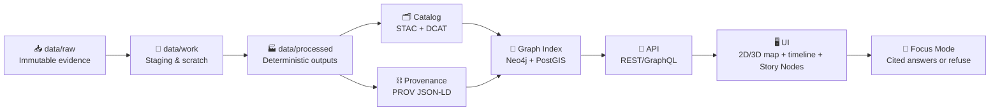

# 🧪 Experiment Report Template (MCP / Dev Provenance)


> [!IMPORTANT]
> This folder is the **canonical** “experiment write-up” pattern for Kansas Frontier Matrix (KFM): **every meaningful change in data, UI, AI, modeling, or automation must be documented as an experiment**—with reproducible inputs, deterministic steps, and verifiable provenance.

---

## 🧭 What this example is

This example provides a **copy/paste-friendly experiment report template** for:
- 🗺️ **Geospatial pipelines** (ingest → transform → catalog → graph)
- 🧠 **AI / Focus Mode** changes (prompting, retrieval, citations, guardrails, evals)
- 🎛️ **UI + storytelling** (MapLibre/Cesium, timeline, Story Nodes, exports)
- 🛰️ **Simulation & modeling** runs (`kfm-sim-run`, notebooks, scenario testing)
- 🤖 **Automation** (Watcher–Planner–Executor agents, idempotent watchers, QA bots)
- 🔐 **Governance & policy** changes (OPA/Conftest gates, sensitivity & license rules)

The template is explicitly aligned to KFM’s project philosophy:
- **Provenance-first & evidence-first**
- **Raw data is immutable**
- **Pipelines are deterministic & config-driven**
- **Policy gates fail closed**
- **AI answers must be citation-backed or refuse**

---

## ✅ When you must write an experiment report

Write a report when you change anything that can alter:
- 📦 **Artifacts** (STAC items, DCAT datasets, processed outputs, exports)
- 🧬 **Graph facts** (Neo4j nodes/edges, entity resolution, ontology updates)
- 🗣️ **Focus Mode output** (retrieval strategy, prompting, filters, refusal logic)
- 🎞️ **Story output** (Story Nodes, timeline behaviors, narrative playback)
- ⚙️ **Automation behavior** (polling cadence, idempotency keys, W-P-E plans)
- 🔐 **Governance behavior** (new policy pack rule, new sensitivity class, new license logic)

> [!TIP]
> Treat the report as a **mergeable artifact**: if the report can’t explain *what changed, why, and how to reproduce it*, the change isn’t ready.

---

## 🧱 How this maps to KFM’s “evidence pipeline spine”

KFM’s “no mystery layers” stance implies every experiment references **where** it lives in the pipeline.



---

## ⚡ Quick start

1) **Copy** the report template section from this README (below) into a new file  
   - Suggested naming: `experiments/EXP-YYYYMMDD_<short_slug>.md` 📅  
   - Or: `experiments/EXP-010_<short_slug>.md` 🔢

2) **Attach artifacts** in a predictable folder layout (recommended):
```text
📁 mcp/dev_prov/examples/10_experiment_report_template/
├─ 📄 README.md
└─ 📁 (your real reports typically live elsewhere, e.g. /experiments/)
   ├─ 📄 EXP-2026-01-21_focusmode-citation-gate.md
   ├─ 📁 artifacts/
   │  ├─ 📊 figures/
   │  ├─ 📋 tables/
   │  └─ 🧾 logs/
   ├─ 📁 prov/
   │  ├─ prov.run.jsonld
   │  └─ receipts/
   ├─ 📁 stac/
   │  ├─ collection.json
   │  └─ items/
   └─ 📁 dcat/
      └─ dataset.jsonld
```

3) **Record reproducibility** (the “minimum viable proof”):
- ✅ Git commit SHA (and PR link if applicable)
- ✅ Inputs (dataset IDs + hashes/digests)
- ✅ Exact commands / configs used
- ✅ Outputs (paths + hashes/digests)
- ✅ Policy gate results
- ✅ Decision (ship / iterate / abandon)

---

## 🧾 What “good” looks like (report contract)

A strong report answers these questions **without Slack archaeology** 🧠🧹:

| Question | Must be answered with |
|---|---|
| What did we try? | Hypothesis + scope + expected outcome |
| What changed? | Diff summary + configs + pipeline stage |
| What data did we use? | Dataset contracts, STAC/DCAT IDs, sensitivity + license |
| How do I reproduce it? | Commands, seeds, environment, run IDs |
| What happened? | Metrics, outputs, screenshots/figures, qualitative notes |
| Is it safe & compliant? | Policy gates, privacy/sensitivity notes, CARE/FAIR alignment |
| What’s the decision? | Ship/iterate/abandon + rationale + rollback plan |

> [!NOTE]
> If the experiment touches **Focus Mode**, include a “citations coverage” check: any answer lacking evidence should trigger refusal (policy violation).

---

## 📄 Copy/paste template

<details>
<summary><strong>➡️ Click to expand the full Experiment Report Template</strong></summary>

```markdown
---
id: EXP-YYYYMMDD-<slug>
title: "<short human title>"
owners:
  - "@you"
status: draft | proposed | accepted | rejected
date:
  started: YYYY-MM-DD
  ended: YYYY-MM-DD
scope:
  domain: data | graph | ui | ai | simulation | automation | governance
  kfm_components:
    - "<component name(s) e.g. kfm-sim-run | Focus Mode | PostGIS loader>"
  blast_radius: low | medium | high
tags: ["stac", "dcat", "prov", "policy-pack", "maplibre", "cesium", "story-nodes"]
dev_provenance:
  git:
    commit: "<sha>"
    branch: "<name>"
    pr: "<url or id>"
  ci:
    workflow_run: "<url or id>"
run:
  run_id: "<uuid or timestamped id>"
  environment:
    os: "<...>"
    container_image: "<name@sha256:digest if used>"
    python: "<version>"
    node: "<version>"
    notes: "<anything special>"
---

# 🧪 Experiment Report — {{ title }}

## 1) 🎯 Goals & hypothesis
**Goal:**  
- 

**Hypothesis (testable):**  
- If we change ___, then ___ will improve because ___.

**Success criteria (measurable):**
- [ ] Metric A improves by ≥ X%
- [ ] Policy gates remain green
- [ ] No regressions in UI/AI behavior
- [ ] Provenance completeness preserved

---

## 2) 🧩 Context (where in the KFM pipeline?)
- Pipeline stage(s): `raw → work → processed → catalog → graph → api → ui → ai`
- Affected features:
  - [ ] Map layers
  - [ ] Timeline
  - [ ] Story Nodes
  - [ ] Focus Mode
  - [ ] Simulation outputs
  - [ ] Automation agent(s)
  - [ ] Governance / policy

---

## 3) 📦 Data used (inputs)
> [!IMPORTANT]
> Raw inputs are immutable; transformations must be reproducible and config-driven.

### 3.1 Dataset inventory
For each dataset (or feed), include:
- **DCAT Dataset ID:**  
- **STAC Collection:**  
- **STAC Item(s):**  
- **Source URL / citation:**  
- **License:**  
- **Sensitivity:** public | internal | restricted | culturally-sensitive  
- **Ingestion method:** batch | streaming | watcher  
- **Hashes / digests:** sha256 / OCI digest if applicable

### 3.2 Privacy & safety notes (required if not purely public)
- Any geo-obfuscation?
- Any “temporal release” risk?
- Any role-based access control assumptions?

---

## 4) 🧪 Method (exact steps)
### 4.1 Change summary
- What changed (code/config/data contracts)?
- Why was this change needed?

### 4.2 Reproduction commands
```bash
# Example
# 1) fetch raw evidence
# 2) run deterministic transform
# 3) build STAC/DCAT/PROV
# 4) ingest graph
# 5) run eval
```

### 4.3 Parameters, seeds, determinism
- Random seed(s):
- Config file(s):
- Determinism assertions (idempotent rerun checks):

---

## 5) ✅ Policy gates & validation results (fail closed)
List the gates you ran and outcomes:

- [ ] Schema validation
- [ ] STAC/DCAT/PROV completeness
- [ ] License presence + compatibility
- [ ] Sensitivity classification present + enforced
- [ ] Provenance chain complete (inputs → activity → outputs)
- [ ] AI citation enforcement (if Focus Mode touched)
- [ ] UI export attribution / provenance surfaced (if UI touched)

Attach logs or screenshots:
- `artifacts/logs/...`
- `artifacts/figures/...`

---

## 6) 📊 Results
### 6.1 Quantitative
| Metric | Baseline | Variant | Δ | Notes |
|---|---:|---:|---:|---|
| | | | | |

### 6.2 Qualitative / UX
- What felt better/worse?
- Any new edge cases?
- Any confusing UI / narrative behavior?

### 6.3 Artifacts produced
For each artifact, include path + hash/digest:
- `data/processed/...`  sha256:...
- `stac/items/...`      sha256:...
- `prov/prov.run.jsonld` sha256:...
- `artifacts/figures/...` sha256:...

---

## 7) 🤖 AI / Focus Mode evaluation (if applicable)
- Retrieval scope & filters used:
- Citation coverage check:
  - % answers with ≥1 citation:
  - % refusals due to missing evidence:
- Bias / drift checks (what was monitored?):
- Prompt security notes (injection attempts / mitigations):

---

## 8) 🤖 Automation (Watcher–Planner–Executor) (if applicable)
- Watcher name + trigger:
- Polling strategy (ETag/Last-Modified, schedule):
- Idempotency key design:
- Planner output format (what plan was produced?):
- Executor constraints (what is allowed/not allowed?):
- “Exactly-once” proof (how do we know duplicates don’t happen?):

---

## 9) 🧠 Knowledge graph impact (if applicable)
- New node/edge types?
- Entity resolution changes?
- Orphan detection / graph health checks run?
- Invariants maintained?

---

## 10) 🧭 Decision
**Decision:** ship | iterate | abandon  
**Rationale:**  
- 

**Rollout plan:**
- Canary? Feature flag?
- Monitoring?

**Rollback plan:**
- What artifact/version do we revert to?
- How to verify rollback correctness?

---

## 11) 🧵 Optional: Pulse Thread candidate (micro-story)
If this experiment generated a reusable narrative snippet:
- Title:
- Evidence refs (dataset IDs, citations):
- Geographic focus (place IDs / bounding box):
- Time window:
- Draft narrative (short):

---

## 12) 📚 References
- Links to prior reports
- Relevant docs / issues / PRs
- Any external citations

```

</details>

---

## 🧰 Built-in guidance for common experiment types

### 🗺️ UI / Map / Story experiments
When testing map/timeline/story changes, capture:
- 2D vs 3D behavior (MapLibre/Leaflet vs Cesium)
- Timeline interaction (time window, scrub behavior, filters)
- Story Node playback (camera steps, overlays, transitions)
- Export behavior (does it preserve credits + provenance?)

### 🧠 AI / Focus Mode experiments
When testing Focus Mode changes, include:
- Retrieval scope (which indexes / data sources were searched)
- Citation rules (min citations, refusal thresholds)
- Bias/drift checks (what changed, how monitored)
- Prompt security notes (boundary rules, injection tests)

### 📡 Streaming / watcher experiments
When testing real-time ingestion:
- Poll cadence + ETag/Last-Modified usage
- Idempotency keys + dedupe behavior
- Exactly-once proofs (re-run safety)
- STAC Item generation scheme per observation

### 🔐 Governance & ethics experiments
When testing policy/ethics changes:
- Sensitivity classification taxonomy
- CARE/FAIR considerations
- Cultural protocol expectations (role-based access, restrictions)
- “Fail closed” behavior documented with logs

---

## ✅ Review checklist (copy into PR description)

- [ ] Report includes **hypothesis + success criteria**
- [ ] Report includes **exact repro steps**
- [ ] Inputs have **license + sensitivity + IDs**
- [ ] Outputs have **hashes/digests**
- [ ] STAC/DCAT/PROV artifacts attached (or referenced)  
- [ ] Policy gates are **green**
- [ ] Decision is explicit (ship/iterate/abandon)
- [ ] Rollback plan exists (if blast radius ≠ low)
- [ ] If AI touched: **citations coverage** documented + refusal behavior verified
- [ ] If UI touched: provenance/attribution surfaced and exportable

---

## 📚 Source docs used to shape this template (KFM project files)

> [!NOTE]
> The following docs are treated as “source of truth” for philosophy, architecture, UI/AI behavior, and governance patterns that this template encodes.

### 🧠 Core KFM docs
- 📥 Data intake philosophy & pipeline invariants (raw immutability, deterministic ETL, machine-readable provenance)  
   [oai_citation:0‡📚 Kansas Frontier Matrix (KFM) Data Intake – Technical & Design Guide.pdf](file-service://file-EbUCdsJMbu5KwpoKMrLrgj)  [oai_citation:1‡📚 Kansas Frontier Matrix (KFM) Data Intake – Technical & Design Guide.pdf](file-service://file-EbUCdsJMbu5KwpoKMrLrgj)
- 🏗️ Architecture, testing strategy, policy gates, and W-P-E agents  
   [oai_citation:2‡Kansas Frontier Matrix (KFM) – Comprehensive Architecture, Features, and Design.pdf](file-service://file-4Umt1yHoGKicdmLWzFJ9sC)
- 📑 Comprehensive technical overview (licensing, openness, ethics, governance)  
   [oai_citation:3‡Kansas Frontier Matrix (KFM) – Comprehensive Technical Documentation.pdf](file-service://file-AkqwUuYPp5zePf7pv5SMxi)
- 🖥️ UI system overview (2D/3D maps, timeline, Story Nodes, Focus Mode, exports)  
   [oai_citation:4‡Kansas Frontier Matrix – Comprehensive UI System Overview.pdf](file-service://file-KcBQruYcoFVDEixzzRHTwt)  [oai_citation:5‡Kansas Frontier Matrix – Comprehensive UI System Overview.pdf](file-service://file-KcBQruYcoFVDEixzzRHTwt)
- 🤖 AI system overview (Focus Mode, citations, bias/drift, policy pack, simulations, W-P-E)  
   [oai_citation:6‡Kansas Frontier Matrix (KFM) – AI System Overview 🧭🤖.pdf](file-service://file-Pv8eev6RWvCKrGCXyzY7zg)
- 🌟 Latest ideas & future proposals (DevOps↔PROV integration, policy pack direction, reproducible research vision)  
   [oai_citation:7‡🌟 Kansas Frontier Matrix – Latest Ideas & Future Proposals.docx.pdf](file-service://file-SQ3f7ve8SGiusT6ThZEuCe)
- 💡 Additional project ideas (OCI/ORAS/Cosign artifacts, graph health checks, Pulse Threads & conceptual attention nodes)  
   [oai_citation:8‡Additional Project Ideas.pdf](file-service://file-Pc2GNivcrHBeKjBQksLC3T)
- 🚀 Innovative concepts (AR + 4D digital twins, AI co-pilots, crowdsourced QA, CARE + cultural protocols)  
   [oai_citation:9‡Innovative Concepts to Evolve the Kansas Frontier Matrix (KFM).pdf](file-service://file-G71zNoWKxsoSW44iwZaaCC)  [oai_citation:10‡Innovative Concepts to Evolve the Kansas Frontier Matrix (KFM).pdf](file-service://file-G71zNoWKxsoSW44iwZaaCC)

### 🗺️ Geospatial & engineering reading packs (project files)
- 🧭 Maps / virtual worlds / geospatial WebGL concepts  
   [oai_citation:11‡Maps-GoogleMaps-VirtualWorlds-Archaeological-Computer Graphics-Geospatial-webgl.pdf](file-service://file-RshcX5sNY2wpiNjRfoP6z6)
- 🧑‍💻 Various programming languages & engineering resources (portfolio)  
   [oai_citation:12‡Various programming langurages & resources 1.pdf](file-service://file-4wp3wSSZs7gk5qHWaJVudi)
- 🗄️ Data management + architectures + Bayesian methods (portfolio)  
   [oai_citation:13‡AI Concepts & more.pdf](file-service://file-K6BctJjeUwvyCahLf9qdwr)
- 🤯 AI concepts & more (portfolio)  
   [oai_citation:14‡Data Managment-Theories-Architures-Data Science-Baysian Methods-Some Programming Ideas.pdf](file-service://file-RrXMFY7cP925exsQYermf2)

---

## 🔎 Notes for maintainers

- Keep the template **strict** but not bureaucratic: it should make “the right thing” the easy thing ✅
- Prefer **links + hashes + artifacts** over long narrative descriptions
- If this template evolves, version it and keep old reports reproducible

---

<!-- Legacy chat citation marker requested by tooling:  [oai_citation:15‡Additional Project Ideas.pdf](file-service://file-Pc2GNivcrHBeKjBQksLC3T) -->
