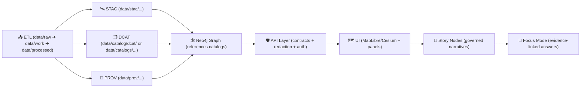

# 🧬 dev_prov Examples (MCP) — Evidence-First Templates


> **Goal:** Give you *copy/paste* example artifacts for **development provenance** in Kansas Frontier Matrix (KFM) / Kansas-Matrix-System.  
> These examples encode the project’s non‑negotiables: **pipeline ordering**, **evidence-first publishing**, **FAIR+CARE governance**, and **auditable automation**.

---

## 🧭 What “dev_prov” covers

**dev_prov** is the “paper trail engine” for the platform — *datasets, narratives, and even devops events* are treated as queryable provenance. That means:

- 🗺️ **Every dataset/evidence artifact** publishes the **Evidence Triplet**:
  - **STAC** (asset-level metadata)
  - **DCAT** (catalog/discovery-level metadata)
  - **W3C PROV** (lineage: inputs → processing → outputs → agents)
- 🧾 **Every run** emits an auditable **Run Manifest** (inputs, outputs, parameters, environment, checks)
- 🧠 **Focus Mode outputs** (AI answers / dynamic queries) still log provenance + citations
- 🧪 **AI/analysis outputs** are first-class “evidence artifacts” (not “magic text”)
- 🧱 **Policy-as-code** blocks merges if provenance is missing or governance rules are violated
- 📦 **Release artifacts** can be shipped as OCI artifacts and signed/attested (supply chain integrity)

---

## 🧱 Canonical pipeline ordering (invariants)

KFM’s pipeline order is **inviolable**:

> **ETL → Catalogs (STAC/DCAT/PROV) → Graph → API → UI → Story Nodes → Focus Mode**  
> No stage consumes data that hasn’t crossed the previous boundary with its formal artifacts. ✅



---

## 📁 Expected folder layout (this directory)

```text
mcp/dev_prov/examples/
├─ 📄 README.md                         # 👈 you are here 📌 How to use the examples + recommended learning order
├─ 🚀 00_quickstart_minimal_triplet/     # Smallest end-to-end “evidence triplet” example (claim + citation + artifact)
├─ 🛰️ 01_dataset_evidence_triplet/       # Dataset-focused triplet: source → processed artifact → catalog/prov links
├─ 🔐 02_run_manifest_and_hashing/       # Run manifest + checksum patterns (inputs/outputs, sha256, reproducibility)
├─ 🎬 03_story_node_evidence_manifest/   # Story Node evidence manifest: citations, media, layer refs, policy gates
├─ 🧵 04_pulse_thread_evidence/          # Pulse thread example: short updates + evidence bundle + lineage pointers
├─ 🔗 05_github_pr_to_prov/              # Link a GitHub PR to PROV/receipts (ids, commits, approvals, traceability)
├─ 🔎 06_focus_mode_answer_log/          # Focus Mode answer logging: citations required + redaction notices + receipts
├─ 📡 07_streaming_ingest_stub_prov/     # Streaming ingest stub: event traces + backpressure notes + partial lineage
├─ 📦 08_oci_artifact_distribution/      # OCI distribution example: artifact manifest + digests + publication record
├─ 🚦 09_policy_pack_smoke_tests/        # Policy pack smoke tests: known-pass/known-fail fixtures for gates
├─ 🧪 10_experiment_report_template/     # Experiment report example: meta, evidence, metrics, and PROV bundle
└─ ♻️ _shared/
   ├─ 📐 schemas/                        # Shared schema snippets used by multiple examples (avoid duplication)
   └─ 🧩 snippets/                       # Reusable fragments (YAML/JSON/MD) for copy/paste into new examples
```

> If your repo currently uses slightly different paths, keep the **artifact intent** identical and update the paths consistently (see “Gotchas” below).

---

## 🧰 Example index

| # | Example | You learn / produce | Key outputs |
|---:|---|---|---|
| 00 | ⚡ Quickstart Minimal Triplet | “Hello world” provenance | STAC + DCAT + PROV |
| 01 | 🛰️ Dataset Evidence Triplet | A real dataset with full linkage | STAC Item/Collection + DCAT Dataset + PROV bundle |
| 02 | 🧾 Run Manifest + Hashing | Reproducibility + canonical digests | `run_manifest.json` + canonical JSON digest |
| 03 | 📖 Story Node Evidence Manifest | Evidence-first narrative packaging | `story.md` + evidence manifest + PROV link |
| 04 | 💓 Pulse Thread Evidence | Live “pulse” entries with review gates | pulse entry JSON + evidence refs + PROV |
| 05 | 🔀 GitHub PR → PROV | DevOps events become provenance graph | PR activity + commit entities + agents |
| 06 | 🤖 Focus Mode Answer Log | AI answers become evidence artifacts | answer log JSON + citations + PROV usage |
| 07 | ⏱ Streaming Ingest “Stub PROV” | Real-time data still obeys rules | streaming STAC + minimal PROV + update strategy |
| 08 | 📦 OCI Artifact Distribution | Ship + sign datasets like containers | ORAS push + cosign signatures + attestations |
| 09 | 🛡️ Policy Pack Smoke Tests | Fail-closed governance | conftest/rego checks + examples |
| 10 | 🧪 Experiment Report Template | MCP scientific-method logging | experiment README + protocol + outputs |

---

# ✅ Example 00 — Quickstart Minimal Triplet

This is the *smallest valid* proof that your pipeline can publish **boundary artifacts**.

**Definition of done** ✅  
- [ ] STAC exists (item or collection)
- [ ] DCAT dataset exists
- [ ] PROV lineage exists
- [ ] All 3 link to each other (IDs + URLs/paths)
- [ ] Policy Pack passes (even minimal)

<details>
<summary>🛰️ Minimal STAC Item (example)</summary>

```json
{
  "type": "Feature",
  "stac_version": "1.0.0",
  "id": "kfm.ks.demo.minimal_asset.v1",
  "collection": "kfm.ks.demo.minimal_asset",
  "geometry": { "type": "Point", "coordinates": [-96.0, 39.0] },
  "bbox": [-96.0, 39.0, -96.0, 39.0],
  "properties": {
    "datetime": "2026-01-20T00:00:00Z",
    "title": "KFM Minimal Asset (Demo)",
    "kfm:prov_ref": "data/prov/kfm.ks.demo.minimal_asset.v1.prov.jsonld"
  },
  "assets": {
    "data": {
      "href": "data/processed/demo/minimal_asset/minimal_asset_v1.geojson",
      "type": "application/geo+json",
      "roles": ["data"]
    }
  }
}
```
</details>

<details>
<summary>🗂️ Minimal DCAT Dataset (example)</summary>

```json
{
  "@context": {
    "dcat": "http://www.w3.org/ns/dcat#",
    "dct": "http://purl.org/dc/terms/",
    "prov": "http://www.w3.org/ns/prov#"
  },
  "@type": "dcat:Dataset",
  "@id": "urn:kfm:dataset:kfm.ks.demo.minimal_asset.v1",
  "dct:title": "KFM Minimal Asset (Demo)",
  "dct:license": "CC-BY-4.0",
  "dcat:distribution": [
    {
      "@type": "dcat:Distribution",
      "dct:format": "STAC",
      "dcat:accessURL": "data/stac/items/kfm.ks.demo.minimal_asset.v1.json"
    }
  ],
  "prov:wasGeneratedBy": "urn:kfm:activity:run:demo_minimal_v1"
}
```
</details>

<details>
<summary>🧾 Minimal PROV JSON-LD (example)</summary>

```json
{
  "@context": { "prov": "http://www.w3.org/ns/prov#", "dct": "http://purl.org/dc/terms/" },
  "@graph": [
    {
      "@id": "urn:kfm:entity:data:raw:demo_source_v1",
      "@type": "prov:Entity",
      "dct:description": "Raw demo source input",
      "prov:value": "sha256:REPLACE_ME"
    },
    {
      "@id": "urn:kfm:activity:run:demo_minimal_v1",
      "@type": "prov:Activity",
      "prov:used": ["urn:kfm:entity:data:raw:demo_source_v1"],
      "prov:generated": ["urn:kfm:entity:data:processed:kfm.ks.demo.minimal_asset.v1"],
      "prov:startedAtTime": "2026-01-20T00:00:00Z"
    },
    {
      "@id": "urn:kfm:agent:human:you",
      "@type": "prov:Agent",
      "prov:label": "Developer"
    }
  ]
}
```
</details>

---

# 🛰️ Example 01 — Dataset Evidence Triplet (STAC + DCAT + PROV)

This example shows **full cross-layer linkage** and “graph-ready” metadata.

## 🧩 Linking rules (don’t skip these)

- **STAC** must point to the actual assets in `data/processed/**`
- **DCAT** must link to STAC (and/or distribution download URLs)
- **PROV** must link raw inputs → work → processed outputs, including **run ID** and/or **git commit**
- The **graph** should reference these catalog IDs (not duplicate payloads)

> Treat STAC/DCAT/PROV as **boundary artifacts**. Downstream systems only trust what’s behind those boundaries.

---

# 🧾 Example 02 — Run Manifest + Canonical Digest

This example implements an auditable run log with **repeatable hashing**.

## 📄 `run_manifest.json` (shape)

```json
{
  "run_id": "2026-01-20T20-00Z__usgs_nwis_ingest",
  "pipeline": "hydro/usgs_nwis_ingest",
  "code_ref": {
    "git_commit": "REPLACE_WITH_SHA",
    "repo": "REPLACE_WITH_REPO_URL"
  },
  "inputs": [
    { "uri": "data/raw/hydro/usgs_nwis/source_dump.json", "sha256": "..." }
  ],
  "outputs": [
    { "uri": "data/processed/hydro/river_gauges/river_gauges_v1.geoparquet", "sha256": "..." },
    { "uri": "data/stac/items/kfm.ks.hydro.river_gauges.v1.json", "sha256": "..." },
    { "uri": "data/prov/kfm.ks.hydro.river_gauges.v1.prov.jsonld", "sha256": "..." }
  ],
  "params": { "epsg": 4326, "dedupe": true },
  "environment": { "python": "3.12.x", "container_image": "ghcr.io/ORG/IMAGE@sha256:..." },
  "timestamps": { "started": "2026-01-20T19:55:12Z", "ended": "2026-01-20T20:02:41Z" }
}
```

## 🔒 Canonical digest (why we care)

If two developers (or CI bots) run the same pipeline with the same inputs, the **manifest digest** should match.

<details>
<summary>🐍 Minimal hashing snippet (illustrative)</summary>

```python
# PSEUDOCODE: Use RFC 8785 JSON canonicalization in your implementation.
import json, hashlib

def canonical_json_bytes(obj: dict) -> bytes:
    # Replace with RFC 8785 canonicalization (stable key order, number formatting, etc.)
    return json.dumps(obj, sort_keys=True, separators=(",", ":"), ensure_ascii=False).encode("utf-8")

manifest = json.load(open("data/audits/RUN_ID/run_manifest.json", "r", encoding="utf-8"))
digest = hashlib.sha256(canonical_json_bytes(manifest)).hexdigest()
print("canonical_digest_sha256:", digest)
```
</details>

> 🧠 TIP: Put run manifests in `data/audits/<run_id>/run_manifest.json` and store digests alongside them for easy verification.

---

# 📖 Example 03 — Story Node Evidence Manifest

Story Nodes are **governed narrative artifacts**: every claim points to evidence in catalogs.

## 📄 `story.md` + evidence manifest (pattern)

- `story.md` (human-readable + machine-ingestible)
- `evidence.yaml` (structured list of citations, assets, checksums)
- Optional: `story.prov.jsonld` (story as an Entity; evidence as used Entities; author/reviewer Agents)

<details>
<summary>🧾 Example evidence manifest (YAML)</summary>

```yaml
story_id: kfm.story.ks.historical.santa_fe_trail.segment_a.v1
title: "Santa Fe Trail — Segment A (Draft)"
status: "needs_review"
claims:
  - id: claim-001
    text: "This segment follows the corridor between X and Y (approx.)."
    evidence:
      - stac_item_id: kfm.ks.historical_maps.santa_fe_trail_1859.v1
        asset_key: geotiff
        locator: "map sheet 2, annotation A"
        checksum: "sha256:REPLACE_ME"
  - id: claim-002
    text: "A military outpost existed near Z during the 18xx period."
    evidence:
      - dcat_dataset_id: urn:kfm:dataset:kfm.ks.archives.fort_records.v1
        locator: "doc page 12"
        checksum: "sha256:REPLACE_ME"
```
</details>

> ✅ **Policy expectation:** “Evidence-first narrative” — **no unsourced claims** in Story Nodes or Focus Mode.

---

# 💓 Example 04 — Pulse Thread Evidence (review-gated)

A “Pulse Thread” is a **time-based feed** entry (an alert, anomaly, update, event) that’s still evidence-linked.

Use this when:
- ⏱ streaming data has notable events
- 🧪 a model run flags an anomaly
- 🛰️ a new dataset version is published
- 🧯 a governance warning occurs

<details>
<summary>💓 Pulse entry (example)</summary>

```json
{
  "pulse_id": "pulse.kfm.ks.hydro.kansas_river.level_spike.v1",
  "timestamp": "2026-01-20T20:00:00Z",
  "geo": { "type": "Point", "coordinates": [-95.67, 39.05] },
  "headline": "Kansas River gauge spike detected",
  "status": "needs_review",
  "evidence": {
    "stac_item_id": "kfm.ks.hydro.river_gauge_readings.2026-01-20T20-00Z",
    "prov_bundle": "data/prov/kfm.ks.hydro.river_gauge_readings.2026-01-20T20-00Z.prov.jsonld",
    "query": "SELECT max(value) ... WHERE station_id='TOPEKA' ..."
  },
  "governance": {
    "classification": "public",
    "notes": "If station is private/sensitive, downgrade visibility or obfuscate."
  }
}
```
</details>

---

# 🔀 Example 05 — GitHub PR → PROV (DevOps as provenance)

Treat code evolution like data evolution: PRs become provenance activities, commits become entities, humans/bots become agents.

**Why this matters:** You can answer questions like:
- “Which PR produced this dataset version and who reviewed it?”
- “Which PRs touched the hydrology pipeline last year?”

<details>
<summary>🧾 PR-as-PROV JSON-LD (example)</summary>

```json
{
  "@context": { "prov": "http://www.w3.org/ns/prov#" },
  "@graph": [
    {
      "@id": "urn:kfm:activity:pr:1234",
      "@type": "prov:Activity",
      "prov:label": "GitHub PR #1234",
      "prov:used": ["urn:kfm:entity:git:commit:abc123", "urn:kfm:entity:git:commit:def456"],
      "prov:wasAssociatedWith": ["urn:kfm:agent:github:author", "urn:kfm:agent:github:ci-bot"]
    },
    {
      "@id": "urn:kfm:entity:git:commit:merge789",
      "@type": "prov:Entity",
      "prov:wasGeneratedBy": "urn:kfm:activity:pr:1234"
    }
  ]
}
```
</details>

> ✅ **Optional invariant:** CI can fail if a merged PR is missing required provenance nodes/edges.

---

# 🤖 Example 06 — Focus Mode Answer Log (AI outputs as evidence artifacts)

Even when Focus Mode runs a *dynamic query* (or RAG retrieval), the answer should:
- cite sources (catalog IDs or endpoints),
- log which exact reading/time was used,
- and produce a provenance record.

<details>
<summary>🧠 Focus Mode answer log (example)</summary>

```json
{
  "answer_id": "kfm.focus.answer.2026-01-20T20-01Z.topeka_gauge.v1",
  "question": "What’s the current water level at the Kansas River gauge in Topeka?",
  "timestamp": "2026-01-20T20:01:00Z",
  "map_context": {
    "bbox": [-96.0, 38.8, -95.3, 39.3],
    "layers": ["hydro:river_gauges:realtime"]
  },
  "retrieval": [
    { "type": "graph_lookup", "id": "station:TOPEKA_KANSAS_RIVER_GAUGE" },
    { "type": "postgis_query", "id": "qry:latest_reading:TOPEKA", "result_sha256": "..." }
  ],
  "answer": {
    "text": "As of 2026-01-20 20:00Z, the water level at Topeka is X ft.",
    "citations": [
      "urn:kfm:dataset:usgs_realtime_water_data",
      "kfm.ks.hydro.river_gauge_readings.2026-01-20T20-00Z"
    ]
  },
  "prov_ref": "data/prov/kfm.focus.answer.2026-01-20T20-01Z.topeka_gauge.v1.prov.jsonld"
}
```
</details>

---

# ⏱ Example 07 — Streaming ingest “stub PROV” (still governed)

Streaming data is “many small datasets over time.”  
The platform can generate:
- a **DCAT dataset** representing the stream,
- **STAC items** per micro-batch (or per time bucket),
- and **PROV** that captures the query/collector activity (with timestamps).

✅ Policy expectation: real-time layers still require at least *minimal provenance* before UI use.

---

# 📦 Example 08 — OCI artifact distribution (ORAS + Cosign)

For “NASA-grade” reproducibility and sharing:
- package dataset outputs + catalogs + provenance as an **OCI artifact**
- sign it (Cosign)
- attach attestations (SLSA-style provenance, SBOMs, etc.)

<details>
<summary>📦 Example ORAS/Cosign flow (illustrative)</summary>

```bash
# PSEUDOCODE — adapt to your registry + media types
oras push ghcr.io/ORG/kfm-datasets/river_gauges:v1 \
  --artifact-type application/vnd.kfm.dataset \
  data/processed/hydro/river_gauges/river_gauges_v1.geoparquet:application/x-parquet \
  data/stac/items/kfm.ks.hydro.river_gauges.v1.json:application/json \
  data/prov/kfm.ks.hydro.river_gauges.v1.prov.jsonld:application/ld+json

cosign sign --yes ghcr.io/ORG/kfm-datasets/river_gauges:v1

# Optional: attach attestations (run manifest / SLSA provenance)
cosign attest --yes \
  --predicate data/audits/RUN_ID/run_manifest.json \
  --type slsa-provenance \
  ghcr.io/ORG/kfm-datasets/river_gauges:v1
```
</details>

---

# 🛡️ Example 09 — Policy Pack smoke tests (OPA/Rego + Conftest)

Your CI should fail if:
- STAC/DCAT/PROV is missing
- classification is downgraded
- sources/citations are missing
- sensitive locations appear without obfuscation/redaction
- API boundary rule is violated (UI must not query graph directly)

<details>
<summary>🧠 Tiny illustrative Rego rule (concept only)</summary>

```rego
package kfm.provenance

deny[msg] {
  input.changed_processed_assets == true
  not input.has_prov
  msg := "Missing PROV lineage for processed asset change"
}

deny[msg] {
  input.classification_output == "public"
  input.classification_input == "restricted"
  msg := "Classification downgrade detected (restricted -> public)"
}
```
</details>

---

# 🧪 Example 10 — Experiment report template (MCP scientific method)

When doing NLP extraction, OCR ingestion, georeferencing comparisons, model selection, etc. — log it like a lab notebook:

- question/problem
- hypothesis
- methods
- data used
- results + artifacts
- conclusion
- next steps

<details>
<summary>🧪 Minimal experiment README (template skeleton)</summary>

```markdown
# EXP-00X — Title

## Objective 🎯
(What question are we answering?)

## Data 📦
- Dataset IDs:
- Versions:
- Provenance refs:

## Method 🧰
- Steps:
- Parameters:
- Environment:

## Results 📊
- Outputs:
- Metrics:
- Links to artifacts:

## Interpretation 🧠
(What did we learn?)

## Next Steps 🔁
(What do we do next?)
```
</details>

---

## ⚠️ Gotchas (common drift points)

- **DCAT path:** Some docs reference `data/catalogs/` while v13 conventions also show `data/catalog/dcat/`. Pick one canonical location in your repo and make policies enforce it consistently.
- **“Evidence artifact” means everything:** AI-generated layers, OCR corpora, simulation outputs — all must publish STAC/DCAT/PROV and be governed like “normal” datasets.
- **No narrative without evidence:** Story Nodes and Focus Mode must cite cataloged sources and identify AI-generated text clearly.
- **Sovereignty/classification propagation:** Outputs must not be *less restricted* than inputs. Redact/obfuscate where needed.

---

## 🧳 Appendix — Using the “Programming Books” PDF Portfolios

Some project PDFs are **portfolios** containing multiple embedded books/resources (they may show “open in Acrobat” if viewed as plain text). You can still access embedded files locally.

### 🔎 List embedded documents
```bash
pdfdetach -list "Various programming langurages & resources 1.pdf"
pdfdetach -list "Data Managment-Theories-Architures-Data Science-Baysian Methods-Some Programming Ideas.pdf"
pdfdetach -list "Maps-GoogleMaps-VirtualWorlds-Archaeological-Computer Graphics-Geospatial-webgl.pdf"
pdfdetach -list "AI Concepts & more.pdf"
```

### 📤 Extract one embedded file
```bash
# Example: extract file number 13 (name varies)
pdfdetach -save 13 -o extracted_book.pdf "Maps-GoogleMaps-VirtualWorlds-Archaeological-Computer Graphics-Geospatial-webgl.pdf"
```

> These portfolios are meant to serve as the project’s “📚 built-in reference library” for geospatial, data engineering, CI/CD, cryptography/signing, and AI governance.

---

## 📚 Sources & design docs used for these examples

### ✅ Core KFM design (primary)
- 📥 Data intake philosophy, pipeline gating, streaming + Focus Mode provenance →  [oai_citation:0‡📚 Kansas Frontier Matrix (KFM) Data Intake – Technical & Design Guide.pdf](file-service://file-EbUCdsJMbu5KwpoKMrLrgj)  [oai_citation:1‡📚 Kansas Frontier Matrix (KFM) Data Intake – Technical & Design Guide.pdf](file-service://file-EbUCdsJMbu5KwpoKMrLrgj)
- 🧭 AI system overview (Watcher–Planner–Executor, supply chain, governance) →  [oai_citation:2‡Kansas Frontier Matrix (KFM) – AI System Overview 🧭🤖.pdf](file-service://file-Pv8eev6RWvCKrGCXyzY7zg)
- 🧱 Architecture & design (FAIR+CARE, mandatory provenance, AI-enhanced ingestion) →  [oai_citation:3‡Kansas Frontier Matrix (KFM) – Comprehensive Architecture, Features, and Design.pdf](file-service://file-4Umt1yHoGKicdmLWzFJ9sC)
- 🗺️ UI system overview (mobile/offline, AR future, governed UX expectations) →  [oai_citation:4‡Kansas Frontier Matrix – Comprehensive UI System Overview.pdf](file-service://file-KcBQruYcoFVDEixzzRHTwt)
- 🧾 Technical documentation (docs-first, governance, SOPs, long-form architecture notes) →  [oai_citation:5‡Kansas Frontier Matrix (KFM) – Comprehensive Technical Documentation.pdf](file-service://file-AkqwUuYPp5zePf7pv5SMxi)
- 🌟 Latest ideas & proposals (PR→PROV, policy pack tightening) →  [oai_citation:6‡🌟 Kansas Frontier Matrix – Latest Ideas & Future Proposals.docx.pdf](file-service://file-SQ3f7ve8SGiusT6ThZEuCe)
- 💡 Innovative concepts (GeoXAI, cultural protocols, sensitivity-aware handling, crowdsourced QA) →  [oai_citation:7‡Innovative Concepts to Evolve the Kansas Frontier Matrix (KFM).pdf](file-service://file-G71zNoWKxsoSW44iwZaaCC)  [oai_citation:8‡Innovative Concepts to Evolve the Kansas Frontier Matrix (KFM).pdf](file-service://file-G71zNoWKxsoSW44iwZaaCC)
- 🧠 Additional ideas (run manifests, canonical digests, OCI artifact distribution, evidence manifests) →  [oai_citation:9‡Additional Project Ideas.pdf](file-service://file-Pc2GNivcrHBeKjBQksLC3T)

### 🧾 MCP / documentation protocol references
- 📘 Master guide v13 patterns & invariants (pipeline ordering, boundary artifacts, evidence artifacts) →  [oai_citation:10‡MARKDOWN_GUIDE_v13.md.gdoc](file-service://file-UYVruFXfueR8veHMUKeugU)
- 🧪 Scientific Method / Research / MCP documentation approach →  [oai_citation:11‡Scientific Method _ Research _ Master Coder Protocol Documentation.pdf](file-service://file-HTpax4QbDgguDwxwwyiS32)
- 🗂️ Hub design doc (MCP-compatible templates, SOPs, experiment reports) →  [oai_citation:12‡Kansas-Frontier-Matrix_ Open-Source Geospatial Historical Mapping Hub Design.pdf](file-service://file-64djFYQUCmxN1h6L6X7KUw)

### 📚 Reference-library portfolios (embedded multi-doc PDFs)
- 🧠 AI reference portfolio →  [oai_citation:13‡AI Concepts & more.pdf](file-service://file-K6BctJjeUwvyCahLf9qdwr)
- 🗺️ Maps / WebGL / geospatial reference portfolio →  [oai_citation:14‡Kansas Frontier Matrix – Comprehensive UI System Overview.pdf](file-service://file-KcBQruYcoFVDEixzzRHTwt)
- 🧰 Programming languages & tooling reference portfolio →  [oai_citation:15‡Innovative Concepts to Evolve the Kansas Frontier Matrix (KFM).pdf](file-service://file-G71zNoWKxsoSW44iwZaaCC)
- 🗄️ Data management / architecture / data science reference portfolio →  [oai_citation:16‡Kansas Frontier Matrix (KFM) – AI System Overview 🧭🤖.pdf](file-service://file-Pv8eev6RWvCKrGCXyzY7zg)
