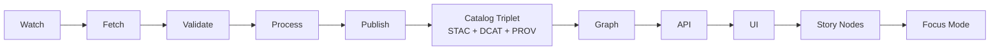

# 🧩 `_shared` — MCP Dev Provenance (dev_prov) Example Kit


> Shared contracts, schemas, templates, and fixtures used by `mcp/dev_prov/examples/*`.
>
> **Design intent:** every example is **reviewable**, **reproducible**, and **evidence-backed** — nothing “mystery” reaches the graph, API, UI, Story Nodes, or Focus Mode.

---

## 🧭 Quick Nav

- [Why this folder exists](#-why-this-folder-exists)
- [Non‑negotiable invariants](#-non-negotiable-invariants)
- [Typical contents](#-typical-contents)
- [Shared manifests](#-shared-manifests)
- [Evidence triplet](#-evidence-triplet-stac--dcat--prov)
- [Policy Pack integration](#-policy-pack-integration-opa--conftest)
- [Artifact packaging](#-artifact-packaging-oci--oras--cosign)
- [Telemetry](#-telemetry--auditability)
- [UI + Focus Mode expectations](#-ui--focus-mode-expectations)
- [Privacy & sovereignty](#-privacy--sovereignty)
- [How to add a new example](#-how-to-add-a-new-example-using-_shared)
- [Reference docs](#-reference-docs)

---

## 🎯 Why this folder exists

KFM’s overall architecture is **contract-first** and **provenance-first**: if something is visible in the platform, it must be traceable back to **cataloged sources** and **provable processing**.

`_shared` exists to make that *easy* in examples:

- ✅ **One canonical “example contract”** for runs, evidence, and catalogs  
- ✅ **One canonical “policy surface”** so examples don’t drift around governance  
- ✅ **One canonical “evidence packaging”** approach (hashes, signatures, attestations)  
- ✅ **One canonical “human-facing story discipline”** (citations required, AI text marked)

> [!NOTE]
> In KFM terms, **MCP** refers to the **Master Coder Protocol**: “research-grade” documentation + reproducibility habits applied to code, data, pipelines, and models. 🧪🧱

---

## 🚦 Non‑negotiable invariants

These are project-wide invariants that examples **must not** violate:

### 1) Pipeline ordering is absolute 🧬➡️🗂️➡️🕸️➡️🧰➡️🗺️➡️📖➡️🤖
**ETL → Catalogs (STAC/DCAT/PROV) → Graph → API → UI → Story Nodes → Focus Mode**

### 2) API boundary rule 🔒
The UI **must never** query the Neo4j graph directly — all governed access goes through the API layer.

### 3) Raw data is immutable 🧊
`data/raw/` is a trust boundary: ingest “as received”; transform downstream (`data/work/`, `data/processed/`).

### 4) Deterministic, idempotent ETL ♻️
Same inputs + same config ⇒ same outputs. Pipelines must be safe to re-run without side effects.

### 5) Evidence-first narrative ✍️📌
Story Nodes and Focus Mode output **must have citations**. AI-generated text must be **clearly marked** and backed by provenance / confidence metadata.

---

## 📦 Typical contents

> [!TIP]
> Keep `_shared` **language-agnostic** when possible: JSON, JSON Schema, markdown templates, small fixtures. Examples in Python/TS/etc can all consume the same “contracts”.

<details>
<summary>📁 Suggested layout (may evolve, but keep intent consistent)</summary>

```text
mcp/dev_prov/examples/_shared/
├─ schemas/                      # JSON Schemas for manifests + catalogs + story node metadata
├─ templates/                    # Canonical JSON/MD templates used by examples
├─ fixtures/                     # Tiny, reviewable sample datasets (GeoJSON, CSV, PMTiles stubs, etc.)
├─ policy/                       # Example-local policy harness (or links/wrappers around repo Policy Pack)
├─ scripts/                      # Helper scripts: hashing, canonicalization, validation, redaction helpers
└─ README.md                     # You are here ✅
```
</details>

---

## 🧾 Shared manifests

Examples should produce **two simple, boring, universal artifacts** every run:

1) **Run Manifest** — “what happened?” (who/what/when/how, inputs/outputs, tool versions)  
2) **Evidence Manifest** — “what evidence exists?” (hashes, formats, classification, provenance links)

### 1) Run Manifest ✅

**Why:** the “ledger spine” for deterministic runs, audits, idempotency, and provenance graph linking.

Key ideas:
- Includes `run_id`, `run_time`, `tool_versions`, `source_urls`, `summary_counts`
- Includes a **canonical hash** (`canonical_digest`) computed from a canonicalized JSON representation (RFC 8785) so repeated runs are detectable.

Minimal template (example):

```json
{
  "schema_version": "kfm.run_manifest.v1",
  "run_id": "2026-01-21T120102Z__example__demo__a1b2c3",
  "run_time": "2026-01-21T12:01:02Z",
  "idempotency_key": "sha256:…",
  "canonical_digest": "sha256:…",
  "actor": {
    "type": "human|agent|ci",
    "id": "github:bartytime4life",
    "runner": "local|github-actions|k8s-job"
  },
  "inputs": [
    {
      "uri": "https://example.org/source/file.tif",
      "etag": "…",
      "sha256": "…",
      "classification": "public|restricted|confidential"
    }
  ],
  "outputs": [
    {
      "path": "data/processed/example/output.geoparquet",
      "sha256": "…",
      "media_type": "application/vnd.apache.parquet"
    }
  ],
  "tool_versions": {
    "python": "3.x",
    "gdal": "…",
    "postgis": "…"
  },
  "summary_counts": { "records_in": 0, "records_out": 0, "errors": 0 },
  "policy": {
    "pack_version": "kfm-policy@…",
    "decisions": []
  }
}
```

### 2) Evidence Manifest 📎

**Why:** a single place to enumerate *everything* this example expects reviewers (and CI) to validate:
- outputs
- metadata
- signatures
- attestations
- sensitivity classification
- cross-links to STAC/DCAT/PROV identifiers

Minimal template (example):

```json
{
  "schema_version": "kfm.evidence_manifest.v1",
  "run_id": "2026-01-21T120102Z__example__demo__a1b2c3",
  "evidence": [
    {
      "kind": "data_asset",
      "path": "data/processed/example/output.geoparquet",
      "media_type": "application/vnd.apache.parquet",
      "sha256": "…",
      "size_bytes": 123,
      "classification": "public",
      "derived_from": ["data/raw/example/source.tif"]
    },
    {
      "kind": "catalog_stac",
      "path": "data/catalogs/stac/example/output.item.json",
      "media_type": "application/json",
      "sha256": "…"
    },
    {
      "kind": "catalog_dcat",
      "path": "data/catalogs/dcat/example/output.dataset.jsonld",
      "media_type": "application/ld+json",
      "sha256": "…"
    },
    {
      "kind": "provenance",
      "path": "data/catalogs/prov/example/output.prov.jsonld",
      "media_type": "application/ld+json",
      "sha256": "…"
    }
  ]
}
```

---

## 🗂 Evidence triplet: STAC + DCAT + PROV

KFM’s “catalog triplet” is the minimum bar for publishing:

- **STAC**: asset footprint (geometry/bbox) + time extent + links to assets  
- **DCAT**: dataset publication metadata (license, publisher, access, themes)  
- **PROV-O**: lineage (entities, activities, agents; what used what; what generated what)

> [!IMPORTANT]
> Treat STAC/DCAT/PROV as **first-class outputs** of the pipeline — not optional documentation.

---

## 🛡 Policy Pack integration (OPA + Conftest)

Examples should be **policy-checkable** the same way the main repo is:

- “Fail closed” by default 🚫✅  
- Policies apply to **humans and agents** equally 🤝🤖  
- Stable rule IDs (e.g., `KFM-CAT-001`, `KFM-PROV-001`) help track waivers and evolution

Common example-facing policies:
- license required (DCAT)
- no secrets in JSON/YAML/MD
- sovereignty/classification propagation (outputs can’t be “less restrictive” than inputs)
- citations required in Story Nodes
- PROV required before graph/UI use

Tiny illustrative Rego snippets (pattern only):

```rego
package kfm.catalogs

deny[msg] {
  input.kind == "dcat_dataset"
  not input.license
  msg := "DCAT dataset missing license"
}
```

```rego
package kfm.security

deny[msg] {
  some s
  s := input.strings[_]
  regex.match("AKIA[0-9A-Z]{16}", s)
  msg := "Potential AWS access key detected"
}
```

> [!TIP]
> When you add/modify schemas or templates in `_shared`, update policies (and vice versa). Drift = broken trust.

---

## 📦 Artifact packaging: OCI + ORAS + Cosign

Some examples may demonstrate treating **data artifacts like container images**:

- Push artifacts to an OCI registry (versioned, content-addressed)
- Sign with **Cosign** (Sigstore)
- Attach PROV / SBOM / attestations as referrers

Illustrative flow (pseudo):

```bash
# push by tag (human-friendly) AND rely on digest (immutable)
oras push registry.example/kfm/example:demo \
  --artifact-type application/vnd.kfm.dataset \
  data/processed/example/output.geoparquet:application/vnd.apache.parquet \
  data/catalogs/prov/example/output.prov.jsonld:application/ld+json

# sign the digest (supply chain provenance)
cosign sign registry.example/kfm/example@sha256:...
cosign verify registry.example/kfm/example@sha256:...
```

> [!NOTE]
> OCI packaging pairs naturally with **FAIR** (reusable, interoperable artifacts) and **CARE** (access control for restricted data).

---

## 📈 Telemetry + auditability

Every pipeline run and major operation should emit telemetry:

- timing + status + volumes
- run identifiers + config hashes
- correlation IDs for traceability
- append-only logging (NDJSON is a good default)

Examples may also demonstrate **Focus telemetry** (latency, query volume, etc.) for sustainability/performance tracking.

---

## 🗺 UI + Focus Mode expectations

Even in “examples land”, we build toward the real KFM stack:

### UI stack (typical) 🧭
- **React** front-end  
- 2D map rendering via **MapLibre GL JS**  
- 3D via **CesiumJS / 3D Tiles**  
- Data served via governed API (REST OpenAPI and/or GraphQL), backed by PostGIS + graph

### Focus Mode (AI) rules 🤖📌
- Must cite cataloged sources (DCAT/STAC/PROV)
- Must log provenance for answers, especially when answers depend on dynamic queries
- Should prefer graph/catalog lookups before generation (RAG + knowledge graph)

---

## 🧰 Geospatial building blocks (shared patterns)

### PostGIS → GeoJSON pattern (handy for examples)

```sql
SELECT row_to_json(fc)
FROM (
  SELECT
    'FeatureCollection' AS type,
    array_to_json(array_agg(f)) AS features
  FROM (
    SELECT
      'Feature' AS type,
      ST_AsGeoJSON(geom)::json AS geometry,
      row_to_json((SELECT l FROM (SELECT id, name) AS l)) AS properties
    FROM my_table
  ) AS f
) AS fc;
```

### WebGL / virtual world patterns 🌍🕹️
Some examples may illustrate:
- terrain/tiles loading for 3D context (Cesium / three.js)
- “storytelling over geography” where Story Nodes drive camera/scene

---

## 🔐 Privacy & sovereignty

KFM’s governance posture shows up in examples too:

- Respect **FAIR + CARE**
- Treat “sensitive location” as a first-class concern (redaction, aggregation, blurring/generalization)
- Never leak credentials or secrets in examples (policy gate should catch this)

For analytics/ML examples:
- consider privacy-preserving techniques (k-anonymity family, query auditing, differential privacy) when publishing aggregates
- document privacy assumptions in MCP artifacts (datasheets, model cards, experiment reports)

---

## 🧪 How to add a new example using `_shared`

### ✅ “Definition of done” checklist
- [ ] Raw inputs ingested immutably (`data/raw/…`) with checksums
- [ ] Deterministic processing into `data/processed/…`
- [ ] STAC + DCAT + PROV produced and cross-linked
- [ ] Run Manifest + Evidence Manifest produced (canonical hash included)
- [ ] Policy gates pass locally + in CI
- [ ] If artifact is distributed: OCI push + Cosign signature verified
- [ ] If human-facing: Story Node includes citations; AI text marked
- [ ] If Focus Mode is involved: answer provenance is logged

### 🧱 Suggested sequence


---

## 📚 Reference docs

<details>
<summary>📖 Project docs that inform these examples (the “why” behind `_shared`)</summary>

- 📄 **Kansas Frontier Matrix (KFM) – Comprehensive Technical Documentation.pdf**  
  Architecture, APIs (OpenAPI/GraphQL), scaling, contract-first + provenance-first principles

- 📄 **Kansas Frontier Matrix (KFM) – Comprehensive Architecture, Features, and Design.pdf**  
  Observability, governance + security framing, collaboration patterns

- 📄 **📚 Kansas Frontier Matrix (KFM) Data Intake – Technical & Design Guide.pdf**  
  Pipeline philosophy (immutability, deterministic ETL), catalog triplet, streaming/real-time patterns

- 📄 **Kansas Frontier Matrix – Comprehensive UI System Overview.pdf**  
  UI stack (React + MapLibre/Cesium), Story Nodes, sensitive-data UX guardrails

- 📄 **Kansas Frontier Matrix (KFM) – AI System Overview 🧭🤖.pdf**  
  Evidence-backed Focus Mode, provenance logging for answers, fairness/bias checks

- 📄 **🌟 Kansas Frontier Matrix – Latest Ideas & Future Proposals.docx.pdf**  
  FAIR/CARE codification, supply-chain attestations (SLSA/SBOM/Sigstore), PR-linked provenance, rollback ideas

- 📄 **Additional Project Ideas.pdf**  
  Run Manifest hashing (RFC 8785), policy-as-code patterns, OCI artifact distribution ideas, graph health checks

- 📄 **Innovative Concepts to Evolve the Kansas Frontier Matrix (KFM).pdf**  
  AR overlays, 4D digital twins, AI copilot for maps, next-gen narrative + simulation concepts

- 📦 **AI Concepts & more.pdf** *(PDF portfolio)*  
  Reference material for AI/ML + data mining + evaluation + privacy

- 📦 **Data Managment-Theories-Architures-Data Science-Baysian Methods-Some Programming Ideas.pdf** *(PDF portfolio)*  
  Reference material for data architectures + Bayesian/statistical thinking (useful for model provenance)

- 📦 **Maps-GoogleMaps-VirtualWorlds-Archaeological-Computer Graphics-Geospatial-webgl.pdf** *(PDF portfolio)*  
  Reference material for WebGL/virtual worlds + mapping interfaces

- 📦 **Various programming langurages & resources 1.pdf** *(PDF portfolio)*  
  Reference material across languages/tools used in examples (Python/TS/DB/web)
</details>

---

## 🧷 Final note

> [!IMPORTANT]
> If you’re unsure what belongs in `_shared`, default to this rule:
>
> ✅ Put it here **only if** (1) multiple examples need it, **and** (2) it encodes a *contract*, *policy surface*, or *evidence discipline* that must stay consistent.
