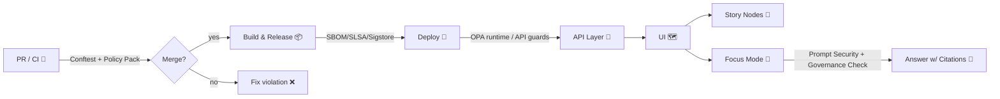

<!--
📄 File: mcp/dev_prov/policies/docs/POLICY_INDEX.md
🎯 Purpose: Canonical index for Dev Provenance (dev_prov) policy docs + policy-as-code map.
-->

---
care_label: "C0-Public"
scope: "mcp/dev_prov"
status: "canonical-index"
---

# 🧾 POLICY_INDEX — Dev Provenance Policies (KFM)


> [!IMPORTANT]
> If you’re here because CI failed ✅ — jump to **[CI Gate Summary](#-ci-gate-summary)** and **[Policy ID Registry](#-policy-id-registry)**.

---

## 🧭 Quick Navigation

- [🎯 What this is](#-what-this-is)
- [🧬 Core Invariants](#-core-invariants)
- [🧱 Enforcement Points](#-enforcement-points)
- [✅ CI Gate Summary](#-ci-gate-summary)
- [🗂️ Policy Docs Index](#️-policy-docs-index)
- [🪪 Policy ID Registry](#-policy-id-registry)
- [🧰 Directory Map](#-directory-map)
- [🧪 Running Policies Locally](#-running-policies-locally)
- [🧯 Waivers Exceptions](#-waivers--exceptions)
- [🧩 Adding or Updating a Policy](#-adding-or-updating-a-policy)
- [📚 Reference Design Docs](#-reference-design-docs)
- [🧾 Changelog](#-changelog)

---

## 🎯 What this is

This file is the **single jump-page** for the **Dev Provenance** policy system inside KFM.

It indexes:

- 📄 **Policy documentation** (human-readable)
- 🧩 **Policy-as-code** (machine-enforced, typically OPA/Rego + Conftest in CI)
- 🧬 **Provenance-first guarantees** (run manifests, evidence manifests, signed artifacts)
- 🛡️ **Security + governance guardrails** (FAIR+CARE, sovereignty-awareness, sensitive-data handling)
- 🤖 **AI governance / Focus Mode** constraints (prompt security, governance checks, citation requirements)

> [!NOTE]
> “dev_prov” is intentionally broader than “DevOps.” In KFM, **provenance is product behavior**:
> it touches ingest ➜ graph ➜ API ➜ UI ➜ narratives ➜ AI answers.

---

## 🧬 Core Invariants

These are **non-negotiable** system truths. If you’re designing a new pipeline, feature, or AI behavior, start here.

### 🧾 Invariants (must always hold)

- **KFM-INV-001 — Evidence-first**
  - No insight without evidence: every derived artifact is traceable to catalogs + provenance. 🧾🔗
- **KFM-INV-002 — Pipeline ordering**
  - Data flow follows the spine: **ETL → Catalogs → Graph → API → UI**. 🧱
- **KFM-INV-003 — API boundary**
  - APIs **do not write** the graph directly (writes are pipeline-owned). 🚧
- **KFM-INV-004 — Provenance-first publishing**
  - No processed outputs without a matching PROV record / run manifest. 🧬
- **KFM-INV-005 — Sensitivity does not downgrade**
  - Outputs cannot be **less restricted** than inputs. 🔒
- **KFM-INV-006 — Focus Mode citations required**
  - If an answer can’t be sourced/cited, it must **refuse or defer to human review**. 📎
- **KFM-INV-007 — No secrets in repos**
  - Secrets must be managed via vault/env/secure config; CI blocks leaks. 🧨
- **KFM-INV-008 — Supply-chain integrity**
  - Releases attach SBOM + attestations + signatures; provenance is verifiable. 📦✅
- **KFM-INV-009 — Cultural protocols respected**
  - Indigenous / culturally sensitive content honors TK labels / community rules. 🪶
- **KFM-INV-010 — Terminology consistency**
  - Docs/UI/API use consistent terms via glossary & controlled vocabulary. 📘

---

## 🧱 Enforcement Points

Policies are enforced at multiple layers so governance isn’t “just a document.”



### 🧠 Practical interpretation

- **CI** blocks violations early (cheap + fast).
- **Runtime** policies protect users when bad data slips in.
- **UI** and **Focus Mode** protect *understanding* (explainability, citations, safe defaults).
- **Release** policies protect the *supply chain*.

---

## ✅ CI Gate Summary

When CI fails, it should point to a policy ID (see **[Policy ID Registry](#-policy-id-registry)**). Typical “red” reasons:

- 🧾 Missing required metadata fields (license, provenance, classification, contacts)
- 🧬 Processed output changed but provenance/run manifest not updated
- 🚧 Graph artifacts updated without matching catalog updates
- 🔒 Sensitive data rules violated (wrong label, missing review flag, exposed restricted coordinates)
- 🧨 Secret detected (hard fail)
- 📦 Release artifacts not signed / no SBOM / no attestation
- 🤖 AI/Focus Mode guardrails violated (uncited output, prompt injection patterns, disallowed content)

---

## 🗂️ Policy Docs Index

This is the **doc inventory** for this folder (`mcp/dev_prov/policies/docs/`).

| Doc 📄 | Purpose 🎯 | Status |
|---|---|---|
| `POLICY_INDEX.md` | This index (start here) | ✅ Active |
| `POLICY_CORE_INVARIANTS.md` | Formal definitions + examples for KFM-INV-* | 🟨 Planned |
| `POLICY_PIPELINE_GATES.md` | ETL/catalog/graph/API ordering + PROV rules | 🟨 Planned |
| `POLICY_DATA_SOVEREIGNTY.md` | FAIR+CARE labels, sovereignty constraints, community review | 🟨 Planned |
| `POLICY_AI_GOVERNANCE.md` | Prompt Security, drift monitoring, citation contract | 🟨 Planned |
| `POLICY_SUPPLY_CHAIN.md` | SBOM/SLSA/signing/registry requirements | 🟨 Planned |
| `POLICY_SECURITY_PRIVACY.md` | Secrets, access control, redaction, privacy constraints | 🟨 Planned |
| `POLICY_WAIVERS.md` | Waiver rules, expiry, logging, audit trails | 🟨 Planned |
| `POLICY_ID_REGISTRY.md` | Canonical registry & lifecycle for policy IDs | 🟨 Planned |

> [!TIP]
> If you create any of the planned docs, update this table + the registry below in the same PR. ✅

---

## 🪪 Policy ID Registry

**ID format:** `KFM-<DOMAIN>-###`

Domains (recommended):
- `INV` (invariants), `PROV` (provenance), `CAT` (catalog/schema), `GOV` (FAIR+CARE / sovereignty),
  `SEC` (security/privacy), `AI` (AI/Focus Mode), `SC` (supply chain), `UI` (UI safeguards), `OPS` (ops health checks)

### 🔥 High-signal starter set

| Policy ID | Name | Enforced by | Typical Inputs | Waivable? |
|---|---|---|---|---|
| `KFM-CAT-001` | Dataset must include license + required metadata | CI Policy Pack | catalog JSON/YAML | ✅ (rare) |
| `KFM-PROV-001` | Processed data requires PROV/run manifest | CI + Pipeline | manifests + outputs | ✅ (time-boxed) |
| `KFM-PROV-002` | Canonical hash required for run manifest | Pipeline + CI | run_manifest.json | ✅ (time-boxed) |
| `KFM-INV-002` | Pipeline ordering (ETL→Catalog→Graph→API→UI) | CI + Pipeline | change set | ❌ |
| `KFM-SEC-001` | Secrets must never be committed | CI | repo scan | ❌ |
| `KFM-GOV-001` | FAIR+CARE label required & propagated | CI + Runtime OPA | metadata + API | ✅ (council) |
| `KFM-GOV-002` | Sensitive areas require review/approval | CI + Runtime | geodata + flags | ✅ (council) |
| `KFM-AI-001` | Focus Mode: every claim must be cited | Runtime (AI) | answer JSON/MD | ❌ |
| `KFM-SC-001` | Release artifacts require SBOM | Release pipeline | build outputs | ✅ (break-glass) |
| `KFM-SC-002` | Release artifacts require signature/attestation | Release pipeline | OCI artifacts | ✅ (break-glass) |
| `KFM-UI-001` | Restricted layers default hidden + warning | UI runtime | layer metadata | ✅ (council) |

> [!WARNING]
> “Waivable” never means “silent.” Waivers must be explicit, time-bounded, and auditable. 🧾🔍

---

## 🧰 Directory Map

Suggested/expected structure (adjust to match repo reality):

```text
📁 mcp/
  📁 dev_prov/
    📁 policies/
      📁 docs/                📚 (you are here)
        📄 POLICY_INDEX.md
        📄 POLICY_*.md
      📁 rego/                🧩 OPA/Rego policies
        📁 kfm/
          📁 cat/
          📁 prov/
          📁 gov/
          📁 sec/
          📁 ai/
          📁 sc/
      📁 tests/               🧪 conftest/opa unit tests
      📁 schemas/             🧾 JSON schemas for policy inputs
      📁 examples/            🧰 example inputs + expected denies
      📄 waivers.yml          🧯 approved exceptions (expiry required)
```

---

## 🧪 Running Policies Locally

> [!TIP]
> Keep a fast feedback loop: run the same checks CI will run.

### 🧩 Conftest (typical)

```bash
# Example: validate a folder of catalog files
conftest test data/catalogs/ \
  --policy mcp/dev_prov/policies/rego \
  --all-namespaces
```

### 🧠 OPA unit tests (typical)

```bash
opa test mcp/dev_prov/policies/rego -v
```

### ✅ “Fail closed” mindset

If the system can’t determine a decision safely (missing labels, missing provenance, missing license),
the default should be **DENY** (then require waiver or remediation).

---

## 🧯 Waivers & Exceptions

A waiver is a **documented temporary exception**.

### Recommended `waivers.yml` shape

```yaml
# 📄 mcp/dev_prov/policies/waivers.yml
waivers:
  - id: "WAIVER-2026-001"
    policy_id: "KFM-PROV-001"
    scope:
      paths:
        - "data/work/experimental/**"
    reason: "Backfilling provenance for legacy dataset import"
    approved_by: "FAIR+CARE Council"
    issued: "2026-01-22"
    expires: "2026-02-22"
    compensating_controls:
      - "Dataset not published to API"
      - "Restricted to maintainers"
```

### Waiver rules ✅

- ⏳ **Expiry required** (no permanent waivers)
- 🧑‍⚖️ **Approver required** (role-based)
- 🧾 **Reason + scope required**
- 🧯 **Compensating controls required** for high-severity policies
- 🧠 **Waivers are visible** (audit trail + changelog)

---

## 🧩 Adding or Updating a Policy

### 📌 Checklist

- [ ] Pick an ID (`KFM-<DOMAIN>-###`) and add it to the registry
- [ ] Write/modify the **Rego** rule(s) in `../rego/`
- [ ] Add tests in `../tests/` (deny + allow cases)
- [ ] Add or update schema in `../schemas/` if inputs changed
- [ ] Document the rule in a `POLICY_*.md` doc (or add here if small)
- [ ] Update CI wiring so the policy actually runs
- [ ] If policy changes behavior for users, update UI/AI docs and add release notes

> [!NOTE]
> Policy changes are “product changes.” Treat them like breaking API changes when they are. 🔥

---

## 📚 Reference Design Docs

These documents informed the policy scope and vocabulary for dev_prov.

> [!NOTE]
> Some reference PDFs are **PDF Portfolios** (bundles). If so, open them in Acrobat to access embedded docs.

### 🧭 Core KFM Architecture & Governance

- 📘 **Kansas Frontier Matrix (KFM) – Comprehensive Architecture, Features, and Design**
- 🧾 **Kansas Frontier Matrix (KFM) – Comprehensive Technical Documentation**
- 🧭 **Kansas Frontier Matrix (KFM) – AI System Overview 🧭🤖**
- 🗺️ **Kansas Frontier Matrix – Comprehensive UI System Overview**
- 📥 **Kansas Frontier Matrix (KFM) Data Intake – Technical & Design Guide**
- 🌟 **Kansas Frontier Matrix – Latest Ideas & Future Proposals**
- 💡 **Innovative Concepts to Evolve the Kansas Frontier Matrix (KFM)**
- 🧠 **Additional Project Ideas**

### 📚 Supporting Research Libraries (Portfolios)

- 🤖 **AI Concepts & more** (portfolio)
- 🗺️ **Maps / GoogleMaps / VirtualWorlds / Archaeological / Geospatial / WebGL** (portfolio)
- 🧰 **Various programming languages & resources** (portfolio)
- 🧮 **Data Management / Theories / Architectures / Bayesian / Programming Ideas** (portfolio)

---

## 🧾 Changelog

- **2026-01-22** — Created `POLICY_INDEX.md` as canonical index for dev_prov policy docs and policy-as-code map.
