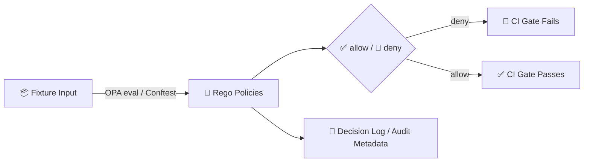

# 🧪 Policy Fixtures — `dev_prov` (Developer Provenance)

> **Folder:** `mcp/dev_prov/policies/fixtures/`  
> **Purpose:** Golden **inputs + expected outcomes** for policy-as-code regression tests (OPA/Rego + Conftest) ✅

---

## 🧭 What lives here?

This folder is a **fixture library** for the **developer provenance policy layer** (aka `dev_prov`).  
Fixtures are small, deterministic “mini-worlds” that represent:

- 🧾 **GitHub / CI events** (PR opened/merged, reviews, bot actions)
- ⛓️ **PROV-style lineage** (code → dataset → UI/AI output)
- 🔐 **Supply-chain evidence** (SBOMs, SLSA attestations, signing metadata)
- ⚖️ **Governance gates** (license, sensitivity classification, provenance completeness)
- 🧠 **AI governance inputs** (e.g., “answers must be citeable” as a policy check)

They exist so we can change policies *safely* and prove we didn’t regress KFM’s non‑negotiables.

---

## 🧩 How fixtures fit the KFM philosophy

KFM is built around a few big invariants:

- **Contract-first** ✅  
- **Provenance-first** ⛓️  
- **Fail-closed** 🛑 (if we can’t prove it’s safe/valid, we deny it)
- **FAIR + CARE** ⚖️ (open science + community rights & ethics)

Fixtures are how we *continuously verify* those invariants—especially when automation (agents), rapid ingestion, and AI are involved.

---

## 🗺️ The fixture → policy → CI loop



---

## 🗂️ Suggested directory layout

> If your repo already has a different structure, keep it — but try to preserve the *intent*.

```text
📁 mcp/dev_prov/policies/fixtures/
├─ 📁 devops/
│  ├─ 📁 pr_prov/            # PR → PROV graph invariants
│  │  ├─ ✅ allow/
│  │  └─ 🛑 deny/
│  ├─ 📁 wpe_agents/         # Watcher → Planner → Executor constraints
│  └─ 📁 reviews_roles/      # reviewer requirements, role checks
├─ 📁 supply_chain/
│  ├─ ✅ allow/              # SBOM/SLSA present, signed, consistent
│  └─ 🛑 deny/               # missing/invalid attestations
├─ 📁 data_governance/
│  ├─ 📁 metadata/           # STAC/DCAT/PROV completeness stubs
│  ├─ 📁 license/            # missing/unknown license scenarios
│  └─ 📁 sensitivity/        # sensitive location, obfuscation, access rules
├─ 📁 ai_governance/
│  └─ 📁 focus_mode/         # cite-or-refuse, prompt security inputs
└─ 📁 _templates/            # copy/paste starter fixtures
```

---

## 🧾 Fixture contract (recommended)

A fixture should be **self-describing** and contain:

- `case_id` — stable ID (human readable + grep-friendly)
- `title` / `description`
- `tags` — searchable keywords
- `input` — JSON object passed into OPA/Conftest
- `expected` — what *must* happen (allow/deny + reasons)

### ✅ Minimal YAML case format

<details>
<summary><strong>Click to expand: <code>case.yml</code> template</strong> 🧩</summary>

```yaml
case_id: DEVPROV-PR-001
title: "Merged PR missing merge-commit entity"
description: >
  A PR merge event must be representable as a complete provenance activity.
tags: [devops, prov, github, integrity]

input:
  event:
    type: "pull_request.merged"
    pr_number: 123
    repo: "Kansas-Frontier-Matrix"
    actor: { kind: "human", login: "contributorA" }

  prov:
    # minimal JSON-LD-ish shape (stubbed)
    activity:
      id: "prov:pr/123"
    entities:
      - id: "prov:commit/abc123"
    agents:
      - id: "prov:agent/contributorA"
    relations:
      - pred: "prov:used"
        subj: "prov:pr/123"
        obj: "prov:commit/abc123"

  supply_chain:
    sbom:
      present: true
    slsa:
      present: true
    signatures:
      cosign_verified: true

expected:
  decision: "deny"
  violations:
    - code: "DEVPROV.MERGE_INVARIANT.MISSING_MERGE_COMMIT"
      severity: "error"
      message_contains: "merge commit"
```

</details>

### ✅ Minimal JSON fixture format

<details>
<summary><strong>Click to expand: <code>input.json</code> example</strong> 🧾</summary>

```json
{
  "event": {
    "type": "pull_request.opened",
    "pr_number": 42,
    "repo": "Kansas-Frontier-Matrix",
    "actor": { "kind": "bot", "login": "kfm-executor" }
  },
  "prov": {
    "activity": { "id": "prov:pr/42" },
    "entities": [{ "id": "prov:commit/def456" }],
    "agents": [{ "id": "prov:agent/kfm-executor" }],
    "relations": [
      { "pred": "prov:used", "subj": "prov:pr/42", "obj": "prov:commit/def456" },
      { "pred": "prov:wasAssociatedWith", "subj": "prov:pr/42", "obj": "prov:agent/kfm-executor" }
    ]
  }
}
```

</details>

---

## 🧪 Fixture families we care about (and why)

| Fixture family 🧩 | What it protects 🛡️ | Example deny trigger 🚫 |
|---|---|---|
| **PR → PROV invariants** ⛓️ | “Code history is provenance” | PR merged but missing required activity/entity/agent links |
| **W–P–E agents** 🤖 | Automation is reviewable, not autonomous | Executor attempts auto-merge, missing idempotency key, missing trace |
| **Supply chain** 🔐 | Build artifacts are verifiable | Missing SBOM, missing SLSA attestation, signature not verified |
| **Metadata completeness** 🧾 | No “mystery layers” reach UI/AI | STAC/DCAT/PROV stub missing required fields |
| **License enforcement** 📜 | No unknown/legal-risk data | license missing/unknown/forbidden |
| **Sensitivity governance** 🧿 | Prevent harm (looting/PII/community harm) | precise coordinates for sensitive locations without permission |
| **AI governance** 🧠 | “Cite-or-refuse” | answer contains claims without citations / violates content rules |
| **Query auditing** 🕵️ | Prevent inference leaks | query would reconstruct restricted information from outputs |

---

## 🧷 Golden rules for writing fixtures

### 1) Keep them tiny (but realistic)
- Prefer **stubs** over full payloads.
- Include only the fields that the policy actually reads.

### 2) Deterministic or it doesn’t belong
- No “today’s date” unless explicitly injected as a fixed value in `input`.
- No network calls.
- No random IDs (unless seeded and stable).

### 3) Safe by default
- 🚫 No secrets, tokens, private keys, credentials  
- 🚫 No real PII  
- 🧪 Use synthetic locations for “sensitive location” tests (and test **generalization** behavior)

### 4) Always capture *why*
A deny fixture is only useful if the expected violation is **specific**:
- include an error `code`
- include a short `message_contains`
- include `path` (if your harness supports it)

---

## ➕ Adding a new fixture (checklist)

- [ ] Pick a **single** policy outcome to test (avoid mega-cases)
- [ ] Create folder: `fixtures/<family>/<allow|deny>/<CASE_ID>/`
- [ ] Add: `case.yml` (or `input.json` + `expected.yml`)
- [ ] Add 1–2 sentence `README.md` in the case folder (optional but helpful)
- [ ] Run policy tests locally
- [ ] Ensure fixture contains **no sensitive data**
- [ ] Tag it so future-you can find it (`tags:` is your friend 🧠)

---

## 🧯 Debugging tips

If a fixture fails unexpectedly:

1. **Print the policy decision trace** (OPA supports explain/trace)
2. Confirm the policy is reading the fields you think it is
3. Reduce the input until the failure disappears (then re-add fields)
4. If this is an intended change, update:
   - the policy
   - the fixture expected output
   - and ideally add a *new* fixture capturing the edge case

> 🔎 Pro tip: treat this like a scientific experiment — hypothesis, method, expected outcome, repeatability.

---

## 🧱 Templates (starter pack)

Create these once in `_templates/` and reuse everywhere:

- `template.case.yml` ✅
- `template.input.json` 🧾
- `template.expected.yml` 🎯
- `template.case.README.md` 📝

---

## 📚 Related (in-repo) docs to keep handy

```text
docs/architecture/…
docs/governance/ROOT_GOVERNANCE.md
docs/governance/ETHICS.md
docs/governance/SOVEREIGNTY.md
docs/templates/…
mcp/…
```

---

## ✅ Definition of Done for fixture PRs

A fixture PR is “done” when:

- ✅ New behavior is covered by **at least one allow** and **one deny** case (where applicable)
- ✅ Expected outcomes are **specific** (codes/messages), not vague
- ✅ The fixture is **safe** (no secrets, no PII, no real sensitive coordinates)
- ✅ Running the suite is deterministic on CI and locally
- ✅ The fixture teaches something (future maintainers understand *why it exists*)
