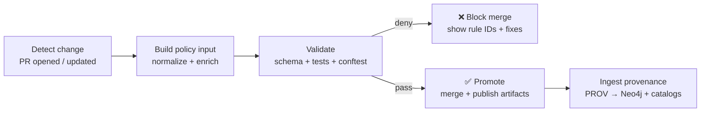

# 🧾🔐 Dev Provenance Policy Pack (Rego)


Policy-as-code for **Kansas-Matrix-System** 🧠🗺️ — focused on **development provenance** (PR → PROV), plus the shared governance rules that keep KFM **evidence-first**, **provenance-first**, and **safe to publish**.

> [!IMPORTANT]
> **Fail-closed by default.** If a check can’t run or an invariant can’t be proven, we block merge/publish and ask for explicit review/waiver.

---

## 🧭 Why this exists

KFM’s architecture is built around a few non-negotiables:

- **Contract-first / provenance-first publishing**: if it shows up in the UI (or Focus Mode), it must be traceable to cataloged sources — no “mystery layers.”
- **Evidence-first metadata**: “published” means the metadata + lineage exists (not just the bytes).
- **Governance is automated**: CI gates run on every PR; runtime gates can evaluate actions (data access, AI output) before execution.

This folder is the **Rego policy bundle** that turns those principles into enforceable rules.

---

## 🧩 Where `dev_prov` fits in the platform

`mcp/dev_prov` is the bridge between **DevOps reality** (PRs, commits, CI runs, artifact publishing) and the **KFM evidence graph**.

Typical responsibilities:
- 🧷 **Capture**: ingest GitHub/CI events and artifact metadata
- 🧾 **Translate**: emit **PROV JSON-LD** describing PR activity, pipeline runs, and published entities
- 🔎 **Validate**: evaluate those artifacts with this Rego bundle (fail-closed)
- 🧠 **Ingest**: write accepted provenance into the knowledge graph + catalogs so it’s queryable later

This keeps “how did we make this?” answerable — even years later.

---

## ✅ What these policies enforce (high level)

### 🧾 1) Evidence-first publishing
- Require the “evidence triplet” for publishable assets: **STAC + DCAT + PROV**.
- Ensure required metadata fields exist (source, license, spatial/temporal extent, processing steps).
- Ensure processed outputs cannot change without corresponding PROV updates.

### 🧬 2) Provenance everywhere (including DevOps)
- Convert **GitHub PR activity → W3C PROV(-O)** records so “which code produced this dataset?” is always answerable.
- Enforce invariants on PR provenance (e.g., merge commit presence / derivations / agents).

### 🧑🏽‍⚖️ 3) Sovereignty, sensitivity & ethical access
- Propagate the **most restrictive classification** from inputs → outputs.
- Prevent sensitive coordinates/fields from being published at an inappropriate visibility level.
- Support differential access models (role-based, protocol-based) for cultural and community-provided content.

### 🔐 4) Security & supply chain hygiene
- Block secrets in commits/metadata/configs (keys, JWTs, etc.).
- Require signed artifacts (Cosign), and attach provenance attestations / PROV JSON-LD when publishing to OCI.

### 🤖 5) AI transparency rules
- Require AI outputs to include citations / evidence references.
- Enforce guardrails (uncertainty language for speculative claims, no invented entities, etc.).

### 🗺️ 6) UI / map integrity rules
- Require attribution and provenance hooks for any layer shown in 2D/3D maps.
- Ensure geospatial layers declare CRS and respect sensitivity rules (zoom generalization / blur requirements).

---

## 🗂️ Policy domains, IDs, and outputs

We organize rules into **domains** with stable IDs.

| Domain 🧩 | Prefix 🏷️ | Examples (illustrative) |
|---|---|---|
| Catalogs | `KFM-CAT-###` | Missing STAC/DCAT fields, invalid license |
| Provenance | `KFM-PROV-###` | “Processed data changed without matching PROV update” |
| Sovereignty | `KFM-SOV-###` | Classification regression; sensitive coords exposed |
| API | `KFM-API-###` | Deprecated endpoints; schema drift |
| Story | `KFM-STORY-###` | Narrative lacks citations; AI text not labeled |
| Security | `KFM-SEC-###` | Secrets detected; unsigned artifacts |
| Style | `KFM-STYLE-###` | Formatting, naming, deterministic ordering |
| Dev Provenance | `KFM-DEV-###` | PR→PROV missing merge entity; missing reviewer agent |

**Conftest conventions** (recommended):
- `deny[msg]` → fails CI
- `warn[msg]` → reports but does not fail (use sparingly; fail-closed is preferred)

---

## 🧱 Expected folder layout

```text
mcp/dev_prov/policies/rego/
├─ policy/                      # ✅ Rego packages (deny/warn/allow)
│  ├─ catalogs/                  # STAC/DCAT requirements
│  ├─ prov/                      # PROV invariants (data lineage)
│  ├─ dev/                       # PR → PROV invariants (dev provenance)
│  ├─ sovereignty/               # classification / sensitivity propagation
│  ├─ ai/                        # AI transparency + guardrails
│  ├─ security/                  # secret scanning, signing requirements
│  └─ ui/                        # map layer publishing requirements
├─ data/                         # 📦 Policy data (allowlists, governance cards)
│  ├─ governance_card.json        # allowed licenses, provider requirements, etc.
│  ├─ sensitive_terms.json        # secret patterns / blocked terms
│  └─ roles.json                  # optional role / capability definitions
├─ tests/                         # 🧪 opa test fixtures + rego *_test.rego
├─ waivers.yml                    # ⏳ time-bound exceptions (with reason + expiry)
└─ README.md                      # 👈 you are here
```

> [!NOTE]
> If your repo already has a canonical policy pack location (e.g., `api/scripts/policy/` or `tools/validation/policy/`), treat this directory as the **MCP/dev_prov bundle** and vendor/import as needed.

---

## 🧾 Inputs: what policies evaluate

Policies are intentionally **tool-agnostic**. They evaluate **artifacts**, not “how you made them.”

Common inputs include:

- **PR context**: repo, branch, author(s), reviewer(s), checks, changed files.
- **PROV JSON-LD**: dev provenance records (PR activity, commits/entities, agents).
- **Run manifests**: deterministic pipeline run records (inputs, tool versions, counts, timestamps, digest).
- **Catalog artifacts**: STAC items/collections, DCAT datasets, PROV activities/entities.
- **UI config**: layer manifests, attribution strings, sensitivity flags, zoom/generalization rules.

### Example: unified policy input (suggested shape)

```json
{
  "event": { "type": "pull_request", "action": "opened" },
  "repo": { "name": "Kansas-Matrix-System", "default_branch": "main" },
  "pr": { "number": 123, "author": "alice", "reviewers": ["bob"] },
  "changes": {
    "files": [
      { "path": "data/stac/items/foo.json", "kind": "json", "sha256": "…" },
      { "path": "data/prov/foo.prov.jsonld", "kind": "jsonld", "sha256": "…" }
    ]
  },
  "artifacts": {
    "prov": { "dev": { "jsonld": {} }, "data": { "jsonld": {} } },
    "run_manifest": { "path": "data/audits/run_2026-01-22/run_manifest.json", "json": {} },
    "oci": { "ref": "ghcr.io/org/kfm/foo:2026-01-22", "cosign": { "verified": true } }
  }
}
```

---

## 🧾 Decision contract (how rules surface)

This bundle supports **both** CI-style evaluation (Conftest) and runtime evaluation (OPA).

### Conftest
Conftest looks for:
- `deny[msg]` → failing checks
- `warn[msg]` → non-failing checks

### OPA (runtime / service mode)
If you serve these policies via OPA, standardize on a single decision document, e.g.:

```json
{
  "allow": false,
  "deny": [
    { "id": "KFM-PROV-001", "msg": "Missing PROV for published dataset", "path": "data/prov/foo.jsonld" }
  ],
  "warn": [],
  "meta": { "policy_version": "git:abcdef", "evaluated_at": "2026-01-22T00:00:00Z" }
}
```

> [!TIP]
> Keep **policy IDs** stable and machine-readable so the UI/CI can hyperlink fixes, docs, and waivers.

---

## 📦 Build + serve as an OPA bundle (optional)

```bash
# Build a distributable bundle (tar.gz)
opa build -b mcp/dev_prov/policies/rego -o /tmp/devprov-policy-bundle.tar.gz

# Serve via OPA (local dev)
opa run --server --bundle /tmp/devprov-policy-bundle.tar.gz
```

## 🧪 Running locally

### Install tooling
- **OPA** (policy engine + `opa test`)
- **Conftest** (runs Rego against PR diffs / files)

### Run Conftest (CI-like)
```bash
# Run all policies against a folder of inputs (JSON/YAML/etc.)
conftest test ./path/to/inputs \
  --policy mcp/dev_prov/policies/rego/policy \
  --data   mcp/dev_prov/policies/rego/data
```

### Run OPA unit tests
```bash
opa test mcp/dev_prov/policies/rego -v
```

### Debug a single decision (OPA eval)
```bash
opa eval \
  --data mcp/dev_prov/policies/rego/policy \
  --data mcp/dev_prov/policies/rego/data \
  --input ./examples/input.pr.json \
  "data.kfm.decision"
```

---

## 🔁 CI workflow integration (Detect → Validate → Promote)



**Where this fits:**
- Conftest in CI = fast, deterministic gate.
- OPA at runtime = “allow/deny” decisions for sensitive access and AI output checks.

---

## ⏳ Waivers (time-bound exceptions)

Waivers exist so we can unblock critical work **without** silently eroding governance.

**Rules of thumb:**
- Waivers must have: **policy ID**, **scope**, **reason**, **owner**, **expiry**.
- Prefer fixing root causes over long-lived exceptions.

Example `waivers.yml`:

```yaml
waivers:
  - id: KFM-CAT-004
    scope:
      paths:
        - data/catalogs/dcat/example_dataset.json
    reason: "Upstream provider license field pending; tracked in ISSUE-123."
    owner: "@maintainer-handle"
    expires: "2026-02-15"
    approved_by: "@governance-council"
```

> [!WARNING]
> Expired waivers should fail CI.

---

## 🧰 Authoring guidelines (Rego style)

### ✅ Do
- Keep policies **small**, **composable**, and **deterministic**
- Emit actionable messages:
  - include **Policy ID**
  - include **file path**
  - include **how to fix**
- Prefer strict checks for publishable artifacts (fail-closed)

### ❌ Don’t
- Encode heavy parsing logic inside Rego (do that in the input builder)
- Hide exceptions in code — use waivers with review + expiry

---

## 🧩 Example rules (snippets)

### 1) Evidence triplet required for publish
```rego
package kfm.catalogs

deny[msg] {
  input.event.type == "publish"
  not input.artifacts.stac
  msg := "KFM-CAT-001: Missing STAC artifact for publishable data"
}

deny[msg] {
  input.event.type == "publish"
  not input.artifacts.dcat
  msg := "KFM-CAT-002: Missing DCAT artifact for publishable data"
}

deny[msg] {
  input.event.type == "publish"
  not input.artifacts.prov
  msg := "KFM-PROV-001: Missing PROV artifact for publishable data"
}
```

### 2) Classification must not downgrade
```rego
package kfm.sovereignty

deny[msg] {
  in := input.artifacts.inputs[_]
  out := input.artifacts.outputs[_]
  severity_rank(out.classification) < severity_rank(in.classification)
  msg := sprintf("KFM-SOV-001: Classification regressed (%s → %s) for %s",
    [in.classification, out.classification, out.path])
}
```

### 3) PR → PROV must include merge entity (merged PRs)
```rego
package kfm.devprov

deny[msg] {
  input.event.type == "pull_request"
  input.pr.merged == true
  not input.artifacts.prov.dev.has_merge_commit
  msg := sprintf("KFM-DEV-001: Merged PR #%d missing merge-commit PROV entity", [input.pr.number])
}
```

### 4) AI answer must cite at least one source
```rego
package kfm.ai

deny[msg] {
  input.event.type == "ai_answer"
  count(input.ai.citations) == 0
  msg := "KFM-AI-001: AI answer missing citations (evidence-first requirement)"
}
```

### 5) Secrets scanning (minimal)
```rego
package kfm.security

deny[msg] {
  some f
  f := input.changes.files[_]
  re_match("AKIA[0-9A-Z]{16}", f.contents) # AWS access key pattern example
  msg := sprintf("KFM-SEC-001: Potential secret detected in %s", [f.path])
}
```

---

## 📎 How this connects to the rest of KFM

This policy pack exists to support the platform’s broader goals:

- **UI trust**: provenance + citations are surfaced everywhere (layers, stories, exports).
- **AI trust**: Focus Mode is explainable, cites evidence, and is policy-governed.
- **Ops trust**: code history is provenance; deployments are auditable; artifacts are signed.

---

## 🌱 FAIR + CARE alignment (policy goals)

KFM explicitly targets **FAIR** (Findable, Accessible, Interoperable, Reusable) and **CARE**
(Collective Benefit, Authority to Control, Responsibility, Ethics).

This policy pack translates those values into gates such as:

| Principle | What we enforce ✅ | Example policy domains |
|---|---|---|
| **Findable** | Everything publishable is cataloged (STAC/DCAT) | Catalogs |
| **Accessible** | Access paths are explicit + auditable | API, Sovereignty |
| **Interoperable** | Standard formats + provenance attached (PROV) | Provenance, Catalogs |
| **Reusable** | License clarity + attribution + signed artifacts | Catalogs, Security |
| **Collective Benefit** | Governance that supports collaboration without harm | Sovereignty, Story |
| **Authority to Control** | Differential access + protocol-based restrictions | Sovereignty |
| **Responsibility** | Prevent accidental sensitive exposure | Sovereignty, UI |
| **Ethics** | Cultural protocols + citation requirements | Sovereignty, Story, AI |

---

## 📚 Source documents used to design this pack

Core KFM design docs:
- Kansas Frontier Matrix (KFM) – Comprehensive Technical Documentation
- Kansas Frontier Matrix (KFM) – Comprehensive Architecture, Features, and Design
- 📚 KFM Data Intake – Technical & Design Guide
- Kansas Frontier Matrix (KFM) – AI System Overview 🧭🤖
- Kansas Frontier Matrix – Comprehensive UI System Overview
- 🌟 KFM – Latest Ideas & Future Proposals
- Innovative Concepts to Evolve the Kansas Frontier Matrix (KFM)
- Additional Project Ideas

Reference libraries (PDF portfolios / multi-doc collections):
- AI Concepts & more (portfolio)
- Data Management / Architectures / Bayesian Methods (portfolio)
- Maps / Google Maps / Virtual Worlds / Geospatial WebGL (portfolio)
- Various programming languages & resources (portfolio)

---

## 🧠 Next steps (recommended)
- Add `examples/` with real input fixtures (PR event, run_manifest, publish event).
- Implement `*_test.rego` for every domain rule (golden fixtures).
- Wire a CI job: build policy input → conftest test → annotate PR with deny IDs.
- Add a small `policy_input_builder` in `mcp/dev_prov` to normalize GitHub payloads into the unified input shape.
