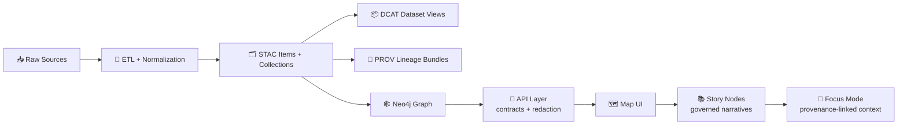

# 🤖🛡️ KFM AI Policy Pack (OPA/Rego) — `mcp/dev_prov/policies/rego/ai`


> [!IMPORTANT]
> This folder contains **AI-specific governance policies** for Kansas Frontier Matrix (KFM) “Focus Mode” and agent workflows. Policies are evaluated in **CI (Conftest)** and can also be applied at **runtime (OPA)** to block unsafe / unverifiable / non-compliant outputs before they reach users.  
> This mirrors KFM’s design goal: rules are explicit, versioned with code, and enforced automatically.  [oai_citation:0‡Kansas Frontier Matrix (KFM) – Comprehensive Architecture, Features, and Design.pdf](file-service://file-4Umt1yHoGKicdmLWzFJ9sC) [oai_citation:1‡Kansas Frontier Matrix (KFM) – Comprehensive Architecture, Features, and Design.pdf](file-service://file-4Umt1yHoGKicdmLWzFJ9sC)

---

## 🧭 Table of Contents

- [🎯 What this pack is for](#-what-this-pack-is-for)
- [🧠 Where policies run](#-where-policies-run)
- [🧩 “Evidence-first” invariants](#-evidence-first-invariants)
- [🧯 Safety, sensitivity & sovereignty](#-safety-sensitivity--sovereignty)
- [🧾 Policy IDs, categories, and waivers](#-policy-ids-categories-and-waivers)
- [📦 Decision contract (inputs/outputs)](#-decision-contract-inputsoutputs)
- [🧪 Local testing](#-local-testing)
- [🔌 How this ties into Dev Provenance](#-how-this-ties-into-dev-provenance)
- [🖥️ How policy results surface in the UI](#️-how-policy-results-surface-in-the-ui)
- [📚 Project sources used](#-project-sources-used)
- [📎 Appendix: suggested module layout](#-appendix-suggested-module-layout)

---

## 🎯 What this pack is for

KFM’s AI features are designed to be **evidence-backed**, **policy-governed**, and **auditable**:

- **AI outputs must be traceable**: Focus Mode answers are treated as derived information and are expected to carry **citations/provenance links** (if an answer cannot cite sources, it should refuse). [oai_citation:2‡Kansas Frontier Matrix (KFM) – Comprehensive Architecture, Features, and Design.pdf](file-service://file-4Umt1yHoGKicdmLWzFJ9sC) [oai_citation:3‡Kansas Frontier Matrix (KFM) – AI System Overview 🧭🤖.pdf](file-service://file-Pv8eev6RWvCKrGCXyzY7zg)
- **Governance is automated**: policy-as-code (OPA/Rego) + Conftest in CI validates changes (metadata, narratives, configs, etc.). [oai_citation:4‡Kansas Frontier Matrix (KFM) – Comprehensive Architecture, Features, and Design.pdf](file-service://file-4Umt1yHoGKicdmLWzFJ9sC)
- **Runtime checks are expected**: OPA can be consulted at runtime (e.g., before executing/publishing a Focus Mode response) to ensure no privacy/content policy is violated. [oai_citation:5‡Kansas Frontier Matrix (KFM) – Comprehensive Architecture, Features, and Design.pdf](file-service://file-4Umt1yHoGKicdmLWzFJ9sC)
- **Prompt security is multi-layered**: content rules, tool allow/block lists, and OPA checks are part of the design to mitigate malicious inputs and prevent unsafe behavior. [oai_citation:6‡Kansas Frontier Matrix (KFM) – AI System Overview 🧭🤖.pdf](file-service://file-Pv8eev6RWvCKrGCXyzY7zg) [oai_citation:7‡Kansas Frontier Matrix (KFM) – AI System Overview 🧭🤖.pdf](file-service://file-Pv8eev6RWvCKrGCXyzY7zg)

---

## 🧠 Where policies run

### 1) ✅ CI policy gates (Conftest)

In KFM’s architecture, Rego rules are stored in-repo and evaluated during CI (including JSON files, configs, docs). Violations fail the build and name the specific rule that fired. [oai_citation:8‡Kansas Frontier Matrix (KFM) – Comprehensive Architecture, Features, and Design.pdf](file-service://file-4Umt1yHoGKicdmLWzFJ9sC) [oai_citation:9‡📚 Kansas Frontier Matrix (KFM) Data Intake – Technical & Design Guide.pdf](file-service://file-EbUCdsJMbu5KwpoKMrLrgj)

### 2) 🛡️ Runtime policy gates (OPA)

OPA can also be used at runtime, e.g. to evaluate a generated Focus Mode answer and deny disallowed content or privacy violations before it’s returned to the user. [oai_citation:10‡Kansas Frontier Matrix (KFM) – Comprehensive Architecture, Features, and Design.pdf](file-service://file-4Umt1yHoGKicdmLWzFJ9sC)

### 3) 🧬 End-to-end traceability (Data → Graph → API → UI → Story → Focus Mode)

KFM’s core pipeline is designed around “boundary artifacts” (STAC/DCAT/PROV) feeding the graph, API, UI, Story Nodes, and Focus Mode. Policies enforce the invariants at each stage. [oai_citation:11‡MARKDOWN_GUIDE_v13.md.gdoc](file-service://file-UYVruFXfueR8veHMUKeugU) [oai_citation:12‡📚 Kansas Frontier Matrix (KFM) Data Intake – Technical & Design Guide.pdf](file-service://file-EbUCdsJMbu5KwpoKMrLrgj)



(High-level flow aligns with KFM documentation patterns.) [oai_citation:13‡MARKDOWN_GUIDE_v13.md.gdoc](file-service://file-UYVruFXfueR8veHMUKeugU)

---

## 🧩 “Evidence-first” invariants

KFM treats outputs (including AI outputs) as **first-class evidence artifacts** that must be stored, versioned, and provenance-linked rather than “hand-waved” into existence. [oai_citation:14‡MARKDOWN_GUIDE_v13.md.gdoc](file-service://file-UYVruFXfueR8veHMUKeugU)

Core invariants the AI policy pack should enforce:

- **Citations required for human-facing claims** (Focus Mode answers, Story Node text, etc.). [oai_citation:15‡Kansas Frontier Matrix (KFM) – Comprehensive Architecture, Features, and Design.pdf](file-service://file-4Umt1yHoGKicdmLWzFJ9sC) [oai_citation:16‡📚 Kansas Frontier Matrix (KFM) Data Intake – Technical & Design Guide.pdf](file-service://file-EbUCdsJMbu5KwpoKMrLrgj)
- **No “mystery nodes / mystery layers”**: graph/UI content must map back to catalog & provenance artifacts. [oai_citation:17‡📚 Kansas Frontier Matrix (KFM) Data Intake – Technical & Design Guide.pdf](file-service://file-EbUCdsJMbu5KwpoKMrLrgj)
- **No bypassing governance boundaries**: UI shouldn’t talk directly to databases; access is governed by the API layer which applies policy + redaction. [oai_citation:18‡📚 Kansas Frontier Matrix (KFM) Data Intake – Technical & Design Guide.pdf](file-service://file-EbUCdsJMbu5KwpoKMrLrgj)
- **Strict answer contract**: Focus Mode is designed around a strict prompt template and evidence-based responses; if evidence isn’t available, refuse or state uncertainty instead of fabricating. [oai_citation:19‡Kansas Frontier Matrix (KFM) – AI System Overview 🧭🤖.pdf](file-service://file-Pv8eev6RWvCKrGCXyzY7zg) [oai_citation:20‡Kansas Frontier Matrix (KFM) – AI System Overview 🧭🤖.pdf](file-service://file-Pv8eev6RWvCKrGCXyzY7zg)

---

## 🧯 Safety, sensitivity & sovereignty

KFM’s governance model is designed to encode FAIR + CARE rules into tooling, and agents should refuse to plan/execute actions that would violate those rules (e.g., exposing precise sacred site locations). [oai_citation:21‡🌟 Kansas Frontier Matrix – Latest Ideas & Future Proposals.docx.pdf](file-service://file-SQ3f7ve8SGiusT6ThZEuCe)

### 🔒 “No output may be less restricted than its inputs”
A core sovereignty/sensitivity principle: transformations must preserve (or increase) restriction; public outputs cannot downgrade confidential/restricted sources. [oai_citation:22‡📚 Kansas Frontier Matrix (KFM) Data Intake – Technical & Design Guide.pdf](file-service://file-EbUCdsJMbu5KwpoKMrLrgj) [oai_citation:23‡📚 Kansas Frontier Matrix (KFM) Data Intake – Technical & Design Guide.pdf](file-service://file-EbUCdsJMbu5KwpoKMrLrgj)

### 🗺️ Geo-obfuscation / sensitive locations
KFM’s design notes propose hiding or generalizing sensitive coordinates in public outputs (example: coordinate rounding / coarse accuracy). [oai_citation:24‡Innovative Concepts to Evolve the Kansas Frontier Matrix (KFM).pdf](file-service://file-G71zNoWKxsoSW44iwZaaCC) [oai_citation:25‡🌟 Kansas Frontier Matrix – Latest Ideas & Future Proposals.docx.pdf](file-service://file-SQ3f7ve8SGiusT6ThZEuCe)

### 🧾 Cultural protocols (TK labels / community rules)
KFM’s “CARE” stance includes the concept of culturally-informed access controls and restrictions (e.g., special handling for heritage or sacred-site content). [oai_citation:26‡Innovative Concepts to Evolve the Kansas Frontier Matrix (KFM).pdf](file-service://file-G71zNoWKxsoSW44iwZaaCC)

### 🧨 Fail-closed posture
If checks can’t be performed or provenance is missing, the expected default is to reject rather than allow uncertain/unsafe publishing. [oai_citation:27‡📚 Kansas Frontier Matrix (KFM) Data Intake – Technical & Design Guide.pdf](file-service://file-EbUCdsJMbu5KwpoKMrLrgj)

### 🧰 Prompt security (AI-facing)
Focus Mode is expected to use layered defenses including content filtering rules and tool allow/block lists, plus OPA policy checks where relevant. [oai_citation:28‡Kansas Frontier Matrix (KFM) – AI System Overview 🧭🤖.pdf](file-service://file-Pv8eev6RWvCKrGCXyzY7zg) [oai_citation:29‡Kansas Frontier Matrix (KFM) – AI System Overview 🧭🤖.pdf](file-service://file-Pv8eev6RWvCKrGCXyzY7zg)

> [!TIP]
> Data-mining literature emphasizes **privacy-preserving output controls** and **query auditing**, which is conceptually aligned with KFM’s “no sensitive leaks” and “log governance decisions” goals. [oai_citation:30‡Data Mining Concepts & applictions.pdf](file-service://file-2uwEbQAFVKpXaTtWgUirAH)

---

## 🧾 Policy IDs, categories, and waivers

KFM documentation describes policy organization into categories with stable IDs (e.g., `KFM-CAT-001`, `KFM-PROV-001`) and a **time-bound waiver mechanism** (e.g., `waivers.yml`) to handle exceptions with reasoning + expiration. [oai_citation:31‡📚 Kansas Frontier Matrix (KFM) Data Intake – Technical & Design Guide.pdf](file-service://file-EbUCdsJMbu5KwpoKMrLrgj)

### ✅ Recommended AI policy ID convention

Even if your repo already uses the v13 categories, this folder can keep its own **AI grouping** while still emitting stable IDs:

- **Prefix:** `KFM-AI-###` for AI-specific rules (Focus Mode / agent governance)
- **Map to v13 categories as needed:** e.g., an AI citation rule could also be `KFM-STORY-*` or `KFM-PROV-*`

### 🧱 Example “AI pack” rule families (suggested)

| ID | Rule Family | Typical deny reason |
|---|---|---|
| `KFM-AI-001` | Evidence & citations | Answer has claims but no citation links |
| `KFM-AI-002` | Provenance linkage | Missing PROV pointer for an AI response / run |
| `KFM-AI-003` | Sensitivity & redaction | Outputs downgrade classification or reveal restricted coordinates |
| `KFM-AI-004` | Tool usage boundaries | Tool call to disallowed endpoint / missing allowlist |
| `KFM-AI-005` | Secrets & PII | Response or artifacts include obvious secrets/PII patterns |
| `KFM-AI-006` | Marking AI-authored text | AI text included in narrative without marking/labeling |

These align with documented policy examples (licenses required, AI outputs must include citations, sensitive areas require review flags, etc.). [oai_citation:32‡Kansas Frontier Matrix (KFM) – Comprehensive Architecture, Features, and Design.pdf](file-service://file-4Umt1yHoGKicdmLWzFJ9sC) [oai_citation:33‡📚 Kansas Frontier Matrix (KFM) Data Intake – Technical & Design Guide.pdf](file-service://file-EbUCdsJMbu5KwpoKMrLrgj)

### 🧯 Waiver pattern (time-bound)

```yaml
# waivers.yml (example)
- id: KFM-AI-001
  scope: "docs/story_nodes/ks_river_story.md"
  expires: "2026-03-01"
  reason: "Historical draft pending primary-source citations; tracked in issue #123."
  approved_by: "FAIR+CARE Council"
```

(Structure is illustrative; the project docs describe waivers as time-bound exceptions with ID + reasoning.) [oai_citation:34‡📚 Kansas Frontier Matrix (KFM) Data Intake – Technical & Design Guide.pdf](file-service://file-EbUCdsJMbu5KwpoKMrLrgj)

---

## 📦 Decision contract (inputs/outputs)

This folder is meant to be imported into a larger policy pack, so keep the decision surface stable.

### ✅ Suggested input shape (runtime)
```json
{
  "actor": {
    "type": "focus_mode|ai_agent|human",
    "user_id": "u_123",
    "roles": ["public|researcher|admin"]
  },
  "request": {
    "mode": "focus_mode",
    "question": "What’s the water level at Topeka?",
    "context_bundle": {
      "datasets": ["dcat:usgs_realtime_water"],
      "prov_entities": ["prov:entity:station_topeka"],
      "time": "2026-01-22T20:00:00Z"
    }
  },
  "response": {
    "answer_md": "As of 8:00 PM today, the level is X ft.【source】",
    "citations": [
      { "kind": "dcat", "ref": "dcat:usgs_realtime_water" },
      { "kind": "prov", "ref": "prov:entity:station_topeka_reading_2026_01_22_2000Z" }
    ],
    "classification": "public",
    "redactions_applied": []
  }
}
```

This aligns with KFM’s emphasis that even real-time answers are provenance-linked (including timestamps) and cite catalog/provenance records. [oai_citation:35‡📚 Kansas Frontier Matrix (KFM) Data Intake – Technical & Design Guide.pdf](file-service://file-EbUCdsJMbu5KwpoKMrLrgj)

### ✅ Suggested output shape (OPA decision)

```json
{
  "allow": false,
  "deny": [
    {
      "id": "KFM-AI-001",
      "message": "Missing citations for at least one claim.",
      "help": "Attach DCAT/STAC/PROV refs or refuse."
    }
  ],
  "obligations": [
    {
      "type": "redact",
      "path": "response.answer_md",
      "reason": "Sensitive location detail"
    }
  ]
}
```

KFM’s CI examples show deny messages that include stable IDs (e.g., `KFM-PROV-001`) and fail builds when missing PROV or leakage is detected. [oai_citation:36‡📚 Kansas Frontier Matrix (KFM) Data Intake – Technical & Design Guide.pdf](file-service://file-EbUCdsJMbu5KwpoKMrLrgj) [oai_citation:37‡📚 Kansas Frontier Matrix (KFM) Data Intake – Technical & Design Guide.pdf](file-service://file-EbUCdsJMbu5KwpoKMrLrgj)

---

## 🧪 Local testing

### ✅ Conftest (CI-like tests)

```bash
# Example: test a folder of AI-related artifacts (JSON/MD) against the AI policy pack
conftest test ./artifacts --policy ./mcp/dev_prov/policies/rego/ai
```

### ✅ OPA unit tests (rego-native)

```bash
opa test ./mcp/dev_prov/policies/rego/ai -v
```

> [!NOTE]
> KFM design docs explicitly describe using **OPA (Rego) + Conftest** for policy gates and evolving rules over time with community discussion/approval.  [oai_citation:38‡Kansas Frontier Matrix (KFM) – Comprehensive Architecture, Features, and Design.pdf](file-service://file-4Umt1yHoGKicdmLWzFJ9sC)

---

## 🔌 How this ties into Dev Provenance

This folder sits under `mcp/dev_prov` for a reason: KFM’s development process itself is designed to be provenance-aware.

- **DevOps provenance**: KFM documentation describes mapping PRs/commits to PROV and enabling queries like “which PR produced this dataset?” [oai_citation:39‡Kansas Frontier Matrix (KFM) – AI System Overview 🧭🤖.pdf](file-service://file-Pv8eev6RWvCKrGCXyzY7zg)
- **Agent pipeline checks**: Watcher/Planner/Executor agents are expected to block actions that violate FAIR/CARE (Planner refuses; Executor won’t promote PR without proof of redaction/approval). [oai_citation:40‡🌟 Kansas Frontier Matrix – Latest Ideas & Future Proposals.docx.pdf](file-service://file-SQ3f7ve8SGiusT6ThZEuCe)
- **Supply-chain attestations**: KFM plans SLSA provenance statements, SBOMs, and signed artifacts; these can be enforced via policy gates (e.g., “artifact must be signed before use”). [oai_citation:41‡🌟 Kansas Frontier Matrix – Latest Ideas & Future Proposals.docx.pdf](file-service://file-SQ3f7ve8SGiusT6ThZEuCe) [oai_citation:42‡Additional Project Ideas.pdf](file-service://file-Pc2GNivcrHBeKjBQksLC3T)

KFM also sketches an OSS repo structure that includes `mcp/` and `model_cards/`, reinforcing the “documentation and governance live in-repo” approach. [oai_citation:43‡Kansas-Frontier-Matrix_ Open-Source Geospatial Historical Mapping Hub Design.pdf](file-service://file-BJN3xmP44EHc9NRCccCn4H)

---

## 🖥️ How policy results surface in the UI

KFM’s UI is designed around transparency: users should be able to see “the map behind the map.”

- “Every visualization should link back to its sources” and provide a way to audit or export citations/provenance. [oai_citation:44‡Kansas Frontier Matrix – Comprehensive UI System Overview.pdf](file-service://file-KcBQruYcoFVDEixzzRHTwt)
- A “Layer Provenance” panel concept is described: show source, license, processing summary; exporting should generate citations automatically. [oai_citation:45‡Kansas Frontier Matrix (KFM) – AI System Overview 🧭🤖.pdf](file-service://file-Pv8eev6RWvCKrGCXyzY7zg)
- Policy denies should be actionable: CI output lists which deny rules fired and why, so contributors can fix issues rather than guess. [oai_citation:46‡📚 Kansas Frontier Matrix (KFM) Data Intake – Technical & Design Guide.pdf](file-service://file-EbUCdsJMbu5KwpoKMrLrgj)

---

## 📚 Project sources used

> These policy conventions and requirements are derived from the project’s design documents and supporting research.

### 🧠 Core KFM design docs
- **Kansas Frontier Matrix (KFM) – Comprehensive Architecture, Features, and Design**  [oai_citation:47‡Kansas Frontier Matrix (KFM) – Comprehensive Architecture, Features, and Design.pdf](file-service://file-4Umt1yHoGKicdmLWzFJ9sC)  
  Policy pack (OPA+Conftest), CI/runtimes, and governance examples. [oai_citation:48‡Kansas Frontier Matrix (KFM) – Comprehensive Architecture, Features, and Design.pdf](file-service://file-4Umt1yHoGKicdmLWzFJ9sC) [oai_citation:49‡Kansas Frontier Matrix (KFM) – Comprehensive Architecture, Features, and Design.pdf](file-service://file-4Umt1yHoGKicdmLWzFJ9sC)
- **Kansas Frontier Matrix (KFM) – AI System Overview 🧭🤖**  [oai_citation:50‡Kansas Frontier Matrix (KFM) – AI System Overview 🧭🤖.pdf](file-service://file-Pv8eev6RWvCKrGCXyzY7zg)  
  Prompt security layers, governance/ethics, and DevOps transparency themes. [oai_citation:51‡Kansas Frontier Matrix (KFM) – AI System Overview 🧭🤖.pdf](file-service://file-Pv8eev6RWvCKrGCXyzY7zg) [oai_citation:52‡Kansas Frontier Matrix (KFM) – AI System Overview 🧭🤖.pdf](file-service://file-Pv8eev6RWvCKrGCXyzY7zg)
- **📚 Kansas Frontier Matrix (KFM) Data Intake – Technical & Design Guide**  [oai_citation:53‡📚 Kansas Frontier Matrix (KFM) Data Intake – Technical & Design Guide.pdf](file-service://file-EbUCdsJMbu5KwpoKMrLrgj)  
  Evidence-first publishing, policy IDs, waivers, fail-closed posture, and sovereignty rules. [oai_citation:54‡📚 Kansas Frontier Matrix (KFM) Data Intake – Technical & Design Guide.pdf](file-service://file-EbUCdsJMbu5KwpoKMrLrgj) [oai_citation:55‡📚 Kansas Frontier Matrix (KFM) Data Intake – Technical & Design Guide.pdf](file-service://file-EbUCdsJMbu5KwpoKMrLrgj)
- **Kansas Frontier Matrix (KFM) – Comprehensive Technical Documentation**  [oai_citation:56‡Kansas Frontier Matrix (KFM) – Comprehensive Technical Documentation.pdf](file-service://file-AkqwUuYPp5zePf7pv5SMxi)  
  Contract-first mindset; metadata/citation requirements tied to trust model. [oai_citation:57‡Kansas Frontier Matrix (KFM) – Comprehensive Technical Documentation.pdf](file-service://file-AkqwUuYPp5zePf7pv5SMxi)
- **Kansas Frontier Matrix – Comprehensive UI System Overview**  [oai_citation:58‡Kansas Frontier Matrix – Comprehensive UI System Overview.pdf](file-service://file-KcBQruYcoFVDEixzzRHTwt)  
  UI transparency expectations (“map behind the map”). [oai_citation:59‡Kansas Frontier Matrix – Comprehensive UI System Overview.pdf](file-service://file-KcBQruYcoFVDEixzzRHTwt)
- **MARKDOWN_GUIDE_v13.md.gdoc**  [oai_citation:60‡MARKDOWN_GUIDE_v13.md.gdoc](file-service://file-UYVruFXfueR8veHMUKeugU)  
  Pipeline diagrams + evidence-artifact conventions for AI/analysis outputs. [oai_citation:61‡MARKDOWN_GUIDE_v13.md.gdoc](file-service://file-UYVruFXfueR8veHMUKeugU) [oai_citation:62‡MARKDOWN_GUIDE_v13.md.gdoc](file-service://file-UYVruFXfueR8veHMUKeugU)

### 🧪 Future proposals & implementation ideas
- **🌟 Kansas Frontier Matrix – Latest Ideas & Future Proposals**  [oai_citation:63‡🌟 Kansas Frontier Matrix – Latest Ideas & Future Proposals.docx.pdf](file-service://file-SQ3f7ve8SGiusT6ThZEuCe)  
  FAIR/CARE codification, agent refusal logic, sensitive-area review flags, supply chain attestations. [oai_citation:64‡🌟 Kansas Frontier Matrix – Latest Ideas & Future Proposals.docx.pdf](file-service://file-SQ3f7ve8SGiusT6ThZEuCe) [oai_citation:65‡🌟 Kansas Frontier Matrix – Latest Ideas & Future Proposals.docx.pdf](file-service://file-SQ3f7ve8SGiusT6ThZEuCe)
- **Additional Project Ideas**  [oai_citation:66‡Additional Project Ideas.pdf](file-service://file-Pc2GNivcrHBeKjBQksLC3T)  
  Run manifests, canonical hashing (RFC8785), policy-as-code patterns, secret scanning, fail-closed gates, artifact signing. [oai_citation:67‡Additional Project Ideas.pdf](file-service://file-Pc2GNivcrHBeKjBQksLC3T) [oai_citation:68‡Additional Project Ideas.pdf](file-service://file-Pc2GNivcrHBeKjBQksLC3T)
- **Innovative Concepts to Evolve the Kansas Frontier Matrix (KFM)**  [oai_citation:69‡Innovative Concepts to Evolve the Kansas Frontier Matrix (KFM).pdf](file-service://file-G71zNoWKxsoSW44iwZaaCC)  
  Cultural protocol controls and sensitivity-aware geo-obfuscation approaches. [oai_citation:70‡Innovative Concepts to Evolve the Kansas Frontier Matrix (KFM).pdf](file-service://file-G71zNoWKxsoSW44iwZaaCC) [oai_citation:71‡Innovative Concepts to Evolve the Kansas Frontier Matrix (KFM).pdf](file-service://file-G71zNoWKxsoSW44iwZaaCC)

### 🧩 Repo / process framing
- **Kansas-Frontier-Matrix_ Open-Source Geospatial Historical Mapping Hub Design**  [oai_citation:72‡Kansas-Frontier-Matrix_ Open-Source Geospatial Historical Mapping Hub Design.pdf](file-service://file-BJN3xmP44EHc9NRCccCn4H)  
  Notes repo structure including `mcp/` and `model_cards/`. [oai_citation:73‡Kansas-Frontier-Matrix_ Open-Source Geospatial Historical Mapping Hub Design.pdf](file-service://file-BJN3xmP44EHc9NRCccCn4H)
- **Scientific Method _ Research _ Master Coder Protocol Documentation**  [oai_citation:74‡Kansas Frontier Matrix (KFM) – AI System Overview 🧭🤖.pdf](file-service://file-Pv8eev6RWvCKrGCXyzY7zg)  
  Broader “documentation-first” / system design framing for MCP processes. [oai_citation:75‡Scientific Method _ Research _ Master Coder Protocol Documentation.pdf](file-service://file-HTpax4QbDgguDwxwwyiS32)

### 📚 Research libraries stored as PDF portfolios (extraction recommended)
These are included in the project as supporting references but are stored as PDF portfolios (may require extraction for indexing/search in some toolchains):
- **AI Concepts & more**  [oai_citation:76‡AI Concepts & more.pdf](file-service://file-K6BctJjeUwvyCahLf9qdwr)  [oai_citation:77‡AI Concepts & more.pdf](file-service://file-K6BctJjeUwvyCahLf9qdwr)
- **Various programming langurages & resources 1**  [oai_citation:78‡Various programming langurages & resources 1.pdf](file-service://file-4wp3wSSZs7gk5qHWaJVudi)  [oai_citation:79‡Various programming langurages & resources 1.pdf](file-service://file-4wp3wSSZs7gk5qHWaJVudi)
- **Data Managment-Theories-Architures-Data Science-Baysian Methods-Some Programming Ideas**  [oai_citation:80‡Data Managment-Theories-Architures-Data Science-Baysian Methods-Some Programming Ideas.pdf](file-service://file-RrXMFY7cP925exsQYermf2)  [oai_citation:81‡Data Managment-Theories-Architures-Data Science-Baysian Methods-Some Programming Ideas.pdf](file-service://file-RrXMFY7cP925exsQYermf2)
- **Maps-GoogleMaps-VirtualWorlds-Archaeological-Computer Graphics-Geospatial-webgl**  [oai_citation:82‡Maps-GoogleMaps-VirtualWorlds-Archaeological-Computer Graphics-Geospatial-webgl.pdf](file-service://file-RshcX5sNY2wpiNjRfoP6z6)  [oai_citation:83‡Maps-GoogleMaps-VirtualWorlds-Archaeological-Computer Graphics-Geospatial-webgl.pdf](file-service://file-RshcX5sNY2wpiNjRfoP6z6)

---

## 📎 Appendix: suggested module layout

> [!NOTE]
> This is a *recommended* structure to keep policies composable and testable.

```text
📁 mcp/
  📁 dev_prov/
    📁 policies/
      📁 rego/
        📁 ai/
          📄 README.md   👈 you are here
          📁 rules/
            🤖 citations.rego
            🧬 provenance_linkage.rego
            🧯 sensitivity_redaction.rego
            🧰 tool_allowlist.rego
            🔐 secrets_pii.rego
            🏛 faircare_guardrails.rego
          📁 tests/
            ✅ citations_test.rego
            ✅ sensitivity_test.rego
          📄 waivers.yml
```

---

> [!END]
> If you’re adding new rules: keep them **fail-closed**, give them **stable IDs**, and make deny messages actionable (how to fix).  
> This matches KFM’s governance intent: policy gates enforce evidence, provenance, and safety continuously.  [oai_citation:84‡📚 Kansas Frontier Matrix (KFM) Data Intake – Technical & Design Guide.pdf](file-service://file-EbUCdsJMbu5KwpoKMrLrgj) [oai_citation:85‡📚 Kansas Frontier Matrix (KFM) Data Intake – Technical & Design Guide.pdf](file-service://file-EbUCdsJMbu5KwpoKMrLrgj)
