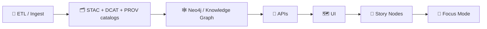

# 🛡️ `data_gov` Policy Pack (Rego) — Data Governance for KFM + MCP Dev Provenance


📍 **You are here:** `mcp/dev_prov/policies/rego/data_gov/README.md`

> [!IMPORTANT]
> **KFM is evidence‑first.** If a dataset, layer, Story Node, export, or AI answer can’t point to its **sources** (STAC/DCAT/PROV + citations), it **doesn’t ship** ✅  
> This folder is where we encode those invariants as **Policy‑as‑Code** (OPA/Rego) so CI, pipelines, APIs, and UI all enforce the *same truth*.

---

<details>
<summary>🧭 Table of Contents</summary>

- [✨ What lives in this folder](#-what-lives-in-this-folder)
- [🧱 KFM governance principles (non‑negotiables)](#-kfm-governance-principles-nonnegotiables)
- [🔌 Where policies run](#-where-policies-run)
- [🧾 Policy decision contract](#-policy-decision-contract)
- [🧠 Input model](#-input-model)
- [🗂️ Policy index & stable IDs](#-policy-index--stable-ids)
- [🧬 Core rule set (v13 baseline)](#-core-rule-set-v13-baseline)
- [🔐 Classification, sovereignty, and privacy](#-classification-sovereignty-and-privacy)
- [🧰 Common obligations (redaction / generalization)](#-common-obligations-redaction--generalization)
- [🧪 Running & testing locally](#-running--testing-locally)
- [🧯 Waivers (time‑bound exceptions)](#-waivers-timebound-exceptions)
- [📦 Bundling & distribution](#-bundling--distribution)
- [🧬 MCP dev provenance alignment](#-mcp-dev-provenance-alignment)
- [📚 Reference library](#-reference-library)
</details>

---

## ✨ What lives in this folder

This is the **Data Governance** policy pack for Kansas Frontier Matrix (KFM) and the MCP “dev provenance” workflows.

It is responsible for enforcing (at minimum):

- 🧾 **Evidence Triplet** requirements (STAC + DCAT + PROV) before anything is published/served/used.
- 🔐 **Classification propagation**: outputs can’t be less restrictive than inputs.
- 🧠 **Focus Mode governance checks**: AI outputs must be traceable (citations) and policy compliant.
- 🧬 **Provenance‑first publishing** across batch + streaming ingestion.
- 🧰 **Export governance**: licensing/attribution + redaction/generalization obligations.
- 🧯 **Fail‑closed CI gating** (Conftest) to stop regressions and prevent “mystery layers”.

### 📁 Suggested layout (recommended)
```text
📁 mcp/
  📁 dev_prov/
    📁 policies/
      📁 rego/
        📁 data_gov/
          📄 README.md  👈 you are here
          📁 modules/
            📄 catalogs.rego
            📄 provenance.rego
            📄 sovereignty.rego
            📄 api_boundary.rego
            📄 story.rego
            📄 security.rego
            📄 export.rego
            📄 utils.rego
          📁 tests/
            📄 catalogs_test.rego
            📄 provenance_test.rego
            📄 sovereignty_test.rego
            📄 story_test.rego
          📁 fixtures/
            📄 input_ingest_ok.json
            📄 input_ingest_missing_prov.json
            📄 input_story_missing_citations.json
            📄 input_export_sensitive_denied.json
          📄 waivers.yml  (optional)
```

> [!NOTE]
> If your repo already has a “Policy Pack” elsewhere (e.g., `tools/validation/policy/`), consider **treating this folder as the canonical bundle source** and importing it (or symlinking) to avoid drift.

---

## 🧱 KFM governance principles (non‑negotiables)

These principles are repeated across the KFM architecture, data intake design, UI trust model, and future roadmap. This policy pack is how we make them **enforceable**.

### ✅ Evidence-first pipeline ordering
The core pipeline is intentionally **ordered** and **non‑skippable**:



**Policy intent:** nobody (human or automation) can “jump stages” to publish data without catalogs + provenance.

### ✅ Fail closed (no silent bypass)
- If a required artifact is missing → **deny**.
- If provenance links break → **deny**.
- If classification is absent/invalid → **deny**.
- If secrets/sensitive leaks are detected → **deny**.

### ✅ “No output less restrictive than its inputs”
If a dataset or layer is `restricted/sensitive`, any derived output must be at least as restrictive **unless** it is explicitly **redacted/generalized** with an obligation record.

### ✅ UI truthfulness (“Map Behind the Map”)
UI features that build trust (e.g., “Layer Provenance”, citations in Focus Mode, warnings/locks for restricted layers) should be driven by **the same policy decision** returned by OPA.

---

## 🔌 Where policies run

| Enforcement point | Tooling | Typical decisions |
|---|---|---|
| ✅ PR / CI gate | **Conftest** (`deny[]`, `warn[]`) | Missing STAC/DCAT/PROV, broken links, secrets, invalid contracts |
| 🧪 Pipeline runs (ETL / Watcher–Planner–Executor) | OPA (bundle) | Require run manifest + hashes, provenance stub for streaming updates |
| 🔌 API runtime (FastAPI / GraphQL) | OPA sidecar / library | Allow/deny read/export based on actor, license, classification |
| 🗺️ UI actions (export/share/publish) | API calls to policy endpoint | Click‑throughs, redaction obligations, max zoom limits |
| 🧠 Focus Mode “Governance Check” | Policy decision + citations validator | Require citations, forbid uncited claims, label AI output |

---

## 🧾 Policy decision contract

We support **two entrypoint styles**, because CI and runtime have different needs:

### 1) ✅ Conftest-compatible (`deny[]`, `warn[]`)
Conftest expects something like:

```rego
package kfm.data_gov

deny[msg] {
  missing_license
  msg := "KFM-LIC-001 ❌ dataset missing license"
}

warn[msg] {
  input.dataset.sensitivity == "internal"
  msg := "KFM-SOV-010 ⚠️ internal dataset — verify intended audience"
}
```

### 2) 🔌 Runtime decision object (`decision`)
For APIs / pipelines, we prefer a structured decision:

```rego
package kfm.data_gov

default decision := {
  "allow": false,
  "deny": [],
  "warn": [],
  "obligations": [],
  "labels": {},
  "audit": {}
}

decision := out {
  # ... compute allow/deny/obligations ...
  out := {
    "allow": allow,
    "deny": deny_reasons,
    "warn": warn_reasons,
    "obligations": obligations,
    "labels": labels,
    "audit": audit_blob,
  }
}
```

**Recommended minimum fields:**
- `allow: bool`
- `deny: [{id, msg, path?, severity?}]`
- `obligations: [{type, params...}]`
- `labels: {classification, care, license...}`
- `audit: {run_id?, actor_id?, resource_id?, timestamp?}`

---

## 🧠 Input model

Policy decisions become dramatically easier (and reusable) if the input shape is consistent across CI, pipelines, and APIs.

### ✅ Recommended `input` envelope
```json
{
  "kind": "ingest|export|publish_story|focus_answer|api_request|pr_check",
  "actor": {
    "id": "user:alice",
    "roles": ["researcher"],
    "org": "kfm",
    "is_bot": false
  },
  "action": "read|write|publish|export|serve|index",
  "resource": {
    "type": "dataset|layer|story_node|answer|run_manifest",
    "id": "dataset:usgs_water_quality_2024",
    "paths": ["data/stac/usgs_water_quality_2024.json"]
  },
  "dataset": {
    "license": "CC-BY-4.0",
    "sensitivity": "public|internal|restricted|sensitive",
    "care": {
      "indigenous_data": false,
      "authority_to_control": null
    },
    "spatial": {
      "crs": "EPSG:4326",
      "bbox": [-102.05, 36.99, -94.59, 40.00]
    },
    "provenance": {
      "prov_refs": ["data/prov/run_2026_01_22.jsonld"],
      "stac_refs": ["data/stac/items/...json"],
      "dcat_refs": ["data/catalogs/...ttl"]
    }
  },
  "story": {
    "citations": [
      {"ref": "stac:item:abc123", "quote": "…", "url": null}
    ],
    "ai_generated": false
  },
  "run_manifest": {
    "run_id": "run_2026_01_22_001",
    "canonical_sha256": "…",
    "inputs": ["..."],
    "outputs": ["..."],
    "git": {"commit": "…"}
  },
  "context": {
    "purpose": "research|education|public_release",
    "time": "2026-01-22T00:00:00Z"
  }
}
```

> [!TIP]
> Keep `dataset.sensitivity`, `dataset.license`, and `dataset.provenance.*` present even if null—policies can then fail closed with precise messages.

---

## 🗂️ Policy index & stable IDs

Every rule should have:
- ✅ a **stable ID** (so waivers and audits are precise),
- ✅ a **short message** for humans,
- ✅ and ideally a **fix hint**.

### 🧾 ID format
`KFM-<CATEGORY>-<NNN>`

### 📚 Categories (baseline)
| Category | Prefix | Example |
|---|---|---|
| Catalog integrity | `KFM-CAT-###` | STAC/DCAT required, broken links |
| Provenance | `KFM-PROV-###` | provenance-first, run manifest required |
| Sovereignty / classification | `KFM-SOV-###` | sensitivity propagation, CARE flags |
| API boundary | `KFM-API-###` | UI must not bypass API |
| Story / narrative evidence | `KFM-STORY-###` | citations required, AI labeling |
| Security | `KFM-SEC-###` | secrets scanning, signature requirements |
| Style / hygiene | `KFM-STYLE-###` | consistent schemas/paths conventions |

> [!NOTE]
> If you add a new category, document it here and keep the prefix stable.

---

## 🧬 Core rule set (v13 baseline)

These are the “system invariants” repeatedly emphasized in KFM documentation and roadmap.

### 1) 🧪 Pipeline Ordering Rule (ETL → catalogs → graph → APIs → UI → Story → Focus)
**Policy intent:** prevent “mystery layers” and ensure anything visible has provenance.

✅ Enforce:
- “graph publish” requires STAC/DCAT/PROV artifacts exist and cross‑link.
- “serve layer” requires catalog references resolve.

### 2) 🔌 API Boundary Rule (UI must not bypass governance)
**Policy intent:** the UI only sees what the API authorizes.

✅ Enforce:
- requests that claim `context.channel == "ui"` must go through approved API routes
- exports must always call policy decision first

### 3) 🧬 Provenance‑First Publishing Rule (including streaming)
**Policy intent:** even real‑time updates must produce at least a provenance stub.

✅ Enforce:
- streaming ingestion (e.g., GTFS‑RT / sensors) must include source + retrieval metadata, plus immutable event IDs.

### 4) 🧾 Evidence for Narratives Rule (Story Nodes + Focus Mode)
**Policy intent:** narrative claims must be grounded.

✅ Enforce:
- Story Nodes must include citations to STAC/PROV/DCAT items
- AI‑generated text must be labeled and must carry citations

### 5) 🔐 Sovereignty / Classification Rule (“no output less restrictive than inputs”)
**Policy intent:** protect sensitive locations and culturally restricted information.

✅ Enforce:
- derived outputs inherit max(sensitivity of inputs)
- coordinate precision limits / zoom caps / blurring obligations for sensitive sites
- explicit CARE governance flags can require review gates

### 6) ✅ Mandatory CI Checks Rule (fail closed)
**Policy intent:** missing provenance or secrets never merge.

✅ Enforce:
- missing PROV or broken catalog references → fail PR
- secrets and sensitive leaks → fail PR
- deterministic artifacts and pinned dependencies (where applicable) → fail PR

---

## 🔐 Classification, sovereignty, and privacy

### 🧷 Sensitivity levels (recommended)
| Level | Meaning | UI behavior (examples) |
|---|---|---|
| `public` | safe to publish | visible by default |
| `internal` | project/community only | warning banner + limited sharing |
| `restricted` | gated access | 🔒 lock icon, role‑based access |
| `sensitive` | high risk | deny export by default; allow only with obligations |

### 🪶 CARE flags (Indigenous data sovereignty)
If `dataset.care.indigenous_data == true`, policies may require:
- 🧑‍⚖️ human review before publication
- 🔐 restricted roles to view/export
- 🧾 explicit authority-to-control metadata

### 🧠 Privacy / inference controls (optional-but-ready)
Certain datasets (e.g., fine‑grained people, endangered species, sensitive archaeology) can be governed with:
- aggregation requirements (no row‑level export)
- k‑anonymity / l‑diversity / t‑closeness style thresholds (when you have stats)
- differential privacy budgeting (advanced)

> [!NOTE]
> Rego can enforce *presence of required privacy metadata + required transformations*, while the actual transformation happens in ETL.

---

## 🧰 Common obligations (redaction / generalization)

Obligations are how policy says: “allowed, but only if you do X.”

### ✅ Examples
- 🧭 `round_coordinates` → reduce precision (e.g., 2 decimals)
- 🟦 `hexbin_generalize` → aggregate points into hex cells
- 🧊 `max_zoom` → cap zoom for a sensitive layer
- 🧼 `mask_fields` → remove sensitive columns on export
- 🧾 `embed_attribution` → add license/credit overlay
- 📝 `require_clickthrough` → user acknowledges restrictions
- 🧑‍⚖️ `require_human_review` → must be approved by reviewer role
- 🧾 `attach_provenance_panel` → UI must show provenance card

### 📌 Example decision snippet
```json
{
  "allow": true,
  "deny": [],
  "warn": ["KFM-SOV-021 ⚠️ sensitive coordinates detected — applying obligations"],
  "obligations": [
    {"type": "round_coordinates", "precision": 2},
    {"type": "max_zoom", "value": 10},
    {"type": "embed_attribution"}
  ],
  "labels": {
    "classification": "restricted",
    "care": {"indigenous_data": false}
  }
}
```

---

## 🧪 Running & testing locally

### ✅ OPA unit tests
```bash
# from mcp/dev_prov/policies/rego/data_gov
opa test . -v
opa test . --coverage
```

### ✅ Evaluate a single decision
```bash
opa eval \
  -d . \
  -i fixtures/input_ingest_ok.json \
  "data.kfm.data_gov.decision"
```

### ✅ Conftest (PR-style checks)
```bash
conftest test \
  --all-namespaces \
  -p . \
  fixtures/
```

> [!TIP]
> Use fixtures that represent real PRs / pipeline runs / API requests. Governance gets strong when tests mirror reality.

---

## 🧯 Waivers (time‑bound exceptions)

Sometimes you need a temporary exception (e.g., legacy dataset missing metadata). That exception must be:
- explicit,
- time‑boxed,
- and reviewable.

### ✅ Suggested `waivers.yml`
```yaml
waivers:
  - id: KFM-PROV-001
    paths:
      - "data/stac/legacy/**"
    reason: "Legacy import pending provenance backfill"
    expires_on: "2026-03-01"
    approved_by: "maintainer:@you"
```

**Policy guidance:**
- Waivers should only bypass *the specific rule* and only for the specified paths/resources.
- Expired waivers should fail closed.

---

## 📦 Bundling & distribution

If you run OPA as a service/sidecar, ship this folder as a bundle:

```bash
opa build -b . -o data_gov.bundle.tar.gz
```

Recommended:
- ✅ store bundle artifact in CI
- ✅ sign bundle (supply chain integrity)
- ✅ include bundle digest in run manifests / audit logs

---

## 🧬 MCP dev provenance alignment

In KFM’s “dev provenance” vision, development events (PRs, merges, CI runs) are treated like **PROV Activities** with Agents and Entities—so the **code history itself** becomes queryable provenance.

This policy pack should therefore also enforce invariants like:
- PR/merge provenance JSON‑LD exists for protected merges
- run manifests contain:
  - immutable IDs,
  - canonical digests,
  - input/output listings,
  - git commit references
- “Watcher–Planner–Executor” agents:
  - never auto‑merge,
  - always open PRs through standard governance,
  - have kill‑switch support

> [!IMPORTANT]
> Treat **code + data + model outputs** with the same governance rigor. “Reproducible research” is a policy outcome, not a vibe. 🧪✅

---

## 📚 Reference library

These documents informed the design of this policy pack (evidence-first, governance, UI trust, AI governance checks, and future supply-chain/provenance hardening):

### 🧭 Core KFM design & architecture
- 📘 *Kansas Frontier Matrix (KFM) – Comprehensive Architecture, Features, and Design*
- 📗 *Kansas Frontier Matrix (KFM) – Comprehensive Technical Documentation*
- 🧭🤖 *KFM – AI System Overview* (Focus Mode + governance checks)
- 🧩 *KFM – Comprehensive UI System Overview* (trust-by-design UI patterns)
- 📥 *KFM Data Intake – Technical & Design Guide* (contracts + evidence triplet + policy pack rules)

### 💡 Future proposals & hardening ideas
- 🌟 *Latest Ideas & Future Proposals* (PROV integration for devops, Policy Pack, agent architecture)
- 🚀 *Innovative Concepts to Evolve KFM* (governance cards, compliance automation, better enforcement)
- 🧠 *Additional Project Ideas* (run manifests, canonical hashing, signing, fail-closed CI)

### 📚 Embedded reference libraries (portfolios)
- 🤖 *AI Concepts & more* (AI safety, application patterns)
- 🗺️ *Maps / Geospatial / WebGL library* (geospatial correctness, rendering constraints)
- 🧑‍💻 *Programming languages & resources* (CI/CD + security tooling patterns)
- 🗃️ *Data Management theories & architectures* (privacy/inference control concepts)

---

### ✅ “Definition of Done” checklist (for contributors)

Before merging a change that affects data, catalogs, stories, exports, or AI behavior:

- [ ] STAC/DCAT/PROV artifacts exist and cross-link correctly 🧾
- [ ] License and attribution are present 🏷️
- [ ] Sensitivity classification is correct and propagated 🔐
- [ ] Any redaction/generalization is explicit (obligations) 🧰
- [ ] Story Nodes / Focus Mode outputs have citations 📖
- [ ] `opa test` + `conftest test` pass ✅
- [ ] If an exception is needed, a time‑boxed waiver exists 🧯

---

🧭 **Next:** implement modules + tests so this README becomes executable governance.
