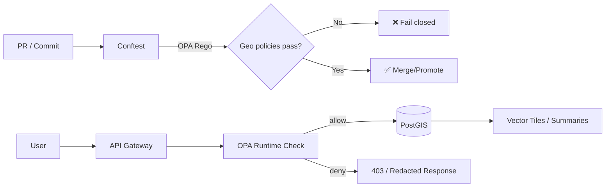

<!-- mcp/dev_prov/policies/rego/geo/README.md -->

# 🗺️ Geo Policy Pack (Rego) — MCP / Dev-Provenance


> **Fail-closed, evidence-first, sensitivity-aware geospatial governance** for Kansas Frontier Matrix (KFM):  
> **CI gates (Conftest)** + **runtime authorization (OPA)** for tiles, exports, and queries.  [oai_citation:0‡Kansas Frontier Matrix (KFM) – AI System Overview 🧭🤖.pdf](file-service://file-Pv8eev6RWvCKrGCXyzY7zg) [oai_citation:1‡Kansas Frontier Matrix (KFM) – AI System Overview 🧭🤖.pdf](file-service://file-Pv8eev6RWvCKrGCXyzY7zg) [oai_citation:2‡Kansas Frontier Matrix (KFM) – Comprehensive Architecture, Features, and Design.pdf](file-service://file-4Umt1yHoGKicdmLWzFJ9sC)

---

## 📌 What this folder is

This directory (`mcp/dev_prov/policies/rego/geo/`) contains the **geospatial** slice of the KFM policy ecosystem:

- ✅ **CI policy gates** (Conftest + OPA/Rego) that block non-compliant geo artifacts from merging (schema, CRS, sensitivity tags, etc.).  [oai_citation:3‡Kansas Frontier Matrix (KFM) – AI System Overview 🧭🤖.pdf](file-service://file-Pv8eev6RWvCKrGCXyzY7zg) [oai_citation:4‡Kansas Frontier Matrix (KFM) – Comprehensive Architecture, Features, and Design.pdf](file-service://file-4Umt1yHoGKicdmLWzFJ9sC)
- 🔐 **Runtime authorization** rules (OPA) used by the API layer to **allow/deny** access to sensitive datasets, tiles, and exports without redeploying the whole system.  [oai_citation:5‡Kansas Frontier Matrix (KFM) – AI System Overview 🧭🤖.pdf](file-service://file-Pv8eev6RWvCKrGCXyzY7zg)
- 🧾 **Provenance-friendly controls** that keep geo data auditable (aligned with STAC/DCAT/PROV “evidence triplet” and dev provenance patterns).  [oai_citation:6‡📚 Kansas Frontier Matrix (KFM) Data Intake – Technical & Design Guide.pdf](file-service://file-EbUCdsJMbu5KwpoKMrLrgj) [oai_citation:7‡Kansas Frontier Matrix (KFM) – AI System Overview 🧭🤖.pdf](file-service://file-Pv8eev6RWvCKrGCXyzY7zg)

---

## 🎯 Why this exists

KFM intentionally mixes **open public data** with potentially **sensitive spatial data** (e.g., archaeological sites, endangered species locations, culturally sensitive / sovereignty-governed content). The design calls for:

- **Location generalization** (fuzz/coarsen coordinates; show as larger polygons/hexes to reduce risk like looting).  [oai_citation:8‡Kansas Frontier Matrix (KFM) – Comprehensive Technical Documentation.pdf](file-service://file-AkqwUuYPp5zePf7pv5SMxi)
- **Access control** for restricted layers (hide from public; require login/role; warn/acknowledge before viewing).  [oai_citation:9‡Kansas Frontier Matrix (KFM) – Comprehensive Technical Documentation.pdf](file-service://file-AkqwUuYPp5zePf7pv5SMxi) [oai_citation:10‡Kansas Frontier Matrix (KFM) – Comprehensive Architecture, Features, and Design.pdf](file-service://file-4Umt1yHoGKicdmLWzFJ9sC)
- **Sensitivity classification as first-class metadata**, enforced via automated policy gates (“fail closed”).  [oai_citation:11‡Kansas Frontier Matrix (KFM) – Comprehensive Architecture, Features, and Design.pdf](file-service://file-4Umt1yHoGKicdmLWzFJ9sC) [oai_citation:12‡Kansas Frontier Matrix (KFM) – Comprehensive Architecture, Features, and Design.pdf](file-service://file-4Umt1yHoGKicdmLWzFJ9sC)
- **FAIR + CARE safeguards** (including Indigenous data sovereignty and “don’t expose sacred locations”).  [oai_citation:13‡🌟 Kansas Frontier Matrix – Latest Ideas & Future Proposals.docx.pdf](file-service://file-SQ3f7ve8SGiusT6ThZEuCe) [oai_citation:14‡Kansas Frontier Matrix (KFM) – Comprehensive Technical Documentation.pdf](file-service://file-AkqwUuYPp5zePf7pv5SMxi)

This policy pack is the **mechanism** that turns those design principles into **enforced behavior**.

---

## 🧠 Design principles

> [!IMPORTANT]
> **Fail-closed by default.** If the policy cannot determine compliance, the answer is **deny**.  
> This is explicitly described as a KFM governance stance.  [oai_citation:15‡Additional Project Ideas.pdf](file-service://file-Pc2GNivcrHBeKjBQksLC3T) [oai_citation:16‡📚 Kansas Frontier Matrix (KFM) Data Intake – Technical & Design Guide.pdf](file-service://file-EbUCdsJMbu5KwpoKMrLrgj)

Core principles:

- **Evidence-first publishing 🧾**  
  Data isn’t “official” until the STAC/DCAT/PROV metadata exists (version-controlled and auditable).  [oai_citation:17‡📚 Kansas Frontier Matrix (KFM) Data Intake – Technical & Design Guide.pdf](file-service://file-EbUCdsJMbu5KwpoKMrLrgj)
- **No mystery geo 🕵️‍♂️🚫**  
  “Nothing goes into the graph without a corresponding provenance record or catalog entry.”  [oai_citation:18‡📚 Kansas Frontier Matrix (KFM) Data Intake – Technical & Design Guide.pdf](file-service://file-EbUCdsJMbu5KwpoKMrLrgj)
- **Sensitivity-aware spatial outputs 🧊**  
  Sensitive coordinates are generalized/obfuscated and/or access-restricted.  [oai_citation:19‡Kansas Frontier Matrix (KFM) – Comprehensive Technical Documentation.pdf](file-service://file-AkqwUuYPp5zePf7pv5SMxi) [oai_citation:20‡Kansas Frontier Matrix (KFM) – Comprehensive Architecture, Features, and Design.pdf](file-service://file-4Umt1yHoGKicdmLWzFJ9sC)
- **“No output less restricted than inputs” 🔒**  
  Transformations must carry forward the **most restrictive** classification (no downgrades).  [oai_citation:21‡📚 Kansas Frontier Matrix (KFM) Data Intake – Technical & Design Guide.pdf](file-service://file-EbUCdsJMbu5KwpoKMrLrgj) [oai_citation:22‡📚 Kansas Frontier Matrix (KFM) Data Intake – Technical & Design Guide.pdf](file-service://file-EbUCdsJMbu5KwpoKMrLrgj)
- **Map behind the map 🧭**  
  The UI should surface provenance, sources, and context for what users see.  [oai_citation:23‡Kansas Frontier Matrix – Comprehensive UI System Overview.pdf](file-service://file-KcBQruYcoFVDEixzzRHTwt) [oai_citation:24‡Kansas Frontier Matrix – Comprehensive UI System Overview.pdf](file-service://file-KcBQruYcoFVDEixzzRHTwt)

---

## 🧩 Where these policies run

### 1) CI gates (Conftest + OPA)

Conftest runs Rego policies against changed artifacts in PRs (metadata JSON, configs, etc.). If a deny rule triggers, CI fails and the change doesn’t merge.  [oai_citation:25‡Kansas Frontier Matrix (KFM) – AI System Overview 🧭🤖.pdf](file-service://file-Pv8eev6RWvCKrGCXyzY7zg)

KFM describes a **Detect → Validate → Promote** pipeline with validation that can include **spatial data quality checks** (e.g., verifying CRS and coordinate ranges).  [oai_citation:26‡Kansas Frontier Matrix (KFM) – AI System Overview 🧭🤖.pdf](file-service://file-Pv8eev6RWvCKrGCXyzY7zg)

### 2) Runtime authorization (OPA)

At runtime, the API can call OPA for decisions like “is this user allowed to access this sensitive dataset?” and block/allow accordingly. Policies can be updated without redeploying the entire system.  [oai_citation:27‡Kansas Frontier Matrix (KFM) – AI System Overview 🧭🤖.pdf](file-service://file-Pv8eev6RWvCKrGCXyzY7zg)

---

## 🧾 Inputs this pack expects

### CI inputs (repo artifacts)
Typical inputs include:

- **STAC Items / Collections** (spatial assets)
- **DCAT Dataset metadata**
- **PROV records**
- **Geo layer configs** (tile settings, max zoom, export rules)
- **Narratives** (Story Nodes, Pulse Threads) when they are geotagged or reference layers

KFM’s “evidence triplet” expectation is DCAT + STAC + PROV for published data.  [oai_citation:28‡📚 Kansas Frontier Matrix (KFM) Data Intake – Technical & Design Guide.pdf](file-service://file-EbUCdsJMbu5KwpoKMrLrgj)

### Runtime inputs (request context)
Runtime policy input should include (at minimum):

- `subject`: who is requesting (roles, org, auth status)
- `action`: what they want (tile.read, export.raw, query.aggregate, etc.)
- `resource`: dataset/layer metadata (sensitivity, license, CRS, etc.)
- `context`: geo-specific request context (zoom level, bbox, region id, etc.)

Example shape:

```json
{
  "subject": {
    "id": "user_123",
    "roles": ["public"],
    "authenticated": false
  },
  "action": "tile.read",
  "resource": {
    "dataset_id": "kfm.layer.endangered_species",
    "sensitivity": {
      "classification": "sensitive",
      "care_labels": ["culturally_sensitive"]
    },
    "tile_policy": {
      "public_max_zoom": 8,
      "requires_obfuscation": true,
      "obfuscation_method": "round_km",
      "obfuscation_param": 10
    }
  },
  "context": {
    "z": 12,
    "x": 656,
    "y": 1583,
    "bbox_wgs84": [-98.7, 37.4, -98.6, 37.5]
  }
}
```

---

## 🧭 Policy index

> [!NOTE]
> KFM’s policy system favors **stable IDs** (e.g., `KFM-CAT-001`, `KFM-PROV-001`) and time-bound waivers.  
> This geo pack follows the same style with `KFM-GEO-###`.  [oai_citation:29‡📚 Kansas Frontier Matrix (KFM) Data Intake – Technical & Design Guide.pdf](file-service://file-EbUCdsJMbu5KwpoKMrLrgj)

| ID | Rule | Enforced in | Typical outcome |
|---:|---|---|---|
| **KFM-GEO-001** | CRS must be declared & valid (and geometries in acceptable ranges) | CI | ❌ Block merge if missing/invalid CRS |
| **KFM-GEO-002** | Sensitivity classification required on geo datasets | CI | ❌ Block merge if classification missing |
| **KFM-GEO-003** | No sensitivity downgrade: outputs must be ≥ most restrictive input | CI + Runtime | ❌ Block merge / deny publish |
| **KFM-GEO-004** | Sensitive-location obfuscation required for public exposure | CI + Runtime | ❌ Deny high-precision views |
| **KFM-GEO-005** | Tile & zoom gating based on sensitivity (`public_max_zoom`) | Runtime | ❌ Deny tile requests above allowed zoom |
| **KFM-GEO-006** | Export controls: raw export denied unless authorized | Runtime | ❌ Deny export or force aggregate-only |
| **KFM-GEO-007** | Evidence-first geo: STAC/DCAT/PROV linkages required | CI | ❌ Block merge if catalog/prov missing |
| **KFM-GEO-008** | Aggregate safety: k-threshold / inference-control guardrails | Runtime | ❌ Deny small-count queries / throttle |
| **KFM-GEO-009** | Narrative geotagging safety (Story Nodes / Pulse Threads) | CI + Runtime | ❌ Deny publish if narrative leaks coordinates |
| **KFM-GEO-010** | “Sensitive areas list” triggers review/escalation requirements | CI + Runtime | ⚠️ Require approval/role to proceed |

### Where these behaviors come from (design anchors)

- **Sensitivity & classification gating** is explicitly part of KFM governance and policy gates.  [oai_citation:30‡Kansas Frontier Matrix (KFM) – Comprehensive Architecture, Features, and Design.pdf](file-service://file-4Umt1yHoGKicdmLWzFJ9sC) [oai_citation:31‡Kansas Frontier Matrix (KFM) – Comprehensive Architecture, Features, and Design.pdf](file-service://file-4Umt1yHoGKicdmLWzFJ9sC)
- **Sensitive locations should be generalized** (e.g., hexagon area rather than exact point).  [oai_citation:32‡Kansas Frontier Matrix (KFM) – Comprehensive Technical Documentation.pdf](file-service://file-AkqwUuYPp5zePf7pv5SMxi)
- **Sensitive areas lists** (tribal lands, endangered species locations) can trigger review / hiding rules.  [oai_citation:33‡🌟 Kansas Frontier Matrix – Latest Ideas & Future Proposals.docx.pdf](file-service://file-SQ3f7ve8SGiusT6ThZEuCe)
- **Community-driven cultural protocols** (Mukurtu-style fine-grained access) and **10 km rounding** for sensitive biodiversity records are cited as effective patterns.  [oai_citation:34‡Innovative Concepts to Evolve the Kansas Frontier Matrix (KFM).pdf](file-service://file-G71zNoWKxsoSW44iwZaaCC)

---

## 🗺️ Geo enforcement points in the KFM stack

KFM’s geo stack has a few “natural chokepoints” for OPA decisions:

1) **Ingestion → Cataloging**  
   The “evidence triplet” (DCAT + STAC + PROV) is required and becomes auditable.  [oai_citation:35‡📚 Kansas Frontier Matrix (KFM) Data Intake – Technical & Design Guide.pdf](file-service://file-EbUCdsJMbu5KwpoKMrLrgj)

2) **Catalogs → Knowledge Graph**  
   No “mystery nodes”; sensitive attributes are not ingested or are flagged for query-time enforcement.  [oai_citation:36‡📚 Kansas Frontier Matrix (KFM) Data Intake – Technical & Design Guide.pdf](file-service://file-EbUCdsJMbu5KwpoKMrLrgj)

3) **API layer** (the enforcement gate)  
   The UI is not supposed to bypass the API for direct DB access; authz belongs here.  [oai_citation:37‡📚 Kansas Frontier Matrix (KFM) Data Intake – Technical & Design Guide.pdf](file-service://file-EbUCdsJMbu5KwpoKMrLrgj)

4) **Tiles & summaries** (PostGIS-backed)  
   PostGIS serves tiles (e.g., ST_AsMVT) and summaries; the UI requests tiles by Z/X/Y.  [oai_citation:38‡📚 Kansas Frontier Matrix (KFM) Data Intake – Technical & Design Guide.pdf](file-service://file-EbUCdsJMbu5KwpoKMrLrgj)

---

## 🧱 Recommended folder layout (📁)

```text
📁 mcp/dev_prov/policies/rego/geo/
├─ 📄 README.md
├─ 🧩 geo.rego                 # package entrypoints (deny[] + allow)
├─ 🔐 sensitivity.rego         # classification propagation + CARE labels
├─ 🧊 obfuscation.rego         # hexbin / rounding / generalization rules
├─ 🧱 geometry_quality.rego     # CRS + bbox + geometry sanity checks
├─ 🧩 tiles.rego               # zoom gating + tile/export policy
├─ 🕵️ inference_control.rego    # k-threshold / query auditing hooks
├─ 📁 data/
│  ├─ 🗺️ sensitive_areas.geojson
│  ├─ 🏷️ care_labels.json
│  └─ 🧱 classification_order.json
└─ 📁 tests/
   ├─ ✅ geo_test.rego
   └─ 📁 fixtures/
      ├─ 🧾 stac_item_public.json
      ├─ 🔐 stac_item_sensitive.json
      └─ 🗺️ tile_request_z12.json
```

---

## 🧪 Running locally

### CI simulation (Conftest)

```bash
# Example: run the geo policies against metadata changes
conftest test \
  --policy mcp/dev_prov/policies/rego \
  --namespace geo \
  data/stac/**/*.json data/catalogs/**/*.json data/prov/**/*.json
```

### Unit tests (OPA)

```bash
opa test -v mcp/dev_prov/policies/rego/geo
```

---

## 🧷 “Fail closed” in Rego (pattern)

KFM’s governance philosophy is to reject changes when required checks can’t be performed or metadata is missing.  [oai_citation:39‡Additional Project Ideas.pdf](file-service://file-Pc2GNivcrHBeKjBQksLC3T) [oai_citation:40‡📚 Kansas Frontier Matrix (KFM) Data Intake – Technical & Design Guide.pdf](file-service://file-EbUCdsJMbu5KwpoKMrLrgj)

Minimal runtime entrypoint pattern:

```rego
package kfm.geo

default allow := false

# allow when there are no deny reasons
allow {
  count(deny) == 0
}
```

CI deny pattern:

```rego
deny[msg] {
  # ... rule conditions ...
  msg := sprintf("KFM-GEO-XXX: %v", [reason])
}
```

---

## 🔐 Sensitivity & obfuscation: what “compliant” looks like

### ✅ Compliant (public safe)
- Dataset classification is `public`.
- CRS is declared and valid (example policy anchor: “All geometries must have CRS defined”).  [oai_citation:41‡Kansas Frontier Matrix (KFM) – AI System Overview 🧭🤖.pdf](file-service://file-Pv8eev6RWvCKrGCXyzY7zg)
- Tiles can be served normally.

### ✅ Compliant (sensitive)
- Dataset classification is `sensitive` / `confidential`.
- Public views are generalized (e.g., hex area / coarse region) rather than exact points.  [oai_citation:42‡Kansas Frontier Matrix (KFM) – Comprehensive Technical Documentation.pdf](file-service://file-AkqwUuYPp5zePf7pv5SMxi)
- Tile policy restricts public zoom, export is denied for public users, and UI uses warnings/acknowledgements where appropriate.  [oai_citation:43‡Kansas Frontier Matrix (KFM) – Comprehensive Architecture, Features, and Design.pdf](file-service://file-4Umt1yHoGKicdmLWzFJ9sC)

### ❌ Non-compliant (examples)
- Sensitive dataset exposed at high zoom to public users (no obfuscation).
- Output classification downgraded to `public` while input is `confidential`.  [oai_citation:44‡📚 Kansas Frontier Matrix (KFM) Data Intake – Technical & Design Guide.pdf](file-service://file-EbUCdsJMbu5KwpoKMrLrgj)
- Narrative content (Story/Pulse) includes precise coordinates for sacred sites without permission/approval.  [oai_citation:45‡🌟 Kansas Frontier Matrix – Latest Ideas & Future Proposals.docx.pdf](file-service://file-SQ3f7ve8SGiusT6ThZEuCe)

---

## 🧠 Privacy & inference-control hooks (geo-specific)

> [!TIP]
> Not all privacy protection is about hiding raw data — *aggregates can leak too*.  
> The project docs reference **query auditing / inference control** and differential privacy as patterns.  [oai_citation:46‡Data Mining Concepts & applictions.pdf](file-service://file-2uwEbQAFVKpXaTtWgUirAH) [oai_citation:47‡Data Mining Concepts & applictions.pdf](file-service://file-2uwEbQAFVKpXaTtWgUirAH)

Recommended geo controls to encode (especially for “stats-by-area” endpoints):

- **k-threshold** (k-anonymity inspired): deny aggregates when `count < k`.  [oai_citation:48‡Data Mining Concepts & applictions.pdf](file-service://file-2uwEbQAFVKpXaTtWgUirAH)
- **query auditing**: deny or throttle repeat queries likely to enable inference.  [oai_citation:49‡Data Mining Concepts & applictions.pdf](file-service://file-2uwEbQAFVKpXaTtWgUirAH)
- Optional future: **differential privacy noise** on public aggregates (policy returns an obligation like `noise_epsilon`).  [oai_citation:50‡Data Mining Concepts & applictions.pdf](file-service://file-2uwEbQAFVKpXaTtWgUirAH)

---

## 🗞️ Narrative safety: Story Nodes + Pulse Threads

KFM introduces geotagged, timely narrative content like **Pulse Threads** that link data to places/regions and include evidence manifests.  [oai_citation:51‡Additional Project Ideas.pdf](file-service://file-Pc2GNivcrHBeKjBQksLC3T)

Geo policy implications:

- Pulse Threads must **not leak** sensitive locations.
- If a Pulse Thread references a sensitive layer, it must inherit that sensitivity and require appropriate access/obfuscation.
- Narrative content must include evidence/citations; missing citations is a policy violation.  [oai_citation:52‡📚 Kansas Frontier Matrix (KFM) Data Intake – Technical & Design Guide.pdf](file-service://file-EbUCdsJMbu5KwpoKMrLrgj)

---

## 🧾 Waivers (time-bound exceptions)

> [!WARNING]
> Waivers are allowed **only** with explicit IDs, expiration, and reasoning (no silent bypasses).  [oai_citation:53‡📚 Kansas Frontier Matrix (KFM) Data Intake – Technical & Design Guide.pdf](file-service://file-EbUCdsJMbu5KwpoKMrLrgj)

Suggested waiver format (`waivers.yml`):

```yaml
- id: KFM-GEO-002
  scope:
    paths:
      - data/stac/example_sensitive_dataset.json
  reason: "Upstream provider missing classification; awaiting updated metadata."
  expires_on: "2026-03-01"
  approved_by: "maintainer_handle"
```

---

## 🔒 Security notes (geo stack)

KFM’s intake design explicitly calls out:
- **No secrets** committed (CI should scan and fail on keys).  [oai_citation:54‡📚 Kansas Frontier Matrix (KFM) Data Intake – Technical & Design Guide.pdf](file-service://file-EbUCdsJMbu5KwpoKMrLrgj)
- **Safe DB access** via parameterized queries to reduce injection risk (relevant for geo query endpoints).  [oai_citation:55‡📚 Kansas Frontier Matrix (KFM) Data Intake – Technical & Design Guide.pdf](file-service://file-EbUCdsJMbu5KwpoKMrLrgj)

For dev provenance traceability, the project also proposes:
- **Run manifests** with canonical JSON hashing tied into provenance graphs.  [oai_citation:56‡Additional Project Ideas.pdf](file-service://file-Pc2GNivcrHBeKjBQksLC3T)
- **Supply-chain attestations** (SBOM/SLSA-style) in CI.  [oai_citation:57‡🌟 Kansas Frontier Matrix – Latest Ideas & Future Proposals.docx.pdf](file-service://file-SQ3f7ve8SGiusT6ThZEuCe)

---

## 🧭 Quick architecture diagram (Mermaid)



---

## 🌱 Future-facing extensions (geo policy-ready)

The innovation backlog includes:
- **4D digital twins** and temporal simulation, plus **AR overlays** and guided storyscapes (policy will need “time-slice” and “view mode” concepts).  [oai_citation:58‡Innovative Concepts to Evolve the Kansas Frontier Matrix (KFM).pdf](file-service://file-G71zNoWKxsoSW44iwZaaCC)
- **Natural-language GIS “co-pilots”** (policy must ensure AI-driven spatial queries still obey sensitivity + inference controls).  [oai_citation:59‡Innovative Concepts to Evolve the Kansas Frontier Matrix (KFM).pdf](file-service://file-G71zNoWKxsoSW44iwZaaCC)

---

## 📚 Project reference bundle (all source files)

> These are the project docs used to shape this README/spec. Some are **PDF portfolios** (best opened in Adobe Reader/Acrobat to browse embedded docs).  [oai_citation:60‡Various programming langurages & resources 1.pdf](file-service://file-4wp3wSSZs7gk5qHWaJVudi) [oai_citation:61‡Maps-GoogleMaps-VirtualWorlds-Archaeological-Computer Graphics-Geospatial-webgl.pdf](file-service://file-RshcX5sNY2wpiNjRfoP6z6) [oai_citation:62‡Data Managment-Theories-Architures-Data Science-Baysian Methods-Some Programming Ideas.pdf](file-service://file-RrXMFY7cP925exsQYermf2) [oai_citation:63‡AI Concepts & more.pdf](file-service://file-K6BctJjeUwvyCahLf9qdwr)

### 🧭 Core KFM specs
-  [oai_citation:64‡Kansas Frontier Matrix (KFM) – AI System Overview 🧭🤖.pdf](file-service://file-Pv8eev6RWvCKrGCXyzY7zg) **KFM – AI System Overview** (OPA/Conftest policy pack; runtime enforcement; PROV mapping).  [oai_citation:65‡Kansas Frontier Matrix (KFM) – AI System Overview 🧭🤖.pdf](file-service://file-Pv8eev6RWvCKrGCXyzY7zg) [oai_citation:66‡Kansas Frontier Matrix (KFM) – AI System Overview 🧭🤖.pdf](file-service://file-Pv8eev6RWvCKrGCXyzY7zg)
-  [oai_citation:67‡Kansas Frontier Matrix (KFM) – Comprehensive Architecture, Features, and Design.pdf](file-service://file-4Umt1yHoGKicdmLWzFJ9sC) **KFM – Comprehensive Architecture, Features, and Design** (policy gates, sensitivity, masking/aggregation, fail-closed).  [oai_citation:68‡Kansas Frontier Matrix (KFM) – Comprehensive Architecture, Features, and Design.pdf](file-service://file-4Umt1yHoGKicdmLWzFJ9sC) [oai_citation:69‡Kansas Frontier Matrix (KFM) – Comprehensive Architecture, Features, and Design.pdf](file-service://file-4Umt1yHoGKicdmLWzFJ9sC)
-  [oai_citation:70‡📚 Kansas Frontier Matrix (KFM) Data Intake – Technical & Design Guide.pdf](file-service://file-EbUCdsJMbu5KwpoKMrLrgj) **KFM – Data Intake Guide** (evidence triplet, graph ingestion rules, sovereignty/classification policies).  [oai_citation:71‡📚 Kansas Frontier Matrix (KFM) Data Intake – Technical & Design Guide.pdf](file-service://file-EbUCdsJMbu5KwpoKMrLrgj) [oai_citation:72‡📚 Kansas Frontier Matrix (KFM) Data Intake – Technical & Design Guide.pdf](file-service://file-EbUCdsJMbu5KwpoKMrLrgj)
-  [oai_citation:73‡Kansas Frontier Matrix – Comprehensive UI System Overview.pdf](file-service://file-KcBQruYcoFVDEixzzRHTwt) **KFM – UI System Overview** (“map behind the map” provenance surfacing; API separation).  [oai_citation:74‡Kansas Frontier Matrix – Comprehensive UI System Overview.pdf](file-service://file-KcBQruYcoFVDEixzzRHTwt) [oai_citation:75‡Kansas Frontier Matrix – Comprehensive UI System Overview.pdf](file-service://file-KcBQruYcoFVDEixzzRHTwt)
-  [oai_citation:76‡Kansas Frontier Matrix (KFM) – Comprehensive Technical Documentation.pdf](file-service://file-AkqwUuYPp5zePf7pv5SMxi) **KFM – Comprehensive Technical Documentation** (sensitive location generalization; CARE framing).  [oai_citation:77‡Kansas Frontier Matrix (KFM) – Comprehensive Technical Documentation.pdf](file-service://file-AkqwUuYPp5zePf7pv5SMxi)

### 🌟 Governance + innovation decks
-  [oai_citation:78‡🌟 Kansas Frontier Matrix – Latest Ideas & Future Proposals.docx.pdf](file-service://file-SQ3f7ve8SGiusT6ThZEuCe) **Latest Ideas & Future Proposals** (FAIR/CARE codified; sensitive areas list concept; supply chain attestations).  [oai_citation:79‡🌟 Kansas Frontier Matrix – Latest Ideas & Future Proposals.docx.pdf](file-service://file-SQ3f7ve8SGiusT6ThZEuCe)
-  [oai_citation:80‡Innovative Concepts to Evolve the Kansas Frontier Matrix (KFM).pdf](file-service://file-G71zNoWKxsoSW44iwZaaCC) **Innovative Concepts to Evolve KFM** (Mukurtu-style cultural protocols; sensitive coordinate rounding; AR/digital twins).  [oai_citation:81‡Innovative Concepts to Evolve the Kansas Frontier Matrix (KFM).pdf](file-service://file-G71zNoWKxsoSW44iwZaaCC) [oai_citation:82‡Innovative Concepts to Evolve the Kansas Frontier Matrix (KFM).pdf](file-service://file-G71zNoWKxsoSW44iwZaaCC)
-  [oai_citation:83‡Additional Project Ideas.pdf](file-service://file-Pc2GNivcrHBeKjBQksLC3T) **Additional Project Ideas** (policy-as-code, fail-closed, Pulse Threads, manifests/hashing).  [oai_citation:84‡Additional Project Ideas.pdf](file-service://file-Pc2GNivcrHBeKjBQksLC3T) [oai_citation:85‡Additional Project Ideas.pdf](file-service://file-Pc2GNivcrHBeKjBQksLC3T)

### 🧰 Supporting reference packs (portfolios + embedded docs)
-  [oai_citation:86‡AI Concepts & more.pdf](file-service://file-K6BctJjeUwvyCahLf9qdwr) **AI Concepts & more** (portfolio container).  [oai_citation:87‡AI Concepts & more.pdf](file-service://file-K6BctJjeUwvyCahLf9qdwr)
-  [oai_citation:88‡Maps-GoogleMaps-VirtualWorlds-Archaeological-Computer Graphics-Geospatial-webgl.pdf](file-service://file-RshcX5sNY2wpiNjRfoP6z6) **Maps / Google Maps / Virtual Worlds / WebGL** (portfolio container).  [oai_citation:89‡Maps-GoogleMaps-VirtualWorlds-Archaeological-Computer Graphics-Geospatial-webgl.pdf](file-service://file-RshcX5sNY2wpiNjRfoP6z6)
-  [oai_citation:90‡Data Managment-Theories-Architures-Data Science-Baysian Methods-Some Programming Ideas.pdf](file-service://file-RrXMFY7cP925exsQYermf2) **Data Management / Architectures / Bayesian Methods** (portfolio container).  [oai_citation:91‡Data Managment-Theories-Architures-Data Science-Baysian Methods-Some Programming Ideas.pdf](file-service://file-RrXMFY7cP925exsQYermf2)
-  [oai_citation:92‡Various programming langurages & resources 1.pdf](file-service://file-4wp3wSSZs7gk5qHWaJVudi) **Various programming languages & resources** (portfolio container).  [oai_citation:93‡Various programming langurages & resources 1.pdf](file-service://file-4wp3wSSZs7gk5qHWaJVudi)

### 📘 Extracted/auxiliary docs surfaced via the portfolios
-  [oai_citation:94‡Data Mining Concepts & applictions.pdf](file-service://file-2uwEbQAFVKpXaTtWgUirAH) **Data Mining Concepts & Applications** (k-anonymity, query auditing, differential privacy patterns).  [oai_citation:95‡Data Mining Concepts & applictions.pdf](file-service://file-2uwEbQAFVKpXaTtWgUirAH) [oai_citation:96‡Data Mining Concepts & applictions.pdf](file-service://file-2uwEbQAFVKpXaTtWgUirAH)
-  [oai_citation:97‡KFM- python-geospatial-analysis-cookbook-over-60-recipes-to-work-with-topology-overlays-indoor-routing-and-web-application-analysis-with-python.pdf](file-service://file-2gpiGDZS8iw6EdxGswEdHp) **Python Geospatial Analysis Cookbook** (PostGIS spatial query patterns, GeoJSON export).  [oai_citation:98‡KFM- python-geospatial-analysis-cookbook-over-60-recipes-to-work-with-topology-overlays-indoor-routing-and-web-application-analysis-with-python.pdf](file-service://file-2gpiGDZS8iw6EdxGswEdHp)
-  [oai_citation:99‡Kansas-Frontier-Matrix Design Audit – Gaps and Enhancement Opportunities.pdf](file-service://file-TkRzAfTnxCYDUHauCf1NcH) **Design Audit – Gaps & Enhancement Opportunities** (domain expansion anchors; tribal layers context).  [oai_citation:100‡Kansas-Frontier-Matrix Design Audit – Gaps and Enhancement Opportunities.pdf](file-service://file-TkRzAfTnxCYDUHauCf1NcH)

---

## ✅ Maintainer checklist (geo PRs)

- [ ] New/updated geo dataset includes **STAC + DCAT + PROV** (and links match).  [oai_citation:101‡📚 Kansas Frontier Matrix (KFM) Data Intake – Technical & Design Guide.pdf](file-service://file-EbUCdsJMbu5KwpoKMrLrgj)
- [ ] CRS present and correct; geometry sanity checks pass.  [oai_citation:102‡Kansas Frontier Matrix (KFM) – AI System Overview 🧭🤖.pdf](file-service://file-Pv8eev6RWvCKrGCXyzY7zg)
- [ ] Sensitivity classification present; no downgrades; CARE labels set when relevant.  [oai_citation:103‡Kansas Frontier Matrix (KFM) – Comprehensive Architecture, Features, and Design.pdf](file-service://file-4Umt1yHoGKicdmLWzFJ9sC) [oai_citation:104‡📚 Kansas Frontier Matrix (KFM) Data Intake – Technical & Design Guide.pdf](file-service://file-EbUCdsJMbu5KwpoKMrLrgj)
- [ ] If sensitive: obfuscation + tile gating configured (max zoom, export rules).  [oai_citation:105‡Kansas Frontier Matrix (KFM) – Comprehensive Technical Documentation.pdf](file-service://file-AkqwUuYPp5zePf7pv5SMxi) [oai_citation:106‡Kansas Frontier Matrix (KFM) – Comprehensive Architecture, Features, and Design.pdf](file-service://file-4Umt1yHoGKicdmLWzFJ9sC)
- [ ] Narratives (Story/Pulse) include citations and don’t leak sensitive coordinates.  [oai_citation:107‡📚 Kansas Frontier Matrix (KFM) Data Intake – Technical & Design Guide.pdf](file-service://file-EbUCdsJMbu5KwpoKMrLrgj) [oai_citation:108‡🌟 Kansas Frontier Matrix – Latest Ideas & Future Proposals.docx.pdf](file-service://file-SQ3f7ve8SGiusT6ThZEuCe)

---

> [!ENDGOAL]
> This geo policy pack makes KFM’s geospatial ethics **enforceable**: sensitive places stay protected, public layers remain useful, and everything stays auditable.
