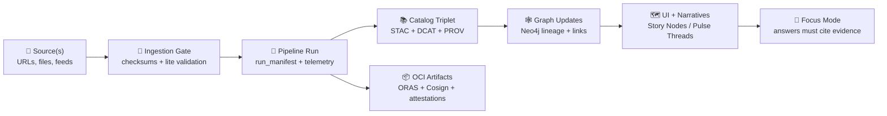

# 🧾 dev_prov Manifest Schemas (MCP)


**Manifests are KFM’s “receipts.”** They make pipelines, policies, content, and AI outputs **auditable**, **reproducible**, and **governable**. 🧾✅

---

## 🚀 What lives here?

This folder contains **JSON Schemas** for **manifest documents** used by:

- 🧪 **Pipelines** (ingestion → transforms → publication)
- 🔐 **Policy gates** (CI + runtime OPA checks)
- 🧠 **AI outputs** (evidence-bound “Focus Mode” answers)
- 🧵 **Narratives** (Story Nodes / Pulse Threads) with evidence manifests
- 📦 **Artifact publishing** (OCI/ORAS/Cosign, content-addressed + signed)

> [!IMPORTANT]
> **Fail-closed by default.** If a manifest doesn’t validate, the change/output should not ship.

---

## 🧭 Context: why dev_prov?

`dev_prov` (development provenance) exists because **KFM treats “data like code” and “code like science.”**  
We don’t just track *what* changed — we track **who/what/when/how** it changed, and we can replay or audit it later.

That means **PRs, CI runs, pipelines, policy decisions, releases, and story edits** all produce structured, schema-validated manifests.

---

## 🗺️ Where manifests sit in the KFM flow



---

## 🧩 What is a “manifest” here?

A **manifest** is a small, machine-readable document (JSON/YAML → canonical JSON) that answers:

- **What** happened? (kind + version + summary)
- **When** did it happen? (timestamps)
- **Who/what** did it? (human, CI, agent)
- **What inputs** were used? (sources, dataset IDs, digests)
- **What outputs** were produced? (files, artifacts, catalog refs)
- **What rules** were applied? (policy pack + decisions)
- **What lineage** connects it all? (PROV references)

---

## 🗂️ Suggested folder layout

> This README is contract-first. Actual filenames may evolve, but **naming + structure should remain predictable**.

```text
📁 mcp/
  📁 dev_prov/
    📁 policies/
      📁 schemas/
        📁 manifests/
          📄 README.md                        👈 you are here
          📄 base.manifest.schema.json
          📄 run.manifest.schema.json
          📄 policy.decision.manifest.schema.json
          📄 artifact.oci.manifest.schema.json
          📄 evidence.manifest.schema.json
          📄 dev.pr.manifest.schema.json
          📄 telemetry.event.manifest.schema.json
          📁 examples/
            📄 run_manifest.example.json
            📄 policy_decision.example.json
            📄 evidence_manifest.example.yaml
```

---

## 🧱 Schema conventions

### ✅ 1) JSON Schema draft + `$id`
- Use a single draft across the directory (recommended: `2020-12`).
- Every schema should have a stable `$id` and semantic version.

### ✅ 2) “Base manifest” + `allOf`
All manifest schemas should extend a **base schema** that defines:

- `manifest_kind` (string enum / pattern)
- `manifest_version` (semver)
- `created_at` (RFC3339)
- `created_by` (human/agent/CI identity)
- `environment` (dev/stage/prod)
- `labels` (tags for routing & governance)
- `sensitivity` (classification + protocols)
- `integrity` (digests + canonicalization)
- `links` (STAC/DCAT/PROV, PRs, artifacts, etc.)

### ✅ 3) Canonical JSON + deterministic digests
Manifests should support **canonical hashing** so the “same meaning” produces the same digest.

> [!TIP]
> Keep manifests **diff-friendly**: stable key order, minimal nesting, prefer lists of objects over “magic strings.”

---

## 🧾 Manifest kinds

Below is the **recommended** manifest catalog. Treat this as the “target shape” for v13+.

### 🧪 Core pipeline & governance

- **`kfm.run`** — *Pipeline run receipt*  
  Tracks `run_id`, inputs/outputs, tool versions, counts, errors, timing, and a canonical digest.

- **`kfm.source`** — *Ingestion/source receipt*  
  Records where data came from, when it was fetched, checksums, licensing pointers, and sensitivity flags.

- **`kfm.policy.decision`** — *OPA/Conftest decision receipt*  
  Captures policy pack version, evaluated inputs, decision result, violations, and approved exemptions.

- **`kfm.telemetry.event`** — *Append-only event record*  
  NDJSON-friendly events for ingestion, validation, publication blocks, redactions, AI answer checks, etc.

### 📚 Narrative & evidence

- **`kfm.evidence`** — *Evidence manifest*  
  A structured list of evidence items (datasets, documents, queries, transforms) supporting Story Nodes / Pulse Threads.

- **`kfm.story.node`** — *Story Node publication receipt*  
  Includes narrative metadata and references an evidence manifest + PROV snippet/bundle.

- **`kfm.pulse.thread`** — *Pulse Thread receipt*  
  Short, geotagged narrative updates that still generate an evidence manifest and provenance metadata.

### 📦 Artifacts & supply chain

- **`kfm.artifact.oci`** — *OCI distribution receipt*  
  Registry/repo/tag/digest + media types + signature/attestation refs (Cosign, SBOM, provenance).

### 🧑‍💻 Development provenance

- **`kfm.dev.pr`** — *Pull request receipt*  
  PR → PROV mapping: commits, checks, approvals, schema/policy outcomes, and produced entities.

- **`kfm.dev.ci`** — *CI run receipt*  
  Workflow name/run ID, artifact digests, policy decisions, SBOM refs, and provenance attestations.

---

## 🧱 Base manifest shape (example)

<details>
  <summary><b>📌 Example: base manifest (illustrative)</b> 👈 click to expand</summary>

```json
{
  "$schema": "./base.manifest.schema.json",
  "manifest_kind": "kfm.run",
  "manifest_version": "1.0.0",

  "id": "kfm:run:2026-01-22T18:12:00Z:abc123",
  "created_at": "2026-01-22T18:12:00Z",

  "created_by": {
    "actor_type": "ci",
    "actor_id": "github-actions",
    "actor_ref": "repo:owner/name#workflow:ingest"
  },

  "environment": "prod",
  "labels": {
    "domain": "hydrology",
    "stage": "ingest",
    "region": "KS"
  },

  "sensitivity": {
    "level": "public",
    "protocols": [],
    "redactions_applied": false
  },

  "integrity": {
    "canonicalization": "rfc8785",
    "hash_alg": "sha256",
    "canonical_digest": "sha256:…"
  },

  "links": {
    "prov_bundle": "data/prov/runs/…/prov.jsonld",
    "stac_item": "data/stac/items/…json",
    "dcat_dataset": "data/catalog/dcat/…jsonld"
  }
}
```
</details>

---

## 🔐 Sensitivity & cultural protocols

KFM is built to support **differential access**: not all data should be exposed equally.

Manifests should therefore carry:

- **Sensitivity classification** (public / sensitive / restricted / etc.)
- **Usage constraints** (export limits, access requirements)
- **Cultural protocols** (e.g., TK labels / community restrictions)
- **Geo-obfuscation flags** (rounded coords, generalized geometry, masked attributes)

> [!NOTE]
> Treat sensitivity as **infectious**: if an input is sensitive, derived outputs may need classification or redaction too.

---

## ✅ Validation & policy gates

### 🧪 Schema validation
Manifests should validate via JSON Schema in CI and/or pipeline runtime.

```bash
# Example with ajv (choose your validator)
ajv validate \
  -s mcp/dev_prov/policies/schemas/manifests/run.manifest.schema.json \
  -d "data/audits/**/run_manifest.json"
```

### 🔐 Policy validation (OPA/Conftest)
Schemas define “shape”; policies define “rules.”

```bash
# Example with Conftest
conftest test \
  -p mcp/dev_prov/policies/packs \
  "data/audits/**/run_manifest.json"
```

> [!IMPORTANT]
> **No evidence, no output**: manifests enable runtime checks like “AI answers must include citations” and “datasets must have licenses.”

---

## 🧪 Adding a new manifest schema

### 🧰 Checklist (Definition of Done)

- [ ] 📄 Add schema file: `*.manifest.schema.json`
- [ ] 🧱 Extend `base.manifest.schema.json` via `allOf`
- [ ] 🧪 Add at least **one** realistic example under `examples/`
- [ ] 🔐 Add/adjust OPA rules if new policy invariants exist
- [ ] ✅ Add schema tests in CI (validate examples)
- [ ] 🧾 Update this README’s “Manifest kinds” section
- [ ] 🔁 Version correctly (semver) and document breaking changes

---

## 🧠 Practical tips (keep it sane)

- 🧷 Prefer **references** over embedding giant payloads (link to STAC/DCAT/PROV/Artifacts)
- 🧊 Keep “policy outputs” separate: use a `kfm.policy.decision` manifest rather than stuffing decisions everywhere
- 🧭 Use stable IDs and digests so you can traverse provenance graphs without guesswork
- 🧼 Never store secrets in manifests (CI should fail on detection)

---

## 📚 Glossary

- **Manifest**: structured receipt for a process, decision, artifact, or narrative.
- **Schema**: JSON Schema definition used to validate manifest shape.
- **Policy Gate**: automated enforcement step (CI or runtime) that fails closed.
- **Evidence Manifest**: structured, replayable list of evidence supporting a narrative claim.
- **PROV bundle**: W3C PROV lineage graph (often JSON-LD) for activities/entities/agents.
- **OCI artifact**: content-addressed blob stored in a registry, optionally signed and attested.

---

## 🔗 Related (recommended) reading inside the repo

- 📘 `docs/architecture/KFM_REDESIGN_BLUEPRINT_v13.md`
- 📘 `docs/architecture/ai-system-architecture.md`
- 📘 `docs/guides/governance/`
- 🧭 `schemas/` (STAC/DCAT/PROV profiles)
- 🧾 `data/audits/` (run manifests, policy decisions, evidence bundles)
