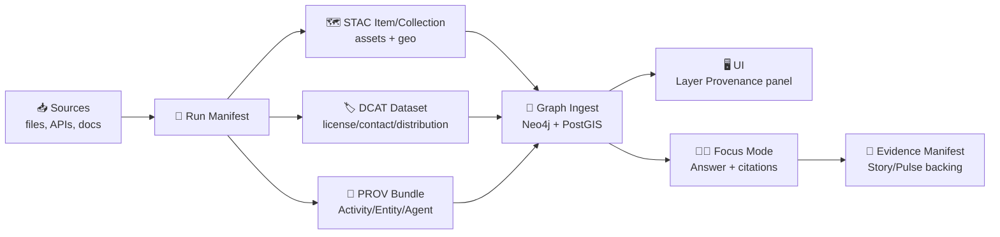

# 🧾 Dev Provenance Schemas (MCP)  
> **Path:** `mcp/dev_prov/schemas/`  
> **Goal:** Make provenance *machine-checkable* ✅, *queryable* 🔎, and *portable* 📦 across KFM pipelines, CI, UI, and AI.

<!-- Badges (URLs are fine inside this fenced markdown block) -->


---

## 🧠 Why this directory exists

KFM is designed so **no dataset, map layer, story, or AI answer becomes a black box**. That only works if every “what happened?” object—**pipeline run**, **evidence list**, **PR event**, **artifact publish**, **AI answer**, **policy decision**—has a **strict contract** and can be validated in CI and at runtime.

This folder holds **JSON Schemas** (and a small number of JSON-LD profiles) that standardize dev/provenance artifacts so they can be:

- **Validated** automatically (local + CI gates) ✅  
- **Ingested** into the provenance/knowledge graph 🔗  
- **Rendered** consistently in the UI (“Layer Provenance”, audit panels) 🗺️  
- **Used** safely by Focus Mode / agents (citations required) 🧭🤖  
- **Signed & content-addressed** for reproducibility (OCI + digests + Cosign) 🔐📦  

---

## 🧩 What “dev provenance” covers in KFM

Dev provenance is broader than “git history”:

- **Data lineage**: sources → transforms → outputs (run manifests, PROV bundles)  
- **Catalog lineage**: STAC/DCAT metadata completeness, license/sensitivity tagging  
- **Narrative lineage**: evidence manifests that back Story Nodes / Pulse Threads  
- **DevOps lineage**: PRs/commits/checks mapped into PROV so “code history is data”  
- **AI lineage**: Focus Mode answers + citations + policy gate outcomes  
- **Artifact lineage**: OCI distribution pointers, signatures, attestations  

---

## 📂 Suggested layout (schema taxonomy)

> You can keep this flat if preferred—this layout is recommended once the set grows.

```text
mcp/dev_prov/schemas/
├── 🧾📄 README.md                         # 🧾 This file: how schemas are versioned, referenced, and validated (CI/gates)
├── 🗂️🧾 index.json                        # 🗂️ Optional machine-readable schema index (id → path → version → owner)
├── 🧰 _defs/                              # 🧰 Shared $defs building blocks (reused across all schemas)
│   ├── 🆔📐🧾 kfm.id.v1.schema.json        # ID patterns: dataset_id/run_id/receipt_id/slugs/UUIDs (canonical formats)
│   ├── 🔐📐🧾 kfm.digest.v1.schema.json    # Digests/checksums: sha256 entries, file metadata, digest sets
│   ├── 🧑‍💻📐🧾 kfm.agent.v1.schema.json   # Agent identity: humans/services/LLMs, roles, contact, accountability fields
│   └── 📚📐🧾 kfm.citation.v1.schema.json  # Citation model: claim→source→locator, access dates, license/attribution
├── 🧬 core/                               # 🧬 “Always-on” provenance artifacts (required for governed workflows)
│   ├── 🧾📐🧾 kfm.run-manifest.v1.schema.json        # Run ledger: who/what/when + inputs/outputs + params + hashes
│   ├── 📎📐🧾 kfm.evidence-manifest.v1.schema.json   # Evidence index: claims/citations/artifacts + checksums + links
│   ├── 📦📐🧾 kfm.source-bundle.v1.schema.json       # Source bundle: upstream sources, retrieval, licensing, integrity
│   └── 🧾📐🧾 kfm.governance-ledger-entry.v1.schema.json # Governance event: reviews/approvals/waivers/audit metadata
├── 🧯 devops/                             # 🧯 CI/PR provenance for code operations (traceability of changes)
│   ├── 🔗📐🧾 kfm.github-pr-event.v1.schema.json     # PR event record: ids, commits, reviewers, linked artifacts/receipts
│   ├── ✅📐🧾 kfm.ci-check-report.v1.schema.json     # CI check report: job/run metadata, results, logs, artifacts
│   └── 🚦📐🧾 kfm.policy-gate-result.v1.schema.json  # Gate decision envelope: pass/fail, findings, pointers, severities
├── 🧭🤖 ai/                               # 🧭🤖 AI/automation accountability artifacts (evidence-first outputs)
│   ├── 🤖📐🧾 kfm.agent-action.v1.schema.json        # Agent action record: intent, tools used, inputs/outputs, safety notes
│   ├── 🔎📐🧾 kfm.focus-answer-record.v1.schema.json # Focus Mode answer record: citations, uncertainty, redactions, receipts
│   └── 🪪📐🧾 kfm.model-card.v1.schema.json          # Model card contract: intended use, risks, evals, dataset notes
├── 🗺️ geo_profiles/                       # 🗺️ KFM constraints layered onto STAC/DCAT/PROV (profile overlays)
│   ├── 🛰️📐🧾 kfm.stac.profile.v13.schema.json       # KFM-STAC profile overlay (required fields, link rules, extensions)
│   ├── 🗂️📐🧾 kfm.dcat.profile.v13.schema.json       # KFM-DCAT profile overlay (license/contact/distribution rules)
│   └── 🧬📐🧾 kfm.prov.profile.v13.schema.json       # KFM-PROV profile overlay (activity/entity shape + derivation rules)
└── 🔐 security/                           # 🔐 Distribution + signing/attestations (supply-chain verifiability)
    ├── 📦📐🧾 kfm.oci-distribution.v1.schema.json     # OCI/ORAS distribution record: digests, refs, artifact metadata
    ├── 🔏📐🧾 kfm.cosign-ref.v1.schema.json           # Cosign signature/attestation reference: registry/digest/signers
    └── 🧾📐🧾 kfm.slsa-attestation-ref.v1.schema.json # SLSA-style attestation ref: predicate, subject digests, builder
```

---

## 🗺️ Schema catalogue (what to expect)

| Area 🧭 | Schema (suggested) 📄 | Validates… ✅ | Produced by 🛠️ | Consumed by 👀 |
|---|---|---|---|---|
| Core | `kfm.run-manifest.v1.schema.json` | One pipeline run: run_id, timing, inputs, tool versions, digest | ETL / CI jobs / W–P–E agents | Graph ingest, audit UI, policy pack |
| Core | `kfm.evidence-manifest.v1.schema.json` | Evidence list for Story Nodes / Pulse Threads (sources + checksums + transforms) | Story tooling / narrative pipeline | UI provenance panel, Focus Mode citations |
| Core | `kfm.source-bundle.v1.schema.json` | Bundled sources (e.g., PDF portfolios) + attachment inventory | Intake tooling | Reproducibility, indexing |
| DevOps | `kfm.github-pr-event.v1.schema.json` | PR events mapped to PROV (Activity/Entity/Agent) | CI webhooks / GitHub Actions | Neo4j PROV graph |
| DevOps | `kfm.policy-gate-result.v1.schema.json` | Policy decisions + rule IDs + reasons | CI / runtime policy gate | Merge gates, governance ledger |
| Geo | `kfm.*.profile.v13.schema.json` | KFM-required STAC/DCAT/PROV fields | Catalog generator | UI + API + Focus Mode |
| Security | `kfm.oci-distribution.v1.schema.json` | Artifact location by repo/tag/digest + media types | Publish step | Fetchers, verifiers |
| Security | `kfm.cosign-ref.v1.schema.json` | Signature references for OCI artifacts | CI signing | Verification gates |
| AI | `kfm.agent-action.v1.schema.json` | Agent actions are logged as immutable facts | Watcher/Planner/Executor | Audit UI, policy checks |
| AI | `kfm.focus-answer-record.v1.schema.json` | AI answer + citations + data timestamps + policy checks | Focus Mode runtime | Governance ledger, explainability UI |
| AI | `kfm.model-card.v1.schema.json` | Model card metadata (MCP alignment) | Model packaging | Review + transparency |

> [!NOTE]
> These names are **recommended conventions**. If the repo already has a canonical naming scheme, keep it—just ensure schemas are versioned and indexed.

---

## 🧬 Schema conventions (project-wide rules)

### 1) JSON Schema version & strictness
- Use **JSON Schema 2020-12** (`$schema: "https://json-schema.org/draft/2020-12/schema"`).
- Default to **`additionalProperties: false`** in “core artifacts”.
- Prefer explicit extension points:
  - `extensions: { "<namespace>": { ... } }`
  - or `$defs` / `oneOf` for controlled polymorphism.

### 2) Artifact envelope (recommended)
Most provenance artifacts should share a consistent “envelope”:

```json
{
  "schema_id": "kfm.run-manifest.v1",
  "schema_version": "1.0.0",
  "generated_at": "2026-01-20T12:34:56Z",
  "producer": {
    "tool": "kfm-ingest",
    "tool_version": "0.13.2",
    "git_sha": "bb86bf1"
  },
  "subject_id": "kfm.dataset.hydrology.usgs_nwis",
  "payload": { }
}
```

### 3) Determinism & digests
Provenance artifacts should support:
- `idempotency_key` (so reruns are safe / “exactly-once” patterns)
- `canonical_digest` (e.g., sha256 of canonicalized JSON)
- `inputs[]` with immutable identifiers (URL + checksum / digest)

---

## 🧷 How these schemas fit KFM’s provenance stack

KFM’s “evidence-first” stack is easiest to reason about as a pipeline:



**Schema role in the stack:** schemas are the *contracts* that keep each arrow reliable—so nothing “mysteriously” appears in UI or AI answers without traceable context.

---

## ✅ Validation workflow (local + CI)

### Local validation (quick)
Pick one validator and standardize:

**Option A — `check-jsonschema` (Python)**
```bash
check-jsonschema --schemafile core/kfm.run-manifest.v1.schema.json path/to/run_manifest.json
```

**Option B — `ajv` (Node)**
```bash
ajv validate -s core/kfm.run-manifest.v1.schema.json -d path/to/run_manifest.json --strict=true
```

### CI validation (recommended gates)
In CI, run (at minimum):

1. **Schema validation** (STAC/DCAT/PROV + internal manifests)  
2. **Policy-as-code** (OPA/Conftest) enforcing governance and invariants  
3. **Signature / attestation verification** for published artifacts  
4. **Link integrity** (IDs resolve; referenced artifacts exist; digests match)  

> [!IMPORTANT]
> **Fail closed**: if any gate fails, the change does not merge and does not publish.

---

## 🛠️ Adding a new schema (PR checklist)

- [ ] Choose the correct area folder (`core/`, `devops/`, `ai/`, `security/`, …)
- [ ] Name it: `kfm.<artifact>.v<MAJOR>.schema.json`
- [ ] Include `$id`, `$schema`, `title`, `description`
- [ ] Add at least **1 “happy path”** example + **1 “must fail”** example
- [ ] Update `index.json` (if used)
- [ ] Add/adjust OPA rules (if the schema introduces governance requirements)
- [ ] Document migration notes if any breaking changes are introduced

---

## 🧪 Examples (minimal patterns)

### 1) Run Manifest (example skeleton)
```json
{
  "run_id": "RUN-20260120T123456Z",
  "run_time": "2026-01-20T12:34:56Z",
  "idempotency_key": "pa:06752000:2026-01-20T12:00:00Z",
  "canonical_digest": "sha256:...",
  "source_urls": ["https://example.gov/data.csv"],
  "tool_versions": { "kfm-ingest": "0.13.2", "gdal": "3.8.0" },
  "outputs": [
    { "dataset_id": "kfm.dataset.hydrology.usgs_nwis", "artifact_digest": "sha256:..." }
  ]
}
```

### 2) Evidence Manifest (example skeleton)
```yaml
evidence_manifest_id: EM-84
created_at: 2026-01-20T12:40:00Z
topic: "Drought conditions – weekly pulse"
sources:
  - source_id: "kfm.source.usgs.nwis"
    url: "https://example.gov/nwis"
    checksum: "sha256:..."
transforms:
  - transform_id: "kfm.transform.normalize_units.v1"
    notes: "Converted cfs to cms"
outputs:
  - story_node_id: "kfm.story.drought.weekly.2026-01-20"
    link: "docs/reports/story_nodes/published/..."
```

### 3) OCI Distribution pointer (example skeleton)
```json
{
  "distribution": {
    "oci": {
      "registry": "ghcr.io",
      "repository": "kfm/artifacts/surficial_geology",
      "tag": "20260120",
      "digest": "sha256:...",
      "files": [
        { "path": "surficial_geology.pmtiles", "media_type": "application/vnd.pmtiles" },
        { "path": "surficial_geology.parquet", "media_type": "application/vnd.geo+parquet" }
      ]
    }
  }
}
```

### 4) GitHub PR → PROV JSON-LD (tiny conceptual snippet)
```json
{
  "@context": "https://www.w3.org/ns/prov.jsonld",
  "@id": "kfm.prov.pr.123",
  "@type": "prov:Activity",
  "prov:used": ["kfm.prov.commit.abc123"],
  "prov:wasAssociatedWith": ["kfm.prov.agent.github_user.bartytime4life"]
}
```

---

## 🔐 Governance fields (schemas should make these easy)

Schemas should support governance **without leaking policy into application code**:

- `license` (SPDX where possible) 📜  
- `sensitivity_level` / `classification` 🔒  
- `care_tags` / `ethical_review_required` 🌿  
- `access_roles` (Public Viewer / Contributor / Admin) 👥  
- `citations[]` required for AI-derived outputs 📎  
- `review_flags[]` for sensitive areas / embargoed sources 🚩  

---

## 📚 Design inputs (the docs that informed this folder)

This schema system is anchored in KFM’s core documents and reference libraries:

- 📥 Data intake & governance (STAC/DCAT/PROV + policy gates)  
- 🧭🤖 AI system overview (Focus Mode citations, traceable answers, supply chain)  
- 🖥️ UI system overview (provenance overlays, transparent layers)  
- 🧱 Architecture & technical documentation (contract-first, “no mystery layers”)  
- 🌿 Innovative concepts (FAIR/CARE, attribution, sensitive data handling)  
- 💡 Future proposals (PR→PROV, rollback/provenance repair, W–P–E agents)  
- 🧰 Reference libraries (AI concepts, data management, programming resources, maps/webgl)  

---

## 🔗 Related project paths (for orientation)

- `schemas/` — canonical schemas across the repo (STAC/DCAT/PROV, story nodes, UI, telemetry)  
- `tools/validation/policy/` — OPA policies + Conftest rules (policy gates)  
- `data/stac/`, `data/catalog/dcat/`, `data/prov/` — catalog/prov outputs  
- `mcp/` — experiments, runs, model cards, methods & reproducibility artifacts  

---

## 🧭 FAQ

**Q: Why JSON Schema instead of “just docs”?**  
A: Because the platform’s promise depends on **automated gates** and **reproducible artifacts**—schemas are executable documentation.

**Q: Are these schemas only for Kansas?**  
A: No—schemas should be region-agnostic where possible, enabling federation (“Nebraska Frontier Matrix”, etc.) with the same contracts.

**Q: Where do external standards live?**  
A: Prefer vendoring upstream standards (STAC/DCAT/PROV) with minimal KFM profile overlays in `geo_profiles/`.

---

> [!TIP]
> Treat schema changes like database migrations: version, test, gate, document, and (when needed) include **rollback + provenance repair** guidance.
