# 🧠 AI Schemas — dev_prov


> **Contracts for AI-generated artifacts in Kansas Frontier Matrix (KFM)**: Focus Mode answers 🧭, agent actions 🤖, run manifests 🧾, and policy decisions ✅ — all **schema-validated**, **policy-gated**, and **provenance-linked**.

---

<a id="toc"></a>

## 🧭 Table of contents

- [📌 Overview](#overview)
- [🎯 Scope](#scope)
- [🧩 Core principles](#principles)
- [📁 Folder layout](#layout)
- [🗂️ Schema families](#families)
- [🔁 End-to-end flows](#flows)
- [🛡️ Validation and policy gates](#gates)
- [🔏 Provenance and integrity](#provenance)
- [🔒 Sensitivity and access](#sensitivity)
- [🧪 Experiments and model documentation](#experiments)
- [🧰 Tooling and validation examples](#tooling)
- [🧱 Contributing](#contributing)
- [✅ Definition of Done](#dod)

---

<a id="overview"></a>

## 📌 Overview

KFM’s AI features are not “chat glued onto a map.” They are **auditable system components** that must:

- produce **structured, verifiable outputs** (JSON)
- attach **citations and evidence references**
- record **lineage and decisioning** in provenance
- pass **automated policy gates** (OPA/Conftest)
- stay compatible with the platform’s metadata standards (**STAC / DCAT / PROV-O**)

This folder defines the **JSON Schemas** for those AI artifacts so they can be validated in CI/CD and consumed reliably by:

- 🧭 **Focus Mode** (context-aware Q&A)
- 🛰️ the **UI audit panel / provenance panel**
- 🤖 **Watcher–Planner–Executor** automation
- 🧾 the **governance ledger** and provenance graph

---

<a id="scope"></a>

## 🎯 Scope

| In scope ✅ | Out of scope ❌ |
|---|---|
| Focus Mode response objects with citations | Raw LLM “chat logs” as the source of truth |
| Run manifests and retrieval traces | Storing private chain-of-thought |
| Policy reports and gate decisions | Replacing STAC/DCAT/PROV with custom formats |
| AgentAction records for W-P-E automation | Uncontrolled automation that edits data without review |
| Redaction/sensitivity summaries | UI-only presentation formats without underlying structured objects |

> [!IMPORTANT]
> **Focus Mode + automation are “contract-first.”** If an artifact doesn’t validate or violates policy → it must **fail closed** and not ship.

---

<a id="principles"></a>

## 🧩 Core principles

### 1) Evidence-first 🧾
Every claim intended for users must be backed by **structured citations** pointing to cataloged sources (datasets, documents, graph entities, or API query results).

### 2) Provenance-first 🧬
AI outputs are treated like data products: they must be linkable to the **inputs used**, **processing steps**, and **agents** involved.

### 3) Policy-gated publishing 🛡️
Artifacts are only accepted when they pass:
- JSON Schema validation
- STAC/DCAT/PROV completeness checks
- license + sensitivity checks
- “citations required” constraints
- determinism + reproducibility expectations (when applicable)

### 4) Human-in-the-loop automation 👤🤝🤖
W-P-E agents can propose and prepare changes, but merges/promotion must remain gated by review + policy.

### 5) Explainability is a UI feature and a data feature 🔍
The UI can only explain what the data model can represent. Schemas must carry:
- citations
- provenance pointers
- policy reports
- (optional) explainability summaries (feature attributions / influence factors)

---

<a id="layout"></a>

## 📁 Folder layout

> This is the **recommended** layout for this folder. If filenames differ in your repo, update the index table below — the *contracts* matter more than the exact names.

```text
📦 mcp/
└─ 📂 dev_prov/
   └─ 📂 schemas/
      └─ 📂 ai/
         ├─ 📄 README.md  👈 you are here
         ├─ 🧾 ai.answer.v1.schema.json
         ├─ 🧾 ai.claim.v1.schema.json
         ├─ 🧾 ai.citation.v1.schema.json
         ├─ 🧾 ai.context.v1.schema.json
         ├─ 🧾 ai.run_manifest.v1.schema.json
         ├─ 🧾 ai.retrieval_trace.v1.schema.json
         ├─ 🧾 ai.policy_report.v1.schema.json
         ├─ 🧾 ai.agent_action.v1.schema.json
         ├─ 🧾 ai.redaction.v1.schema.json
         ├─ 🧾 ai.xai_summary.v1.schema.json
         ├─ 🧾 ai.story_evidence_manifest.v1.schema.json
         └─ 📂 defs/
            ├─ 🧩 common.v1.schema.json
            ├─ 🧩 identifiers.v1.schema.json
            └─ 🧩 geo.v1.schema.json
```

---

<a id="families"></a>

## 🗂️ Schema families

### 🧭 A) Focus Mode responses

**Goal:** make Focus Mode answers **UI-ready** and **audit-ready**.

| Schema | What it represents | Must include |
|---|---|---|
| `ai.answer.v1` | Top-level response object | `claims[]`, `context`, `run_ref`, `policy` |
| `ai.claim.v1` | Atomic, citable claim | `text`, `citations[]`, `confidence` |
| `ai.citation.v1` | Link from claim → evidence | stable `source_ref`, precise `locator`, optional `checksum` |
| `ai.context.v1` | User + UI context captured at query time | viewport, time range, active layers, user intent |

**Recommended constraints**
- `claims[].citations.length >= 1` for any user-facing factual claim
- citations must reference **cataloged IDs** (STAC/DCAT/graph IDs) or **traceable API results** with timestamp + query signature
- context should include **map bbox** and **time window** when geospatial answers are produced

---

### 🧾 B) Run manifests and retrieval traces

**Goal:** make AI runs replayable and auditable.

| Schema | What it represents | Why it matters |
|---|---|---|
| `ai.run_manifest.v1` | Canonical record of a single AI run | reproducibility, governance ledger, signing |
| `ai.retrieval_trace.v1` | What sources were retrieved and how | guards against “mystery evidence” |
| `ai.tool_call.v1` | Structured record of tool calls | deep audits, debugging, and trust |

**Common fields to capture**
- `run_id` (stable, globally unique)
- timestamps (`started_at`, `ended_at`)
- model identity (`provider`, `name`, `version`)
- prompt template references (template ID + parameters)
- retrieval inputs/outputs (queries, parameters, result digests)
- environment snapshot (repo commit, container digest, key package versions)
- canonical digest (RFC 8785 canonical JSON) for signing / dedup

> [!NOTE]
> Storing *raw prompts* may be restricted or redacted; schemas should support `prompt_hash` + `redaction_notes`.

---

### ✅ C) Policy and safety reports

**Goal:** ensure we can prove *why* an artifact was allowed or denied.

| Schema | What it represents | Required signals |
|---|---|---|
| `ai.policy_report.v1` | OPA/Conftest outputs + decisions | rule IDs, decisions, messages |
| `ai.redaction.v1` | summary of any redaction performed | method, fields affected, reason |
| `ai.prompt_security_event.v1` | injection / unsafe content events | detected patterns, mitigation applied |

**Policy-friendly shape**
- `decision: "allow" | "deny" | "warn"`
- `violations[]: { rule_id, severity, message, target_pointer }`
- `artifacts[]: refs` linking what was checked

---

### 🤖 D) Watcher–Planner–Executor agent actions

**Goal:** make automation safe, reviewable, and provenance-linked.

| Schema | What it represents | Core idea |
|---|---|---|
| `ai.agent_action.v1` | Proposed + approved + executed change | structured “proposal → approval → execution” |
| `ai.change_set.v1` | file/data changes + intent | what will change and why |
| `ai.rollback_plan.v1` | how to revert if bad | safe operations at scale |

**Recommended model**
- `proposal` includes: detected issue, plan, expected diffs, impacted datasets
- `approval` includes: human approver identity + timestamp
- `execution` includes: PR ID, CI run IDs, merge commit, policy report refs
- all of the above link into PROV (agents, activities, entities)

---

### 📚 E) Narrative evidence and attention artifacts

KFM treats narratives as first-class data, not just markdown blobs. AI may assist, but it must remain evidence-based.

| Schema | What it represents | Ties into |
|---|---|---|
| `ai.story_evidence_manifest.v1` | structured evidence list for a Story Node | citations, checksums, reproducibility |
| `ai.pulse_thread.v1` | “Pulse” narrative thread across time/events | graph traversal + story nodes |
| `ai.attention_node.v1` | conceptual focus objects that connect topics | knowledge graph semantics |

**UI-friendly behavior**
- evidence manifests should support `stable_id` + `checksum`
- citations should be renderable as `[1] [2] [3]` with a “View Evidence” panel

---

<a id="flows"></a>

## 🔁 End-to-end flows

### 🧭 Flow 1 — Focus Mode Q&A

```mermaid
flowchart TD
  U[👤 User question] --> C[🧩 Capture context\n(bbox/time/layers/intent)]
  C --> R[🔎 Retrieval\n(graph + catalog + docs)]
  R --> E[🧾 Evidence assembly\n(candidates + digests)]
  E --> L[🧠 LLM synthesis\n(claims + citations)]
  L --> S[📐 Schema validation\n(JSON Schema)]
  S --> P[🛡️ Policy gates\n(OPA/Conftest)]
  P -->|allow| G[🧬 Write provenance\n(PROV bundle + ledger)]
  P -->|deny| X[⛔ Refuse / return safe fallback]
  G --> UI[🗺️ UI renders answer\n+ citations + audit panel]
```

### 🤖 Flow 2 — W-P-E automation

```mermaid
flowchart LR
  W[👀 Watcher\nDetect] --> PL[🧠 Planner\nPropose PR]
  PL --> V[✅ Validate\nSchema + Policy + Tests]
  V -->|pass| A[👤 Human approval]
  A --> EX[🛠️ Executor\nApply + Merge]
  V -->|fail| R[🧯 Rollback / revise]
  EX --> PROV[🧬 PROV + Ledger\nwho/what/why]
```



---

<a id="gates"></a>

## 🛡️ Validation and policy gates

### The minimum gate stack ✅

1. **Schema validation** (JSON Schema)
2. **Metadata completeness** (STAC/DCAT/PROV required artifacts)
3. **License presence** (no unknown license)
4. **Sensitivity classification** (including redaction rules)
5. **Provenance completeness** (inputs + steps declared)
6. **Citations required** for Focus Mode outputs

### Recommended CI wiring

```bash
# 1) schema
ajv validate -s mcp/dev_prov/schemas/ai/ai.answer.v1.schema.json -d artifacts/ai_answer.json

# 2) policy-as-code
conftest test artifacts/ --policy tools/validation/policy
```

### Example policy intent

```rego
# pseudo-rego (illustrative)
deny[msg] {
  input.kind == "ai.answer.v1"
  some i
  input.claims[i].citations == []
  msg := "AI claim missing citations (fail closed)"
}
```

---

<a id="provenance"></a>

## 🔏 Provenance and integrity

Schemas in this folder should integrate cleanly with PROV-O patterns:

- **Agents**: user, Focus Mode service, W-P-E components, CI system
- **Activities**: AI inference run, retrieval, validation, merge, publish
- **Entities**: datasets, documents, graph nodes, answers, manifests

### Integrity hooks 🧷

Recommended fields:
- `canonical_digest` (hash of canonical JSON)
- `artifact_digests[]` (content-address each output)
- `signature_refs[]` (e.g., Cosign / in-toto provenance)

> [!TIP]
> If you store artifacts in an OCI registry (ORAS) you can attach PROV JSON-LD as a referrer and sign artifacts for supply-chain integrity.

---

<a id="sensitivity"></a>

## 🔒 Sensitivity and access

AI schemas must support the platform’s ethics and access controls:

- tiered access levels (public vs restricted)
- culturally sensitive labels and protocols when applicable
- coordinate obfuscation/redaction (rounding, bounding, suppression)
- role-based access checks (viewer vs contributor vs admin)

Suggested standard fields:
- `sensitivity: "public" | "restricted" | "sensitive" | "secret"`
- `access_tier: "tier_0" | "tier_1" | "tier_2" | "tier_3"`
- `care_labels[]` / `tk_labels[]` (optional)
- `redaction: { method, fields, reason }`

---

<a id="experiments"></a>

## 🧪 Experiments and model documentation

KFM aligns with MCP-style research documentation:
- model cards
- experiment reports
- reproducibility requirements (inputs/config/results/uncertainty)

Recommended linkage fields:
- `model_card_ref`
- `experiment_report_ref`
- `protocol_ref`
- `dataset_cards[]`

> If a schema change impacts AI behavior, update the model card and/or experiment log reference paths so audits remain end-to-end traceable.

---

<a id="tooling"></a>

## 🧰 Tooling and validation examples

### Node.js

```bash
npm i -D ajv ajv-formats
node scripts/validate.js artifacts/ai_answer.json mcp/dev_prov/schemas/ai/ai.answer.v1.schema.json
```

### Python

```bash
python -m pip install jsonschema
python -m jsonschema -i artifacts/ai_answer.json mcp/dev_prov/schemas/ai/ai.answer.v1.schema.json
```

---

<a id="contributing"></a>

## 🧱 Contributing

### Adding a new schema 🧩

1. Create `ai.<thing>.v<major>.schema.json`
2. Use:
   - `$schema: "https://json-schema.org/draft/2020-12/schema"`
   - `$id` with a stable URI (or stable repo path convention)
   - `title`, `description`, and `examples`
3. Prefer `$defs` reuse for:
   - IDs/URNs
   - timestamps
   - bbox/geometry
   - sha256 digests
4. Add:
   - ✅ a valid example
   - ⛔ an invalid example
   - CI wiring updates (schema + policy)

### Versioning rules 🔢

- **SemVer** per schema family
- breaking change → new **major**
- additive change → **minor**
- typo/doc fix → **patch**
- keep deprecated schemas readable for audits; mark deprecated with `deprecated: true`

---

<a id="dod"></a>

## ✅ Definition of Done

- [ ] Schema validates with JSON Schema 2020-12 tooling
- [ ] `additionalProperties: false` where strictness is required
- [ ] Examples exist: at least one valid + one invalid
- [ ] Policy impact assessed (OPA/Conftest updates if needed)
- [ ] Provenance linkage designed (run_ref + prov references)
- [ ] Sensitivity + license signals included where relevant
- [ ] UI consumption confirmed (citations render + audit panel usable)
- [ ] README schema index updated 📌
