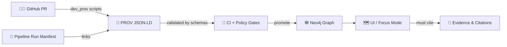

# 🧬 `dev_prov` Schemas (Contract‑First Provenance)

<p align="center">
  <kbd>🧾 contract-first</kbd>
  <kbd>🧭 PROV / JSON-LD</kbd>
  <kbd>🧪 CI gates</kbd>
  <kbd>⚖️ FAIR + CARE</kbd>
  <kbd>🔒 fail-closed</kbd>
</p>

> **TL;DR**: This folder is the **schema registry** for everything produced/consumed by `mcp/dev_prov` scripts — especially **DevOps → PROV** records (PRs/commits/releases), **pipeline run manifests**, **agent action logs**, and **telemetry/energy artifacts**.  
> If an artifact can affect what KFM publishes, serves, or reasons over, it must be **validated against a schema** here.

---

## 🎯 Why this folder exists

KFM is built around **metadata-as-code** and **provenance-first** operations:

- **No black boxes**: every dataset and every “important action” should be traceable (who/what/when/why/how).  
- **Contract-first**: schemas are the *source of truth* for what is allowed to enter the system.
- **Governance at the edges**: CI and policy gates validate artifacts before promotion (fail closed if uncertain).
- **Human + Agent parity**: scripts may generate changes, but they still must pass the same schema + policy checks.

This folder makes those guarantees enforceable.

---

## 🗂️ What lives here

> Keep this list updated as schemas are added/renamed. Think of it as a **living index** 🧠✨

### ✅ Core schema families

| Family | What it validates | Why it matters | Typical producers/consumers |
|---|---|---|---|
| 🧭 **PROV JSON-LD** | `prov:Entity / Activity / Agent` records | end-to-end lineage (data + devops + AI) | CI, ingestion pipelines, graph ingest |
| 🧑‍💻 **GitHub / DevOps PROV** | PRs, commits, merges, releases as PROV | “which PR produced this dataset & who reviewed it?” | CI hooks, Neo4j ingest |
| 🧾 **Run Manifests / Audits** | per-run ledgers (inputs/outputs/tools/errors/digests) | reproducibility + policy checks + idempotency | pipelines, audits, policy pack |
| 🤖 **AgentAction** | planner/executor suggestions vs executed steps | transparency of AI assistance | W-P-E agents, provenance pipeline |
| 📡 **Telemetry / Energy** | traces + energy/carbon summaries | operational accountability | CI runbooks, observability checks |
| 🧷 **Evidence / Narrative Inputs** *(optional)* | citation blocks, story evidence manifests | “evidence-first narrative” | Story tooling, Focus Mode publishing |

---

## 🧱 Recommended directory layout (flexible)

Even if your repo is currently flat, use this as a mental model. If you add subfolders, keep names predictable.

```text
📁 mcp/dev_prov/scripts/
  📁 schemas/ 🧬
    📄 README.md
    📁 prov/         🧭  (PROV profiles / shapes)
    📁 github/       🧑‍💻 (PR/commit/release provenance)
    📁 runs/         🧾  (run manifests, audit ledgers)
    📁 agents/       🤖  (AgentAction + automation traces)
    📁 telemetry/    📡  (OpenTelemetry + energy/carbon)
    📁 policy/       🧪  (optional: policy input/report schemas)
```

> 💡 If you keep a flat layout, prefix filenames: `prov__*`, `github__*`, `runs__*`, etc.

---

## 🔗 How these schemas plug into KFM

### 1) CI “Detect → Validate → Promote” 🧪➡️✅➡️🚀

A typical flow:

1. **Detect** changes (PR diff, new datasets, pipeline outputs, etc.)
2. **Validate**:
   - JSON/YAML formatting & linting
   - **Schema validation** (this folder ✅)
   - Policy Pack checks (OPA/Conftest)
   - Link/reference integrity checks
3. **Promote** only if everything passes (merge/deploy/import)

### 2) Policy Pack integration ⚖️

Schemas and policy gates work together:

- Schemas ensure **structure** and required fields are present
- Policies ensure **rules** and invariants (license present, classification propagation, provenance required, etc.)

See:
- `../../../../api/scripts/policy/README.md`
- `../../../../tools/validation/policy/`

### 3) Graph ingest (Neo4j) 🕸️

Validated PROV JSON-LD is ingested so that development history and data lineage become queryable.

Example queries unlocked:
- “Which PR produced dataset `kfm.dataset.*` and who reviewed it?”
- “List PRs that touched hydrology pipelines in the last year.”
- “Show all pipeline runs that used a sensitive input and ensure output stayed ≥ that classification.”

---

## 🧭 PROV + JSON-LD conventions (KFM flavor)

### ✅ What we standardize here

**Represent development + pipelines using PROV:**

- **PR / Merge** → `prov:Activity`
- **Commits / artifacts / configs** → `prov:Entity`
- **Authors / reviewers / CI bot / agents** → `prov:Agent`

Use PROV relations consistently:

- `prov:used` — Activity used an input Entity (commit, config, dataset, etc.)
- `prov:wasAssociatedWith` — Activity associated with Agent (human, bot, CI)
- `prov:wasGeneratedBy` — output Entity generated by Activity

### 🔒 Minimum expectations

- Every record must be **self-identifying** (`@id`) and typed (`@type`)
- Records must be **linkable** to:
  - commits (SHA), PR number, repo, workflow run id
  - dataset ids / artifact digests (when relevant)
- Include **timestamps** in a consistent format (ISO 8601)
- Include **classification / care labels** when the record references governed data

> 🔥 If you add a new artifact type, define how it maps into: **Entity / Activity / Agent**.

---

## 🧾 Run manifests (audit ledgers)

Run manifests are “what happened” receipts:

- inputs (hashes, source URLs, dataset ids)
- outputs (artifacts, counts, digests)
- toolchain (versions)
- error summaries
- a canonical digest / idempotency key (so re-running the same exact operation yields the same identity)

**Schema tips for this family:**
- include a `canonical_digest` (computed after canonicalization)
- include `tool_versions` and `runtime_env` for reproducibility
- include `summary_counts` and `errors[]` for reviewability

---

## 🤖 AgentAction records (Planner ↔ Executor parity)

If an AI agent proposes transformation steps, we log:

- the proposed plan (structured JSON)
- the validated config actually executed
- any deviations
- the review context (PR link, approver, timestamps)

**Why?** Later we can answer: “What did the agent suggest vs what shipped?” — and enforce “no silent automation.”

---

## 📡 Telemetry + energy artifacts

Telemetry validation enables runbooks like:

- “Every CI run emits trace spans with expected attributes”
- “Energy/carbon reports exist for sustainability goals”
- “Missing telemetry fails a health check”

Schemas in this family should:
- validate required span attributes (commit SHA, pipeline name, run id)
- validate energy report fields (duration, joules/kWh, CO₂ estimate, sampling methodology)

---

## 🧪 Validation workflows

### Local (developer) validation ✅

Use whatever validator the repo standardizes on (Node `ajv`, Python `jsonschema`, or repo scripts). Typical pattern:

```bash
# Example shape (adapt to your tooling):
# validate <instance> against <schema>
dev_prov validate --schema ./schemas/github/pr_prov.schema.json --input ./out/pr_123.prov.jsonld
```

### CI validation 🧰

CI should:
- validate all changed artifacts that match known patterns (`data/prov/**`, `data/catalog/**`, `data/stac/**`, `data/audits/**`, etc.)
- fail closed if schema validation cannot run or inputs are ambiguous
- surface errors with stable IDs (ex: `KFM-PROV-001`, `KFM-CAT-001`, …)

---

## 🧷 Example: PR → PROV JSON-LD (minimal)

> This is an illustrative example. Real schemas may require more fields.

```json
{
  "@context": {
    "prov": "http://www.w3.org/ns/prov#",
    "kfm":  "https://kansasfrontiermatrix.example/ns#"
  },
  "@id": "kfm:devprov/pr/1234",
  "@type": "prov:Activity",
  "prov:startedAtTime": "2026-01-21T18:42:11Z",
  "prov:endedAtTime": "2026-01-21T19:02:37Z",
  "prov:used": [
    { "@id": "kfm:git/commit/abc123", "@type": "prov:Entity" }
  ],
  "prov:wasAssociatedWith": [
    { "@id": "kfm:agent/github_user/alice", "@type": "prov:Agent" },
    { "@id": "kfm:agent/ci/github_actions", "@type": "prov:Agent" }
  ],
  "kfm:repo": "Kansas-Frontier-Matrix",
  "kfm:pr_number": 1234,
  "kfm:classification": "public"
}
```

---

## 🧩 Authoring rules for schemas (please follow)

### ✅ JSON Schema standards

- Declare `$schema` (dialect) and stable `$id`
- Prefer **Draft 2020-12** unless the repo standard says otherwise
- Use `additionalProperties: false` for “core objects” (tight contracts)
- Provide:
  - `title`, `description`
  - minimal `examples`
  - `required` fields for contract guarantees

### 🏷️ Versioning

- **SemVer** for schema changes:
  - **MAJOR**: breaking changes (required fields changed, meaning changed)
  - **MINOR**: backward-compatible additions
  - **PATCH**: clarifications, typo fixes, non-semantic changes
- Keep `$id` stable per version (don’t silently change meaning without version bump)

### 🔒 Governance baked in

Where applicable, schemas should include:

- `license` or `rights` fields (for catalog artifacts)
- `classification` / sensitivity level fields (public/sensitive/confidential/etc.)
- `care_label` fields when sovereignty or ethics apply
- references to upstream artifacts (STAC/DCAT/PROV links)

---

## ✅ Definition of Done (DoD) for adding/changing schemas

- [ ] Schema file added/updated in this folder 🧬
- [ ] At least **one valid example** instance added (and validated) 🟢
- [ ] At least **one invalid example** (negative test) added 🧯
- [ ] CI wired to validate the artifact(s) that use this schema 🧪
- [ ] Policy Pack updated if new invariants are needed ⚖️
- [ ] Graph ingest updated if new IDs/types/relations introduced 🕸️
- [ ] README index updated (this file) 📝
- [ ] Breaking changes include migration notes (and version bump) 🚧

---

## 🧭 Related docs (repo-relative)

- `../../../../docs/MASTER_GUIDE_v13.md`
- `../../../../docs/standards/` *(KFM profiles for STAC / DCAT / PROV)*
- `../../../../api/scripts/policy/README.md`
- `../../../../tools/validation/policy/`

---

## 🗺️ Big picture (DevOps ↔ Data lineage)



> If it can’t be validated, it can’t be promoted. ✅
