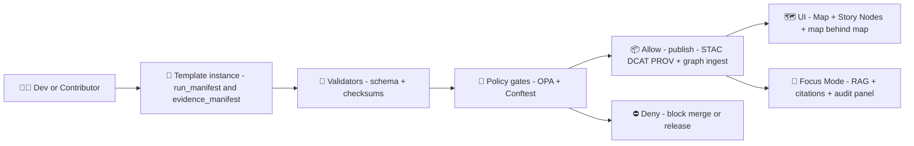

# 🧾 `dev_prov` Templates (MCP) — Provenance-First Dev Records


> [!NOTE]
> This folder contains **Developer Provenance (`dev_prov`) templates** used across Kansas Frontier Matrix (KFM) to ensure that **anything shipped, published, shown in the UI, or answered by Focus Mode** is **traceable, governed, and reproducible** 🧠🗺️

---

## 🧭 What is `dev_prov`?

`dev_prov` is the **project’s repeatable “paper trail” kit** for:

- ✅ **Pipeline runs** (ingestion, transforms, validation, exports)
- ✅ **AI/Focus Mode changes** (prompts, retrieval config, model updates)
- ✅ **Narrative artifacts** (Story Nodes, Pulse Threads, Conceptual Attention Nodes)
- ✅ **Architecture decisions** (ADR-style records)
- ✅ **Governance events** (policy gates, exceptions, sensitivity handling)
- ✅ **Reproducible releases** (data snapshots, signed artifacts, SBOM/SLSA notes)

KFM’s core principle is simple:

> **If it’s visible, it’s provable.**  
> No unsourced “mystery layers” 🔎

---

## 📦 Folder layout

```text
📦 mcp/
└─ 🧾 dev_prov/
   └─ 🧩 templates/
      ├─ 📄 README.md                       👈 you are here
      ├─ 📄 TEMPLATE_run_manifest.yaml       (pipeline run → PROV Activity)
      ├─ 📄 TEMPLATE_evidence_manifest.yaml  (citations bundle → UI + Focus Mode)
      ├─ 📄 TEMPLATE_story_node.md           (narrative + map stops + citations)
      ├─ 📄 TEMPLATE_pulse_thread.md         (short update + evidence)
      ├─ 📄 TEMPLATE_attention_node.yaml     (theme/pattern node → narrative graph)
      ├─ 📄 TEMPLATE_adr.md                  (architecture decision record)
      ├─ 📄 TEMPLATE_model_card.md           (AI component behavior + evals)
      ├─ 📄 TEMPLATE_governance_exception.md (sensitive / restricted handling)
      └─ 📄 TEMPLATE_graph_health_report.md  (graph QA + anomaly evidence)
```

> [!TIP]
> If you add a new template: **also add a schema + example instance** (where your repo keeps them), and wire it into CI policy gates.

---

## 🧱 Core contracts these templates support

KFM is **contract-first + provenance-first**. Templates here are designed to map cleanly into the KFM evidence stack:

- **🛰️ STAC** — assets / items / spatial metadata  
- **📚 DCAT** — dataset discovery & distributions  
- **🧾 PROV-O** — lineage (entities, activities, agents)

Together they form an “evidence triplet” that powers the catalog, the graph, and trustworthy UI/AI behavior.

---

## 🔐 Governance mindset (policy gates)

KFM uses **automated policy gates** at key checkpoints:

- ingestion
- AI inference (Focus Mode)
- content publication (stories/layers)

Minimum gate concepts include:
- schema validity
- STAC/DCAT/PROV completeness
- license presence
- sensitivity classification
- provenance completeness
- **AI answers must have citations** (fail closed if not)

> [!WARNING]
> “Fail closed” means: if a template record is missing required provenance fields, **it’s not shippable**.

---

## 🧩 Template conventions

### 1) IDs, versioning, and determinism 🧬
Use stable, machine-friendly IDs that can be referenced across:
- catalogs (STAC/DCAT)
- lineage (PROV)
- graph nodes/edges (Neo4j)
- UI “map behind the map” panels

**Recommended patterns**
- `kfm.<domain>.<thing>.<version>`
- `run_id`: time + git sha (or CI run id)
- `idempotency_key`: stable “same inputs → same key” value
- `canonical_digest`: output bundle checksum (e.g., sha256 over an artifact manifest)

### 2) Preferred timestamps 🕒
- ISO-8601 UTC: `2026-01-20T12:34:56Z`

### 3) Checksums everywhere ✅
For **any** artifact referenced:
- include `sha256` (or stronger) and size if feasible
- record tool versions used to generate it

### 4) Sensitivity + ethics first 🪶
Always include:
- `sensitivity`: `public | internal | restricted`
- `license` / `terms`
- optional: cultural protocol handling notes (CARE-aligned)

---

## 📚 Template index

| Template | What it is | When you use it | Must include |
|---|---|---|---|
| `run_manifest` 🏃 | A single pipeline execution record | Every ingest/transform/export | inputs, outputs, checksums, tool versions, policy outcome |
| `evidence_manifest` 🧾 | A citation bundle backing a story/analysis/answer | Every story, pulse, or AI answer bundle | evidence IDs, URIs, checksums, excerpt pointers |
| `story_node` 🗺️ | A guided narrative with map/timeline stops | Publishing/curating stories | map stops, narrative, citations/evidence link |
| `pulse_thread` ⚡ | A short “what changed?” narrative update | Weekly updates, new dataset drops | summary, linked run/evidence manifests |
| `attention_node` 🧠 | A theme/pattern node for narrative graph | When tagging cross-story patterns | references to story nodes + datasets |
| `adr` 🏛️ | Architectural decision record | Any irreversible/major design choice | context, decision, consequences |
| `model_card` 🤖 | AI behavior + evaluation | Any Focus Mode or AI pipeline update | purpose, data, eval, limitations |
| `governance_exception` 🔒 | Controlled override record | Rare “must proceed” exceptions | justification, expiry, mitigations |
| `graph_health_report` 🩺 | QA report for Neo4j graph quality | scheduled checks / before releases | metrics, anomalies, evidence pointers |

---

## 🧪 Minimal examples

### ✅ `run_manifest` (YAML skeleton)

```yaml
# TEMPLATE_run_manifest.yaml
run_id: "run_2026-01-20T12-34-56Z_gsha-abcdef1"
run_time: "2026-01-20T12:34:56Z"
actor:
  type: "human|agent|ci"
  id: "github:bartytime4life"
activity:
  type: "ingest|transform|validate|export|publish"
  dataset_id: "kfm.ks.example.dataset.v1"
idempotency_key: "sha256:..."
inputs:
  - uri: "source://..."
    sha256: "..."
    license: "..."
    media_type: "application/zip"
outputs:
  - uri: "stac://collections/.../items/..."
    sha256: "..."
    media_type: "application/json"
tool_versions:
  python: "3.12.x"
  gdal: "..."
  postgis: "..."
policy:
  opa_bundle: "policy-pack@vX.Y.Z"
  decision: "allow|deny"
  notes: "..."
provenance:
  prov_activity_id: "prov:activity:..."
  prov_entity_ids: ["prov:entity:..."]
notes:
  summary_counts:
    features_ingested: 0
    warnings: 0
```

### ✅ `evidence_manifest` (YAML skeleton)

```yaml
# TEMPLATE_evidence_manifest.yaml
manifest_id: "evidence_2026-01-20_story_floods-1951"
created_at: "2026-01-20T12:34:56Z"
owner: "github:bartytime4life"
evidence:
  - evidence_id: "ev_001"
    kind: "dataset|document|graph_query|analysis"
    uri: "dcat://datasets/kfm.ks.hydro.floods.1951.v1"
    sha256: "..."
    citation_label: "USGS flood record (1951)"
    retrieval:
      method: "api|graph|search"
      query: "..."
    excerpt:
      pointer: "page:12"
      note: "used for timeline claim"
```

> [!TIP]
> Evidence manifests should be **re-usable**: Story Nodes, Pulse Threads, and Focus Mode responses can all reference the same manifest.

---

## 🗺️ Where these templates plug into KFM



### Why this matters for UI ✨
The UI is designed for **trust and transparency**:
- layers show attributions
- story content is “sourceable”
- AI answers come with citations
- exported views preserve credits

So these templates are how we **feed the UI trust model**.

---

## 🤖 Focus Mode and AI changes

KFM’s AI approach is:
- hybrid retrieval (graph + spatial DB + doc search)
- context-aware (map extent, timeline focus)
- citations required
- governance checks before output

When you modify AI behavior (prompts, retrieval config, model choice, embeddings, etc.), you should:
- create/attach a `model_card`
- create/attach a `run_manifest` for evaluation runs
- attach an `evidence_manifest` for benchmark evidence
- record policy results (allow/deny + notes)

> [!IMPORTANT]
> If Focus Mode can’t cite a source, it should refuse rather than guess.

---

## 🧠 Narrative graph extensions (Pulse Threads + Attention Nodes)

KFM’s future narrative layer supports:
- **Pulse Threads**: short, time-stamped updates
- **Conceptual Attention Nodes**: cross-story themes/patterns
- **Narrative Pattern Detection**: emergent storyline analytics

These templates give that narrative system:
- a stable schema
- auditability
- linkability to STAC/DCAT/PROV and Neo4j nodes

---

## 🛰️ Real-time + bulk ingestion readiness

KFM roadmap ideas include:
- real-time “Watcher” agents (e.g., GTFS-RT polling with ETag/Last-Modified)
- bulk document ingestion (OCR + entity extraction)
- AI-assisted metadata drafting (human-in-the-loop)

**Use `run_manifest`** to log:
- polling cycles
- idempotency keys
- ingestion batches
- extracted entities and links
- policy outcomes and sensitivity handling

---

## 🔏 Artifact integrity (OCI + signing)

Some KFM proposals include treating run outputs as **OCI artifacts**:
- push manifests/data bundles to an OCI registry
- sign digests (Cosign)
- reference digests inside `run_manifest`

If your pipeline outputs are “release-grade”, include:
- digest(s)
- signature(s)
- SBOM pointer
- provenance bundle pointer (SLSA-style)

---

## 📚 Research library packs included in this project

These “PDF portfolio” files are **embedded libraries** you can extract for deep reference work:

### 🧠 AI references
- `AI Concepts & more.pdf` → 36 embedded AI books (ML, deep learning, evaluation, AI law, etc.)

### 🗺️ Mapping + WebGL references
- `Maps-GoogleMaps-VirtualWorlds-Archaeological-Computer Graphics-Geospatial-webgl.pdf`  
  → embedded docs on GIS basics, map design, projections, WebGL, Google Maps JS cookbook, Python geoprocessing

### 🧰 Engineering references
- `Various programming langurages & resources 1.pdf`  
  → embedded “Notes for Professionals” + CI/CD guide + Docker + SQL + React + TypeScript, etc.

### 🗄️ Data & modeling references
- `Data Managment-Theories-Architures-Data Science-Baysian Methods-Some Programming Ideas.pdf`  
  → embedded data engineering, database performance, CI/CD, Git notes, statistics, Bayesian methods, etc.

#### Extract embedded PDFs (local dev)
```bash
# list embedded PDFs
pdfdetach -list "AI Concepts & more.pdf"

# extract by file number
pdfdetach -save 11 -o "extracted/ci_cd_guide.pdf" "Various programming langurages & resources 1.pdf"

# extract everything into the current folder
pdfdetach -saveall "Maps-GoogleMaps-VirtualWorlds-Archaeological-Computer Graphics-Geospatial-webgl.pdf"
```

> [!TIP]
> If you add these libraries to the repo, keep them under something like `docs/library/` and maintain a manifest (title, source, license, purpose).

---

## ✅ Definition of Done checklist (recommended)

Before merging anything that affects data, UI, or AI:

- [ ] A **run_manifest** exists for the pipeline run (or CI run)
- [ ] All referenced artifacts have **checksums**
- [ ] **Policy gate results** are recorded (`allow/deny`)
- [ ] STAC/DCAT/PROV outputs (if relevant) are linked
- [ ] Any new story/pulse has an **evidence_manifest**
- [ ] Any AI behavior change has a **model_card**
- [ ] Sensitivity/license fields are present and correct
- [ ] Nothing “mystery” will appear in UI or answers

---

## 🛠️ Maintainers: adding a new template

1. Add `TEMPLATE_<name>.(md|yaml|json)`
2. Add an example instance: `examples/<name>/...`
3. Add a schema (JSON Schema / Pydantic model / both)
4. Wire validation into CI + policy gates
5. Update the **Template index** table in this README ✅

---

## 🧾 License & attribution

These templates exist to preserve:
- credits to data providers and knowledge holders
- legal terms and licenses
- cultural protocol constraints (when applicable)

When in doubt, choose:
- **more provenance**
- **more explicit attribution**
- **more conservative access**

---

### 🧠 Final reminder
> KFM is a trust machine.  
> Templates are how we **keep the trust enforceable** 🔐✅
