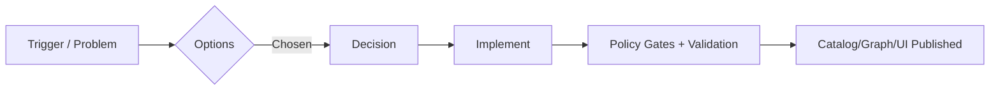

---
# 🧾 Architecture Decision Record (ADR) — KFM / MCP / DEV_PROV
# 👉 Copy this template into: 📂 mcp/dev_prov/adr/ADR-YYYYMMDD-<slug>.md
# ✅ Keep front-matter machine-readable (used for provenance + indexing)

title: "ADR-YYYYMMDD-<slug>: <Decision Title>"
adr_id: "ADR-YYYYMMDD-<slug>"
status: "draft" # draft | proposed | accepted | rejected | superseded | deprecated
date_created: "YYYY-MM-DD"
date_last_updated: "YYYY-MM-DD"

# 🧭 Classification
decision_kind: "architecture" # architecture | data | ui | ai | policy | security | ops | docs
domain: "<e.g., history | climate | hydrology | imagery | treaties | story_nodes | ops>"
component: "<service/package/module>"
scope: "<what this ADR covers>"
out_of_scope: "<what this ADR does NOT cover>"

# 🎯 Impact
impact_level: "M"   # XS | S | M | L | XL
risk_level: "M"     # XS | S | M | L | XL
blast_radius: "repo" # local | service | repo | ecosystem
target_release: "<milestone/tag/date>"

# 👥 People
owners: ["<handle/name>"]
deciders: ["<handle/name>"]
reviewers: ["<handle/name>"]
stakeholders: ["<Data Steward>", "<Maintainer>", "<Security>", "<Community/Tribal Liaison if applicable>"]

# 🔗 Traceability
related_prs: []
related_issues: []
related_docs: []
supersedes: []
superseded_by: []

# ⚖️ Governance & data ethics
fair_care_profile: "FAIR+CARE"
sensitivity: "public" # public | internal | restricted | tribal_sensitive | pii
license: "<SPDX id or reference>"
access_model: "<RBAC/ABAC notes if relevant>"

# 🧬 Provenance artifacts (fill if applicable)
prov_bundle: "<path/to/prov.jsonld>"
evidence_manifest: "<path/to/evidence.yaml>" # required for story nodes / reports / narratives
run_manifest: "<path/to/run.manifest.json>"  # recommended for pipelines + deterministic builds

# 🧪 Policy gates / CI contracts
pipeline_contract: "v13"
policy_pack_ref: "<git tag/sha>"
conftest_report: "<path/to/conftest/report.json>"
validation_reports: []

# 📦 Artifact & supply chain (optional but preferred)
artifact_refs:
  - name: "<artifact name>"
    oci_ref: "<registry/repo@sha256:...>"
    cosign_sig_ref: "<oci referrer or path>"
    sbom_ref: "<path/to/sbom.spdx.json>"
    attestation_ref: "<in-toto / provenance attestation ref>"

# 🗺️ Graph / catalog hooks (optional but recommended)
graph_entities_touched: []   # e.g., ["kfm:dataset:...", "kfm:place:..."]
stac_items_touched: []       # e.g., ["data/catalog/.../item.json"]
dcat_records_touched: []     # e.g., ["data/catalog/.../dcat.json"]
---


# 📌 ADR — <Decision Title>

> 🧠 **Rule of thumb:** If this decision changes **what users see**, **what data enters the catalog**, **what AI is allowed to say**, or **what policies block merges** — it deserves an ADR.

---

## 🧭 Quick Start (fill these first)
- [ ] Set `adr_id`, `title`, `status`, and dates in front-matter
- [ ] Write a 1–3 sentence **Decision Summary**
- [ ] List **Decision Drivers** (why now?)
- [ ] List **Options Considered** (≥2 if feasible)
- [ ] Record **Decision** + **Consequences**
- [ ] Add **Implementation Plan** + **Rollback Plan**
- [ ] Confirm **Provenance + Policy Gate** updates (DEV_PROV)

---

## 📂 Suggested placement (repo layout)
```text
📦 repo/
  📂 mcp/
    📂 dev_prov/
      📂 templates/
        TEMPLATE_adr.md  ✅ (this file)
      📂 adr/
        ADR-YYYYMMDD-<slug>.md  🧾
  📂 data/
    📂 raw/         🧊 immutable inputs
    📂 work/        🧪 intermediate artifacts
    📂 processed/   ✅ publish-ready datasets
    📂 catalog/     🗂️ STAC / DCAT / PROV pointers
  📂 graph/         🔗 Neo4j schema + ingest
  📂 ui/            🗺️ Map + Story + Focus Mode UX
  📂 backend/       ⚙️ APIs + pipelines + AI services
```

---

## 🧾 Decision Summary
**One-liner:** We will **<do X>** to achieve **<Y>**, while preserving **provenance-first, fail-closed governance**.

**User-visible outcome (if any):**
- <What changes in the UI / map / story playback / exports?>

**Data-visible outcome (if any):**
- <New dataset, updated schema, updated STAC/DCAT/PROV, new catalog entries?>

---

## 🌍 Context
### Problem / Trigger
- **What problem are we solving?**
- **Why now?** (incident, scaling limit, policy requirement, new domain onboarding, UI gap, drift alert, etc.)

### Background
- What already exists?
- What constraints must we honor (governance, licensing, sensitivity, performance, maintainability, community trust)?

### Assumptions
- <Assumption 1>
- <Assumption 2>

---

## 🎛️ Decision Drivers
Rank the key drivers (1 = most important):

| Rank | Driver | Notes |
|------|--------|------|
| 1 | Evidence-first & traceability 🧬 | Every claim should be auditable |
| 2 | Policy gates / fail-closed ⚖️ | Missing metadata/license/provenance blocks merge |
| 3 | UX clarity & trust 🗺️ | “Map behind the map” always visible |
| 4 | Maintainability 🧱 | Config-driven, modular components |
| 5 | Performance & scale 🚀 | Tiles/CDN, caching, query performance |
| 6 | Ethics & safety 🛡️ | Sensitive data controls + prompt security |

---

## ✅ Requirements
### Functional requirements
- [ ] <FR-1>
- [ ] <FR-2>

### Non-functional requirements
- **Performance:** <latency / throughput targets>
- **Reliability:** <SLOs, failure modes>
- **Security:** <auth, threat model notes>
- **Governance:** <FAIR/CARE, sensitivity rules>
- **Interoperability:** <STAC/DCAT/PROV, APIs, export formats>

---

## 🧩 Options Considered
> Include at least 2 options when practical (including “do nothing”).

| Option | Description | Pros ✅ | Cons ⚠️ | Risk | Cost | Decision? |
|--------|-------------|--------|--------|------|------|----------|
| A | <Option A> | <…> | <…> | <…> | <…> | ⬜ |
| B | <Option B> | <…> | <…> | <…> | <…> | ⬜ |
| C | Do nothing | <…> | <…> | <…> | <…> | ⬜ |

---

## 🏁 Decision
**Chosen option:** <A/B/C>

### Rationale
- <Why this option best satisfies decision drivers + requirements>
- <Trade-offs explicitly accepted>

### Decision Details (make it implementable)
- **Architecture pattern:** <e.g., modular service, adapter, pipeline step, UI module>
- **API contracts:** <REST/GraphQL changes, versioning, deprecations>
- **Data contracts:** <schema IDs, required fields, validation rules>
- **Storage:** <PostGIS / object storage / registry / catalog references>
- **Graph:** <Neo4j schema nodes/edges, ontologies (CIDOC-CRM, OWL-Time, etc.)>

---

## 🧬 DEV_PROV: Provenance & Evidence Obligations
> If this ADR changes **data, AI outputs, story nodes, exports, or pipelines**, you must specify provenance artifacts + how they are validated.

### Required artifacts checklist
- [ ] **PROV bundle** updated/created (`prov_bundle`)
- [ ] **Evidence manifest** updated/created (`evidence_manifest`) — required for narratives
- [ ] **Run manifest** recorded (`run_manifest`) — recommended for pipelines & deterministic jobs
- [ ] **Catalog pointers** updated (STAC/DCAT fields reference artifacts)
- [ ] **Policy gates** updated + CI passes (OPA/Conftest)

### Provenance mapping (fill this in)
**Entity/Activity/Agent sketch:**
- **Agents:** <authors, maintainers, CI, institutions>
- **Activities:** <pipeline runs, transformations, reviews, approvals>
- **Entities:** <source datasets, intermediate artifacts, final outputs, ADR itself>

**Graph linkage (if applicable):**
- `ADR` node id: `<kfm:adr:...>`
- Connects to: `<dataset/place/event/story/model/policy>`

<details>
<summary>🧾 Optional: PROV JSON-LD skeleton (copy/paste)</summary>

```json
{
  "@context": "https://www.w3.org/ns/prov.jsonld",
  "id": "urn:kfm:adr:<ADR-ID>",
  "type": "prov:Entity",
  "prov:label": "<Decision Title>",
  "prov:wasAttributedTo": "urn:kfm:agent:<owner>",
  "prov:wasGeneratedBy": "urn:kfm:activity:<decision-activity>",
  "prov:wasDerivedFrom": [
    "urn:kfm:doc:<design-doc>",
    "urn:kfm:issue:<issue-id>"
  ]
}
```
</details>

<details>
<summary>🧾 Optional: Evidence manifest skeleton (for Story Nodes / reports)</summary>

```yaml
evidence_id: "EM-<number>"
story_or_output_id: "urn:kfm:story:<id>"
sources:
  - kind: "dataset"
    id: "urn:kfm:dataset:<id>"
    stac_item: "data/catalog/<...>/item.json"
    checksum: "sha256:<...>"
    query_or_filter: "<bbox/time/attributes>"
  - kind: "document"
    id: "urn:kfm:doc:<id>"
    excerpt_locator: "<page/line/url-fragment>"
    checksum: "sha256:<...>"
claims:
  - claim: "<short factual claim>"
    supported_by: ["dataset:urn:kfm:dataset:<id>", "document:urn:kfm:doc:<id>"]
```
</details>

---

## ⚖️ Policy Gates / Governance Impact
### Which gates are impacted?
- [ ] Schema validation (data contracts)
- [ ] STAC/DCAT/PROV completeness
- [ ] License presence + compatibility
- [ ] Sensitivity classification + handling
- [ ] Provenance completeness
- [ ] Focus Mode citation enforcement
- [ ] Prompt security / injection resistance
- [ ] Supply-chain security (SBOM, signatures)

### Policy changes required
- **OPA/Conftest rules to add/change:** <paths + summary>
- **New tests to add:** <what fails if this regresses?>
- **Fail-closed behavior:** <what is blocked if checks fail?>

---

## 🗃️ Data Lifecycle & Catalog Impact
> If this ADR touches data: confirm how it flows **raw → work → processed → catalog**.

### Data staging
- **Raw inputs:** `data/raw/<...>` (immutable)
- **Work/intermediate:** `data/work/<...>`
- **Processed outputs:** `data/processed/<...>`
- **Catalog entries:** `data/catalog/<...>` (STAC/DCAT/PROV references)

### Data contract changes
- **Schema ID:** `<id>`
- **Breaking changes?** <yes/no>
- **Migration plan:** <how existing records are upgraded>

---

## 🔗 Knowledge Graph Impact (Neo4j)
- **New node/edge types:** <…>
- **Ontology alignment:** <CIDOC-CRM / OWL-Time / custom>
- **Constraints/indexes:** <…>
- **Migration steps (Cypher):**
```cypher
// TODO: include migration queries if needed
```

---

## 🧠 AI / Focus Mode Impact
> KFM’s AI must remain **auditable** and **citation-backed**.

- **Retrieval changes (RAG / graph queries / search index):** <…>
- **Prompt/security changes (“Prompt Gate”):** <…>
- **Citation coverage rules:** <what must be cited, what can be inferred?>
- **Bias/drift monitoring:** <metrics + alert thresholds>
- **Refusal behavior:** <when the assistant must refuse vs. answer with uncertainty?>

---

## 🗺️ UI/UX Impact (Map • Timeline • Story Nodes • Explainability)
If user-facing:
- **Map engine impact:** <MapLibre / Cesium changes, layers, style changes>
- **Timeline behavior:** <time slider, temporal filters, playback>
- **Story Nodes:** <markdown + json config changes, authoring workflow>
- **Explainability UI:** <audit panel, citations panel, provenance popovers>
- **Accessibility:** <keyboard, contrast, ARIA, mobile responsiveness>

---

## 🛡️ Security, Privacy, and Sensitive Data Handling
- **Threat model considerations:** <abuse cases, data poisoning, prompt injection, exfiltration>
- **AuthN/AuthZ:** <roles, permissions, sensitive-layer gating>
- **Sensitive location handling:** <generalization, redaction, access controls>
- **Privacy techniques (if applicable):** <aggregation, k-anonymity, query auditing, differential privacy>

---

## 📈 Observability & Ops
- **Metrics:** <what we measure>
- **Logging:** <what is logged + retention + PII rules>
- **Alerts:** <when we page humans>
- **Runbooks:** <links/paths>
- **Graph health checks:** <integrity rules, missing provenance detection, broken links>

---

## 🧰 Implementation Plan
### Steps
1. <Step 1>
2. <Step 2>
3. <Step 3>

### Delivery phases (recommended)
- **Phase 0:** behind feature flag / shadow mode
- **Phase 1:** limited rollout (internal)
- **Phase 2:** full rollout + documentation

### Backwards compatibility
- **What breaks?** <…>
- **Deprecation plan:** <timeline + comms>

---

## 🧪 Validation Plan
- [ ] Unit tests
- [ ] Integration tests
- [ ] Policy gate tests (Conftest/OPA)
- [ ] Schema validation (contracts)
- [ ] STAC/DCAT/PROV completeness checks
- [ ] UI sanity checks (map/timeline/story playback)
- [ ] AI evals (citation coverage, drift checks)

---

## 🧯 Rollback Plan
- **How to revert code:** <…>
- **How to revert data/catalog:** <…>
- **How to revert graph migrations:** <…>
- **What to monitor after rollback:** <…>

---

## ⚖️ Consequences
### Positive ✅
- <…>

### Negative / Trade-offs ⚠️
- <…>

### Mitigations 🧩
- <…>

---

## ❓ Open Questions
- [ ] <question 1>
- [ ] <question 2>

---

## 🧷 Appendix
<details>
<summary>📊 Optional: Mermaid diagram placeholder</summary>


</details>

---

## 📚 References (Project docs + anchors)
> Keep this list tight: only the documents that truly shaped the decision.

- UI architecture + Story Nodes + map/timeline patterns:  [oai_citation:0‡Kansas Frontier Matrix – Comprehensive UI System Overview.pdf](file-service://file-KcBQruYcoFVDEixzzRHTwt)
- AI architecture + Focus Mode + governance checks:  [oai_citation:1‡📚 Kansas Frontier Matrix (KFM) Data Intake – Technical & Design Guide.pdf](file-service://file-EbUCdsJMbu5KwpoKMrLrgj)
- Data intake + staging + STAC/DCAT/PROV workflow:  [oai_citation:2‡Innovative Concepts to Evolve the Kansas Frontier Matrix (KFM).pdf](file-service://file-G71zNoWKxsoSW44iwZaaCC)
- Additional ideas (OCI artifacts, evidence manifests, provenance attachments):  [oai_citation:3‡Additional Project Ideas.pdf](file-service://file-Pc2GNivcrHBeKjBQksLC3T)

---

## ✅ Definition of Done (DoD)
- [ ] Front-matter complete + correct
- [ ] Decision summary is clear and actionable
- [ ] ≥2 options considered (or justified why not)
- [ ] Provenance artifacts listed (PROV/evidence/run manifests as applicable)
- [ ] Policy gates updated (or explicitly “no change”) + CI green
- [ ] Implementation + validation + rollback plan included
- [ ] Security/privacy reviewed (especially for sensitive data)
- [ ] Links to PRs/issues/docs added for traceability
