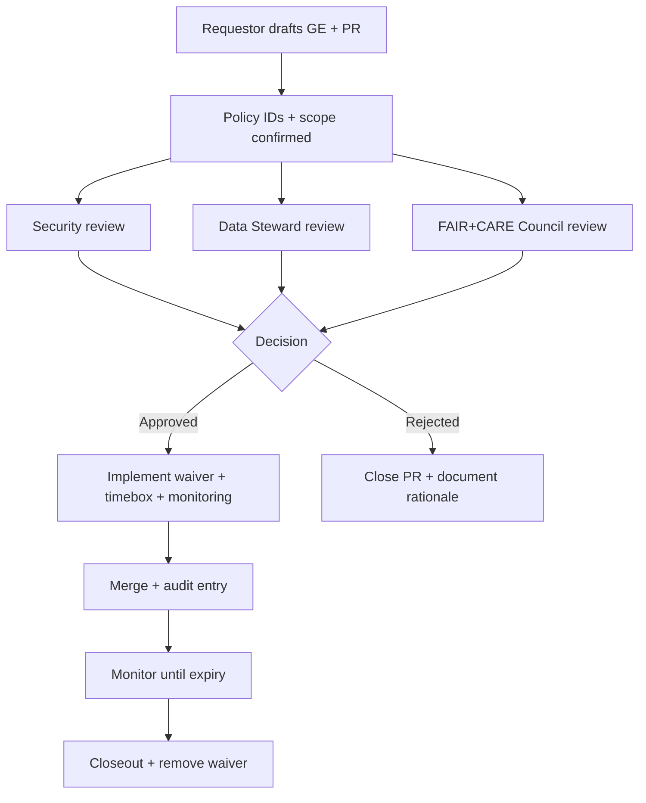

<!--
📌 TEMPLATE FILE (DO NOT FILL THIS ONE IN DIRECTLY)
✅ Copy this to a new file (example): docs/governance/exceptions/GE-YYYYMMDD-<short-slug>.md
✅ Fill it out completely, then open a PR.
✅ If the exception affects CI policy gates, add a time-bound entry to waivers.yml and link it here.

This template is designed for the Kansas Frontier Matrix (KFM) governance model:
- Provenance-first (PROV) 🧬
- Catalog-driven (DCAT/STAC) 🗂️
- FAIR + CARE + sovereignty-aware governance 🧭
- Policy-as-code (OPA/Conftest) ⚖️
- Auditability + signed/append-only records 🧾
-->

---
template: "governance-exception"
template_version: "1.0.0"
exception_id: "GE-YYYYMMDD-###"              # e.g., GE-20260122-001
title: "<short, descriptive title>"
status: "draft"                              # draft | under-review | approved | rejected | expired | revoked
created_utc: "YYYY-MM-DDTHH:MM:SSZ"

requestor:
  name: "<name>"
  role: "<role>"
  org_or_team: "<team/org>"
  contact: "<email/handle>"

sponsor:
  name: "<data steward / product owner>"
  contact: "<email/handle>"

environment_scope:
  allowed_environments: ["dev", "staging"]   # dev | staging | prod
  prod_allowed: false

policy_scope:
  policy_pack: "OPA/Conftest"
  policy_ids: ["KFM-XXX-###"]                # e.g., KFM-CAT-001, KFM-PROV-001 (add all that apply)
  waiver_required: false
  waiver_id: ""                              # e.g., WVR-20260122-002
  waiver_expires_utc: ""                     # must be set if waiver_required: true

data_scope:
  kfm_dataset_ids: ["<kfm:dataset_id>"]
  graph_nodes_or_layers: ["<node_id_or_layer_id>"]
  story_nodes: ["<story_id_if_any>"]
  api_endpoints: ["<endpoint_if_any>"]
  agents_or_automation: ["<agent_id_if_any>"]

classification:
  input_classification: "<public|internal|restricted|sovereign|other>"
  output_classification: "<public|internal|restricted|sovereign|other>"
  care_labels: ["<culturally_sensitive|community_review|...>"]
  sovereignty_authority_required: false
  sovereignty_authority_contact: ""

timebox:
  start_utc: "YYYY-MM-DDTHH:MM:SSZ"
  end_utc: "YYYY-MM-DDTHH:MM:SSZ"            # MUST be set; governance exceptions are time-bound by default
  renewal_allowed: false
  renewal_criteria: ""

review_requirements:
  fair_care_council: true
  security: true
  data_steward: true
  legal_or_licensing: false
  ui_ux_review: false
  accessibility_review: false
  sustainability_review: false

links:
  issue_or_ticket: "<link>"
  pr_link: "<link (once created)>"
  run_manifest_path: "<repo path or artifact location>"
  prov_record_path: "<repo path or URL>"
  dcat_record_path: "<repo path or URL>"
  stac_record_path: "<repo path or URL>"
  governance_ledger_entry: "<ledger entry id/link>"
---

# 🧾 Governance Exception / Waiver Request (Template)


> [!IMPORTANT]
> This document requests a **time-bound governance exception** (a.k.a. **waiver**) to KFM rules.
> - If you need a permanent change: **propose a policy update** (new/modified Rego rules + docs) instead.
> - If this is an active leak/incident (PII/sensitive data exposure): **follow Incident Response** first, then file this as a post-incident record.

---

## 🧭 Quick Navigation

- [0) Quick Summary](#-0-quick-summary)
- [1) What Rule Are We Requesting to Waive](#-1-what-rule-are-we-requesting-to-waive)
- [2) Scope & Blast Radius](#-2-scope--blast-radius)
- [3) Governance Classification & Sovereignty](#-3-governance-classification--sovereignty)
- [4) Rationale](#-4-rationale)
- [5) Risk Assessment](#-5-risk-assessment)
- [6) Mitigations & Guardrails](#-6-mitigations--guardrails)
- [7) Implementation Plan](#-7-implementation-plan)
- [8) Evidence & Provenance Attachments](#-8-evidence--provenance-attachments)
- [9) Monitoring, Audit, and Rollback](#-9-monitoring-audit-and-rollback)
- [10) Approvals & Decision](#-10-approvals--decision)
- [11) Closeout](#-11-closeout)
- [Appendix A: waivers.yml Entry Snippet](#appendix-a-waiversyml-entry-snippet)
- [Appendix B: Governance Ledger Decision Record Snippet](#appendix-b-governance-ledger-decision-record-snippet)
- [Appendix C: Definitions](#appendix-c-definitions)

---

## 🚦 Hard Stops (Non-Waivable by Default)

> [!CAUTION]
> If **any** item below applies, stop and escalate to Council/Security. Most of these are **not waiveable** except under documented emergency procedures.

- [ ] **Secrets in Git / build logs / artifacts** (credentials, tokens, private keys)
- [ ] **PII / sensitive personal data exposure** (especially public-facing)
- [ ] **Sovereignty / culturally sensitive location exposure** without authority approval
- [ ] **“Bypass the API boundary”** (e.g., UI directly querying the graph DB in prod)
- [ ] **Silent provenance loss** for public releases (publishing outputs without traceable lineage)
- [ ] **Disable audit logging** or tamper with append-only governance records
- [ ] **Expand access scope without authentication/authorization controls**

If you checked any box above, jump to: [9) Monitoring, Audit, and Rollback](#-9-monitoring-audit-and-rollback) and document as **Incident / Emergency**.

---

## 🧭 0) Quick Summary

| Field | Value |
|---|---|
| **What are you requesting?** | `<1–2 sentence summary>` |
| **Why now?** | `<time-critical reason>` |
| **Duration / timebox** | `<start → end UTC>` |
| **Who is impacted?** | `<users/systems/datasets>` |
| **Primary risk** | `<1 sentence>` |
| **Primary mitigation** | `<1 sentence>` |

---

## 🧩 1) What Rule Are We Requesting to Waive

### 1.1 Policy IDs and Deny Messages

> [!NOTE]
> KFM policy rules should be referenced by their **stable IDs** (e.g., `KFM-PROV-001`) plus the CI “deny” message (copy/paste).

| Policy ID | Category | CI / Runtime Deny Message (copy exact) | Why it triggers here | Requested exception |
|---|---|---|---|---|
| `KFM-___-___` | `<Catalog|Provenance|Sovereignty|API|Story|Security|Style>` | `<deny message>` | `<root cause>` | `<waive? narrow scope?>` |

### 1.2 Exception Type (check all that apply)

- [ ] 🗂️ **Catalog / metadata** (e.g., missing non-critical field, temporary provider contact gap)
- [ ] 🧬 **Provenance / lineage** (e.g., provisional PROV stub for dev only; pending upstream)
- [ ] 🧭 **Sovereignty / CARE** (e.g., additional review required; stricter-than-default controls)
- [ ] 🗺️ **Geospatial display** (e.g., fuzzing/aggregation rules change; zoom-level gating)
- [ ] 🤖 **AI / Focus Mode** (e.g., sandbox model test; strict non-prod controls)
- [ ] 🧱 **Security / supply chain** (e.g., temporary unsigned artifact in dev; SBOM pending)
- [ ] 🧪 **Experimental simulation / AR / 4D** (e.g., prototype only; no production export)
- [ ] 📦 **Offline pack / field bundle** (e.g., encryption + time-limited key distribution)

### 1.3 Why a Waiver (not a Policy Change)?

- **Why can’t we comply right now?**  
  `<explain the blocker and why it is temporary>`

- **What is the plan to eliminate the need for this waiver?**  
  `<concrete fix + owner + date>`

---

## 🎯 2) Scope & Blast Radius

### 2.1 Affected Systems & Surfaces

Check all that apply and list specifics:

- [ ] 🌐 UI layer(s) / map tiles / overlays  
  - `layer_id(s)`: `<...>`
  - `zoom levels`: `<...>`
- [ ] 🧠 Focus Mode / AI answer generation  
  - `model/version`: `<...>`
  - `prompt gate / policy checks impacted`: `<...>`
- [ ] 🔌 API endpoints  
  - `endpoint(s)`: `<...>`
  - `auth changes`: `<...>`
- [ ] 🧬 Provenance records (PROV JSON-LD / PROV-O)  
  - `prov activity ids`: `<...>`
- [ ] 🗂️ Catalog records (DCAT)  
  - `dcat ids`: `<...>`
- [ ] 🛰️ STAC assets (Collections/Items)  
  - `stac collection/item ids`: `<...>`
- [ ] 🕸️ Knowledge graph (Neo4j / CSV snapshots)  
  - `node ids`: `<...>`
- [ ] 🤖 Agents / automation pipeline  
  - `agent id`: `<...>`
  - `kill-switch needed?`: `<yes/no>`
- [ ] 📦 OCI artifacts (ORAS/registry)  
  - `artifact digest`: `<...>`
  - `cosign signature?`: `<yes/no>`

### 2.2 Who/What Can Be Harmed?

- **Primary stakeholder(s):** `<community, agencies, researchers, public>`  
- **Secondary stakeholder(s):** `<...>`  
- **Worst-case misuse scenario:** `<...>`  
- **Likelihood of misuse:** `<low/med/high + why>`

---

## 🔐 3) Governance Classification & Sovereignty

### 3.1 Classification Inputs → Outputs (Propagation)

> [!IMPORTANT]
> KFM treats classification as **sticky**: outputs must remain **at least as restricted** as inputs unless outputs are **provably redacted/aggregated** into a new, safe artifact and approved.

| Item | Classification | CARE / Sovereignty Label(s) | Notes |
|---|---|---|---|
| **Input(s)** | `<public/internal/restricted/sovereign>` | `<labels>` | `<...>` |
| **Output(s)** | `<public/internal/restricted/sovereign>` | `<labels>` | `<...>` |

- [ ] Output classification is **NOT less restricted** than any input  
- [ ] If classification changes, explain **how the transformation makes it safe** (redaction, fuzzing, aggregation, access gating)

### 3.2 Authority & Community Review (if applicable)

- **Is this Indigenous / culturally sensitive / sovereignty-scoped data?** `<yes/no>`  
- **Authority to control (approver):** `<name/role/org>`  
- **Community liaison / reviewer:** `<name/handle>`  
- **Review evidence attached:** `<link>`  

> [!TIP]
> For sensitive locations (e.g., heritage sites), describe any **coordinate fuzzing**, **resolution reduction**, **delayed release**, or **zoom gating** you will enforce.

---

## 🧠 4) Rationale

### 4.1 Business / Research Need

- **Objective:** `<what outcome are we trying to achieve?>`
- **Why KFM needs the exception:** `<why this can’t be done within normal policy>`
- **Why the timebox is appropriate:** `<why end date is safe & realistic>`

### 4.2 Alternatives Considered (must include at least 2)

| Alternative | Why it doesn’t work | Residual risk vs waiver |
|---|---|---|
| `<alt #1>` | `<...>` | `<...>` |
| `<alt #2>` | `<...>` | `<...>` |

---

## 🧨 5) Risk Assessment

### 5.1 Risk Matrix (fill all rows)

Score each: **Likelihood (1–5)** and **Impact (1–5)**, then **Risk = L×I**.

| Risk Area | Likelihood (1–5) | Impact (1–5) | Risk | Notes |
|---|---:|---:|---:|---|
| ⚖️ Legal / licensing |  |  |  | `<license ambiguity, attribution issues, terms>` |
| 🧬 Integrity / scientific trust |  |  |  | `<provenance gaps, reproducibility>` |
| 🔐 Privacy / sensitive locations |  |  |  | `<PII, doxxing, looting risk, misuse>` |
| 🧭 Sovereignty / CARE |  |  |  | `<authority, community benefit/harm>` |
| 🛡️ Security / supply chain |  |  |  | `<SBOM/SLSA, signature, dependency risk>` |
| 🧪 Model/AI reliability |  |  |  | `<bias, hallucination risk, drift>` |
| ♿ Accessibility |  |  |  | `<UI changes, readability, alt text>` |
| 🌱 Sustainability |  |  |  | `<compute cost, energy report needed?>` |
| 🧯 Operational / rollback |  |  |  | `<can we revert cleanly?>` |

### 5.2 “Trust Break” Test

- **If this went public tomorrow, would we be proud of the audit trail?** `<yes/no + why>`
- **Could a reviewer reproduce / verify outputs?** `<yes/no + how>`
- **Would a community stakeholder feel respected & protected?** `<yes/no + why>`

---

## 🛡️ 6) Mitigations & Guardrails

### 6.1 Required Guardrails (check + describe)

- [ ] **Timebox enforced** (waiver expires automatically)  
  - How enforced: `<CI gate, runtime check, scheduled job, etc.>`
- [ ] **Access control enforced** (RBAC + least privilege)  
  - Roles/groups: `<...>`
- [ ] **Audit logging enabled** (who accessed what, when)  
  - Log location: `<...>`
- [ ] **UI disclosure** (labels/banners/lock icons in UI)  
  - Where shown: `<Layer Provenance panel, Focus Mode audit panel, dataset page>`
- [ ] **Export controls** (prevent export or add mandatory provenance bundle)  
  - Controls: `<disable export / watermark / attach PROV/DCAT/STAC>`
- [ ] **Data minimization** (aggregation, fuzzing, redaction)  
  - Method: `<k-anonymity-like aggregation, coordinate fuzzing, rounding, binning>`
- [ ] **Simulation/AR safeguards** (no precise overlays, no offline leakage)  
  - Method: `<...>`
- [ ] **Agent safeguards** (no auto-merge; kill-switch ready)  
  - Method: `<...>`
- [ ] **Supply chain** (SBOM + SLSA + signing)  
  - Method: `<attach attestations; require cosign; pin digests>`

### 6.2 Extra Mitigations (optional but encouraged)

- [ ] Independent peer review of outputs (separate reviewer runs pipeline)
- [ ] Canary rollout (limited users first)
- [ ] “Fail closed” fallback (if checks fail → deny access / block release)
- [ ] Monitoring alerts (thresholds defined below)

---

## 🧰 7) Implementation Plan

### 7.1 What Changes Will Be Made?

Describe *exactly* what will change and where:

- **Code changes:** `<files/modules>`
- **Data changes:** `<dataset files, generated outputs>`
- **Metadata changes:** `<DCAT/STAC fields>`
- **Provenance changes:** `<PROV activities/entities/agents>`
- **Policy/waiver changes:** `<waivers.yml + referenced policy ids>`
- **UI changes:** `<labels, warnings, access prompts, provenance panels>`

### 7.2 Step-by-Step Checklist (fill + check)

- [ ] Create PR with this exception file + supporting changes
- [ ] Add/update PROV record(s) linking inputs → activities → outputs
- [ ] Update DCAT record(s) and ensure STAC/DCAT/PROV cross-links are intact
- [ ] Add waiver entry (if needed) with strict scope + expiration
- [ ] Run pipeline deterministically and generate **run_manifest.json**
- [ ] Produce signed attestations (SBOM/SLSA/cosign) if artifacts are built/distributed
- [ ] Verify policy gates (all non-waived checks must pass)
- [ ] Add UI disclosures / governance flags
- [ ] Define monitoring + rollback steps
- [ ] Collect approvals (Council + Security + Steward)
- [ ] Merge only when approvals + CI green + timebox set

---

## 🧾 8) Evidence & Provenance Attachments

> [!NOTE]
> Attach enough evidence that an auditor can answer: **what happened, why, who approved, and how to reproduce**.

### 8.1 Required Links (fill all that apply)

- **Run manifest:** `<path>`  
  - Canonical digest (RFC8785 JSON canonicalization): `<sha256:...>`
- **PROV JSON-LD:** `<path>`
- **DCAT record:** `<path>`
- **STAC collection/items:** `<path>`
- **Governance ledger entry:** `<id/link>`
- **PR link:** `<link>`
- **Issue/ticket:** `<link>`

### 8.2 Supply Chain Artifacts (if applicable)

- **OCI artifact reference + digest:** `<registry/ref@sha256:...>`
- **Cosign signature reference:** `<...>`
- **SBOM (SPDX/CycloneDX):** `<...>`
- **SLSA attestation:** `<...>`

### 8.3 Reproducibility Notes

- **How to reproduce (commands, env, seeds):**  
  `<steps here>`

- **Known limitations / non-determinism:**  
  `<...>`

---

## 👀 9) Monitoring, Audit, and Rollback

### 9.1 Monitoring Plan (minimum)

| Signal | Where measured | Threshold | Action on breach |
|---|---|---|---|
| Policy gate failures | CI / runtime OPA | `<...>` | `<block/alert>` |
| Sensitive access events | audit logs | `<...>` | `<alert + review>` |
| Data drift / anomaly | graph health checks | `<...>` | `<flag + pause>` |
| AI reliability issues | Focus Mode audit panel / logs | `<...>` | `<fallback/refuse>` |

### 9.2 Rollback Plan (must be explicit)

- **Rollback trigger(s):** `<what events force rollback>`
- **Rollback steps (GitOps):**
  1. `<revert commit / restore prior metadata>`
  2. `<redeploy / resync DB from repo snapshots>`
  3. `<invalidate caches / revoke tokens>`
  4. `<confirm state via audits>`
- **If sensitive data leaked:**  
  - [ ] Flip classification to restricted immediately  
  - [ ] Remove artifacts & purge history where required  
  - [ ] Notify Council/Security and record incident/post-mortem  
  - [ ] Add/strengthen policy rule to prevent recurrence

### 9.3 Agent Kill-Switch (if agents involved)

- **Kill-switch location / method:** `<where + how it’s triggered>`
- **When to trigger it:** `<conditions>`

---

## ✅ 10) Approvals & Decision

### 10.1 Review Flow (recommended)



### 10.2 Sign-Off Table

| Role | Name | Decision | Date | Notes |
|---|---|---|---|---|
| Requestor | `<...>` | `<approve>` | `<YYYY-MM-DD>` | `<...>` |
| Data Steward | `<...>` | `<approve/reject>` | `<...>` | `<...>` |
| Security | `<...>` | `<approve/reject>` | `<...>` | `<...>` |
| FAIR+CARE Council | `<...>` | `<approve/reject>` | `<...>` | `<...>` |
| Maintainer (merge authority) | `<...>` | `<approve/reject>` | `<...>` | `<...>` |
| Legal/Licensing (if needed) | `<...>` | `<approve/reject>` | `<...>` | `<...>` |

### 10.3 Decision Summary

- **Decision:** `Approved / Rejected / Approved with conditions`
- **Conditions (if any):**  
  - `<condition #1>`
  - `<condition #2>`
- **Expiry:** `<UTC end time>`
- **Required closeout tasks:** `<...>`

---

## 🧹 11) Closeout

> [!IMPORTANT]
> Governance exceptions must be **closed** (or renewed) before expiry. Renewal requires a new review.

### 11.1 Closeout Checklist

- [ ] Waiver removed / expired and no longer needed
- [ ] Root cause fixed (or permanent policy change proposed)
- [ ] Monitoring confirmed “no adverse events”
- [ ] Provenance + catalog records remain correct and linked (DCAT ↔ STAC ↔ PROV)
- [ ] UI disclosures removed or converted into standard UX patterns
- [ ] Governance ledger updated with closure entry
- [ ] Retrospective notes added (what we learned)

### 11.2 Retrospective Notes

- **What worked:** `<...>`
- **What failed / surprised us:** `<...>`
- **Policy or process improvements proposed:** `<...>`

---

# Appendix A: waivers.yml Entry Snippet

> [!NOTE]
> Keep waivers **narrow**, **time-bound**, and **fully explained**. Prefer waiving a single policy ID for a single PR/dataset.

```yaml
# Example only — adapt to your repo’s actual waivers.yml schema
- waiver_id: "WVR-YYYYMMDD-###"
  exception_id: "GE-YYYYMMDD-###"
  policy_id: "KFM-XXX-###"
  scope:
    pr: "<PR number or URL>"
    datasets: ["<kfm:dataset_id>"]
    paths: ["<path/glob if supported>"]
    environments: ["dev", "staging"]   # avoid prod unless Council explicitly approves
  reason: "<why this waiver is needed>"
  mitigations: "<summary of guardrails>"
  created_utc: "YYYY-MM-DDTHH:MM:SSZ"
  expires_utc: "YYYY-MM-DDTHH:MM:SSZ"
  approvers:
    - "<name/role>"
    - "<name/role>"
  links:
    exception_doc: "docs/governance/exceptions/GE-YYYYMMDD-<slug>.md"
```

---

# Appendix B: Governance Ledger Decision Record Snippet

> [!NOTE]
> The governance ledger should be append-only and auditable. Use this snippet as a minimum shape.

```json
{
  "review_id": "LEDGER-YYYYMMDD-###",
  "exception_id": "GE-YYYYMMDD-###",
  "waiver_id": "WVR-YYYYMMDD-###",
  "timestamp_utc": "YYYY-MM-DDTHH:MM:SSZ",
  "decision": "approved_with_conditions",
  "policy_ids": ["KFM-XXX-###"],
  "scope": {
    "datasets": ["kfm:dataset:..."],
    "environments": ["staging"]
  },
  "conditions": [
    "Timebox ends at 2026-02-01T00:00:00Z",
    "Export disabled for restricted layer"
  ],
  "approvals": [
    {"role": "security", "name": "…", "approved": true},
    {"role": "council", "name": "…", "approved": true}
  ],
  "evidence": {
    "pr": "<link>",
    "run_manifest": "<path>",
    "prov": "<path>",
    "sbom": "<path>"
  }
}
```

---

# Appendix C: Definitions

- **DCAT** 🗂️: Dataset discovery/catalog metadata.
- **STAC** 🛰️: Spatiotemporal Asset Catalog (geospatial assets/collections/items).
- **PROV / PROV-O** 🧬: W3C provenance model for lineage (entities, activities, agents).
- **OPA / Rego** ⚖️: Policy engine + policy language (policy-as-code).
- **Conftest** 🧪: Runs OPA policies against config/data in CI.
- **SBOM** 🧾: Software Bill of Materials (what’s inside an artifact).
- **SLSA** 🛡️: Supply-chain security framework for build provenance.
- **OCI / ORAS** 📦: Artifact distribution standard + tooling for non-container artifacts.
- **CARE** 🧭: Collective benefit, Authority to control, Responsibility, Ethics (esp. Indigenous data governance).
- **Timebox** ⏳: A strict start/end window after which access is revoked and waiver expires.
- **Fail-closed** 🔒: If checks can’t be performed, default is deny/block until reviewed.

---

## 📚 Reference Library (for context)

> [!TIP]
> Keep these documents close when proposing exceptions—especially those touching sovereignty, provenance, AI outputs, and exports.

- 📘 Kansas Frontier Matrix (KFM) – Comprehensive Technical Documentation
- 📗 Kansas Frontier Matrix (KFM) – Comprehensive Architecture, Features, and Design
- 🧭 Kansas Frontier Matrix (KFM) – AI System Overview
- 🖥️ Kansas Frontier Matrix – Comprehensive UI System Overview
- 📥 Kansas Frontier Matrix (KFM) Data Intake – Technical & Design Guide
- 💡 Kansas Frontier Matrix – Latest Ideas & Future Proposals
- 🚀 Innovative Concepts to Evolve the Kansas Frontier Matrix (KFM)
- 🧠 AI Concepts & more
- 🗺️ Maps / Virtual Worlds / Archaeological / Geospatial WebGL
- 🧰 Various programming languages & resources
- 🗄️ Data Management theories / architectures / Bayesian methods / data science ideas
- 🧪 Scientific Method / Research / Master Coder Protocol Documentation
- 🧩 Additional Project Ideas
