<div align="center">

# 🔬 Kansas-Frontier-Matrix — MCP Experiments (`mcp/experiments/`)

**Mission:** Provide a **reproducible laboratory** for all experiments,  
built on the **Master Coder Protocol (MCP)** principles:  
**documentation-first, reproducibility, provenance, and safety**.  

[](../../.github/workflows/site.yml)  
[](../../.github/workflows/tests.yml)  
[](../../.github/workflows/stac-validate.yml)  
[](../../.github/workflows/stac-badges.yml)  

[](../../.github/workflows/codeql.yml)  
[](../../.github/workflows/trivy.yml)  
[](../../.github/workflows/secret-scanning.yml)  
[](../../.github/workflows/ossf-scorecard.yml)  

[](../../.github/workflows/roadmap.yml)  
[](../../.github/workflows/labels.yml)  
[](../../.github/workflows/pr-labeler.yml)  
[](../../.github/workflows/automerge.yml)  

  
  
  

</div>

---

## 🎯 Purpose

The `mcp/experiments/` directory is the **laboratory space** of the Kansas-Frontier-Matrix.  
Every experiment here:

- Documents a **clear hypothesis** and **success criteria**  
- Tracks **inputs, configs, and provenance** (STAC, sources, hashes)  
- Produces **deterministic outputs** (COGs, reports, figures)  
- Ensures **reproducibility** with `commands.sh` and `params.yaml`  
- Connects to the **roadmap** for milestones, labels, and automation  

---

## 📂 Layout

```

mcp/experiments/
├── template/              # Reusable scaffold (copy this to start a new experiment)
│   ├── README.md
│   ├── commands.sh
│   ├── params.yaml
│   ├── results/
│   ├── provenance/
│   ├── env/
│   └── figures/
├── EXP-20250101-hillshade/
│   ├── README.md          # Experiment log
│   ├── commands.sh        # Deterministic run script
│   ├── results/           # Metrics, STAC reports
│   ├── provenance/        # git SHA, artifact hashes
│   └── figures/           # Outputs (visuals)
└── ...

````

---

## 🧩 How to Start a New Experiment

1. **Copy the template:**

```bash
cp -r mcp/experiments/template mcp/experiments/EXP-2025XXXX-my-study
````

2. **Edit metadata + params:**

```bash
$EDITOR mcp/experiments/EXP-2025XXXX-my-study/README.md
$EDITOR mcp/experiments/EXP-2025XXXX-my-study/params.yaml
```

3. **Run it:**

```bash
bash mcp/experiments/EXP-2025XXXX-my-study/commands.sh
```

4. **Commit results (text/JSON)**
   Large rasters/vectors → use Git LFS or DVC.

```bash
git add mcp/experiments/EXP-2025XXXX-my-study
git commit -m "EXP: run EXP-2025XXXX-my-study (reproducible)"
```

---

## 🔄 Lifecycle

```mermaid
flowchart TD
  A["Hypothesis & Metadata"] --> B["Run commands.sh"]
  B --> C["Results\nmetrics.json · stac_report.json"]
  B --> D["Provenance\ngit SHA · artifact hashes"]
  B --> E["Figures\nvisualizations, outputs"]
  C --> F["Interpretation\ncompare to success criteria"]
  F --> G["Roadmap Integration\nlabels, milestones, issues"]
```



<!-- END OF MERMAID -->

---

## 🧮 Validation & CI

Experiments are tied into CI/CD via **Make targets**:

```bash
make stac-validate       # validate STAC items/collections
make config-validate     # check viewer configs
make site                # rebuild viewer (optional if outputs are UI-facing)
```

Artifacts (`stac_report.json`, hashes, env files) can be uploaded in CI for provenance.

---

## 📑 Roadmap Integration

Each experiment should link to milestones and roadmap via stable keys:

```markdown
<!-- roadmap:key=exp-<stable-key> -->
```

* Auto-labeled via `labels.yml` + `roadmap.yml`
* Auto-tracked in issues/PRs
* Ensures roadmap stays in sync with experimental progress

---

## ✅ Checklist for Experiments

* [ ] Metadata filled (`EXP-YYYYMMDD-slug`, owners, status, scope)
* [ ] Clear **objective & hypothesis** documented
* [ ] Inputs referenced via **STAC/source descriptors**
* [ ] Deterministic commands captured in `commands.sh`
* [ ] Environment + git SHA recorded in `env/` + `provenance/`
* [ ] Outputs stored in `results/` + `figures/`
* [ ] Provenance hashes (`artifact_hashes.txt`) updated
* [ ] Roadmap marker added (`<!-- roadmap:key=... -->`)

---

## 📚 References

* [MCP Experiment Template](./template/README.md)
* [SOPs (`mcp/sops/`)](../sops/)
* [Roadmap (`.github/roadmap/`)](../../.github/roadmap/)
* [STAC Catalog (`/stac/`)](../../stac/)

---

## ✅ Summary

`mcp/experiments/` is the **MCP-grade laboratory** for Kansas-Frontier-Matrix.
Every experiment here is **reproducible, auditable, and roadmap-linked**.
Follow the template, log everything, and let CI enforce **provenance + reproducibility**.
