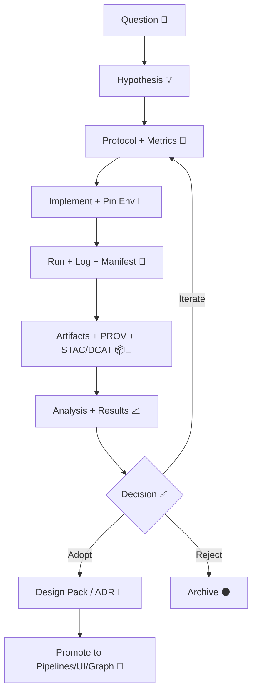

# 🧪 MCP Experiments — YYYY


-brightgreen)


-red)

> **This folder is the year-based “lab notebook” for KFM experiments under MCP (Methods, Controls & Processes).**  
> Every experiment here should be **reproducible**, **evidence-backed**, and **reviewable** — the goal is to turn ideas into validated building blocks (or retire them fast, with receipts 🧾).

> [!TIP]
> Replace `YYYY` with the actual year (e.g., `2026`) and keep one README per year so we can build an *audit trail over time*.

---

## 🧭 Quick Links

- 🧩 **MCP Home:** `../../README.md`
- 🧪 **Experiments Home:** `../README.md`
- 🧱 **Architecture / Design:** `../../../docs/`
- ✅ **SOPs & Governance:** `../../sops/`
- 🧰 **Templates:** `../../templates/`
- 📦 **Artifacts / Releases:** `../../../artifacts/` (or your chosen registry + index)

---

## 🎯 What “Counts” as an Experiment?

If it changes **outputs, decisions, or user experience** and you’re not 100% sure what will happen, it’s an experiment:

- 🤖 **AI / Focus Mode**: prompt routing, retrieval strategies, citation enforcement, safety controls, eval harnesses
- 🧬 **Graph + Ontology**: schema evolution, relationship rules, entity resolution, “concept nodes”
- 🛰️ **Geo + Data**: ingestion transforms, new sources, projections, tiling formats, PMTiles/COG/GeoParquet pipelines
- 🗺️ **UI / Storytelling**: story playback UX, timeline behavior, layer controls, Story Builder prototypes, AR scenes
- 🧪 **Ops + Reliability**: monitoring, drift detection, graph health checks, CI policy gates, deterministic pipelines

---

## 🧠 MCP Experiment Principles

> [!IMPORTANT]
> **If it can’t be reproduced, it didn’t happen.**  
> **If it can’t be cited, it’s a hypothesis — not a fact.**

**Golden rules (non-negotiable):**
- 🧾 **Evidence-first**: claims must trace to datasets, queries, or sources.
- 🧬 **Provenance-first**: every output must be linked to inputs + process.
- 🧱 **Deterministic-by-default**: idempotent runs, stable IDs, repeatable results.
- 🔒 **Policy gates fail closed**: missing licenses/metadata/provenance = no merge.
- 🧑‍⚖️ **Human-in-the-loop**: automation can propose; humans approve what becomes “real”.

---

## 🗂️ Year Folder Layout

This is the recommended structure for `mcp/experiments/YYYY/`:

```text
mcp/experiments/YYYY/
├── README.md                # 📌 You are here (year index + rules)
├── _assets/                 # 🖼️ Shared images, diagrams, screenshots for this year
├── _reports/                # 📚 Year-level rollups (quarterly, annual summaries)
├── EXP-001-short-slug/      # 🧪 Individual experiment folders
├── EXP-002-short-slug/
└── EXP-999-template/        # 🧰 Optional: frozen copy of the template for easy cloning
```

---

## 🧾 Experiment Index (Update This As You Go)

> Keep this table current. It becomes the “map of work” for the year.

| ID | Title | Domain | Status | Start | Owner(s) | Key Result |
|---:|---|---|---|---|---|---|
| EXP-001 | _TBD_ | AI / Data / UI / Ops | Proposed | YYYY-MM-DD | @you | _TBD_ |
| EXP-002 | _TBD_ |  |  |  |  |  |

**Status vocabulary**
- 🟡 **Proposed** → 🟦 **Running** → 🟢 **Completed** → ⚫ **Archived**
- 🔁 **Superseded** is allowed (link to replacement experiment)

---

## 🚀 Start a New Experiment (5-Minute “Kickoff”)

1. 🆕 Create a folder: `EXP-###-short-slug/`
2. 🧪 Copy the template files (see below) into the folder
3. ✍️ Write the **question + hypothesis + success metrics**
4. 🧱 Pin the environment (container/requirements) + record dataset versions
5. ▶️ Run it, produce artifacts + provenance, write results
6. ✅ Open a PR with:
   - a short summary
   - output links / artifact digests
   - what you learned
   - what you recommend next

---

## 🧰 Experiment Folder Template

```text
EXP-###-short-slug/
├── README.md                 # 🧠 1-page executive summary (what/why/result)
├── protocol.md               # 🧪 MCP protocol (question → method → analysis)
├── experiment.yaml           # 🗂️ machine-readable metadata (IDs, inputs, metrics)
│
├── env/                      # 🧱 reproducible environment
│   ├── Dockerfile            # (preferred) or
│   ├── requirements.txt
│   └── environment.yml
│
├── src/                      # 🧩 scripts / modules
├── notebooks/                # 📓 exploratory work (must still be reproducible)
├── configs/                  # ⚙️ config files used in runs
│
├── data/                     # 🧊 keep light — store pointers, not massive blobs
│   ├── inputs/               # dataset pointers + manifests (no raw dumps unless small)
│   └── outputs/              # small derived outputs or index files
│
├── outputs/                  # 📈 figures, tables, intermediate results
├── report/                   # 🧾 final narrative results (what happened + why)
│   └── RESULTS.md
│
├── logs/                     # 🧵 run logs (NDJSON recommended)
├── audits/                   # 🔍 run manifests + policy reports (if used)
│   └── run_manifest.json
│
├── prov/                     # 🧬 provenance bundles (PROV JSON-LD, etc.)
├── stac/                     # 🛰️ STAC Items/Collections for experiment artifacts
├── dcat/                     # 🗃️ DCAT dataset records (if experiment creates datasets)
│
└── artifacts/                # 📦 artifact references (OCI digests, checksums, SBOMs)
    └── artifact_index.md
```

---

## 🧾 `experiment.yaml` (Suggested Minimal Schema)

> Keep it boring and consistent — it enables automation later 🤖

```yaml
id: EXP-###-short-slug
year: YYYY
title: "..."
status: proposed|running|completed|archived|superseded
owners:
  - handle: "@yourname"
domains: [ai, ui, pipeline, graph, ops, governance]

question: "What are we trying to learn?"
hypothesis: "If we do X, then Y will improve because Z."
success_metrics:
  - id: metric.example
    target: ">= 0.95"
    measure: "definition + calculation method"

inputs:
  datasets:
    - id: dataset.catalog.id
      license: "..."
      sensitivity: public|restricted|confidential
      pointers:
        - "stac/item.json"
        - "dcat/dataset.json"
  configs:
    - "configs/config.yaml"

environment:
  container_image: "ghcr.io/ORG/IMAGE:tag"
  container_digest: "sha256:..."
  tool_versions:
    python: "3.11.x"
    gdal: "..."
    node: "..."

runs:
  - run_id: "YYYYMMDD-HHMM-<short>"
    seed: 42
    manifest: "audits/run_manifest.json"
    prov_bundle: "prov/prov.jsonld"
    outputs:
      - "report/RESULTS.md"
      - "outputs/"

artifacts:
  - kind: dataset|model|tiles|report
    location: "artifacts/artifact_index.md"

decision:
  outcome: adopt|iterate|reject|park
  promoted_to:
    - "ADR-###"
    - "pipeline/<name>"
notes: "Any extra context"
```

---

## 🧪 `protocol.md` (MCP Scientific Method Skeleton)

```markdown
# Protocol — EXP-### (Title)

## 1) Question
- ...

## 2) Hypothesis
- ...

## 3) Method (Plan)
- Inputs:
- Controls / baselines:
- Variables:
- Procedure:
- Risks & mitigations:
- Governance constraints (licenses/sensitivity/ethics):

## 4) Execution
- Run commands / steps:
- Environments used:
- Run IDs:

## 5) Analysis
- Metrics:
- Statistical notes:
- Failure modes:
- Surprises:

## 6) Conclusion
- Supported? (Y/N/Partial)
- Recommendation: adopt / iterate / reject / park
- Follow-ups:
```

---

## 🔒 Governance, Sensitivity, and “Do No Harm” 🛡️

Experiments can touch sensitive things (precise locations, restricted datasets, cultural data, PII).  
**Every experiment must declare:**
- 🔐 **Sensitivity level** (public/restricted/confidential)
- 🧭 **Location handling** (exact vs generalized)
- 📜 **License & reuse constraints**
- 🤝 **CARE alignment** (authority to control, responsibility, ethics)

> [!CAUTION]
> If an experiment uses or generates sensitive location data, store *generalized* outputs by default and keep exact geometry behind access controls.

---

## ✅ Policy Gates (Fail-Closed)

Treat CI as a safety rail, not a speed bump.

**Common gates we enforce:**
- ✅ every dataset has a license + sensitivity tag
- ✅ no secrets / tokens / private keys in repo
- ✅ required metadata present (STAC/DCAT/PROV where applicable)
- ✅ provenance links exist (no orphan outputs)
- ✅ experiment outputs reference their run manifest + environment

> [!NOTE]
> Gates should be easy to satisfy *when you do the right thing* — painful only when you skip steps.

---

## 🧬 Provenance & Reproducibility Contract

### Minimum “Repro Pack” for any significant run
- 🧾 `audits/run_manifest.json` (inputs/outputs/tool versions/summary counts)
- 🧬 `prov/` bundle linking inputs → process → outputs
- 🧱 pinned environment (container digest preferred)
- 🧠 results narrative (`report/RESULTS.md`)
- 📦 artifact references (checksums or OCI digests)

### Recommended: Run Manifest Pattern
Store a **self-identifying** run manifest:
- canonicalize JSON (stable hashing)
- compute a SHA-256 `canonical_digest`
- use the digest as an immutable run identity

This makes experiments idempotent and auditable.

---

## 📦 Artifact Storage (When Git Isn’t Enough)

For large artifacts (PMTiles, GeoParquet, model weights, big rasters):
- ✅ Store **pointers + metadata** in Git
- 📦 Store binaries in a registry/object store (OCI registry recommended)
- 🔏 Sign artifacts when possible (provenance + integrity)

Keep `artifacts/artifact_index.md` human-readable, e.g.:

```markdown
# Artifacts — EXP-###

| Kind | Name | Ref | Digest | Notes |
|---|---|---|---|---|
| tiles | surficial_geology.pmtiles | ghcr.io/...:2026-01-11 | sha256:... | Kansas statewide |
| dataset | hydro_obs.geoparquet | ghcr.io/...:v1 | sha256:... | hourly ingest |
```

---

## 🤖 Human-in-the-Loop Automation (Watcher → Planner → Executor)

KFM automation should behave like an **assistant**, not an unaccountable actor:

- 👀 **Watcher**: detects triggers (new data, anomalies, broken SLAs, drift)
- 🧠 **Planner**: proposes an experiment plan + expected outcomes
- 🛠️ **Executor**: runs the plan in a controlled environment, produces artifacts + provenance
- ✅ **Human**: reviews, signs off, merges/promotes

> [!TIP]
> If a watcher auto-generates content (e.g., a “pulse”), require a reviewer and attach the evidence manifest.

---

## 🧩 KFM-Aligned Experiment Themes (Good Targets)

### 🌊 1) Real-time “Pulse” content + anomaly detection
- Geotagged short narratives tied to regions/datasets
- Watchers trigger based on sensor anomalies or pattern detection
- Must include evidence manifests + provenance

### 🧠 2) Conceptual Attention Nodes + thematic navigation
- Promote “concepts” to first-class graph entities (drought, biodiversity, railroads…)
- Evaluate: discovery UX, query relevance, AI grounding quality

### 🗺️ 3) Story Nodes & Story Builder
- Stories are file-based (Markdown + JSON config)
- Experiments can test: citation UX, step playback, timeline sync, authoring workflow

### 🛰️ 4) Temporal simulation & AR / hybrid storytelling
- “4D” thinking: time-travel through layers, guided tours, scenario playback
- Prototype AR “scenes” that reuse existing APIs/graph data

### 📦 5) Deterministic ingestion patterns
- exactly-once ingestion, idempotent merges, stable identifiers
- evaluate: rerun safety, duplication rate, latency, lineage completeness

---

## 📏 Metrics & Evaluation (Pick Metrics Before You Run)

**AI / Focus Mode**
- citation coverage (% statements with support)
- groundedness / factuality (human or benchmark eval)
- refusal rate (correct refusals vs false refusals)
- latency (P50/P95)
- drift (quality over time)

**Pipelines**
- idempotency (same inputs → same outputs)
- schema validation pass rate
- provenance completeness (no orphan outputs)
- SLA freshness (time since last update)

**UI**
- time-to-insight (task completion time)
- error rate / confusion points
- “trust actions” (did users click evidence?)
- accessibility checks

**Graph**
- orphan node rate
- query performance (p95)
- entity resolution precision/recall

---

## 🏁 Promotion Path: From Experiment → Product

When an experiment “wins” 🟢:

1. 🧾 Write a short decision summary in `report/RESULTS.md`
2. 🧱 Create/Update a **Design Pack** or ADR describing the promoted change
3. ✅ Add tests + policy rules + docs
4. 🚚 Wire it into ingestion / graph / API / UI
5. 📣 Announce via release notes / changelog

When it “loses” ⚫:
- archive it with the results + why, and link any follow-on ideas

---

## 🧬 Lifecycle Diagram (MCP-Friendly)



---

## 📚 Suggested Year Rollups (Optional, But Powerful)

Add quarterly/annual rollups to `_reports/`:
- ✅ what shipped
- ❌ what failed + why
- 📈 what metrics improved
- 🧭 what to do next year

---

## 🧾 Mini-Checklist (Before You Merge)

- [ ] `experiment.yaml` completed (inputs, metrics, owners, status)
- [ ] environment pinned (container digest or frozen deps)
- [ ] run manifest present + stable run_id
- [ ] provenance bundle present (or explicitly “N/A” with reason)
- [ ] artifacts referenced (checksums/digests)
- [ ] results written in `report/RESULTS.md`
- [ ] sensitivity + license declared
- [ ] no large raw blobs committed accidentally

---

## 🧰 FAQ

**Q: Where do big files go?**  
A: Prefer artifact storage (OCI registry/object store). Keep Git for manifests, indexes, and small samples.

**Q: Can notebooks live here?**  
A: Yes — but they must be runnable, versioned, and backed by pinned environments.

**Q: Do we really need provenance for UI experiments?**  
A: If the UI experiment generates claims, derived datasets, or publishable narratives → yes.  
If it’s purely layout/interaction and doesn’t generate new data, provenance can be “N/A” (document why).

---

## 🏷️ Glossary (Tiny, But Useful)

- **MCP**: Methods, Controls & Processes (the operational backbone)
- **PROV**: provenance graph describing how outputs were produced
- **STAC/DCAT**: structured catalogs for data + assets
- **Evidence Manifest**: explicit list of sources supporting claims/narratives
- **OCI Artifacts**: content-addressed packages (optionally signed)

---

_✅ Keep it tight. Keep it honest. Keep it reproducible._ 🚀
