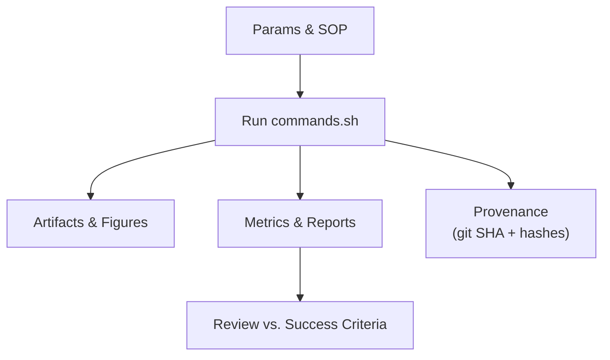

<div align="center">

# 🔬 Kansas-Frontier-Matrix — MCP Experiment Template  
### `mcp/experiments/template/`

**Mission:** Provide a **deterministic scaffold** for experiments, ensuring reproducibility, provenance, and MCP-grade rigor.  

[](../../../.github/workflows/site.yml)  
[](../../../.github/workflows/tests.yml)  
[](../../../.github/workflows/stac-validate.yml)  
[](../../../.github/workflows/stac-badges.yml)  

[](../../../.github/workflows/codeql.yml)  
[](../../../.github/workflows/trivy.yml)  
[](../../../.github/workflows/roadmap.yml)  
[](../../../.github/workflows/automerge.yml)  

  
  
  

</div>

---

## 📂 How to Use

> Copy this folder and rename to:  
> `mcp/experiments/EXP-YYYYMMDD-<slug>/`

Each experiment must remain **self-contained** and **deterministic**.

---

## 0) Metadata

- **Experiment ID:** `EXP-YYYYMMDD-<slug>`  
- **Owner(s):** @you  
- **Status:** ☐ Planned ☐ Running ☐ Completed ☐ Abandoned  
- **Scope areas:** `data` | `stac` | `web` | `src` | `scripts` | `ci` | `docker`  
- **Related issues/PRs:** Fixes #…, Relates #…  
- **Milestone:** `m1-data` | `m2-analytics` | `m3-story` | `m4-tech` | `m5-mcp`  

---

## 1) Objective / Hypothesis

- **Question:** …  
- **Hypothesis:** …  
- **Success criteria:** …  

---

## 2) Inputs & Bounds

- **STAC inputs:** list item/collection IDs or paths  
- **Source descriptors:** `data/sources/*.json`  
- **AOI / timeframe:** bbox / dates  
- **Licenses / provenance:** notes + citations  

---

## 3) Method (SOP)

- Controls/treatments/params noted in `params.yaml`  
- Deterministic commands live in [`commands.sh`](./commands.sh)  

---

## 4) Repro Commands

Run from repo root (or this dir) after activating your venv:

```bash
bash mcp/experiments/EXP-YYYYMMDD-<slug>/commands.sh
````

This script:

* Validates STAC & configs
* Builds derivatives if needed
* Captures env + git SHA
* Snapshots artifact hashes
* Writes metrics & a STAC report to `results/`

---

## 5) Results

* **Metrics:** `results/metrics.json`
* **STAC report:** `results/stac_report.json`
* **Figures:** `figures/` (PNG/SVG)

---

## 6) Provenance

* **Git commit:** `provenance/git_sha.txt`
* **Artifact hashes:** `provenance/artifact_hashes.txt` (SHA-256)

---

## 7) Ethics / Legal

* [ ] Sensitive locations handled?
* [ ] Licenses verified?
* [ ] Indigenous/community data reviewed where applicable?

---

## 8) Follow-ups

* [ ] …
* [ ] …

---

## ✅ Validation & CI Hooks

```bash
make stac-validate
make config-validate || true
```



<!-- END OF MERMAID -->

---

## 🔧 Implementation Notes

### `commands.sh`

This script is the **canonical run log**. It:

* Fetches sources (optional via `params.yaml`)
* Builds derivatives (`make cogs`, `make terrain`)
* Validates STAC + configs
* Captures environment + git SHA
* Computes metrics + writes reports
* Snapshots artifact hashes

Make it executable:

```bash
chmod +x mcp/experiments/template/commands.sh
```

---

## 📑 Roadmap Link (if applicable)

* Milestone: …
* Related epic/issue: …
* Roadmap marker:

  ```
  <!-- roadmap:key=exp-<stable-key> -->
  ```

---

## ✅ Checklist (before merging)

* [ ] Sources & STAC entries exist and validate
* [ ] Results reproducible with `commands.sh`
* [ ] STAC assets include `checksum:sha256` + `file:size`
* [ ] Site rebuilt (`make site`, `make site-config`) if visuals changed
* [ ] SOP/docs updated if workflows changed
