# 🛡️ MCP Gates — Policy, Validation & Trust Boundaries


> [!IMPORTANT]
> **Gates are KFM’s “no-bypass” checkpoints.** They turn *contract-first* + *evidence-first* + *sovereignty-aware* principles into repeatable, automatable enforcement across the full pipeline (data → catalogs → graph → API → UI → Story Nodes → Focus Mode). 🧭✅

---

## 📌 What lives here

This folder documents and standardizes **Gates** in the **MCP** context.

In KFM v13 documentation, `mcp/` is described as the canonical home for **Methods & Computational Experiments** (runs, notebooks, model cards). In the broader project vocabulary, “MCP” is also used as the **Master Coder Protocol** (how we build, verify, and ship work). This `mcp/gates` module is the bridge between both: the **rules + runners + contracts** that make “do the right thing” enforceable. 🧪⚙️

### 🗂️ Suggested layout

> [!NOTE]
> The repo may already host the canonical policy pack(s) elsewhere (e.g., `api/scripts/policy/` and `tools/validation/policy/`). This folder is the **MCP-facing contract & runbook** for how “gates” behave, how they report, and how contributors extend them.

```text
mcp/
└─ 🚦 gates/
   ├─ 📄 README.md                # 👈 you are here 📌 What gates exist, when they run, and what “fail-closed” means
   ├─ 📐 contracts/               # Gate I/O schemas (JSON Schema) for deterministic validation and tooling interop
   ├─ 🛠️ runners/                 # CLI wrappers (conftest/OPA/schema/link checks) + standardized exit codes
   ├─ 🧪 examples/                # Known-good and known-bad gate fixtures (inputs + expected outputs)
   └─ 📚 docs/                    # Gate documentation: ADRs, rationale, threat models, and edge-case decisions
```

---

## 🧭 Quick Start

### Run “policy gates” locally (typical)

```bash
# From repo root (recommended):
conftest test . -p api/scripts/policy

# Alternate location often used for validation policy packs:
conftest test . -p tools/validation/policy
```

### Run schema gates (typical)

```bash
# Example: validate structured artifacts (STAC/DCAT/PROV/Story Node/UI/telemetry) against schemas/
# (Your repo scripts may differ — follow the repo’s validation runner if present.)
python tools/validation/validate_schemas.py
```

### Interpreting results

- ✅ **PASS** → gate returns `allow`
- ❌ **FAIL** → gate returns `deny` (default); includes **stable rule IDs** and remediation hints
- 🟡 **WARN** → allowed only if explicitly configured; otherwise treated as failure in CI for “main” branches

---

## 🧱 Gates: the mental model

A **Gate** is a deterministic, testable decision point:

- **Input:** an artifact + its metadata + boundary context  
- **Decision:** allow / deny (+ warnings)  
- **Evidence:** machine-readable output that can be logged, audited, and reproduced  
- **Default stance:** **deny by default / fail closed** 🚫✅

If you’ve ever studied gated architectures (like LSTM/GRU “gates” controlling information flow), the analogy holds: **KFM gates control what information is allowed to move forward in the pipeline** — but here the “cells” are *datasets, metadata, policies, and narratives*. 🧠🔐

---

## 🗺️ Where gates run in KFM

```mermaid
flowchart LR
  A["📥 Raw Sources"] --> G1["🧱 Ingestion Gate"]
  G1 --> B["🧰 ETL + Normalization"]
  B --> C["📚 Catalogs: STAC + DCAT + PROV"]
  C --> G2["🧱 Catalog/Provenance Gate"]
  G2 --> D["🕸️ Neo4j Graph"]
  D --> G3["🧱 Graph Integrity Gate"]
  G3 --> E["🧩 API Layer (contracts + redaction)"]
  E --> G4["🧱 API Policy Gate (runtime OPA)"]
  G4 --> F["🗺️ UI (React + MapLibre)"]
  F --> G5["🧱 UI Sensitivity Gate"]
  G5 --> H["📝 Story Nodes (governed narratives)"]
  H --> G6["🧱 Story Evidence Gate"]
  G6 --> I["🎯 Focus Mode (provenance-linked context)"]
  I --> G7["🧱 Prompt Gate + Answer Gate"]
```



> [!TIP]
> Gates should be placed at **boundaries** (where context changes): file system → ETL, ETL → catalogs, catalogs → graph, graph → API, API → UI, UI → narrative, narrative → Focus Mode, and AI → user. Boundaries are where mistakes become expensive. 💸🧯

---

## 🧩 Gate taxonomy

| Gate | Boundary | What it prevents | Typical checks | Tech/Mechanism |
|---|---|---|---|---|
| 📥 Ingestion Gate | external → `data/raw/` | corrupt/poisoned inputs; missing basics | checksum/tamper-evidence, parseability, minimum license/source metadata, NDJSON telemetry entry | hash + manifest + lightweight schema checks |
| 📚 Catalog Gate | ETL → STAC/DCAT | “data exists but isn’t discoverable” | STAC/DCAT profile validation; required fields; distribution links | JSON Schema + policy pack |
| 🧾 Provenance Gate | ETL → PROV | “mystery outputs” | PROV bundle present; inputs→outputs lineage; run IDs / config refs | PROV JSON-LD + policy pack |
| 🧷 License Gate | any publish boundary | unlicensed or unclear reuse | license presence, constraints, attribution | policy pack |
| 🏷️ Sensitivity/Sovereignty Gate | any boundary | restricted data leaking to public | classification propagation (no downgrades), geo-obfuscation required, care_label triggers review | policy pack + API/UI enforcement |
| 🧩 API Boundary Gate | graph → UI | bypassing redaction/ACL | UI must not query Neo4j directly; contract checks | CI checks + runtime auth |
| 🧠 Prompt Gate | user → AI | prompt injection / policy bypass | sanitize / strip unsafe instructions; block jailbreak patterns | prompt filtering + policy rules |
| 🧾 Answer/Evidence Gate | AI → user | hallucinations; unsourced claims | citations/evidence required; “advisory-only” constraints | output validator + governance checks |
| 🕸️ Graph Integrity Gate | catalogs → graph | ontology drift; broken constraints | node/relationship constraints; required properties; fixture tests | integration tests |
| 🧷 Doc/Story Gate | narrative publish | broken references; uncited claims | template compliance; link validation; claim→evidence mapping | markdown protocol + link checkers |
| 🔐 Repo Security Gate | PR → main | secrets/PII leaks | secret scan, PII scan, sensitive location checks | scanners + custom rules |
| 📦 Supply Chain Gate | build/release | compromised deps | SBOM, signing, provenance attestations | SLSA-ish workflows |

---

## 📥 Ingestion Gate: baseline contract

The ingestion gate is intentionally **lightweight** but strict — it decides whether we’re even allowed to proceed to heavy processing.

### Minimum expectations (pattern)

- ✅ **File integrity**: compute SHA-256 (or multihash), record in a manifest, optionally compare against known hashes  
- ✅ **Tamper evidence**: emit/store `checksums.sha256` alongside raw assets  
- ✅ **Format sanity**: “is it parseable?” (JSON/CSV/shapefile components present, etc.)  
- ✅ **Governance lite**: presence of essential metadata (license/source/sensitivity label)  
- ✅ **Telemetry**: append-only NDJSON log event (“what happened, when, outcome”)  

> [!WARNING]
> If ingestion gate fails, **the pipeline stops**. No “best effort” continuation. Fail closed. 🔒

---

## 📚 Policy Pack gates (OPA/Rego)

KFM’s “policy pack” pattern is: **rules are code** (Rego), evaluated in CI (Conftest) and sometimes at runtime (OPA).

### Rule IDs (stable)

Use stable IDs (example families):

- `KFM-CAT-*` → catalog requirements (STAC/DCAT)
- `KFM-PROV-*` → provenance requirements (PROV)
- `KFM-SOV-*` → sovereignty/classification requirements
- `KFM-API-*` → API contract/boundary requirements
- `KFM-STORY-*` → Story Node narrative constraints
- `KFM-SEC-*` → security requirements
- `KFM-STYLE-*` → style and repo hygiene

### Waivers (time-bound)

Some failures may be waived **temporarily** with a tracked exception (e.g., `waivers.yml`):

- must reference rule ID  
- must include **reason**, **owner**, and **expiry**  
- should be auditable and reviewed

> [!IMPORTANT]
> Waivers are an *escape hatch*, not a habit. If something is commonly waived, it’s usually a missing feature in the pipeline contract. 🧯➡️🛠️

---

## 🧠 Focus Mode gates (Prompt + Answer)

Focus Mode is treated as a governed experience:

### Prompt Gate (before model execution)

- sanitize user input  
- strip malicious instructions / prompt injection patterns  
- enforce “allowed tool use / allowed context” boundaries  
- prevent sensitive-data exfiltration prompts (when possible)

### Answer Gate (after model execution)

- require provenance-linked citations (no “freeform history”)  
- ensure classification/sensitivity rules are respected  
- enforce “advisory-only” behavior  
- log any redaction/generalization events (telemetry-friendly)

> [!NOTE]
> If the AI can’t cite, it should **say so** (and/or return a “need evidence” response), rather than improvising. 🎯📚

---

## 🏷️ Sovereignty, sensitivity & geo-obfuscation gates

KFM explicitly supports sensitivity handling:

- coordinates may be **generalized** (e.g., show a hex region rather than a point)  
- artifacts can be **hidden or access-controlled**  
- metadata must declare sensitivity and constraints  
- **no output may be less restricted than its inputs** (classification propagation)  

### Practical examples

- Archeological site: point → hex/polygon region to deter looting 🏺🛡️  
- Cultural heritage: restricted visibility per community-defined rules 🧑🏽‍🤝‍🧑🏽🔐  
- Real-time streams: same rules apply; provenance is still required even if generated “on-the-fly” ⏱️📜

---

## 🧪 MCP Experiments: simulation/evidence artifact gates

Any MCP output that becomes “real evidence” must be treated like a dataset:

1. stored as a first-class artifact (typically under `data/processed/...`)  
2. cataloged (STAC/DCAT)  
3. traced (PROV) with parameters, method, and confidence  
4. exposed only through governed APIs (no hard-coded UI access)  

> [!TIP]
> Think: *every experiment produces a “publishable artifact” or it stays private/ephemeral.* Gates decide when it graduates. 🎓🧪

---

## 🧷 CI/CD gates: minimum set (v13 mindset)

A typical v13 “minimum CI gates” set includes:

- ✅ Markdown protocol & YAML front-matter validation (required sections)  
- ✅ Link/reference validation (no broken internal links/citations)  
- ✅ JSON Schema validation (STAC/DCAT/PROV/story nodes/telemetry/UI config)  
- ✅ Graph integrity tests (ontology constraints)  
- ✅ API contract tests (OpenAPI/GraphQL lint + contract checks)  
- ✅ Security/governance scans (secrets, PII, sensitive location checks, classification consistency)  

> [!IMPORTANT]
> CI gates exist to keep `main` permanently **CI-clean** — the branch should always represent a governed, reproducible state. ✅🌲

---

## 🧾 Gate I/O contract (recommended)

### Gate input (example shape)

```json
{
  "gate_context": {
    "gate_name": "catalog_gate",
    "stage": "catalogs",
    "actor": "ci",
    "timestamp": "2026-01-19T00:00:00Z"
  },
  "artifact": {
    "path": "data/stac/items/example.json",
    "kind": "stac_item",
    "sha256": "…",
    "declared_classification": "open",
    "declared_sensitivity": "public",
    "license": "CC-BY-4.0"
  },
  "changed_files": ["…"],
  "refs": {
    "prov_bundle": "data/prov/example.jsonld",
    "dcat_dataset": "data/catalog/dcat/example.jsonld"
  }
}
```

### Gate output (example shape)

```json
{
  "decision": "deny",
  "severity": "error",
  "rule_id": "KFM-CAT-002",
  "message": "STAC Item missing required license field (per KFM profile).",
  "remediation": "Add license in STAC properties and ensure DCAT distribution links it.",
  "evidence": {
    "paths": ["data/stac/items/example.json"],
    "notes": ["See docs/standards/KFM_STAC_PROFILE.md"]
  }
}
```

---

## ➕ Adding a new gate

1. **Pick the boundary** (what stage transition are you protecting?) 🧱  
2. **Define the contract** (what inputs are required to evaluate?) 📦  
3. **Implement the rule**  
   - prefer OPA/Rego for policy gates  
   - prefer JSON Schema for structural validation  
   - prefer deterministic scripts for specialized checks  
4. **Give it a stable ID** (e.g., `KFM-SEC-004`) 🏷️  
5. **Add tests + fixtures** (gates without tests are folklore) 🧪  
6. **Document failures + fixes** (the “remediation” text matters) 🧰  
7. **Add waiver support** only if truly necessary (time-bound) ⏳  
8. **Emit telemetry-ready outputs** (for dashboards and audits) 📡  

---

## 🧑‍⚖️ Human review gates (Council / approvals)

Some categories of work require **human gatekeeping** in addition to automation, especially for culturally sensitive or high-stakes datasets.

A common pattern described in project governance is a staged review workflow like:

**Intake → Ethical Screening → FAIR compliance → Sustainability audit → Accessibility review → Council approval**

For some domains (e.g., Indigenous cultural heritage sites), the intake can be **halted at a gate** requiring explicit approval and documented conditions (including redaction/generalization requirements). 🪶⚖️

---

## 🧯 Troubleshooting: common failures

<details>
<summary><strong>❌ Missing provenance (PROV)</strong></summary>

- **Symptom:** `KFM-PROV-*` failure; dataset exists but has no lineage record  
- **Fix:** produce/update PROV JSON-LD bundle capturing inputs → process → outputs; include run/config refs  
</details>

<details>
<summary><strong>❌ Classification downgrade attempt</strong></summary>

- **Symptom:** output marked `public/open` while input marked `confidential/sensitive`  
- **Fix:** apply redaction/generalization; keep classification consistent; add explicit approval if policy allows  
</details>

<details>
<summary><strong>❌ Story Node lacks evidence links</strong></summary>

- **Symptom:** story template check fails / missing citations  
- **Fix:** ensure each claim references cataloged sources; avoid uncited narrative text  
</details>

<details>
<summary><strong>❌ Focus Mode answer lacks citations</strong></summary>

- **Symptom:** answer gate denies; “no evidence”  
- **Fix:** retrieve evidence artifacts and cite them; if none exist, respond with “insufficient evidence”  
</details>

---

## 📚 Design sources (project docs)

These documents inform the gate philosophy, the pipeline boundaries, and governance:

- 🧱 Architecture & pipeline: **Comprehensive Architecture / Features / Design**  
- 📘 Technical governance & sensitivity: **Comprehensive Technical Documentation**  
- 🧭 Focus Mode + AI safety: **AI System Overview**  
- 🗺️ UI safety & constraints: **Comprehensive UI System Overview**  
- 📥 Intake & policy pack: **Data Intake – Technical & Design Guide**  
- 💡 Future expansions: **Latest Ideas & Future Proposals**  
- 🌱 Ethical access models: **Innovative Concepts to Evolve KFM**  
- 🧠 Systems thinking / AI references: **AI Concepts & more**  
- 🧮 Data governance references: **Data Management (theories/architectures)**  
- 🌍 Geo/WebGL stack references: **Maps / Google Maps / Virtual Worlds / WebGL**  
- 🧰 Implementation references: **Various programming languages & resources**

---

## 🧾 Glossary (mini)

- **Gate**: deterministic checkpoint that allows/denies progression across a boundary  
- **Policy Pack**: versioned set of enforceable rules (often OPA/Rego)  
- **Contract-first**: schemas and API contracts are primary artifacts; changes trigger strict checks  
- **Evidence-first**: catalogs + provenance must exist before narratives/UX claims  
- **CARE**: Collective Benefit, Authority to Control, Responsibility, Ethics (data sovereignty lens)  
- **STAC/DCAT/PROV**: catalogs for assets, dataset discovery, and lineage tracking  
- **Story Node**: governed narrative artifact that must cite evidence  
- **Focus Mode**: interactive context bundle constrained to provenance-linked content

---

## ✅ Definition of Done (for this README)

- [x] Front-matter present and plausible for KFM Markdown Protocol  
- [x] Describes what gates are + where they run  
- [x] Documents policy packs, stable rule IDs, and waivers pattern  
- [x] Includes examples of gate inputs/outputs  
- [x] Includes “how to add a gate” guidance  
- [ ] Link-check the relative repo paths once the repo structure is finalized  
- [ ] Add real runner commands once `mcp/gates/runners/` exists  
- [ ] Add at least 2 fixtures in `mcp/gates/examples/` (PASS + FAIL)  
