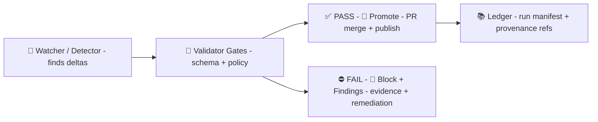

<div align="center">

# 🔐 MCP Gate Contracts  
### _Contract-first • Provenance-first • Policy-enforced_


</div>

> 📍 **Path:** `mcp/gates/contracts/`  
> 🎯 **Mission:** define the **versioned contracts** (schemas + invariants + examples) consumed by **MCP gates** so that anything **ingested**, **published**, or **rendered** in KFM is **traceable**, **policy-compliant**, and **reproducible**.  
> 🧭 **Guiding rule:** anything that appears in the UI or Focus Mode must be traceable to cataloged sources and provable processing, enforced through required metadata/provenance and CI checks (no “mystery layers”). [oai_citation:0‡Kansas Frontier Matrix (KFM) – Comprehensive Technical Documentation.pdf](file-service://file-AkqwUuYPp5zePf7pv5SMxi)

---

## 🧩 What’s a “Gate” vs a “Contract”?

### ✅ Contract
A **contract** is a *versioned promise* about shape + meaning:

- **Schema** (JSON Schema / YAML schema / “shape” definition)
- **Invariants** (“must have license”, “must carry provenance”, “must include citations”, “no sensitive coords unless allowed”)
- **Examples** (golden payloads used for tests)
- **Compatibility rules** (SemVer + upgrade notes)

KFM’s architecture explicitly leans on **contract-first interfaces** + **policy enforcement** to keep the platform rigorous while staying modular and extensible. [oai_citation:1‡Kansas Frontier Matrix (KFM) – Comprehensive Architecture, Features, and Design.pdf](file-service://file-4Umt1yHoGKicdmLWzFJ9sC)

### 🛡️ Gate
A **gate** is an enforcement checkpoint (CI or runtime) that:

- validates a payload against one or more contracts  
- runs policy checks (OPA/Conftest) where applicable  
- produces an auditable decision (**PASS / FAIL / WARN**) plus evidence  
- defaults to **fail-closed** for compliance rules [oai_citation:2‡Kansas Frontier Matrix (KFM) – AI System Overview 🧭🤖.pdf](file-service://file-Pv8eev6RWvCKrGCXyzY7zg)

---

## 🚦 Where gates run in KFM

KFM uses gates across the whole lifecycle: ingestion → catalog → graph → UI → AI → artifact publishing.

### 🔁 The core CI posture (Detect → Validate → Promote)

KFM’s AI/automation flow is explicitly described as a “detect, validate, promote” pipeline with a **Policy Pack** (Conftest + OPA Rego) that can **block non-compliant changes** (fail closed). [oai_citation:3‡Kansas Frontier Matrix (KFM) – AI System Overview 🧭🤖.pdf](file-service://file-Pv8eev6RWvCKrGCXyzY7zg)



### 🤖 Runtime gates for Focus Mode (Prompt Gate → Output Gate)

Focus Mode’s runtime posture includes:
- **Prompt Gate** input filtering/sanitization  
- tool allow/block lists (no arbitrary actions; no internet)  
- optional **OPA policy checks** over generated output before returning it to users [oai_citation:4‡Kansas Frontier Matrix (KFM) – AI System Overview 🧭🤖.pdf](file-service://file-Pv8eev6RWvCKrGCXyzY7zg)

The UI flow also describes the `/api/focus` orchestration and policy screening of queries/responses with OPA or similar, plus the expectation of neutral, citation-backed answers. [oai_citation:5‡Kansas Frontier Matrix – Comprehensive UI System Overview.pdf](file-service://file-KcBQruYcoFVDEixzzRHTwt)

---

## 🗂️ What belongs in this folder

This folder is the **single source of truth** for the “shapes” gates enforce.

### Suggested layout 📁✨
> (You can adjust, but keep the intent: contracts are **portable** across CI + runtime.)

```text
mcp/
  gates/
    contracts/
      _shared/                 # 🔁 common primitives (IDs, timestamps, citations)
      data/                    # 🗄️ dataset + metadata contracts (STAC/DCAT/PROV wrappers)
      provenance/              # 🧬 lineage + citation contracts
      ai/                      # 🤖 prompt + response + safety/output contracts
      graph/                   # 🕸️ graph mutation + health-check report contracts
      artifacts/               # 📦 OCI/ORAS publishing + signature/attestation contracts
      ui/                      # 🗺️ layer/story/offline-pack contracts
      domain/                  # 🧪 “Design Pack” & domain plugin contracts (SampleUnitSpec, ConstraintSpec…)
      gate_report/             # 🧾 standard gate decision envelope + finding format
      examples/                # ✅ golden payloads
      tests/                   # 🧪 schema tests + conftest fixtures (if co-located)
```

> 💡 Why so strict? KFM’s “contract-first & provenance-first” rule requires that components can rely on consistent metadata/provenance, and that unsourced or ad-hoc data is not allowed into the official catalog. [oai_citation:6‡Kansas Frontier Matrix (KFM) – Comprehensive Technical Documentation.pdf](file-service://file-AkqwUuYPp5zePf7pv5SMxi)

---

## 🧾 Core contract families (what gates enforce)

### 1) 🗄️ Data + Metadata contracts
KFM requires every dataset to ship with a **metadata JSON “data contract”** (source, license, spatial/temporal extent, processing steps, etc.) that **must validate before acceptance**, enforced by validators (and CI). [oai_citation:7‡Kansas Frontier Matrix (KFM) – Comprehensive Technical Documentation.pdf](file-service://file-AkqwUuYPp5zePf7pv5SMxi)

KFM’s catalog aligns to open standards:
- **STAC** for geospatial assets  
- **DCAT** for dataset cataloging  
- **W3C PROV** for provenance/lineage [oai_citation:8‡Kansas Frontier Matrix (KFM) – Comprehensive Architecture, Features, and Design.pdf](file-service://file-4Umt1yHoGKicdmLWzFJ9sC)

📌 **Required fields you should expect contracts to cover**:
- `id`, `title`, `description`
- `license` (and usage restrictions)
- `spatial` + `temporal` extents
- provenance block (`source_url`, creator, issued, processing)
- FAIR+CARE / ethics block (collective benefit, authority to control, responsibility, ethics) [oai_citation:9‡Kansas Frontier Matrix (KFM) – Comprehensive Technical Documentation.pdf](file-service://file-AkqwUuYPp5zePf7pv5SMxi)

### 2) 🧬 Provenance + citation contracts
KFM treats provenance as first-class and requires derived information (including Focus Mode answers) to carry citations back to provenance records. [oai_citation:10‡Kansas Frontier Matrix (KFM) – Comprehensive Architecture, Features, and Design.pdf](file-service://file-4Umt1yHoGKicdmLWzFJ9sC)

### 3) 🤖 AI contracts (Prompt + Output + Audit)
Focus Mode security posture includes:
- **Prompt Gate** sanitization
- tool allowlists/denylists (no arbitrary actions; no internet)
- optional **OPA** policy checks on generated responses [oai_citation:11‡Kansas Frontier Matrix (KFM) – AI System Overview 🧭🤖.pdf](file-service://file-Pv8eev6RWvCKrGCXyzY7zg)

Documentation expectations also emphasize that **AI-generated text must be clearly labeled** and **citations must be included** (especially for governance-sensitive contexts). [oai_citation:12‡📚 Kansas Frontier Matrix (KFM) Data Intake – Technical & Design Guide.pdf](file-service://file-EbUCdsJMbu5KwpoKMrLrgj)

### 4) 🕸️ Graph contracts (mutations + health checks)
KFM describes **graph health checks** that look for:
- orphaned nodes / broken lineage
- constraint/index status
- growth anomalies (suspicious spikes)
- scheduled reporting (weekly) [oai_citation:13‡Additional Project Ideas.pdf](file-service://file-Pc2GNivcrHBeKjBQksLC3T)

Graph rollback/restore workflows also assume stable IDs and repeatable imports (so contracts should enforce stable identifiers in mutation payloads). [oai_citation:14‡📚 Kansas Frontier Matrix (KFM) Data Intake – Technical & Design Guide.pdf](file-service://file-EbUCdsJMbu5KwpoKMrLrgj)

### 5) 📦 Artifact contracts (OCI/ORAS + signatures)
KFM proposes publishing outputs as **OCI artifacts** (stored in a registry) and referencing them from STAC/DCAT via `distribution.oci`, including provenance pointers. [oai_citation:15‡Additional Project Ideas.pdf](file-service://file-Pc2GNivcrHBeKjBQksLC3T)

It also explicitly ties automation to **supply-chain integrity** (SLSA attestations, signing commits/images, exploring Sigstore). [oai_citation:16‡Kansas Frontier Matrix (KFM) – AI System Overview 🧭🤖.pdf](file-service://file-Pv8eev6RWvCKrGCXyzY7zg)

### 6) 🗺️ UI contracts (layers, stories, offline packs, time)
The UI stack is described as:
- **MapLibre GL JS** (2D)
- **CesiumJS** (3D)
- **timeline slider** for temporal filtering
- Story Nodes engine for guided narratives [oai_citation:17‡Kansas Frontier Matrix (KFM) – Comprehensive Architecture, Features, and Design.pdf](file-service://file-4Umt1yHoGKicdmLWzFJ9sC)

The UI also emphasizes provenance transparency (“map behind the map”) and citation-backed AI answers. [oai_citation:18‡Kansas Frontier Matrix – Comprehensive UI System Overview.pdf](file-service://file-KcBQruYcoFVDEixzzRHTwt)

Future proposals include:
- “offline packs” bundling layers/tiles/stories for low connectivity [oai_citation:19‡🌟 Kansas Frontier Matrix – Latest Ideas & Future Proposals.docx.pdf](file-service://file-SQ3f7ve8SGiusT6ThZEuCe)
- deterministic dual-format packaging (GeoParquet + PMTiles) with accompanying STAC/DCAT records and traceable hashes [oai_citation:20‡🌟 Kansas Frontier Matrix – Latest Ideas & Future Proposals.docx.pdf](file-service://file-SQ3f7ve8SGiusT6ThZEuCe)

### 7) 🏛️ Ethics / sensitivity contracts (FAIR+CARE + access control)
KFM describes sensitive-data handling measures like:
- coordinate generalization (fuzzing/coarsening)
- access control / restricted visibility
- metadata fields for sensitivity/restrictions
- explicit permission requirements for precise sensitive locations [oai_citation:21‡Kansas Frontier Matrix (KFM) – Comprehensive Technical Documentation.pdf](file-service://file-AkqwUuYPp5zePf7pv5SMxi)

Contracts should encode the “shape” of these flags so gates can enforce them consistently.

---

## 🧾 Standard Gate Decision Envelope (recommended)
To make gates composable, every gate should emit the same report shape (so CI, UI, and audit logs can read it).

```json
{
  "gate_id": "policy/opa",
  "contract_id": "data/metadata@1.2.0",
  "status": "pass",
  "severity": "low",
  "run_id": "run_2026_01_20T12_00_00Z_abc123",
  "timestamp": "2026-01-20T12:00:00Z",
  "findings": [
    {
      "code": "LICENSE_MISSING",
      "message": "Dataset metadata must include a license.",
      "path": "$.license",
      "evidence": { "hint": "Set license to SPDX id or 'Public Domain'." }
    }
  ],
  "provenance_ref": "prov://kfm/catalog/usgs_historic_topo_1894"
}
```

> 🔍 Why: KFM’s governance model expects auditability, traceability, and fast remediation loops (including rollback paths). [oai_citation:22‡📚 Kansas Frontier Matrix (KFM) Data Intake – Technical & Design Guide.pdf](file-service://file-EbUCdsJMbu5KwpoKMrLrgj)

---

## 🧪 Gate ↔ Contract matrix (practical mapping)

| Gate 🧱 | Where it runs | Contract(s) it consumes | What it blocks |
|---|---|---|---|
| **Ingestion Gate** 📥 | pipelines / PR validation | `data/*`, `provenance/*` | missing metadata, broken schema, checksum mismatch, missing provenance (initial validation pass) [oai_citation:23‡📚 Kansas Frontier Matrix (KFM) Data Intake – Technical & Design Guide.pdf](file-service://file-EbUCdsJMbu5KwpoKMrLrgj) |
| **Policy Gate** 🛡️ | CI (Detect→Validate→Promote) | `policy input` + contract shapes | policy violations (fail closed), e.g., provenance/ethics/security rules [oai_citation:24‡Kansas Frontier Matrix (KFM) – AI System Overview 🧭🤖.pdf](file-service://file-Pv8eev6RWvCKrGCXyzY7zg) |
| **Prompt Gate** 🧼 | runtime (Focus Mode) | `ai/prompt/*` | prompt injection, disallowed requests [oai_citation:25‡Kansas Frontier Matrix (KFM) – AI System Overview 🧭🤖.pdf](file-service://file-Pv8eev6RWvCKrGCXyzY7zg) |
| **AI Output Gate** 🧾 | runtime (Focus Mode) | `ai/response/*`, `provenance/citations/*` | uncited claims, sensitive location disclosure, policy-violating output [oai_citation:26‡Kansas Frontier Matrix (KFM) – AI System Overview 🧭🤖.pdf](file-service://file-Pv8eev6RWvCKrGCXyzY7zg) |
| **Graph Health Gate** ❤️‍🩹 | scheduled / CI | `graph/health_report/*` | broken lineage, orphan nodes, missing constraints/indexes [oai_citation:27‡Additional Project Ideas.pdf](file-service://file-Pc2GNivcrHBeKjBQksLC3T) |
| **Artifact Gate** 📦 | publish step | `artifacts/*` | unsigned/unattested OCI artifacts, missing `distribution.oci` descriptors [oai_citation:28‡Additional Project Ideas.pdf](file-service://file-Pc2GNivcrHBeKjBQksLC3T) |
| **UI Layer Gate** 🗺️ | build/release | `ui/*` | layers/stories without traceability, missing attribution/citations [oai_citation:29‡Kansas Frontier Matrix – Comprehensive UI System Overview.pdf](file-service://file-KcBQruYcoFVDEixzzRHTwt) |

---

## 🧬 Run manifests are contracts too
KFM describes a **Run Manifest** as a structured record of what happened in a pipeline run, saved as a JSON artifact and **hashed** so it can be referenced and used in policy checks. [oai_citation:30‡Additional Project Ideas.pdf](file-service://file-Pc2GNivcrHBeKjBQksLC3T)

That implies:
- you should have a `run_manifest@x.y.z` schema
- gates should attach run manifests (or references) to decisions
- artifacts should link back to run manifests via `provenance_ref`

---

## 🧱 “Design Pack” contracts for domain integrations
KFM’s “Design Pack” concept is essentially a **domain contract bundle**:
- clear scope + out-of-scope boundaries  
- how the feature fits into standard pipeline structure  
- required outputs cataloged in STAC/DCAT  
- evidence/provenance flows reused by Focus Mode & Story Nodes  
- domain schemas like `SampleUnitSpec` and constraint rules (`ConstraintSpec`) [oai_citation:31‡Additional Project Ideas.pdf](file-service://file-Pc2GNivcrHBeKjBQksLC3T) [oai_citation:32‡Additional Project Ideas.pdf](file-service://file-Pc2GNivcrHBeKjBQksLC3T)

This folder is where the **schema forms** of those packs should live (`domain/*`).

---

## ✅ Non‑negotiables (what contracts must enable)

- **No “mystery layers”**: unsourced/ad‑hoc data is not permitted in the official catalog; contracts + validators enforce this. [oai_citation:33‡Kansas Frontier Matrix (KFM) – Comprehensive Technical Documentation.pdf](file-service://file-AkqwUuYPp5zePf7pv5SMxi)
- **Human-in-the-loop** by default: automation opens PRs; reviewers merge; branch protections + oversight apply. [oai_citation:34‡📚 Kansas Frontier Matrix (KFM) Data Intake – Technical & Design Guide.pdf](file-service://file-EbUCdsJMbu5KwpoKMrLrgj) [oai_citation:35‡Kansas Frontier Matrix (KFM) – AI System Overview 🧭🤖.pdf](file-service://file-Pv8eev6RWvCKrGCXyzY7zg)
- **Focus Mode is advisory-only** and accountable via citations/disclaimers. [oai_citation:36‡Kansas Frontier Matrix – Comprehensive UI System Overview.pdf](file-service://file-KcBQruYcoFVDEixzzRHTwt)
- **Sensitive data must be explicitly classified** and treated with generalization/access control/permission where required. [oai_citation:37‡Kansas Frontier Matrix (KFM) – Comprehensive Technical Documentation.pdf](file-service://file-AkqwUuYPp5zePf7pv5SMxi)
- **Contracts-first for new surfaces** (APIs and UI layers): define contract first, tie UI layers to provenance + CARE principles. [oai_citation:38‡MARKDOWN_GUIDE_v13.md.gdoc](file-service://file-UYVruFXfueR8veHMUKeugU)

---

## 🛠️ Adding a new contract (checklist)
Use this as a PR checklist ✅

1. **Pick a home** (data / ai / graph / artifacts / ui / domain)  
2. **Create a versioned schema** (`@MAJOR.MINOR.PATCH`)  
3. **Add 2–3 examples** (valid + invalid) in `examples/`  
4. **Update or add gate tests** (schema + policy fixtures)  
5. **Document the invariants** in the schema header and in this README  
6. **Add migration notes** if breaking changes (MAJOR bump)

> 📝 Strong documentation matters in multi-contributor systems; governance + provenance practices make docs “reliable, authoritative sources” rather than casual notes. [oai_citation:39‡Comprehensive Markdown Guide_ Syntax, Extensions, and Best Practices.docx](file-service://file-J6rFRcp4ExCCeCdTevQjxz)

---

## 📚 MCP alignment (why this folder exists inside `mcp/`)
The project structure explicitly treats `mcp/` as part of a “living knowledge base” and calls out **MCP-compatible documentation templates** (experiment reports, versioned artifacts, repeatable methods). [oai_citation:40‡Kansas-Frontier-Matrix_ Open-Source Geospatial Historical Mapping Hub Design.pdf](file-service://file-64djFYQUCmxN1h6L6X7KUw)

Contracts are the “hard edges” that make those templates enforceable.

---

## 🧠 Future-facing contracts (AR / 4D / storyscapes)
Innovation docs discuss:
- **4D digital twins** with time as a first-class dimension [oai_citation:41‡Innovative Concepts to Evolve the Kansas Frontier Matrix (KFM).pdf](file-service://file-G71zNoWKxsoSW44iwZaaCC)
- **AR + hybrid 2D/3D storytelling** as a platform direction [oai_citation:42‡Innovative Concepts to Evolve the Kansas Frontier Matrix (KFM).pdf](file-service://file-G71zNoWKxsoSW44iwZaaCC)

When those land, expect new contracts like:
- `ui/timeline_layer.schema.json`
- `ui/ar_experience.schema.json`
- `simulation/temporal_state.schema.json`

---

## 🔗 Source docs used to derive these contracts (project library)

### Core KFM architecture & governance 🧭
-  [oai_citation:43‡Kansas Frontier Matrix (KFM) – Comprehensive Technical Documentation.pdf](file-service://file-AkqwUuYPp5zePf7pv5SMxi) **KFM – Comprehensive Technical Documentation** (contract-first, provenance-first, governance)  
-  [oai_citation:44‡Kansas Frontier Matrix (KFM) – Comprehensive Architecture, Features, and Design.pdf](file-service://file-4Umt1yHoGKicdmLWzFJ9sC) **KFM – Comprehensive Architecture, Features, and Design** (STAC/DCAT/PROV, modular architecture)  
-  [oai_citation:45‡📚 Kansas Frontier Matrix (KFM) Data Intake – Technical & Design Guide.pdf](file-service://file-EbUCdsJMbu5KwpoKMrLrgj) **KFM – Data Intake Guide** (validators, PR workflow, AI labeling/citations)  
-  [oai_citation:46‡Kansas Frontier Matrix – Comprehensive UI System Overview.pdf](file-service://file-KcBQruYcoFVDEixzzRHTwt) **KFM – Comprehensive UI System Overview** (Focus Mode safeguards, citations, UI traceability)  
-  [oai_citation:47‡Kansas Frontier Matrix (KFM) – AI System Overview 🧭🤖.pdf](file-service://file-Pv8eev6RWvCKrGCXyzY7zg) **KFM – AI System Overview** (Prompt Gate, OPA checks, policy pack, supply chain)

### Expansion & proposals 🚀
-  [oai_citation:48‡Additional Project Ideas.pdf](file-service://file-Pc2GNivcrHBeKjBQksLC3T) **Additional Project Ideas** (OCI artifact publishing, design packs, constraints)  
-  [oai_citation:49‡🌟 Kansas Frontier Matrix – Latest Ideas & Future Proposals.docx.pdf](file-service://file-SQ3f7ve8SGiusT6ThZEuCe) **Latest Ideas & Future Proposals** (offline packs, PMTiles+GeoParquet packaging, hashes)  
-  [oai_citation:50‡Innovative Concepts to Evolve the Kansas Frontier Matrix (KFM).pdf](file-service://file-G71zNoWKxsoSW44iwZaaCC) **Innovative Concepts** (4D/AR, storytelling co-pilots, ethics/provenance credit)

### MCP / documentation rigor 🧩📝
-  [oai_citation:51‡Kansas-Frontier-Matrix_ Open-Source Geospatial Historical Mapping Hub Design.pdf](file-service://file-BJN3xmP44EHc9NRCccCn4H) **Open-Source Geospatial Historical Mapping Hub Design** (why `mcp/` exists, templates, reproducibility)  
-  [oai_citation:52‡Comprehensive Markdown Guide_ Syntax, Extensions, and Best Practices.docx](file-service://file-J6rFRcp4ExCCeCdTevQjxz) **Comprehensive Markdown Guide** (governance/provenance best practices)  
-  [oai_citation:53‡Kansas Frontier Matrix (KFM) – AI System Overview 🧭🤖.pdf](file-service://file-Pv8eev6RWvCKrGCXyzY7zg) **MARKDOWN_GUIDE_v13** (contract-first guidance for new endpoints/layers)  
-  [oai_citation:54‡Kansas Frontier Matrix (KFM) – Comprehensive Technical Documentation.pdf](file-service://file-AkqwUuYPp5zePf7pv5SMxi) **Scientific Method / Master Coder Protocol Documentation** (foundational templates & rigor)

### Reference libraries 📦 (PDF portfolios)
> Some project reference collections are distributed as **PDF portfolios** and may require Acrobat/Reader for best navigation. [oai_citation:55‡AI Concepts & more.pdf](file-service://file-K6BctJjeUwvyCahLf9qdwr) [oai_citation:56‡Various programming langurages & resources 1.pdf](file-service://file-4wp3wSSZs7gk5qHWaJVudi) [oai_citation:57‡Data Managment-Theories-Architures-Data Science-Baysian Methods-Some Programming Ideas.pdf](file-service://file-RrXMFY7cP925exsQYermf2) [oai_citation:58‡Maps-GoogleMaps-VirtualWorlds-Archaeological-Computer Graphics-Geospatial-webgl.pdf](file-service://file-RshcX5sNY2wpiNjRfoP6z6)

-  [oai_citation:59‡AI Concepts & more.pdf](file-service://file-K6BctJjeUwvyCahLf9qdwr) AI Concepts & more (portfolio)  
-  [oai_citation:60‡Various programming langurages & resources 1.pdf](file-service://file-4wp3wSSZs7gk5qHWaJVudi) Various programming languages & resources (portfolio)  
-  [oai_citation:61‡Data Managment-Theories-Architures-Data Science-Baysian Methods-Some Programming Ideas.pdf](file-service://file-RrXMFY7cP925exsQYermf2) Data Management / Bayesian / architectures (portfolio)  
-  [oai_citation:62‡Maps-GoogleMaps-VirtualWorlds-Archaeological-Computer Graphics-Geospatial-webgl.pdf](file-service://file-RshcX5sNY2wpiNjRfoP6z6) Maps / WebGL / geospatial visualization (portfolio)  
-  [oai_citation:63‡KFM- python-geospatial-analysis-cookbook-over-60-recipes-to-work-with-topology-overlays-indoor-routing-and-web-application-analysis-with-python.pdf](file-service://file-2gpiGDZS8iw6EdxGswEdHp) Python geospatial analysis cookbook (PostGIS/schema practices)  
-  [oai_citation:64‡Kansas Frontier Matrix (KFM) – AI System Overview 🧭🤖.pdf](file-service://file-Pv8eev6RWvCKrGCXyzY7zg) Data Mining Concepts & applications (reference)

---

## 🧭 Next file to read
➡️ If you’re implementing a gate: start with the **Gate Decision Envelope** and then the contract family for your surface (data/ai/graph/artifacts/ui).  
➡️ If you’re adding a new feature: create/extend contracts *first*, then wire them into CI/runtime gates.

💥 **Remember:** contracts are how we keep KFM’s “map behind the map” promise real.  [oai_citation:65‡Kansas Frontier Matrix – Comprehensive UI System Overview.pdf](file-service://file-KcBQruYcoFVDEixzzRHTwt)
