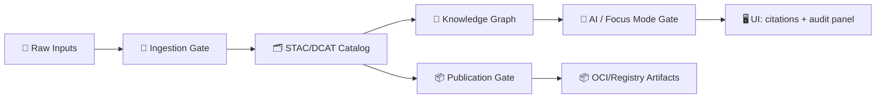

# `mcp/gates/contracts/_shared` 🧩🔐  
Reusable contract primitives that keep every Gate **predictable, auditable, and evidence-backed**.


---

## 🎯 Purpose
This folder contains the **shared contract building blocks** used by all **MCP Gates** (ingestion 🚪, AI inference 🤖, publication 📦, and CI/DevOps checks 🧪).  

If you’re building a new gate contract, you should **compose from `_shared` first** before inventing new shapes.

### ✅ What belongs here
- **Envelope + metadata** primitives (IDs, timestamps, correlation, idempotency)
- **Governance / sensitivity** primitives (classification, restrictions, approvals)
- **Provenance & evidence** primitives (STAC/DCAT/PROV refs, citations, audit trails)
- **Security & integrity** primitives (hash bundles, signatures/attestations refs)
- **Policy decision** primitives (allow/deny, reasons, policy version)

### 🚫 What does *not* belong here
- Gate-specific payload schemas (put those in the gate’s own folder)
- Runtime code (validators, handlers, adapters)
- Domain business rules (those live in the **Policy Pack** / gate logic)

---

<details>
<summary>🧭 Table of Contents</summary>

- [How to think about Gates](#-how-to-think-about-gates)
- [Shared contract philosophy](#-shared-contract-philosophy)
- [Recommended shared primitives](#-recommended-shared-primitives)
- [Canonical envelope pattern](#-canonical-envelope-pattern)
- [Evidence & citations](#-evidence--citations)
- [Provenance & standards alignment](#-provenance--standards-alignment)
- [Governance, sensitivity, sovereignty](#-governance-sensitivity-sovereignty)
- [Policy Pack integration](#-policy-pack-integration)
- [Determinism, run manifests, and auditability](#-determinism-run-manifests-and-auditability)
- [Supply chain & artifact references](#-supply-chain--artifact-references)
- [Versioning rules](#-versioning-rules)
- [How to add or change shared contracts](#-how-to-add-or-change-shared-contracts)
- [🧾 Evidence Trail](#-evidence-trail-project-docs)

</details>

---

## 🚪 How to think about Gates
A **Gate** is a boundary where KFM/MCP **refuses to proceed** unless the data/action is:
- structurally valid ✅
- policy compliant ✅
- provenance/evidence backed ✅
- safe to publish/expose ✅

This is the “**deny by default**” mindset: if we can’t prove it, we don’t ship it. 🧯



---

## 🧠 Shared contract philosophy
These shared contracts encode the project’s core commitments:

- **Evidence-first:** contracts must carry references that let us trace “why / from where.” 🧾  
- **Provenance-first:** metadata + lineage are mandatory, not optional. 🧬  
- **Contract-first:** “no mystery layers” — every interface is explicit and testable. 🧩  
- **Fail-closed:** when validation is uncertain, we **stop** rather than guess. 🛑  
- **Sovereignty-aware:** “no output may be less restricted than its inputs.” 🔒  
- **UI-traceable:** the UI should be able to render “the map behind the map.” 🗺️

---

## 🧱 Recommended shared primitives
> These are the *conceptual* building blocks expected in `_shared`.  
> The **actual JSON Schemas** in this folder are the source of truth.

| 🧩 Primitive | What it does | Used by |
|---|---|---|
| `Envelope` | Standard wrapper: IDs, versioning, correlation, timestamps | every gate |
| `Actor` | Who/what triggered the action (human, bot, pipeline, agent) | CI, ingestion, AI |
| `PolicyContext` | classification, license, approvals, restrictions | policy pack + UI |
| `ProvenanceRefs` | STAC/DCAT/PROV pointers + derived-from links | ingestion, AI, publish |
| `HashBundle` | integrity (sha256, size, canonical digest) | ingestion, publish |
| `TelemetryRef` | run_id, metrics refs, lineage event refs | CI/pipelines |
| `Evidence` / `Citations` | machine-readable citations + evidence manifests | AI + Story Nodes |
| `GateDecision` | allow/deny + reasons + policy_version used | enforcement layer |
| `ErrorShape` | consistent error format across gates | everywhere |

---

## 📦 Canonical envelope pattern
All gate contracts should wrap payloads with a consistent “envelope.”

```json
{
  "meta": {
    "type": "kfm.gate.contract",
    "schema_version": "1.0.0",
    "id": "uuid-or-ulid",
    "created_at": "2026-01-22T00:00:00Z",
    "correlation_id": "trace-across-systems",
    "idempotency_key": "stable-for-retries"
  },
  "actor": {
    "kind": "human|service|ci|agent",
    "id": "focusmode-v1|github-actions|user:123",
    "display": "FocusMode v1"
  },
  "policy": {
    "classification": "public|sensitive|confidential|restricted",
    "license": { "spdx": "CC-BY-4.0" },
    "usage_constraints": [],
    "required_approvals": []
  },
  "provenance": {
    "refs": {
      "dcat_dataset": "kfm://dcat/dataset/...",
      "stac_collection": "kfm://stac/collection/...",
      "prov_activity": "kfm://prov/activity/..."
    },
    "derived_from": ["kfm://entity/..."],
    "agents": ["kfm://agent/..."]
  },
  "integrity": {
    "hashes": [{ "alg": "sha256", "value": "..." }],
    "canonical_digest": "sha256:..."
  },
  "telemetry": {
    "run_id": "run-uuid",
    "policy_version": "policy-pack@semver-or-gitsha",
    "lineage_event_ref": "openlineage://..."
  },
  "payload": {}
}
```

### 🔍 Envelope invariants (recommended)
- `meta.schema_version` is **SemVer** and must be explicit.
- `correlation_id` is required for cross-service traceability.
- `policy.classification` must exist even for public data (explicit is safer than implied).
- `provenance.refs` should be present before anything is “publishable.”

---

## 🧾 Evidence & citations
Any **narrative** or **AI-generated** artifact must be evidence-backed.

Examples:
- Focus Mode answers
- Story Nodes / micro-stories / Pulse Threads
- Derived summaries and analytics outputs presented to users

Recommended shared shape:

```json
{
  "evidence": {
    "citations": [
      {
        "kind": "dataset|document|graph_entity",
        "ref": "kfm://dcat/dataset/...",
        "locator": "optional: page/row/feature-id",
        "quote": "optional: short snippet"
      }
    ],
    "evidence_manifest_ref": "kfm://artifact/evidence-manifest/..."
  }
}
```

✅ Minimum bar: **at least one citation** for publishable narrative output.  
🛑 If citations cannot be produced, the gate should **deny** (or force “refuse/uncertain” behavior).

---

## 🧬 Provenance & standards alignment
KFM treats metadata as code and aligns with:
- **STAC** (asset-level geospatial metadata)
- **DCAT** (catalog/distribution metadata)
- **PROV / PROV-O** (lineage)

Recommended guidance for `_shared`:
- Use *refs* rather than duplicating full catalog objects in gate messages.
- Keep the contract stable even if catalog formats evolve.

Pro tip 🧠: when a gate emits/accepts a dataset-like payload, include a `kfm:dataset_id` and `kfm:classification` (profile extensions), plus refs to STAC/DCAT/PROV.

---

## 🧭 Governance, sensitivity, sovereignty
Shared contracts must support **differential access** and safe defaults.

### 🔒 Recommended fields (shared)
- `policy.classification` (public → restricted)
- `policy.usage_constraints` (e.g., non-commercial, community-only, “do not reproduce”)
- `policy.required_approvals` (council, community liaison, admin review)
- `policy.redaction` hints (masking, aggregation, obfuscation radius)

### 🗺️ Geo-obfuscation support
Some layers (archaeology, biodiversity, sensitive sites) may require:
- rounding coordinates
- generalizing points to polygons/hex bins
- hiding attributes by role

Your contract should carry the **original classification** and the **applied transformation** in provenance so audits can verify “no output is less restricted than inputs.”

---

## 🧰 Policy Pack integration
Policy is enforced via **OPA + Conftest** and can also run at **runtime**.

Shared contract needs to carry:
- `policy_version` (what rules were in effect)
- a stable shape for `GateDecision` results

Example decision output:

```json
{
  "decision": {
    "allow": false,
    "reasons": [
      { "code": "MISSING_LICENSE", "message": "license.spdx required" },
      { "code": "NO_PROVENANCE", "message": "prov_activity ref required" }
    ],
    "policy_version": "policy-pack@1.4.2"
  }
}
```

---

## 🧪 Determinism, run manifests, and auditability
For pipelines and automated actions, shared contracts should support:
- deterministic run identity (`run_id`)
- reproducible inputs/outputs (manifest)
- integrity + “self-fingerprinting” (canonical digest)

Recommended shared refs:
- `run_manifest_ref`
- `telemetry_ref`
- `lineage_event_ref` (e.g., OpenLineage)

---

## 📦 Supply chain & artifact references
When an output is a **release artifact** (dataset snapshot, tile bundle, model output), prefer referencing it via an artifact registry:

Recommended shared shape:

```json
{
  "artifact": {
    "oci_ref": "oci://registry/org/name:tag",
    "digest": "sha256:...",
    "signatures": [{ "kind": "cosign", "ref": "sigstore://..." }],
    "sbom_ref": "kfm://artifact/sbom/...",
    "provenance_attestation_ref": "kfm://artifact/slsa/..."
  }
}
```

---

## 🧾 Versioning rules
- **SemVer for schemas**: `MAJOR.MINOR.PATCH`
  - MAJOR = breaking
  - MINOR = backward-compatible
  - PATCH = docs/typos/constraints that don’t break valid payloads
- Never “silently” reinterpret fields. If meaning changes, **bump MAJOR**.
- Keep older versions readable/validatable (migration notes encouraged).

---

## 🛠️ How to add or change shared contracts
1. **Add/modify** schema(s) in `_shared` 📄  
2. Add/update:
   - ✅ examples/fixtures
   - ✅ conftest/OPA tests (policy constraints)
   - ✅ schema validation tests (CI)
3. Update any gate contracts that compose the shared primitive.
4. Document the change:
   - changelog entry
   - migration notes (if breaking)
5. Run the full gate validation suite 🧪

---

## 🧾 Evidence Trail (project docs)
This README is derived from and aligned with the project’s design documents:

- **AI answers must be citation-backed and refuse/flag uncertainty if not derivable**, with explainability/audit panel support.  [oai_citation:0‡Kansas Frontier Matrix (KFM) – AI System Overview 🧭🤖.pdf](file-service://file-Pv8eev6RWvCKrGCXyzY7zg) [oai_citation:1‡Kansas Frontier Matrix (KFM) – AI System Overview 🧭🤖.pdf](file-service://file-Pv8eev6RWvCKrGCXyzY7zg)
- **AI outputs are treated as first-class artifacts with provenance (ledger + PROV), and output policy checks enforce citations.**  [oai_citation:2‡📚 Kansas Frontier Matrix (KFM) Data Intake – Technical & Design Guide.pdf](file-service://file-EbUCdsJMbu5KwpoKMrLrgj)
- **The UI is designed for transparency (“map behind the map”), surfaces provenance/citations, and is decoupled via well-defined APIs.**  [oai_citation:3‡Kansas Frontier Matrix – Comprehensive UI System Overview.pdf](file-service://file-KcBQruYcoFVDEixzzRHTwt) [oai_citation:4‡Kansas Frontier Matrix – Comprehensive UI System Overview.pdf](file-service://file-KcBQruYcoFVDEixzzRHTwt)
- **Governance includes sensitivity classification in metadata; sensitive layers may be hidden/warned/redacted.**  [oai_citation:5‡Kansas Frontier Matrix (KFM) – Comprehensive Architecture, Features, and Design.pdf](file-service://file-4Umt1yHoGKicdmLWzFJ9sC)
- **Cultural protocols & Indigenous data sovereignty inspire fine-grained access controls, tagging, and geo-obfuscation patterns.**  [oai_citation:6‡Innovative Concepts to Evolve the Kansas Frontier Matrix (KFM).pdf](file-service://file-G71zNoWKxsoSW44iwZaaCC)
- **Security intake principles include no secrets in repos, CI scanning, parameterized queries, containerization/isolation, and sovereignty rule: no output less restricted than inputs.**  [oai_citation:7‡📚 Kansas Frontier Matrix (KFM) Data Intake – Technical & Design Guide.pdf](file-service://file-EbUCdsJMbu5KwpoKMrLrgj)
- **OPA can be used at runtime to allow/deny actions (including AI answers) and policies are versioned/auditable.**  [oai_citation:8‡Kansas Frontier Matrix (KFM) – AI System Overview 🧭🤖.pdf](file-service://file-Pv8eev6RWvCKrGCXyzY7zg)
- **STAC/DCAT/PROV are linked; metadata is validated in CI; profiles are versioned and treated as code.**  [oai_citation:9‡📚 Kansas Frontier Matrix (KFM) Data Intake – Technical & Design Guide.pdf](file-service://file-EbUCdsJMbu5KwpoKMrLrgj)
- **DevOps agent workflow is designed to be idempotent/auditable and constrained by policy (Watcher→Planner→Executor).**  [oai_citation:10‡Kansas Frontier Matrix (KFM) – Comprehensive Architecture, Features, and Design.pdf](file-service://file-4Umt1yHoGKicdmLWzFJ9sC)
- **Supply-chain rigor (attestations/SBOM/Sigstore/SLSA) is a stated direction for validation and promotion pipelines.**  [oai_citation:11‡🌟 Kansas Frontier Matrix – Latest Ideas & Future Proposals.docx.pdf](file-service://file-SQ3f7ve8SGiusT6ThZEuCe)
- **“Query auditing” is a known privacy control pattern: deny queries if they enable confidential disclosure (useful mental model for output gates).**  [oai_citation:12‡Data Mining Concepts & applictions.pdf](file-service://file-2uwEbQAFVKpXaTtWgUirAH)
- **MCP emphasizes environment capture, reproducibility, and peer review—relevant expectations for contract changes and gate validation.**  [oai_citation:13‡Scientific Method _ Research _ Master Coder Protocol Documentation.pdf](file-service://file-HTpax4QbDgguDwxwwyiS32)

---

<!--
📎 Source PDFs (uploaded to this chat) — keep/remove as desired:

Required filecite tokens (from tooling):
 [oai_citation:14‡Kansas Frontier Matrix – Comprehensive UI System Overview.pdf](file-service://file-KcBQruYcoFVDEixzzRHTwt)  [oai_citation:15‡📚 Kansas Frontier Matrix (KFM) Data Intake – Technical & Design Guide.pdf](file-service://file-EbUCdsJMbu5KwpoKMrLrgj)  [oai_citation:16‡Innovative Concepts to Evolve the Kansas Frontier Matrix (KFM).pdf](file-service://file-G71zNoWKxsoSW44iwZaaCC)  [oai_citation:17‡Additional Project Ideas.pdf](file-service://file-Pc2GNivcrHBeKjBQksLC3T)

Project docs most directly referenced:
 [oai_citation:18‡Kansas Frontier Matrix – Comprehensive UI System Overview.pdf](file-service://file-KcBQruYcoFVDEixzzRHTwt)  (Comprehensive UI System Overview)
 [oai_citation:19‡📚 Kansas Frontier Matrix (KFM) Data Intake – Technical & Design Guide.pdf](file-service://file-EbUCdsJMbu5KwpoKMrLrgj) (Data Intake – Technical & Design Guide)
 [oai_citation:20‡Kansas Frontier Matrix (KFM) – Comprehensive Architecture, Features, and Design.pdf](file-service://file-4Umt1yHoGKicdmLWzFJ9sC)  (Comprehensive Architecture, Features, and Design)
 [oai_citation:21‡Kansas Frontier Matrix (KFM) – AI System Overview 🧭🤖.pdf](file-service://file-Pv8eev6RWvCKrGCXyzY7zg)  (AI System Overview)
 [oai_citation:22‡Innovative Concepts to Evolve the Kansas Frontier Matrix (KFM).pdf](file-service://file-G71zNoWKxsoSW44iwZaaCC)  (Innovative Concepts)
 [oai_citation:23‡🌟 Kansas Frontier Matrix – Latest Ideas & Future Proposals.docx.pdf](file-service://file-SQ3f7ve8SGiusT6ThZEuCe) (Latest Ideas & Future Proposals)
 [oai_citation:24‡Kansas Frontier Matrix (KFM) – Comprehensive Technical Documentation.pdf](file-service://file-AkqwUuYPp5zePf7pv5SMxi) (Comprehensive Technical Documentation)
 [oai_citation:25‡Additional Project Ideas.pdf](file-service://file-Pc2GNivcrHBeKjBQksLC3T) (Additional Project Ideas)

Reference library PDFs (PDF portfolios / broad references):
 [oai_citation:26‡AI Concepts & more.pdf](file-service://file-K6BctJjeUwvyCahLf9qdwr) (AI Concepts & more.pdf)
 [oai_citation:27‡Kansas Frontier Matrix (KFM) – Comprehensive Technical Documentation.pdf](file-service://file-AkqwUuYPp5zePf7pv5SMxi) (Maps-GoogleMaps-VirtualWorlds-Archaeological-Computer Graphics-Geospatial-webgl.pdf)
 [oai_citation:28‡Various programming langurages & resources 1.pdf](file-service://file-4wp3wSSZs7gk5qHWaJVudi) (Various programming langurages & resources 1.pdf)
 [oai_citation:29‡Kansas-Frontier-Matrix_ Open-Source Geospatial Historical Mapping Hub Design.pdf](file-service://file-ShqHKgjxCS9UT9vbcxDNzA) (Data Managment-Theories-Architures-Data Science-Baysian Methods-Some Programming Ideas.pdf)

Extra MCP / policy / governance references discovered within the library:
 [oai_citation:30‡Scientific Method _ Research _ Master Coder Protocol Documentation.pdf](file-service://file-HTpax4QbDgguDwxwwyiS32) (Scientific Method / Research / Master Coder Protocol Documentation)
 [oai_citation:31‡Data Mining Concepts & applictions.pdf](file-service://file-2uwEbQAFVKpXaTtWgUirAH)  (Data Mining Concepts & Applications)

-->
