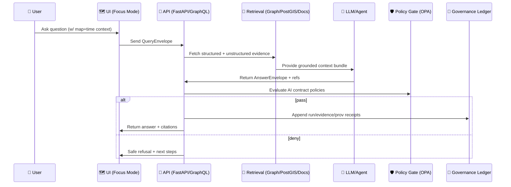

# 🤖 AI Gate Contracts (MCP)


> 📍 **File:** `mcp/gates/contracts/ai/README.md`  
> 🧭 **Mission:** Make every AI interaction in KFM *traceable, reproducible, policy-enforced, and UI-displayable* — with **evidence-first answers** and **provenance as a first-class artifact**.

---

## 🧭 Table of Contents

- [What this folder is](#what-this-folder-is)
- [Where AI sits in KFM](#where-ai-sits-in-kfm)
- [AI Gate contract principles](#ai-gate-contract-principles)
- [Contract registry](#contract-registry)
- [Core data shapes](#core-data-shapes)
- [Policy enforcement](#policy-enforcement)
- [Runtime vs CI enforcement](#runtime-vs-ci-enforcement)
- [Security & safety](#security--safety)
- [Quality & evaluation](#quality--evaluation)
- [Roadmap contract extensions](#roadmap-contract-extensions)
- [References](#references)

---

## What this folder is

This directory defines the **AI Gate contracts** for Kansas Frontier Matrix (KFM):

- ✅ **Machine-checkable schemas** for AI I/O artifacts (JSON/YAML).
- ✅ **Policy-as-code** rules (OPA/Conftest) that “fail closed”.
- ✅ **Test fixtures** for contract conformance.
- ✅ **Documentation** for humans (this README) to keep the gate understandable.

In KFM, AI is not “magic output.” AI is a **pipeline participant**. Its outputs must be:
- verifiable (citations + provenance)
- reproducible (run manifests, digests, deterministic settings)
- safe (classification propagation, redaction, injection defense)
- compatible with UI (Focus Mode panel, Story Nodes, Evidence viewer)

---

## Where AI sits in KFM

KFM’s system design treats **metadata + provenance** as the backbone:  
**DCAT** (discoverability) + **STAC** (spatial/temporal assets) + **PROV** (lineage) → then graph + API → then AI answers.

```mermaid
flowchart LR
  RAW[🧱 data/raw<br/>Immutable] --> WORK[🧰 data/work<br/>Scratch/ETL]
  WORK --> PROC[🧪 data/processed<br/>Versioned outputs]
  PROC --> META[📚 Catalogs<br/>STAC + DCAT]
  META --> PROV[⛓ PROV bundles<br/>Lineage + receipts]
  PROV --> GRAPH[🕸️ Neo4j Graph<br/>Context + links]
  GRAPH --> API[🚪 API (FastAPI/GraphQL)<br/>Gatekeeper + Redaction]
  API --> UI[🗺️ UI (MapLibre/Cesium)<br/>Stories + Exploration]
  API --> AI[🤖 Focus Mode AI<br/>RAG + Contextual Q&A]
  AI --> POLICY[🛡️ AI Policy Gate<br/>OPA/Conftest]
  POLICY -->|pass| OUT[📦 Answer + Evidence + Run Manifest]
  POLICY -->|deny| SAFE[⛔ Safe Refusal<br/>+ Next best action]
  OUT --> UI
  OUT --> LEDGER[📜 Governance Ledger<br/>Append-only]
```

> ✳️ **Key boundary rule:** UI/clients must not bypass the API for graph/DB access — the API is the “gatekeeper” for permissions, redaction, and safety controls.

---

## AI Gate contract principles

### ✅ Non-negotiables (MUST)

1. **Evidence-first** 🧾  
   Every factual claim must be backed by **explicit sources** (dataset IDs, STAC/DCAT references, document URIs, or graph entity IDs).

2. **Provenance always** ⛓️  
   Each AI result must be traceable to:
   - inputs used (`prov:used`)
   - transformations performed (`prov:Activity`)
   - actor/tool identity (`prov:Agent`)
   - digests/hashes for replay

3. **Fail closed** 🔒  
   If the system can’t produce compliant evidence and provenance, it must refuse or return a “needs more evidence” response.

4. **Classification propagation** 🏷️  
   Output classification must be **at least as restrictive** as the most sensitive input used.

5. **No autonomous mutation** 🧑‍⚖️  
   AI can propose, but any repo/data mutation must go through **human-reviewed PR / workflow** (Watcher → Planner → Executor patterns are allowed, but must be gated).

---

## Contract registry

> 📌 This is the “starter set” of contract surfaces we enforce for AI. Expand as needed, but keep it versioned.

| Contract ID | Artifact | Purpose | Enforced | Typical Output Location |
|---|---|---|---|---|
| **KFM-AI-ANS-v1** | `AnswerEnvelope` | Focus Mode Q&A answer | Runtime + CI | API response + ledger |
| **KFM-AI-EVID-v1** | `EvidenceManifest` | Structured list of evidence (datasets/docs/queries) | CI | `data/**/evidence/*.yml` |
| **KFM-AI-RUN-v1** | `RunManifest` | Deterministic run receipt (inputs, digests, toolchain) | CI | `data/**/runs/*.json` |
| **KFM-AI-ACT-v1** | `AgentAction` | Planned actions (PR creation, pipeline triggers) | CI | `mcp/agents/**` |
| **KFM-AI-PULSE-v1** | `PulseThread` *(proposed)* | Living narrative thread w/ evidence & drift | CI | `data/story/pulse/**` |
| **KFM-AI-CAN-v1** | `ConceptAttentionNode` *(proposed)* | Attention clusters / motif nodes | CI | `data/graph/derived/**` |

---

## Core data shapes

### 1) `QueryEnvelope` (UI → AI)

This captures the *question + context* that makes Focus Mode “map-aware” and “time-aware”.

```json
{
  "contract": "KFM-AI-QUERY-v1",
  "request_id": "REQ-2026-01-22-000123",
  "user": {
    "role": "public|contributor|maintainer|admin",
    "scopes": ["read:public", "read:restricted:approved"]
  },
  "ui_context": {
    "viewport_bbox_wgs84": [-96.9, 38.9, -94.5, 40.3],
    "time_range": {"start": "1930-01-01", "end": "1939-12-31"},
    "active_layers": ["kfm.ks.boundaries.counties.v1", "kfm.ks.events.dustbowl.v1"],
    "selected_feature_ids": ["place:DouglasCountyKS"]
  },
  "question": "What drought-related events happened here in the 1930s, and which sources support that?",
  "conversation": {
    "thread_id": "FOCUS-THREAD-0009",
    "turns": []
  }
}
```

### 2) `AnswerEnvelope` (AI → UI/API)

The answer must be **displayable** in the UI and **auditable** in governance logs.

```json
{
  "contract": "KFM-AI-ANS-v1",
  "request_id": "REQ-2026-01-22-000123",
  "classification": "public|internal|restricted",
  "answer_markdown": "…human-readable answer with citations…",
  "citations": [
    {
      "cite_id": "[1]",
      "source_type": "dcat|stac|prov|document|graph",
      "source_ref": "dcat:kfm.ks.landcover.1990_2020.v1",
      "access_url": "/api/v1/datasets/kfm.ks.landcover.1990_2020.v1",
      "snippet": "…optional quote/snippet or query summary…"
    }
  ],
  "evidence_manifest_ref": "evidence:EM-84",
  "run_manifest_ref": "run:RUN-2026-01-22-000123",
  "confidence": {
    "level": "low|medium|high",
    "rationale": "Confidence is limited because only 2 primary sources cover this county/timeframe."
  },
  "safe_completion": {
    "refusal": false,
    "policy_flags": ["none"]
  },
  "ui_hints": {
    "map_anchors": [{"type": "place", "id": "place:DouglasCountyKS"}],
    "time_anchors": [{"start": "1934-01-01", "end": "1936-12-31"}],
    "suggested_next_queries": [
      "Show drought severity indices for 1934–1936",
      "List contemporaneous newspaper articles linked to this county"
    ]
  }
}
```

### 3) `EvidenceManifest` (structured evidence inventory)

This is the “scientific supplement” — the **inventory of evidence** behind a story/answer.

```yaml
contract: KFM-AI-EVID-v1
evidence_manifest_id: EM-84
for_request_id: REQ-2026-01-22-000123
items:
  - id: E-001
    kind: dataset
    ref: dcat:kfm.ks.drought.indices.spi.v1
    used_as: "SPI time series reference"
    retrieval:
      method: api_query
      query: "/api/v1/query?table=drought_spi&county=Douglas&year=1934"
      output_digest: "sha256:..."
  - id: E-002
    kind: document
    ref: doc:archive.newspaper.1935-07-12.example
    used_as: "primary account"
    retrieval:
      method: corpus_search
      snippet_digest: "sha256:..."
notes:
  - "If any item is classified above 'public', the AnswerEnvelope model MUST propagate that classification."
```

### 4) `RunManifest` (repro receipt)

This captures determinism inputs: versions, seeds, data snapshot digests.

```json
{
  "contract": "KFM-AI-RUN-v1",
  "run_id": "RUN-2026-01-22-000123",
  "created_at": "2026-01-22T00:00:00Z",
  "engine": {
    "model_id": "focus-mode-llm-vX.Y",
    "retrieval_stack": ["neo4j", "postgis", "doc-search"],
    "temperature": 0.2,
    "seed": 42
  },
  "inputs": {
    "query_envelope_digest": "sha256:...",
    "data_snapshot": {
      "graph_digest": "sha256:...",
      "catalog_digest": "sha256:..."
    }
  },
  "outputs": {
    "answer_envelope_digest": "sha256:...",
    "evidence_manifest_digest": "sha256:..."
  }
}
```

---

## Policy enforcement

KFM’s design explicitly relies on **policy-as-code** (OPA + Conftest) to gate quality and safety checks.

### ✅ How the AI Gate is enforced

- **Runtime**: AI responses are evaluated *before* returning to the UI. If policies deny, the system returns a compliant refusal.
- **CI**: Any committed AI artifacts (Story Nodes, manifests, run receipts, agent plans) are validated during PR checks.

### 🧷 Stable policy IDs (recommended pattern)

Keep policy rules stable and referenceable:

- `KFM-AI-ANS-001` Evidence-first citations required  
- `KFM-AI-ANS-002` Classification propagation required  
- `KFM-AI-ANS-003` No external network/tool calls unless explicitly allowlisted  
- `KFM-AI-RUN-001` Run manifest required for reproducibility  
- `KFM-AI-EVID-001` Evidence manifest required for narratives/stories  
- `KFM-AI-SEC-001` Prompt injection / instruction hierarchy enforced  

### 🧯 Waivers (escape hatch, but controlled)

If an exception is needed:
- add a waiver entry (e.g., `waivers.yml`)
- include: `policy_id`, justification, owner, expiration date
- waivers should be time-boxed and reviewed

> 🧠 **Rule of thumb:** waivers are for *temporary realities*, not permanent shortcuts.

---

## Runtime vs CI enforcement

### Runtime gate (Focus Mode)



### CI gate (repo artifacts)

- validates schemas
- validates evidence/run manifests
- validates provenance references
- validates no restricted leakage in public artifacts
- validates Story Node front-matter points to evidence manifests

---

## Security & safety

### 🧱 Prompt / instruction security

Minimum guardrails:
- Strict system > developer > user instruction hierarchy
- Input sanitization (strip tool instructions from user content)
- Tool call allowlist
- Output filtering (no secrets, no sensitive coordinate leakage)

> 🔐 Treat prompt injection as “untrusted user input,” not “text”.

### 🏷️ Sensitive data controls

- Redact or generalize sensitive locations (e.g., archaeological site protection)
- Enforce RBAC scopes at retrieval time **and** at answer time
- Prevent inference leaks (aggregation thresholds, k-anonymity-like checks where relevant)

### 🚫 No bypassing the API boundary

AI must not directly query PostGIS/Neo4j from the UI layer or unmediated clients — the **API remains the gatekeeper** for redaction & permissions.

---

## Quality & evaluation

Aligned with MCP’s “documentation-first + scientific rigor”:

- **Golden Q&A sets** ✅ (expected answers + required evidence)
- **Red-team prompt suites** 🧨 (injection, coercion, jailbreak attempts)
- **Determinism checks** 🎯 (seeded runs + replay)
- **Evidence coverage tests** 🧾 (ensure citations map to real KFM IDs)
- **Model cards + experiment logs** 📒 (every deployed model has documentation)

<details>
<summary><strong>📒 MCP-aligned documentation checklist (click to expand)</strong></summary>

- [ ] Problem statement (what question does this AI capability solve?)
- [ ] Background research & references
- [ ] Hypothesis / expected outcome
- [ ] Method/protocol (how we test it)
- [ ] Data & provenance (what data, how sourced, versioned)
- [ ] Results (metrics + examples)
- [ ] Limitations & failure modes
- [ ] Ethical considerations (bias, sensitivity, misuse)
- [ ] Reproducibility (seeds, env, run commands)
- [ ] Change log entry + version bump

</details>

---

## Roadmap contract extensions

These are **planned/optional** artifacts that fit the KFM direction:

### 🧵 Pulse Threads (living narratives)
- persistent thread objects that track “what we believe” + evidence
- drift detection / “NowCast” style updates
- UI shows “what changed” with supporting receipts

### 🧠 Conceptual Attention Nodes (CANs)
- dynamic graph-derived clusters (hotspots, emerging themes)
- used to guide discovery + Story suggestions
- must include provenance and reproducible derivation recipes

### 🧬 Narrative Pattern Detection
- motif detectors that flag repeating patterns (e.g., economic stress → migration → land-use change)
- must output: pattern definition, matched evidence, confidence, and caveats

### 🧪 Simulation outputs as first-class evidence
- simulations treated with the same rigor as empirical data
- must be labeled as **model projections** with uncertainty qualifiers

---

## References

> 📚 These are the primary project documents used to shape this AI Gate contract README.

### ✅ Core KFM docs
- Kansas Frontier Matrix (KFM) – Comprehensive Technical Documentation.pdf  [oai_citation:0‡Kansas Frontier Matrix (KFM) – Comprehensive Technical Documentation.pdf](file-service://file-AkqwUuYPp5zePf7pv5SMxi)  
- Kansas Frontier Matrix (KFM) – Comprehensive Architecture, Features, and Design.pdf  [oai_citation:1‡Kansas Frontier Matrix (KFM) – Comprehensive Architecture, Features, and Design.pdf](file-service://file-4Umt1yHoGKicdmLWzFJ9sC)  
- Kansas Frontier Matrix (KFM) – AI System Overview 🧭🤖.pdf  [oai_citation:2‡Kansas Frontier Matrix (KFM) – AI System Overview 🧭🤖.pdf](file-service://file-Pv8eev6RWvCKrGCXyzY7zg)  
- Kansas Frontier Matrix – Comprehensive UI System Overview.pdf  [oai_citation:3‡Kansas Frontier Matrix – Comprehensive UI System Overview.pdf](file-service://file-KcBQruYcoFVDEixzzRHTwt)  
- 📚 Kansas Frontier Matrix (KFM) Data Intake – Technical & Design Guide.pdf  [oai_citation:4‡📚 Kansas Frontier Matrix (KFM) Data Intake – Technical & Design Guide.pdf](file-service://file-EbUCdsJMbu5KwpoKMrLrgj)  
- Innovative Concepts to Evolve the Kansas Frontier Matrix (KFM).pdf  [oai_citation:5‡Innovative Concepts to Evolve the Kansas Frontier Matrix (KFM).pdf](file-service://file-G71zNoWKxsoSW44iwZaaCC)  
- Additional Project Ideas.pdf  [oai_citation:6‡Additional Project Ideas.pdf](file-service://file-Pc2GNivcrHBeKjBQksLC3T)  
- 🌟 Kansas Frontier Matrix – Latest Ideas & Future Proposals.docx.pdf  [oai_citation:7‡🌟 Kansas Frontier Matrix – Latest Ideas & Future Proposals.docx.pdf](file-service://file-SQ3f7ve8SGiusT6ThZEuCe)  

### 🧪 MCP / process docs
- Scientific Method _ Research _ Master Coder Protocol Documentation.pdf  [oai_citation:8‡Scientific Method _ Research _ Master Coder Protocol Documentation.pdf](file-service://file-HTpax4QbDgguDwxwwyiS32)  
- Kansas-Frontier-Matrix Design Audit – Gaps and Enhancement Opportunities.pdf  [oai_citation:9‡Kansas-Frontier-Matrix Design Audit – Gaps and Enhancement Opportunities.pdf](file-service://file-TkRzAfTnxCYDUHauCf1NcH)  

### 📦 Research library PDFs (reference material)
- AI Concepts & more.pdf  [oai_citation:10‡AI Concepts & more.pdf](file-service://file-K6BctJjeUwvyCahLf9qdwr)  
- Maps-GoogleMaps-VirtualWorlds-Archaeological-Computer Graphics-Geospatial-webgl.pdf  [oai_citation:11‡📚 Kansas Frontier Matrix (KFM) Data Intake – Technical & Design Guide.pdf](file-service://file-EbUCdsJMbu5KwpoKMrLrgj)  
- Various programming langurages & resources 1.pdf  [oai_citation:12‡Kansas-Frontier-Matrix_ Open-Source Geospatial Historical Mapping Hub Design.pdf](file-service://file-64djFYQUCmxN1h6L6X7KUw)  
- Data Managment-Theories-Architures-Data Science-Baysian Methods-Some Programming Ideas.pdf  [oai_citation:13‡Kansas-Frontier-Matrix_ Open-Source Geospatial Historical Mapping Hub Design.pdf](file-service://file-64djFYQUCmxN1h6L6X7KUw)  
- Data Mining Concepts & applications  [oai_citation:14‡Kansas Frontier Matrix (KFM) – AI System Overview 🧭🤖.pdf](file-service://file-Pv8eev6RWvCKrGCXyzY7zg)  

### 🧰 Markdown / authoring helpers
- MARKDOWN_GUIDE_v13.md.gdoc  [oai_citation:15‡Kansas Frontier Matrix (KFM) – AI System Overview 🧭🤖.pdf](file-service://file-Pv8eev6RWvCKrGCXyzY7zg)  
- Comprehensive Markdown Guide.pdf  [oai_citation:16‡MARKDOWN_GUIDE_v13.md.gdoc](file-service://file-UYVruFXfueR8veHMUKeugU)  

---

## ✅ Next file(s) to create (recommended)

If missing, this README assumes these will exist soon:

- `mcp/gates/contracts/ai/schema/*.schema.json`
- `mcp/gates/contracts/ai/policy/*.rego`
- `mcp/gates/contracts/ai/tests/fixtures/*`
- `mcp/gates/contracts/ai/eval/golden_qa.yml`
- `mcp/gates/contracts/ai/eval/redteam_prompts.yml`

> 🚀 The fastest path: define `KFM-AI-ANS-v1` + `KFM-AI-EVID-v1` + `KFM-AI-RUN-v1` first, then expand.
