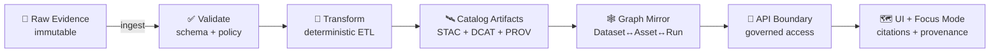

# 🧾 Data Contracts for MCP Gates 📦
> **Location:** `mcp/gates/contracts/data/`  
> **Goal:** make **data artifacts** (datasets, assets, lineage, QC, and publishables) **machine-checkable** before they can reach the **Catalog → Graph → API → UI/Focus Mode** pipeline.

---

## 🧭 What this folder is
This directory is the **source-of-truth** for **data contracts** enforced by the MCP Gate system.

In KFM terms: we’re “**evidence-first**” and “**provenance-first**” — raw inputs are treated as immutable evidence, and everything downstream must be reproducible, traceable, and validated before it can be used.  [oai_citation:0‡📚 Kansas Frontier Matrix (KFM) Data Intake – Technical & Design Guide.pdf](file-service://file-EbUCdsJMbu5KwpoKMrLrgj)

These contracts exist so that:

- 🧊 **Raw stays raw** (no overwrites, no “mystery edits”)  
- 🧬 **Pipelines are deterministic** (same inputs + config ⇒ same outputs)  
- 🧾 **Metadata is non-optional** (catalog + license + classification are required)  
- 🧬 **Lineage is mandatory** (PROV-first publishing)  
- 🚪 **Consumption is governed** (API boundary, no direct DB/storage bypass)  
- ✅ **Gates fail closed** (policy violations stop merges/publishing)

Policy Pack rule IDs referenced by the platform include **KFM-PIPE-001**, **KFM-API-001**, **KFM-PROV-001**, and **KFM-CAT-001** for ordering, API boundary, provenance-first, and contract-first enforcement.  [oai_citation:1‡Additional Project Ideas.pdf](file-service://file-Pc2GNivcrHBeKjBQksLC3T)

---

## 🧠 Design principles (non‑negotiables)
### 1) Evidence-first & immutable raw boundary 🧊
Raw evidence is treated as **read-only** and kept “as received” to preserve auditability.  [oai_citation:2‡📚 Kansas Frontier Matrix (KFM) Data Intake – Technical & Design Guide.pdf](file-service://file-EbUCdsJMbu5KwpoKMrLrgj)

This mirrors the broader project standard of **never overwriting raw data** and using versioning/dates for evolution tracking.  [oai_citation:3‡Scientific Method _ Research _ Master Coder Protocol Documentation.pdf](file-service://file-HTpax4QbDgguDwxwwyiS32)

### 2) Deterministic ETL 🧬
Pipelines must be config/code-driven (no ad-hoc edits), and outputs must be reproducible.  [oai_citation:4‡📚 Kansas Frontier Matrix (KFM) Data Intake – Technical & Design Guide.pdf](file-service://file-EbUCdsJMbu5KwpoKMrLrgj)

### 3) “Metadata as code” 🧾
KFM uses **STAC / DCAT / PROV** as cornerstone standards and validates them in CI (schema validation and policy gates).  [oai_citation:5‡📚 Kansas Frontier Matrix (KFM) Data Intake – Technical & Design Guide.pdf](file-service://file-EbUCdsJMbu5KwpoKMrLrgj) [oai_citation:6‡📚 Kansas Frontier Matrix (KFM) Data Intake – Technical & Design Guide.pdf](file-service://file-EbUCdsJMbu5KwpoKMrLrgj)

### 4) Governance baked into contracts 🛡️
Automated policy gates check schema validity, STAC/DCAT/PROV completeness, licenses, sensitivity tags, provenance, and citation requirements for Focus Mode.  [oai_citation:7‡Kansas Frontier Matrix (KFM) – Comprehensive Architecture, Features, and Design.pdf](file-service://file-4Umt1yHoGKicdmLWzFJ9sC) [oai_citation:8‡Kansas Frontier Matrix – Comprehensive UI System Overview.pdf](file-service://file-KcBQruYcoFVDEixzzRHTwt)

### 5) Cultural protocols & sensitivity handling 🏷️
Contracts must support **sensitivity filters** and governance safeguards (e.g., obfuscation/rounding, restricted access flows, cultural protocol labels). 

---

## 🗂️ Suggested folder layout (inside this `data/` contracts folder)
> If your repo already has a different structure, keep the *conceptual* grouping — the contract families are what matter.

```text
mcp/
└─ 📁 gates/
   └─ 📐 contracts/
      └─ 🗄️ data/
         ├─ ✅📄 README.md                         # ✅ you are here 📌 Scope of “data” contracts + how CI validates them
         ├─ 📐 schema/                             # JSON Schema contracts grouped by concern (import/reuse via $ref)
         │  ├─ 🗂️ catalog/                         # Discovery/catalog contracts (published metadata)
         │  │  ├─ 🛰️ stac/                          # STAC Collection/Item + KFM profile overlays/extensions
         │  │  └─ 🗃️ dcat/                          # DCAT Dataset/Distribution + KFM extensions/constraints
         │  ├─ 🧬 provenance/                       # PROV run/activity/entity schemas + agent role conventions
         │  ├─ 🧪 runs/                             # Run context schemas: run_manifest, inputs/outputs, checksums/digests
         │  ├─ ✅ quality/                          # QCReport/validation outputs + metric spec schemas (data quality gates)
         │  └─ 🚦 gate/                             # GateReport/PolicyDecision payload schemas (standard decision envelope)
         ├─ 🧪 examples/                            # Known-good example payloads for docs/tests (portable fixtures)
         │  ├─ 🛰️🧾 stac.item.example.json           # Example STAC Item payload (profile-compliant)
         │  ├─ 🗃️🧾 dcat.dataset.example.jsonld      # Example DCAT Dataset/Distribution payload (with links)
         │  ├─ 🧬🧾 prov.run.example.jsonld          # Example PROV run bundle (entities/activities/agents)
         │  └─ 🚦🧾 gate.report.example.json         # Example gate decision report (pass/fail + findings + pointers)
         └─ 🧪 tests/                               # Contract tests (schema validation + conftest fixtures)
            ├─ ✅🧪 contract_smoke_tests.yml         # Smoke suite: validate examples + key required schemas compile
            └─ 🧩 fixtures/…                         # Additional valid/invalid fixtures (edge cases, regressions)
```

---

## 🧩 Contract families (what we validate)
### 🛰️ Catalog contracts (STAC + DCAT)
KFM uses STAC for technical/spatial asset metadata and DCAT for discovery/citation metadata, and it **links** them together with provenance to form an evidence graph.  [oai_citation:9‡📚 Kansas Frontier Matrix (KFM) Data Intake – Technical & Design Guide.pdf](file-service://file-EbUCdsJMbu5KwpoKMrLrgj)

KFM also extends these standards with a KFM profile (examples include requiring `kfm:dataset_id` and `kfm:classification`).  [oai_citation:10‡📚 Kansas Frontier Matrix (KFM) Data Intake – Technical & Design Guide.pdf](file-service://file-EbUCdsJMbu5KwpoKMrLrgj)

### 🧬 Provenance contracts (PROV)
Pipelines must generate a provenance document that ties outputs back to inputs, code versions, parameters, and agents.  [oai_citation:11‡📚 Kansas Frontier Matrix (KFM) Data Intake – Technical & Design Guide.pdf](file-service://file-EbUCdsJMbu5KwpoKMrLrgj)

### 🧪 Run/Context contracts (reproducibility glue)
Run contexts carry parameters, pipeline versions, and potentially random seeds (and should be serialized to JSON for provenance).  [oai_citation:12‡📚 Kansas Frontier Matrix (KFM) Data Intake – Technical & Design Guide.pdf](file-service://file-EbUCdsJMbu5KwpoKMrLrgj)

### ✅ Quality contracts (QC as first‑class data)
Quality outputs should be *storable*, *versionable*, and linkable in the graph (design packs explicitly treat quality checks and data contracts as modular spec units).  [oai_citation:13‡Additional Project Ideas.pdf](file-service://file-Pc2GNivcrHBeKjBQksLC3T)

### 🚦 Gate decision contracts (policy-as-code outputs)
OPA/Conftest policy gates enforce governance rules like “every dataset has a license” and “required metadata fields exist,” and **fail closed** in CI.  [oai_citation:14‡Additional Project Ideas.pdf](file-service://file-Pc2GNivcrHBeKjBQksLC3T)

---

## 🔗 How STAC ↔ DCAT ↔ PROV connect (the Evidence Graph)
KFM does not use these standards in isolation — they should reference each other:

- STAC Item properties can carry the **PROV Activity ID** that produced the asset
- DCAT can point to the STAC Collection and the PROV document via distribution/part relationships
- The same linkage is mirrored into the graph (Dataset ↔ Asset ↔ Activity/Run)  [oai_citation:15‡📚 Kansas Frontier Matrix (KFM) Data Intake – Technical & Design Guide.pdf](file-service://file-EbUCdsJMbu5KwpoKMrLrgj)



---

## ✅ Publish boundary: what “ready” means
A dataset is not “published” (or usable by UI/Focus Mode) until it clears these gates:

- **Pipeline ordering**: ingest → validate → transform → publish (no skipping) (**KFM-PIPE-001**)  [oai_citation:16‡Additional Project Ideas.pdf](file-service://file-Pc2GNivcrHBeKjBQksLC3T)
- **API boundary**: UI/external consumption must route through the API (**KFM-API-001**)  [oai_citation:17‡Additional Project Ideas.pdf](file-service://file-Pc2GNivcrHBeKjBQksLC3T) [oai_citation:18‡📚 Kansas Frontier Matrix (KFM) Data Intake – Technical & Design Guide.pdf](file-service://file-EbUCdsJMbu5KwpoKMrLrgj)
- **Provenance-first**: PROV exists before graph/UI use (**KFM-PROV-001**)  [oai_citation:19‡Additional Project Ideas.pdf](file-service://file-Pc2GNivcrHBeKjBQksLC3T)
- **Contract-first**: STAC/DCAT/PROV schema validation must pass (**KFM-CAT-001**)  [oai_citation:20‡Additional Project Ideas.pdf](file-service://file-Pc2GNivcrHBeKjBQksLC3T)

Even for “rapid” or streaming-ish data, policies still imply provenance + classification must be honored before display/use.  [oai_citation:21‡📚 Kansas Frontier Matrix (KFM) Data Intake – Technical & Design Guide.pdf](file-service://file-EbUCdsJMbu5KwpoKMrLrgj)

---

## 🧾 Minimum contract fields (recommended baseline)
> These are the “seatbelts” for traceability.

### For **every dataset** (DCAT-like)
- `id` (stable canonical dataset ID)
- `title`, `description`
- `publisher`/`creator`
- `license` ✅ (required by policy gates)  [oai_citation:22‡Additional Project Ideas.pdf](file-service://file-Pc2GNivcrHBeKjBQksLC3T)
- `classification` / sensitivity tags (public/internal/restricted + cultural protocol flags) 
- `distributions[]` linking to STAC + PROV endpoints/files  [oai_citation:23‡📚 Kansas Frontier Matrix (KFM) Data Intake – Technical & Design Guide.pdf](file-service://file-EbUCdsJMbu5KwpoKMrLrgj)

### For **every geospatial asset** (STAC-like)
- geometry/bbox + temporal properties (if applicable)  [oai_citation:24‡📚 Kansas Frontier Matrix (KFM) Data Intake – Technical & Design Guide.pdf](file-service://file-EbUCdsJMbu5KwpoKMrLrgj)
- `kfm:dataset_id` and `kfm:classification` (KFM profile extension pattern)  [oai_citation:25‡📚 Kansas Frontier Matrix (KFM) Data Intake – Technical & Design Guide.pdf](file-service://file-EbUCdsJMbu5KwpoKMrLrgj)
- checksums (so artifacts are verifiable)  [oai_citation:26‡📚 Kansas Frontier Matrix (KFM) Data Intake – Technical & Design Guide.pdf](file-service://file-EbUCdsJMbu5KwpoKMrLrgj)

### For **every derived artifact** (PROV-like)
- activity/run id
- used entities (inputs) + generated entities (outputs)
- agent(s): human + CI + AI agent roles when applicable  [oai_citation:27‡📚 Kansas Frontier Matrix (KFM) Data Intake – Technical & Design Guide.pdf](file-service://file-EbUCdsJMbu5KwpoKMrLrgj)

---

## 🌍 Spatial rules that contracts should enforce
KFM standardizes outputs to a canonical CRS (commonly WGS84 / EPSG:4326) while tracking original CRS and reprojection steps for audit.  [oai_citation:28‡Kansas-Frontier-Matrix_ Open-Source Geospatial Historical Mapping Hub Design.pdf](file-service://file-ShqHKgjxCS9UT9vbcxDNzA)

> ✅ Contract implication: **store original CRS + transformation metadata** (don’t hide the reprojection).

---

## 🚪 API + UI + AI expectations (why contracts must include citations/provenance)
- The API is the **only gateway** for governed consumption and can apply last-mile filtering/redaction based on classification.  [oai_citation:29‡📚 Kansas Frontier Matrix (KFM) Data Intake – Technical & Design Guide.pdf](file-service://file-EbUCdsJMbu5KwpoKMrLrgj)
- The UI is map-centric (MapLibre for 2D, Cesium for 3D) and can “always show provenance info” because data passed through the pipeline.  [oai_citation:30‡📚 Kansas Frontier Matrix (KFM) Data Intake – Technical & Design Guide.pdf](file-service://file-EbUCdsJMbu5KwpoKMrLrgj)
- Focus Mode/AI is designed for traceability: it uses the knowledge graph, links claims back to sources, and expects provenance + citations to exist.  [oai_citation:31‡Kansas Frontier Matrix (KFM) – Comprehensive Architecture, Features, and Design.pdf](file-service://file-4Umt1yHoGKicdmLWzFJ9sC) [oai_citation:32‡Maps-GoogleMaps-VirtualWorlds-Archaeological-Computer Graphics-Geospatial-webgl.pdf](file-service://file-RshcX5sNY2wpiNjRfoP6z6)

> 🧠 Contract implication: include **citation-able IDs**, **source references**, and **lineage hooks** so answers and UI panels can render “why we believe this.”

---

## 🛡️ Policy gates & CI validation (how contracts get enforced)
A typical CI flow includes:

- formatting/linting
- **schema validation** (STAC/DCAT/PROV + manifests)
- link/reference resolution checks
- tests
- **OPA Policy Pack** (Conftest + Rego) to enforce governance denies before merge  [oai_citation:33‡📚 Kansas Frontier Matrix (KFM) Data Intake – Technical & Design Guide.pdf](file-service://file-EbUCdsJMbu5KwpoKMrLrgj) [oai_citation:34‡Additional Project Ideas.pdf](file-service://file-Pc2GNivcrHBeKjBQksLC3T)

And the broader MCP standard expects CI to keep the pipeline “green before merge.”  [oai_citation:35‡Scientific Method _ Research _ Master Coder Protocol Documentation.pdf](file-service://file-HTpax4QbDgguDwxwwyiS32)

---

## 📦 Artifact distribution & chain-of-custody (optional but recommended)
KFM concepts include storing artifacts in an **OCI registry** (immutable digest addressing) and attaching **Cosign signatures** for origin/integrity verification.  [oai_citation:36‡Additional Project Ideas.pdf](file-service://file-Pc2GNivcrHBeKjBQksLC3T)

> 🔒 Contract implication: include fields for `digest`, `signature_ref`, `attestation_ref`, or similar.

---

## 🧰 Where to put schemas (KFM precedent)
KFM documentation describes a `schemas/` directory approach for validating artifacts like `source_manifest.json`, `run_context.json`, STAC items, and more.  [oai_citation:37‡📚 Kansas Frontier Matrix (KFM) Data Intake – Technical & Design Guide.pdf](file-service://file-EbUCdsJMbu5KwpoKMrLrgj)

---

## 🏗️ Adding a new data contract (workflow)
1. ✅ Create a new schema file under `schema/<family>/...`
2. 🧪 Add at least one example payload under `examples/`
3. 🔗 Ensure cross-links exist (DCAT ↔ STAC ↔ PROV) where relevant  [oai_citation:38‡📚 Kansas Frontier Matrix (KFM) Data Intake – Technical & Design Guide.pdf](file-service://file-EbUCdsJMbu5KwpoKMrLrgj)
4. 🚦 Add/adjust policy rules so the gate can enforce the invariant(s)  [oai_citation:39‡Additional Project Ideas.pdf](file-service://file-Pc2GNivcrHBeKjBQksLC3T)
5. 🧾 Update this README with:
   - new contract ID
   - versioning expectations
   - where it’s used (Catalog/Graph/API/UI)

---

## 🧬 Versioning rules (recommended)
KFM already versions profile/specs (example: KFM-STAC / KFM-DCAT / KFM-PROV profiles) to keep metadata stable as the platform evolves.  [oai_citation:40‡📚 Kansas Frontier Matrix (KFM) Data Intake – Technical & Design Guide.pdf](file-service://file-EbUCdsJMbu5KwpoKMrLrgj) [oai_citation:41‡📚 Kansas Frontier Matrix (KFM) Data Intake – Technical & Design Guide.pdf](file-service://file-EbUCdsJMbu5KwpoKMrLrgj)

Recommended convention:

- **Contract ID**: `kfm.<family>.<name>`
- **Contract Version**: SemVer (`MAJOR.MINOR.PATCH`)
- **Backwards compatibility**:
  - PATCH: relax constraints or fix typos
  - MINOR: add optional fields
  - MAJOR: breaking changes (requires migrations + policy updates)

---

## 🧬 GitHub → Provenance integration (forward-looking)
Future proposals include treating GitHub PR activity as provenance — capturing PR metadata and feeding it into the graph/PROV so the repository itself becomes part of the evidence trail. 

> 🚦 Contract implication: consider a `prov_from_vcs` or `change_event` contract that ties artifacts to PRs/commits.

---

## 📚 Grounding sources used for this README
- 📥 **KFM Data Intake Guide**  [oai_citation:42‡📚 Kansas Frontier Matrix (KFM) Data Intake – Technical & Design Guide.pdf](file-service://file-EbUCdsJMbu5KwpoKMrLrgj)  
  Evidence-first intake, deterministic ETL, STAC/DCAT/PROV integration, CI validation patterns.  [oai_citation:43‡📚 Kansas Frontier Matrix (KFM) Data Intake – Technical & Design Guide.pdf](file-service://file-EbUCdsJMbu5KwpoKMrLrgj) [oai_citation:44‡📚 Kansas Frontier Matrix (KFM) Data Intake – Technical & Design Guide.pdf](file-service://file-EbUCdsJMbu5KwpoKMrLrgj) [oai_citation:45‡📚 Kansas Frontier Matrix (KFM) Data Intake – Technical & Design Guide.pdf](file-service://file-EbUCdsJMbu5KwpoKMrLrgj)
- 🏛️ **KFM Architecture / Features / Design**  [oai_citation:46‡Kansas Frontier Matrix (KFM) – Comprehensive Architecture, Features, and Design.pdf](file-service://file-4Umt1yHoGKicdmLWzFJ9sC)  
  Automated policy gates + governance checks.  [oai_citation:47‡Kansas Frontier Matrix (KFM) – Comprehensive Architecture, Features, and Design.pdf](file-service://file-4Umt1yHoGKicdmLWzFJ9sC)
- 🧭 **KFM AI System Overview**  [oai_citation:48‡Maps-GoogleMaps-VirtualWorlds-Archaeological-Computer Graphics-Geospatial-webgl.pdf](file-service://file-RshcX5sNY2wpiNjRfoP6z6)  
  Traceability and knowledge-graph-driven retrieval expectations.  [oai_citation:49‡Kansas Frontier Matrix (KFM) – Comprehensive Architecture, Features, and Design.pdf](file-service://file-4Umt1yHoGKicdmLWzFJ9sC)
- 🗺️ **KFM UI System Overview**  [oai_citation:50‡Kansas Frontier Matrix (KFM) – Comprehensive Architecture, Features, and Design.pdf](file-service://file-4Umt1yHoGKicdmLWzFJ9sC)  
  UI trust surfaces, provenance and citations requirements.  [oai_citation:51‡Maps-GoogleMaps-VirtualWorlds-Archaeological-Computer Graphics-Geospatial-webgl.pdf](file-service://file-RshcX5sNY2wpiNjRfoP6z6)
- 🧠 **Innovative Concepts (KFM)**  [oai_citation:52‡📚 Kansas Frontier Matrix (KFM) Data Intake – Technical & Design Guide.pdf](file-service://file-EbUCdsJMbu5KwpoKMrLrgj)  
  Sensitivity filters and cultural protocol handling. 
- 🧰 **Additional Project Ideas**  [oai_citation:53‡Additional Project Ideas.pdf](file-service://file-Pc2GNivcrHBeKjBQksLC3T)  
  OCI artifacts, Cosign signatures, OPA/Conftest gate patterns.  [oai_citation:54‡Additional Project Ideas.pdf](file-service://file-Pc2GNivcrHBeKjBQksLC3T)
- 🧪 **Scientific Method / Research / Master Coder Protocol**  [oai_citation:55‡Scientific Method _ Research _ Master Coder Protocol Documentation.pdf](file-service://file-HTpax4QbDgguDwxwwyiS32)  
  Documentation-first + reproducibility + CI discipline.  [oai_citation:56‡Scientific Method _ Research _ Master Coder Protocol Documentation.pdf](file-service://file-HTpax4QbDgguDwxwwyiS32) [oai_citation:57‡Scientific Method _ Research _ Master Coder Protocol Documentation.pdf](file-service://file-HTpax4QbDgguDwxwwyiS32)
- 🌟 **Latest Ideas & Future Proposals**  [oai_citation:58‡MARKDOWN_GUIDE_v13.md.gdoc](file-service://file-UYVruFXfueR8veHMUKeugU)  
  GitHub PR → PROV/graph provenance linking proposal. 

---

## 🧾 Glossary (quick reference)
- **Contract**: a machine-checkable schema for an artifact (JSON/JSON-LD/etc.)  
- **Gate**: a validation checkpoint that must pass before data is “publishable”  
- **Evidence-first**: raw is immutable; everything references its sources  [oai_citation:59‡📚 Kansas Frontier Matrix (KFM) Data Intake – Technical & Design Guide.pdf](file-service://file-EbUCdsJMbu5KwpoKMrLrgj)
- **Provenance-first**: lineage exists before graph/UI consumption  [oai_citation:60‡Additional Project Ideas.pdf](file-service://file-Pc2GNivcrHBeKjBQksLC3T)
- **Catalog-driven**: the catalog is a backbone, not an afterthought  [oai_citation:61‡📚 Kansas Frontier Matrix (KFM) Data Intake – Technical & Design Guide.pdf](file-service://file-EbUCdsJMbu5KwpoKMrLrgj)
- **API boundary**: UI/external consumers use the API as the controlled gateway  [oai_citation:62‡📚 Kansas Frontier Matrix (KFM) Data Intake – Technical & Design Guide.pdf](file-service://file-EbUCdsJMbu5KwpoKMrLrgj)

---
