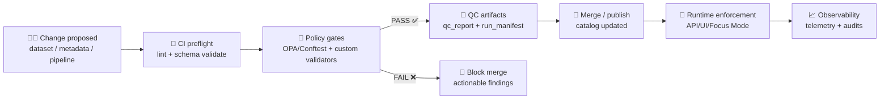

# ✅ Data Schema Quality Gates (MCP)


> 🧭 **One-liner:** This folder defines **schema-quality contracts + policy gates** that keep KFM data **valid, attributable, reproducible, and safe** before it can appear in the **catalog**, **UI**, or **Focus Mode**.

---

## 📌 What this directory is

This directory is the **contract surface area** for a specific MCP gate family:

📦 `mcp/gates/contracts/data/schema/quality/`

It exists to make “**data treated like code**” real in practice:

- 📜 **Contracts** describe what “valid” means (schemas + profiles + invariants).
- 🚦 **Gates** enforce it (CI + ingestion + runtime checks).
- 🧾 **Reports** prove what happened (QC reports, run manifests, audit traces).
- 🔒 **Policies** prevent unsafe or unverifiable assets (“fail closed”).

---

## 🎯 Scope

| ✅ In scope | 🚫 Out of scope |
|---|---|
| Metadata schema validity (STAC/DCAT/PROV + KFM fields) | Heavy ETL / transformation logic |
| Quality dimensions (completeness, consistency, validity, timeliness) | “Best possible” data (we enforce **minimum provable correctness**) |
| Provenance & attribution requirements | UI feature design (only the contracts UI consumes) |
| License + sensitivity labeling & propagation rules | User authentication implementation details |
| CI / PR gate contracts (what must be checked) | Infrastructure provisioning (K8s/Terraform/etc.) |

---

## 🧠 Gate principles (non‑negotiables)

> These are “defaults” for every contract/gate in this folder.

1. **Fail closed** 🔒  
   If we can’t prove it’s valid/safe/attributable → it doesn’t ship.

2. **Contract-first** 📜  
   Every dataset/output that enters the official catalog must have a contract.

3. **Provenance-first** 🧾  
   Anything visible in UI/Focus Mode must be traceable to sources + processing steps.

4. **Policy-as-Code** 🧱  
   Rules live as versioned, testable policy artifacts (e.g., Rego), not tribal memory.

5. **Reproducible by default** 🔁  
   Runs produce manifests + checksums + version pins so results can be repeated and audited.

---

## 🗂️ Recommended layout (inside this folder)

> This README is the “front door.” The rest of the folder is where the gate machinery lives.

```text
mcp/
└── 🚦 gates/
    └── 📜 contracts/
        └── 🗄️ data/
            └── 🧬 schema/
                └── ✅ quality/
                    ├── 📄 README.md                    # 📘 Quality pack overview: what “quality” means + how to run/interpret
                    ├── 📐 schemas/                      # Contract defs (JSON Schema / SHACL / profile overlays)
                    │   ├── 🗂️📐🧾 dataset.metadata.schema.json  # Dataset metadata quality contract (required fields, enums, links)
                    │   ├── 🧬📐🧾 provenance.schema.jsonld       # Provenance quality contract (required lineage edges, agents, timestamps)
                    │   ├── 🧾📐🧾 run_manifest.schema.json        # Run manifest quality contract (inputs/outputs/hashes/tool versions)
                    │   └── ✅📐🧾 qc_report.schema.json           # QCReport contract (checks run, metrics, failures, summaries)
                    ├── ⚖️ policies/                      # Policy pack enforcing invariants beyond schema (OPA/Rego)
                    │   ├── ⚖️📄 KFM-CAT-*.rego            # Catalog/metadata rules (license required, link integrity, completeness)
                    │   ├── ⚖️📄 KFM-PROV-*.rego           # Provenance rules (prov required for processed/derived, receipt linkage)
                    │   └── ⚖️📄 KFM-SENS-*.rego           # Sensitivity rules (label propagation, redaction, review/waiver requirements)
                    ├── 🧪 fixtures/                       # Golden examples for regression testing (pass/fail)
                    │   ├── ✅ valid/                      # Inputs that MUST pass (baseline compliant quality)
                    │   └── ❌ invalid/                    # Inputs that MUST fail (proves deny rules work)
                    ├── 🧯 waivers/                        # Governed exceptions (expiry + rationale + approval required)
                    │   └── 🧯🧾 waivers.yml                # Waiver ledger: id, scope, owner, expiry, rationale, approver
                    ├── 📊 reports/                        # Generated outputs (CI artifacts; do not hand-edit)
                    │   └── 🏗️ (CI writes here)            # CI writes reports/results into this folder (often gitignored)
                    └── 📚 docs/                           # Deeper notes & rationale (optional)
                        └── 🧭 decisions/                  # Decision notes/ADRs about quality rules, thresholds, and exceptions
```

---

## 🔁 Gate lifecycle (PR → Merge → Runtime)



---

## 📜 Contract surface (what we validate)

These are the “objects” we expect gates to understand. Each should have a **schema**, **fixtures**, and **policy checks**.

### 1) 🗂️ Dataset Metadata Contract (Catalog Entry)

**Goal:** Every dataset is self-described and safely reusable.

Typical contract requirements:
- Stable `dataset_id`
- Human-friendly title/description
- License (approved list)
- Spatial + temporal extent
- Links to processed assets
- Sensitivity / classification label
- Versioning (`schema_version`, dataset version, etc.)
- Provenance link(s)

<details>
<summary>📦 Example (simplified) dataset contract</summary>

```json
{
  "id": "example_dataset_id",
  "title": "Example Dataset",
  "description": "What this is, where it came from, how it was processed.",
  "license": "Public Domain",
  "schema_version": "vX.Y.Z",
  "spatial": { "bbox": [-99.5, 38.3, -98.8, 38.9], "crs": "EPSG:4326" },
  "temporal": { "start": "1894-01-01", "end": "1894-12-31" },
  "sensitivity": "public",
  "provenance_ref": "data/provenance/example_dataset_id.prov.jsonld",
  "assets": [
    { "href": "data/processed/example.parquet", "checksum": "sha256:..." }
  ]
}
```
</details>

---

### 2) 🧾 Provenance Contract (PROV)

**Goal:** Every published artifact can be traced:
- **Entity** (data product)
- **Activity** (pipeline/run)
- **Agent** (human/automation/tool)
- Source URLs / input hashes
- Tool versions / environment pins
- Deterministic run context (where applicable)

---

### 3) 🧬 Run Manifest Contract (Audit Trail)

**Goal:** Each pipeline run emits a manifest that records:
- What ran, when, and with which inputs
- Output artifacts + checksums
- Tool versions + parameters
- Summary stats and errors
- Canonical digest / idempotency key

---

### 4) ✅ QC Report Contract (Quality Results)

**Goal:** Gate results are **first-class artifacts**, not just CI logs.

Recommended QC report fields:
- Gate IDs executed
- PASS/FAIL/WARN
- Findings with remediation hints
- Links to artifacts (schemas, manifests, provenance, diffs)
- Timestamp + environment

---

### 5) 🕸️ Graph / Ontology Health Contracts (Optional but powerful)

**Goal:** Detect drift and integrity issues in the knowledge graph (and/or ontology) early.

Examples:
- Orphan nodes check
- Unexpected super-hubs
- Property type drift (e.g., numeric → string)
- Backup verification / restore test artifacts

---

### 6) 🧷 Narrative Evidence Manifests (Story / Focus Mode)

**Goal:** Narratives behave like research outputs:
- Claims map to evidence references
- Citations resolve
- Provenance edges exist for “used dataset → story node”

---

## ✅ Quality dimensions we enforce

A practical “minimum standard” for schema quality gates:

| Dimension | What it means | Example checks |
|---|---|---|
| ✅ Validity | Conforms to schema/profile | JSON Schema validation, enum checks |
| 🧩 Completeness | Required fields present | license, bbox, temporal, provenance_ref |
| 🔁 Consistency | No contradictory values | CRS declared matches file metadata; time ranges sane |
| 🧼 Integrity | Files aren’t corrupted/tampered | checksums present, hash matches |
| ⏱️ Timeliness | Freshness is known | last_updated present; refresh cadence declared |
| 🧠 Traceability | Evidence chain exists | provenance references resolve; sources included |
| 🔐 Safety/Ethics | Sensitive data is controlled | sensitivity label exists; propagation rules |

---

## 🚦 Gate registry (starter set)

> Use stable IDs (never rename, only deprecate). Categorize gates so CI output is predictable.

| ID | Category | Severity | What it blocks |
|---|---:|---:|---|
| `KFM-CAT-001` | Catalog | ❌ FAIL | Missing required catalog fields |
| `KFM-CAT-002` | Catalog | ❌ FAIL | Invalid STAC/DCAT profile / schema version |
| `KFM-PROV-001` | Provenance | ❌ FAIL | No provenance_ref or unresolved provenance |
| `KFM-LIC-001` | License | ❌ FAIL | Missing/invalid license value |
| `KFM-SENS-001` | Sensitivity | ❌ FAIL | Missing sensitivity label |
| `KFM-SENS-002` | Sensitivity | ❌ FAIL | Derivative asset downgrades classification |
| `KFM-INTEG-001` | Integrity | ❌ FAIL | Checksum mismatch / missing checksums |
| `KFM-SCHEMA-DRIFT-001` | Drift | ⚠️ WARN/FAIL | Property type drift above threshold |

> ✨ Tip: Keep “WARN” gates rare. Either something is safe/valid… or it isn’t.

---

## 🧪 How gates run (recommended CI stages)

A typical CI pipeline (human PRs **and** agent-generated PRs) should run:

1. 🧹 **Lint/format** (code + JSON formatting)
2. 🧱 **Schema validation** (JSON Schema / SHACL where applicable)
3. 🔗 **Link/reference checks** (files exist, URLs not broken where required)
4. ✅ **Tests** (unit/integration tests for validators)
5. 🚦 **Policy pack** (OPA/Conftest rules)
6. 🧾 **Artifact generation** (QC report + run manifest + telemetry)
7. 🛡️ **Supply chain checks** (optional): signatures, pinned tool versions, artifact digests

---

## 🛠️ Local dev workflow (suggested commands)

> Adjust to your actual toolchain (Make/Taskfile/npm/pipx/etc.). These are “shape” examples.

```bash
# 1) Validate JSON schemas + fixtures
make schema-validate

# 2) Run policy checks (OPA/Conftest)
make policy-test

# 3) Run catalog QA tool (deep checks)
make catalog-qa

# 4) Generate a QC report artifact locally
make qc-report
```

---

## 🧩 Adding a new gate (checklist)

### Step 1 — Pick the contract target 🎯
- dataset metadata?
- provenance record?
- run manifest?
- graph health report?
- story evidence manifest?

### Step 2 — Create or extend the schema 🧬
- Add `schemas/<thing>.schema.json`
- If you need a stricter profile, add `schemas/profiles/<profile>.json`

### Step 3 — Add fixtures ✅❌
- `fixtures/valid/<name>.json`
- `fixtures/invalid/<name>.json`
- Keep invalid fixtures small and single-failure when possible.

### Step 4 — Implement the policy rule 🚦
- Add `policies/<CATEGORY>/<ID>.rego` (or your equivalent)
- Output should be **actionable** (what failed + how to fix)

### Step 5 — Wire into CI 🔁
- Ensure the gate runs in PR pipelines
- Ensure it produces artifacts (qc_report + logs)

### Step 6 — Document the rationale 📚
- Add `docs/decisions/<ID>.md`
- Include: motivation, scope, false-positive considerations, remediation

---

## 🧯 Waivers (exceptions, but governed)

Waivers are allowed **only** when:
- There’s a legitimate temporary constraint
- The risk is acknowledged
- The waiver has an **owner + expiry date**
- The waiver is scoped (dataset_id / gate_id / version range)

Recommended waiver format (example):

```yaml
- gate_id: KFM-CAT-001
  dataset_id: example_dataset_id
  reason: "Legacy dataset missing temporal.end; migration in progress"
  owner: "@team-handle"
  expires_on: "2026-03-01"
  mitigation: "Dataset marked experimental; blocked from public UI"
```

---

## 🔐 Ethics + sensitivity notes

Schema quality is not just correctness — it’s also **responsible usage**:

- Every dataset must declare a **sensitivity/classification** level.
- Derivatives must not silently downgrade sensitivity.
- Cultural/community-sensitive data may require:
  - access control,
  - geo-obfuscation,
  - consent/authority tracking,
  - additional review gates.

---

## 🧩 UI + Focus Mode integration

These gates exist so the UI/Focus Mode can confidently:
- show provenance panels (sources, licenses, methods),
- generate attributions automatically,
- provide citations/evidence in answers,
- block unsafe exports or visualizations.

---

## 📚 Reference library (project files)

This repo’s knowledge base includes:
- 📦 **KFM architecture/design docs** (how the platform should behave)
- 📦 **MCP protocol docs** (how we build and prove things)
- 📦 **PDF portfolios** (geospatial, programming, AI, data management)

If you see a “PDF Portfolio” file, it typically contains multiple embedded documents/books.

---

## 📖 Glossary

- **Contract** 📜: A schema + invariants defining what an artifact must look like.
- **Gate** 🚦: A deterministic validator that enforces one or more contracts.
- **Profile** 🧬: A stricter specialization of a standard schema (e.g., STAC + KFM-required fields).
- **QC Report** ✅: Machine-readable proof of what gates ran and what they found.
- **Run Manifest** 🧾: Immutable-ish run record (inputs/outputs/tools/checksums).
- **Waiver** 🧯: A time-boxed exception to a gate with explicit risk ownership.

---

## ✅ Success criteria

You’ve “done it right” when:

- A contributor can add a dataset and **CI tells them exactly what to fix**.
- Every dataset in the catalog is **valid, licensed, labeled, traceable**.
- “Mystery layers” don’t exist (not even accidentally).
- Provenance + QC artifacts make audits boring (in the best way 😄).

