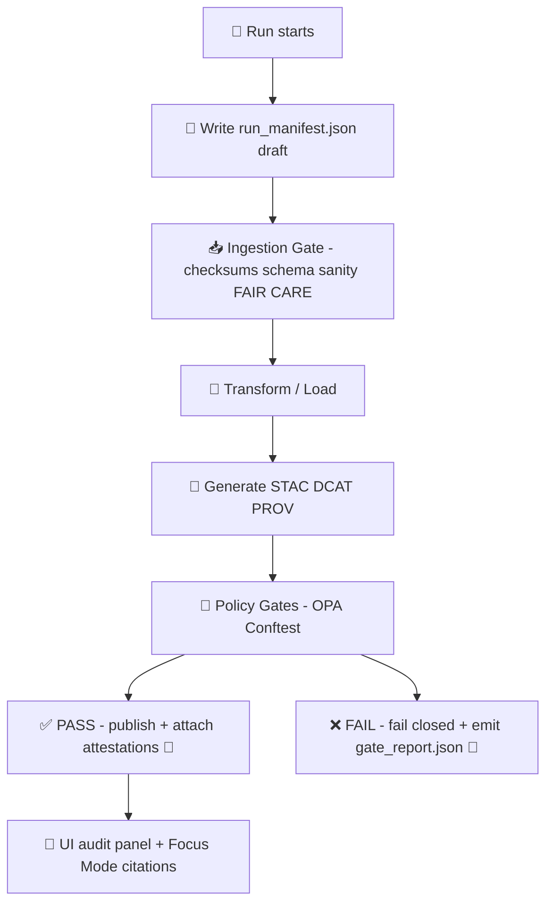

# 🏃 Runs — Schemas & Contracts (MCP Gates)

> [!IMPORTANT]
> This folder is **contract-first** infrastructure. Everything in `mcp/gates/...` depends on runs being **auditable, reproducible, and policy-checkable**.  
> If it isn’t in a schema, it’s not a contract. ✅

---

## 🎯 What this directory is

`mcp/gates/contracts/data/schema/runs/` defines the **machine-readable JSON Schemas** for **run artifacts** produced by Kansas Frontier Matrix (KFM) pipelines, simulations, and agent workflows.

These run artifacts exist so that:

- 🧾 **Every execution is traceable** (who/what ran, on which inputs, producing which outputs)
- 🔒 **Gates can fail-closed** using policy-as-code (e.g., OPA/Conftest)
- 🧠 **Focus Mode + UI audit surfaces** can always show *“the map behind the map”* (sources, provenance, citations)
- 🧪 **MCP scientific-method workflows** (question → hypothesis → method → results) can be attached to runs as structured metadata

---

## ✅ What counts as a “run”?

A **run** is any discrete, reviewable execution that changes or produces *something* worth auditing:

- 📥 **Ingestion runs** (new/updated datasets, transforms, ETL)
- 🧱 **Graph build / sync runs** (Neo4j updates, ontology migrations)
- 🗺️ **Geospatial processing runs** (tile builds, PostGIS transforms, GeoParquet/COG/PMTiles generation)
- 🧠 **AI runs** (retrieval + reasoning, extraction, classification, summarization, Focus Mode responses)
- 🧪 **Simulation runs** (scenario generation, model sweeps, “kfm-sim-run” style outputs + diff patches)
- 🧰 **CI/automation runs** (policy checks, schema validation, QA batteries, bot PR pipelines)

If it can influence what users see (UI) or what the AI answers (Focus Mode), it should have a run record. 🧭

---

## 📦 Contract invariants (MUST / SHOULD / MAY)

### MUST ✅
- **Every run artifact MUST validate** against a schema in this folder.
- **Every run MUST have a stable `run_id`** and a **content digest** for integrity.
- **Every input/output reference MUST be hashable** (checksums, digests, or verifiable content addressing).
- **Gates MUST be able to evaluate runs without “hidden context.”**
- **Artifacts MUST be append-only / immutable once published** (publish new version; don’t mutate history).

### SHOULD 👍
- **Runs SHOULD be idempotent** via an `idempotency_key` derived from canonicalized run intent.
- **Runs SHOULD include provenance bundle references** (STAC/DCAT/PROV and/or graph IDs).
- **Runs SHOULD include environment capture** (container digest, dependency lockfiles, tool versions).

### MAY ✨
- Runs MAY include MCP scientific-method fields (question/hypothesis/method/results) for “lab notebook” rigor.
- Runs MAY carry supply-chain attestations (SBOM, SLSA provenance, signatures).

---

## 🧩 Schema inventory (recommended set)

> [!NOTE]
> Filenames below reflect the intended contract surface. If a file doesn’t exist yet, add it along with:
> 1) an example JSON, and 2) a gate test that enforces it.

| 📄 Schema | Purpose | Primary consumer |
|---|---|---|
| `run-manifest.schema.json` | Canonical summary of *what happened* in a run | Gates, audits, UI/AI trace panels |
| `gate-report.schema.json` | Structured gate outcomes (pass/fail/warn/waive) | CI + runtime gate orchestration |
| `telemetry-event.schema.json` | NDJSON event records for time-ordered run telemetry | Monitoring, investigations, replay |
| `artifact-ref.schema.json` | Strongly-typed references to produced artifacts | Catalog + graph ingestion |
| `provenance-bundle-ref.schema.json` | References to STAC/DCAT/PROV bundles + graph IDs | Provenance gates + UI audit |
| `attestation-ref.schema.json` | References to SBOM/SLSA/signature objects | Supply-chain & trust gates |

---

## 🧾 `run_manifest.json` contract (core artifact)

### 📌 Purpose
`run_manifest.json` is the **single best “receipt”** of a run.

It lets the system answer:

- What code/tool ran?
- With what configuration?
- On which inputs?
- Producing which outputs?
- Under which policies?
- With which provenance + citations?

### 🧷 Minimum required fields (baseline)
A minimal manifest should include:

- `schema_version` (semver)
- `run_id`
- `run_time` (start) + optional `end_time`
- `status` (`planned | running | succeeded | failed | canceled`)
- `actor` (human / CI / agent)
- `trigger` (manual, schedule, PR, webhook, etc.)
- `inputs[]` (each with stable IDs + checksum/digest where possible)
- `outputs[]` (each with stable IDs + checksum/digest where possible)
- `canonical_digest` (hash of canonicalized manifest intent)
- `idempotency_key` (optional, but preferred)
- `provenance` references (STAC/DCAT/PROV pointers)
- `gate_report_ref` (when gates ran)

### 🧪 Example (illustrative)
```json
{
  "$schema": "run-manifest.schema.json",
  "schema_version": "1.0.0",
  "run_id": "01JABCDEF1234567890XYZWVU",
  "run_time": "2026-01-23T00:00:00Z",
  "end_time": "2026-01-23T00:02:41Z",
  "status": "succeeded",

  "actor": {
    "kind": "ci",
    "name": "github-actions",
    "identity": "bot@kfm",
    "toolchain": {
      "container_digest": "sha256:…",
      "repo_commit": "…",
      "workflow_run_id": "…"
    }
  },

  "trigger": { "kind": "pull_request", "ref": "PR-123" },

  "intent": {
    "pipeline": "ingest.usgs_nwis_river_gauges",
    "config_hash": "sha256:…"
  },

  "idempotency_key": "sha256:…",
  "canonical_digest": "sha256:…",

  "inputs": [
    { "kind": "dataset", "id": "kfm.dataset.usgs.nwis", "digest": "sha256:…" }
  ],
  "outputs": [
    { "kind": "artifact", "id": "kfm.artifact.river_gauges.geojson", "digest": "sha256:…", "media_type": "application/geo+json" }
  ],

  "provenance": {
    "prov_jsonld_ref": "prov.jsonld",
    "stac_ref": "stac.item.json",
    "dcat_ref": "dcat.dataset.jsonld"
  },

  "gates": {
    "gate_set": "publish-v13",
    "gate_report_ref": "gate_report.json"
  },

  "summary_counts": { "records_in": 1240, "records_out": 1240, "warnings": 0, "errors": 0 }
}
```

---

## 🔐 Identity, canonicalization, and idempotency

### ✅ Canonical digest
To make runs **deterministic + auditable**, the run manifest intent should be **canonicalized** before hashing.

**Pattern:**
1) Remove volatile fields (`end_time`, `duration`, dynamic counters, etc.)
2) Canonicalize JSON (stable ordering/format)
3) Hash the canonical JSON → `canonical_digest`

### ♻️ Idempotency
If the run is designed to be safely re-runnable, `idempotency_key` should be:

- explicitly set, OR
- derived from `canonical_digest`

This makes *“exactly-once”* behaviors much easier to implement across scheduled jobs.

---

## 🗃️ Expected on-disk layout (audit-friendly)

A consistent location makes investigations fast. Recommended pattern:

```text
data/
└─ 🧾 audits/
   └─ 🏷️ <run_id>/                      # One audit bundle per run (immutable once finalized; append-only for telemetry)
      ├─ ✅🧾 run_manifest.json           # REQUIRED: run receipt (who/what/when, inputs/outputs, tool versions, hashes/pointers)
      ├─ 🚦🧾 gate_report.json            # (if gates ran) Gate decision envelope: pass/fail, findings, severities, waivers used
      ├─ 📈🧾 telemetry.ndjson            # Append-only event stream (optional but preferred): timings, counters, audit-safe events
      ├─ 🔐📄 checksums.sha256            # Recommended: sha256 sums for local files referenced by this bundle (tamper detection)
      ├─ 🧬🧾 prov.jsonld                 # Recommended: PROV-O lineage linking raw→work→processed→catalog + agents/tools/params
      ├─ 🛰️🧾 stac.item.json              # When applicable: STAC Item snapshot pointing to produced assets/artifacts
      ├─ 🗂️🧾 dcat.dataset.jsonld         # When applicable: DCAT dataset/distribution record (license, access, distribution links)
      └─ 📦 artifacts/                    # Optional: local staging copies (logs/figures/exports); keep small + checksum anything included
```

---

## 🚦 How gates use run contracts

Gates should treat the run artifacts as **the sole source of truth** for decisions.

### 🧠 Gate categories (common)
- 🧩 **Schema gates**: validate JSON shape and required fields
- 🧬 **Provenance gates**: STAC/DCAT/PROV present and consistent
- 📜 **License & ethics gates**: required license fields, sensitivity classifications, CARE constraints
- 🔒 **Security gates**: secret scanning, prompt-safety checks, artifact signing verification
- 🧾 **Citation gates**: Focus Mode responses must include citations and traceable sources

### 🔁 Typical gate flow (mermaid)


---

## 📈 Telemetry (NDJSON) for replay + investigations

Telemetry is for **time-ordered facts** about a run:

- start/finish events
- downloads
- validation steps
- row counts
- errors/warnings
- gate evaluations
- publish steps

**Why NDJSON?** It’s append-only, stream-friendly, and easy to ingest into dashboards/log stores.

---

## 🧪 Simulation + scenario runs (kfm-sim-run style)

Simulation runs often output:

- scenario parameters
- generated datasets or layers
- deltas/diff patches for review
- metrics + evaluation summaries

**Contract expectation:** simulation outputs MUST be referenced in the run manifest and MUST be gated like any other data change (no “simulation bypass”).

---

## 🧠 AI runs: traceability is non-negotiable

For AI-related runs (Focus Mode, extractors, classifiers):

- inputs SHOULD include retrieval context references (graph query IDs, document IDs, dataset IDs)
- outputs SHOULD include citations (structured, machine-checkable)
- run manifest SHOULD capture model/tool versions and safety checks

If the UI shows an AI answer, the run artifacts should make it explainable later. 🔎

---

## 🔏 Supply-chain hooks (SBOM / SLSA / signatures)

This folder is where we **standardize** how run artifacts point to:

- SBOM references
- provenance attestations
- signatures (e.g., for OCI-distributed artifacts)
- verification outcomes (pass/fail)

Even if the project starts without full supply-chain enforcement, defining the contract early avoids retrofits later. 🧱

---

## 🧪 Local validation (developer workflow)

> [!TIP]
> Keep validation fast. Developers should be able to run gates locally before pushing.

Example patterns (adjust to repo tooling):

```bash
# 1) Validate a manifest against schema
python -m jsonschema -i data/audits/<run_id>/run_manifest.json mcp/gates/contracts/data/schema/runs/run-manifest.schema.json

# 2) Run policy checks (OPA/Conftest)
conftest test data/audits/<run_id>/ -p mcp/gates/policy/
```

---

## 🧬 Versioning rules (schema evolution)

### SemVer expectations
- **PATCH**: clarifications, tighter validation that doesn’t break valid docs
- **MINOR**: additive fields (backwards compatible)
- **MAJOR**: breaking changes (requires migration plan + dual-read window)

### Deprecation pattern
- Keep old schema readable during a transition window.
- Write a small migration tool (or gate auto-fixer) when possible.
- Update examples + tests in the same PR. ✅

---

## 🧰 Adding a new run artifact schema

Checklist 🧾:

- [ ] Create `*.schema.json` in this folder
- [ ] Add a minimal example JSON (and one “maximal” example if helpful)
- [ ] Add/extend gate tests so CI enforces it
- [ ] Update this README’s inventory table
- [ ] Document how the artifact is produced + where it lives (`data/audits/<run_id>/...`)
- [ ] Confirm UI/AI consumers can rely on the new fields (no ambiguity)

---

## 📚 Glossary (quick)

- **Run**: an auditable execution producing artifacts or decisions
- **Gate**: a policy check that blocks or permits publishing/merging
- **Contract-first**: schema is the source of truth; no hidden formats
- **Provenance bundle**: STAC/DCAT/PROV references that explain origin + lineage
- **Canonical digest**: stable hash of the run’s canonicalized intent
- **Idempotency key**: stable key that prevents duplicate processing
- **NDJSON**: newline-delimited JSON for append-only telemetry streams

---

> [!SUCCESS]
> If you can answer **“what happened, why, and can we reproduce it?”** from `data/audits/<run_id>/`,
> then the run contract is doing its job. ✅

