# 🧪 Data Contract Gate Tests (MCP)


> 🎯 **Purpose:** This folder is the **automated enforcement layer** for KFM’s “contract-first + provenance-first” rule:  
> **Nothing becomes a cataloged dataset, UI layer, Story Node input, or Focus Mode evidence unless it passes these tests.**  
> No “mystery layers” 🚫🗺️.

---

## ✅ What this folder is responsible for

This directory contains **test implementations** for **data contracts** and related **quality gates** that protect KFM’s core promises:

- **Traceability:** anything visible in the UI or used by Focus Mode must link back to catalogs and provenance.
- **Standards alignment:** metadata stays consistent across **STAC / DCAT / PROV**.
- **Governance & safety:** licensing, sensitivity classification, and redaction rules are enforced.
- **Scientific rigor:** pipeline outputs should be reproducible and validation should be repeatable.

---

## 🧭 Where this fits in the KFM pipeline

```mermaid
flowchart TD; PR["🔀 Pull Request - code + data"] --> Lint["🧹 Lint format static checks"]; Lint --> Policy["🛡️ Policy Pack Gate - OPA Conftest"]; Policy --> ContractTests["🧪 Contract Tests - pytest"]; ContractTests --> Integration["🔗 Integration Tests - PostGIS Neo4j"]; Integration --> E2E["🧭 E2E Smoke - optional Cypress critical flows"]; E2E --> Review["👀 Human review + approvals"]; Review --> Merge["✅ Merge - publish deploy"];
```



> 🧠 **Key idea:** the same checks that run in CI can also run as **runtime “gates”** during ingestion pipelines.

---

## 📁 Recommended layout (inside `mcp/gates/contracts/data/`)

> If your repo layout differs, keep the **intent** the same and update paths in commands accordingly.

```text
mcp/
└─ 🚦 gates/
   └─ 📜 contracts/
      └─ 🗄️ data/
         ├─ 🧾📐 schemas/                     # 🧾 JSON Schema + profile constraints (source of truth for validation)
         ├─ 🛡️⚖️ policy/                      # 🛡️ OPA/Rego rules (Conftest runner) enforcing invariants beyond schema
         ├─ 🧪 fixtures/                      # 🧪 Golden samples: contracts + metadata + tiny data (pass/fail coverage)
         └─ ✅ tests/                         # ✅ you are here 📌 Automated contract/profile/geo/privacy verification
            ├─ 📄 README.md                   # 📘 How to run tests locally/CI, expected tooling, and failure interpretation
            ├─ 🧪🐍 test_contract_schema.py     # Validates all schemas compile + example payloads validate (baseline sanity)
            ├─ 🛰️🧪 test_stac_profile.py        # Enforces KFM-STAC profile rules (links/assets/extent/time/license invariants)
            ├─ 🗂️🧪 test_dcat_profile.py        # Enforces KFM-DCAT profile rules (dataset/distribution/license/access constraints)
            ├─ 🧬🧪 test_prov_profile.py        # Enforces KFM-PROV profile rules (entity/activity/agent shape + derivation links)
            ├─ 🗺️🧪 test_geo_validity.py        # Geo QA checks (bbox/CRS/geometry sanity; rejects invalid spatial payloads)
            └─ 🔒🧪 test_sensitivity_redaction.py # Sensitivity + redaction rules (no secrets/PII; label propagation; waivers)
```

---

## 🧱 What is a “Data Contract” in KFM?

A **data contract** is a **metadata JSON** that acts like an API contract for datasets: it defines the minimum required truth about the dataset so *every downstream component can trust it*.

Typical contract fields include:

- **Identity:** `id`, `title`, `description`, `schema_version`
- **License & usage:** `license`, (optionally) `restrictions`, `consent`, `attribution`
- **Spatial/temporal:** bbox, CRS (commonly `EPSG:4326`), time range
- **Provenance basics:** `source_url`, creator/agency, issued date, processing steps
- **Governance:** sensitivity classification + redaction expectations

### Example (simplified contract)
```json
{
  "id": "usgs_historic_topo_1894_ellsworth",
  "title": "USGS Historic Topographic Map (Ellsworth County, 1894)",
  "description": "Digitized historic topo map for Ellsworth County, Kansas.",
  "schema_version": "v3.0.0",
  "license": "Public Domain",
  "spatial": { "bbox": [-99.5, 38.3, -98.8, 38.9], "crs": "EPSG:4326" },
  "temporal": { "start": "1894-01-01", "end": "1894-12-31" },
  "provenance": {
    "source_url": "https://example.gov/usgs/historical-topo",
    "creator": "U.S. Geological Survey",
    "issued": "1894-03-15"
  },
  "governance": {
    "sensitivity": "public",
    "pii": false
  }
}
```

---

## 🚦 Gate → Test mapping (what we enforce here)

| Gate 🧩 | What it protects 🛡️ | Examples of checks ✅ | Typical runner |
|---|---|---|---|
| **Contract Schema Gate** | Contracts are structurally valid & complete | required fields exist, types valid, `schema_version` present | `pytest` (+ jsonschema/pydantic) |
| **Standards Gate** | STAC/DCAT/PROV profiles are respected | required fields present, profile extensions validated | `pytest` + `conftest` |
| **Cross-Link Gate** | Metadata stays synchronized | DCAT distribution links STAC, PROV references inputs/outputs, IDs match | `pytest` |
| **Geo Validity Gate** | Spatial correctness & renderability | CRS present, bbox sane, geometry valid, COG/vector-tile sanity | `pytest` (+ optional PostGIS) |
| **Sensitivity Gate** | Privacy / ethics / sovereignty rules | sensitivity required, coordinate redaction/fuzzing enforced | `conftest` |
| **Evidence Gate** | Anything used as “evidence” is traceable | generated artifacts must still have STAC/DCAT/PROV and be labeled derived | `pytest` + `conftest` |

> ✨ Bonus: Many of these gates exist to ensure the UI can always show **Layer Provenance** (source + license + processing summary) and Focus Mode can always produce **citations**.

---

## ▶️ Running the tests

### 1) Python tests (fast, local)
```bash
pytest mcp/gates/contracts/data/tests -q
```

### 2) Policy Pack tests (OPA/Conftest)
> Your repo may run Conftest over a folder of JSON/YAML (contracts, STAC, DCAT, PROV).
```bash
conftest test mcp/gates/contracts/data/policy
```

### 3) Integration tests (optional but recommended)
Integration tests validate **real system behaviors**, e.g.:
- PostGIS spatial queries, geometry validity
- Neo4j ingest constraints / graph integrity

Typical pattern:
```bash
# Start test deps (example)
docker compose up -d test-postgis test-neo4j

pytest mcp/gates/contracts/data/tests -m integration
```

---

## 🧠 Writing good contract tests (KFM style)

### ✅ Must-haves
- **Deterministic**: same inputs → same outputs (seed where needed 🎲🚫)
- **Idempotent**: re-running does not create drift
- **Evidence-producing**: failures should explain *exactly* what broke and where
- **Both directions**:
  - a **positive** test proving valid examples pass
  - a **negative** test proving invalid examples fail with clear messages

### 🧾 Recommended failure message format
Use stable, grep-able gate IDs so CI output is actionable:
- `KFM-CAT-###` (catalog rules)
- `KFM-PROV-###` (provenance rules)
- `KFM-GEO-###` (geospatial rules)
- `KFM-SEC-###` (security / secrets / signing)
- `KFM-DQ-###` (data quality / distributions)

---

## 🌎 Geospatial checks we expect (common pitfalls)

These checks defend both correctness *and* map rendering reliability:

- **CRS defined** (commonly WGS84 `EPSG:4326`)
- **BBox sanity** (min < max; within [-180..180] / [-90..90] if WGS84)
- **Geometry validity**
  - If PostGIS is available, validate with `ST_IsValid(geom)`
- **Cloud Optimized GeoTIFF (COG) sanity**
  - internal tiling + overviews (where applicable)
- **Vector tile readiness**
  - geometry simplification tolerances, feature count sanity, etc.

---

## 🔐 Governance & security checks (fail-closed philosophy)

These tests are intentionally strict because the platform is designed for **public trust**:

- **License is required** (and often must be from an approved list)
- **Provider/source required**
- **Sensitivity classification required** for datasets in protected themes/areas
- **Secrets scanning** on JSON/YAML (API keys, JWTs, etc.)
- **Supply-chain attestation hooks** (where enabled): artifacts should be signed / traceable

---

## 🤖 AI + evidence considerations (why data tests still care)

Even when artifacts are AI-assisted or AI-generated:
- they must be **stored like normal outputs** (`data/processed/...`)
- they must be **cataloged** (STAC/DCAT)
- they must be **traced** (PROV activity, inputs + parameters)
- they must be **served through governed APIs** (redaction/classification)

This folder focuses on data contracts, but the tests here protect the foundation that makes **Focus Mode citations** possible.

---

## 🧯 Waivers (escape hatch, but accountable)

Sometimes real-world data is messy. If a rule must be bypassed temporarily:

✅ allowed pattern:
- add a **time-bounded waiver** (with owner + expiry + reason)
- create an issue to remove the waiver

🚫 not allowed:
- disabling gates globally
- “just this once” changes without provenance

---

## 🧩 Add a new dataset type? Do this checklist

1. 📌 Define/extend the **contract schema** (version it if breaking)
2. 🧾 Add/extend **STAC/DCAT/PROV profile rules** if needed
3. 🧪 Add a minimal **fixture** (tiny but realistic)
4. ✅ Add tests:
   - contract schema pass/fail
   - cross-link consistency
   - geo validity checks (if spatial)
   - sensitivity rules (if needed)
5. 🔐 Add policy pack rules (OPA/Rego) if governance/security is involved
6. 🧰 Run locally and ensure CI is green

---

## 📚 Reference docs that inform these gates (project-wide)

These tests are derived from KFM’s authored standards, governance rules, and future-roadmap requirements. Keep this folder aligned with:

- **Architecture & contract-first principles**
- **Data Intake CI/CD + policy pack approach**
- **UI provenance/attribution needs**
- **AI evidence + citation enforcement**
- **Future extensions** (real-time feeds, AR overlays, 4D digital twins) that still require the same metadata rigor

> 💡 If you’re unsure where a rule should live:  
> - **Schema rule?** → `schemas/` + `pytest`  
> - **Governance/policy rule?** → `policy/` + `conftest`  
> - **Needs PostGIS/Neo4j to validate?** → integration test marker + dockerized deps

---

