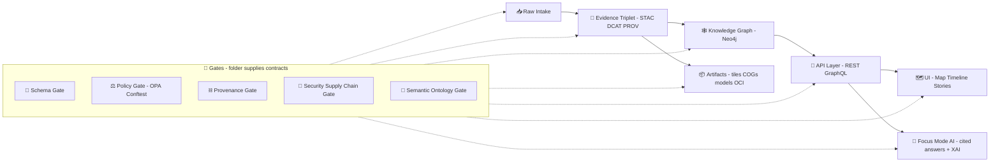

# 🧩 Domain Contracts (MCP Gates)


> 📍 **You are here:** `mcp/gates/contracts/domain/`  
> 🚦 **Purpose:** Define the *canonical* domain schemas/types that **all KFM gates validate** before anything becomes “real” (graph/UI/AI/export).  
> 🧠 **Mental model:** **Contracts define truth. Gates enforce truth.**  

---

## 🧭 Why this folder exists

Kansas Frontier Matrix (KFM) is designed around **evidence-first publishing** and **policy gates**. That means:

- **No “black box” objects**: every dataset, story, AI output, or simulation must be describable by a contract.
- **No silent bypass**: gate checks are expected at ingestion, publication, AI inference, and pipeline automation.
- **No “it worked locally”**: contracts must be **versioned** + **portable** across the pipeline (data → graph → API → UI → AI).  

This directory is the *domain-level* source-of-truth for those schemas.

---

## 🧠 Definitions (quick + practical)

### 🚦 Gate
A **Gate** is a deterministic, policy-backed checkpoint that answers:

- “Is this object valid?”
- “Is it publishable?”
- “Is it safe + compliant?”
- “Is it traceable?”

Gates are expected to be **fail-closed** (if in doubt, block).

### 📜 Domain Contract
A **Domain Contract** is a versioned schema/type/spec that defines:

- **What a thing *is*** (meaning + invariants)
- **What it *must contain*** (metadata + evidence + governance fields)
- **What it *cannot violate*** (constraints, classifications, provenance rules)

Contracts are **NOT** DB schemas and **NOT** UI props.

---

## ✅ What belongs here (and what doesn’t)

### ✅ Put this here
- Domain object schemas (JSON Schema / OpenAPI fragments / protobufs / etc.)
- Canonical IDs, enums, invariant rules
- Evidence + provenance requirements (STAC/DCAT/PROV refs, manifest patterns)
- Sensitivity + licensing + attribution fields
- Narrative object specs (Story Nodes, Pulse Threads, etc.)
- Simulation/model output specs (scenario metadata + model-card references)
- Gate result / gate event shapes (shared format across all gates)

### ❌ Don’t put this here
- PostGIS table definitions
- Neo4j labels/properties as the source of truth
- API pagination and transport-only fields
- React component props or UI state shapes
- “Whatever the pipeline currently outputs” (contracts should lead, not trail)

---

## 🗺️ How contracts power the whole platform



---

## 🗂️ Suggested folder layout (target)

> This repo may evolve, but the structure below keeps contracts **discoverable**, **versioned**, and **codegen-friendly**.

```text
mcp/
└─ 🚦 gates/
   └─ 📜 contracts/
      └─ 🧠 domain/
         ├─ 📄 README.md                         # 👈 you are here 📌 Domain “design pack” contracts + versioning rules
         ├─ 🧬 v1/                               # v1 schema set (stable; additive changes only)
         │  ├─ 🗄️📐🧾 dataset_manifest.schema.json     # Dataset manifest contract (source, license, outputs, checksums, labels)
         │  ├─ 📎📐🧾 evidence_manifest.schema.json     # Evidence manifest (claims→citations→artifacts + digests)
         │  ├─ 🎬📐🧾 story_node.schema.json            # Story Node contract (steps, actions, media refs, citations pointers)
         │  ├─ 🧵📐🧾 pulse_thread.schema.json          # Pulse thread contract (short narrative + evidence + deltas)
         │  ├─ 🧪📐🧾 simulation_run.schema.json        # Simulation run contract (params, seeds, metrics, outputs, receipts)
         │  ├─ 🚦📐🧾 gate_result.schema.json           # Gate result envelope (pass/fail, findings, severities, pointers)
         │  ├─ 📦📐🧾 artifact_ref.schema.json          # Artifact reference (URI/path, mediaType, digest, role, metadata)
         │  ├─ 🧑‍💼📐🧾 rbac_actor.schema.json          # RBAC actor identity/roles (human/service/agent) + accountability fields
         │  └─ 🔒📐🧾 classification.schema.json        # Classification labels + handling rules (public/internal/restricted…)
         ├─ 🧬 v2/                               # (future major) breaking changes / new required fields live here
         └─ ⚙️ _generated/                       # Optional generated types (commit only if you pin generator + versions)
            ├─ 🟦 typescript/                    # TypeScript types derived from schemas
            └─ 🐍 python/                        # Python models (e.g., Pydantic) derived from schemas
```

---

## 🧱 Contract “Header” (recommended for every domain object)

To keep objects consistent across data, graph, API, UI, and AI—use a shared “envelope” header.

| Field | Type | Why it exists |
|------|------|---------------|
| `kind` | string | Discriminator (e.g., `DatasetManifest`, `StoryNode`) |
| `schema_version` | string | Schema SemVer (e.g., `1.2.0`) |
| `id` | string | Stable ID (must be linkable everywhere) |
| `created_at` | ISO datetime | Auditability + provenance |
| `created_by` | `ActorRef` | Human/agent attribution (WPE-friendly) |
| `license` | string/object | “No data without a known license” rule |
| `classification` | enum/object | Public/restricted/embargoed + rationale |
| `evidence` | object | Evidence triplet + citations + query params |
| `links` | array | Forward/back links to other objects + artifacts |
| `hash` | string (optional) | Integrity for content-addressing + diff review |

---

## 🧬 Core domain contract families (what we expect to exist)

<details>
<summary><strong>🧾 Evidence & Provenance</strong></summary>

- **EvidenceTripletRef**  
  References the canonical evidence set used by KFM: **DCAT (dataset), STAC (items/assets), PROV (lineage)**.

- **EvidenceManifest**  
  “Claim → evidence mapping” used by:
  - Story Nodes
  - Pulse Threads
  - Focus Mode answers
  - Simulation narratives

</details>

<details>
<summary><strong>🗺️ Geospatial + Temporal</strong></summary>

- **GeoTemporalExtent**  
  - Geometry (bbox, polygon, point, etc.)
  - Temporal range (start/end, time slices, scenario horizons)
  - CRS notes (internal standardization expectations)

- **MapLayerSpec**  
  Describes how a domain artifact becomes a UI layer (tiles/COG/GeoJSON) without becoming a UI prop bag.

</details>

<details>
<summary><strong>🧾 Data + Catalog</strong></summary>

- **DatasetManifest**  
  Domain-level dataset object:
  - identity
  - evidence refs (STAC/DCAT/PROV)
  - license + classification
  - coverage + units
  - artifact pointers (COG/tiles)

</details>

<details>
<summary><strong>🕸️ Knowledge Graph</strong></summary>

- **GraphEntityRef**  
  A stable “link” shape used everywhere (UI links, citations, narrative anchors).

- **GraphIngestRecord** (optional but powerful)  
  Standardized representation of graph ingestion outputs (nodes/edges + provenance pointers).

</details>

<details>
<summary><strong>📖 Narrative Objects</strong></summary>

- **StoryNode**  
  Long-form interactive narrative with:
  - content
  - map/time anchors
  - evidence manifest

- **PulseThread**  
  Short, timely, geotagged narrative update with:
  - evidence manifest (dataset IDs, query params, timestamps)
  - linkable graph anchors (Place/Region/Dataset)

</details>

<details>
<summary><strong>🧪 Simulation & Models</strong></summary>

- **SimulationRun**  
  Scenario outputs + assumptions + model refs:
  - scenario ID
  - parameters
  - output artifacts
  - caveats + uncertainty notes

- **ModelCardRef / DatasheetRef**  
  Lightweight references to model cards and dataset datasheets (don’t embed the entire thing in domain objects).

</details>

<details>
<summary><strong>📦 Artifact Distribution</strong></summary>

- **ArtifactRef (OCI-friendly)**  
  Immutable digest + optional tags + signature/attestation pointers (cosign/SBOM/SLSA-style).

</details>

<details>
<summary><strong>🚦 Gates</strong></summary>

- **GateResult**  
  Standard output for every gate:
  - pass/fail
  - findings (rule id, severity, message)
  - object references
  - evidence snippets (hashes, links)

- **GateEvent**  
  Useful for automation + audit logs:
  - triggered_by (Watcher event)
  - planned_by (Planner)
  - executed_by (Executor)
  - signatures + attestation refs

</details>

---

## 🧠 Gate design: “contract + policy” (recommended)

A gate should be easy to read and hard to bypass:

1. **Schema validation** (contract-level)
2. **Policy validation** (OPA/Conftest-level)
3. **Provenance validation** (evidence triplet + manifest-level)
4. **Security validation** (signature + SBOM/attestation, when applicable)
5. **Semantic validation** (ontology constraints, graph consistency)

> 🧯 Rule of thumb: if you can’t explain a gate failure in one sentence, the contract or rule is too vague.

---

## 🔐 Governance hooks (must-have fields)

Because KFM explicitly treats governance as a first-class system feature, domain objects should be gateable on:

- **Sensitivity classification** (public / restricted / embargoed / culturally sensitive)
- **Ethics + CARE alignment** (authority of local knowledge, responsibility, etc.)
- **RBAC actor identity** (public viewer vs contributor vs admin)
- **Audit trail** (who/what created/modified it)
- **Citations + provenance** (especially for narrative + AI outputs)

---

## 🧪 CI expectations (minimum viable “closed gate”)

When contracts change, CI should be able to do all of this deterministically:

- Format + lint (JSON/YAML)
- Validate schemas (JSON Schema validator)
- Validate internal references (IDs exist, links resolve)
- Run policy packs (OPA/Conftest)
- Generate + check codegen types (optional but ideal)
- Prevent breaking changes without major version bump

---

## 🧰 Adding or changing a contract (checklist)

### ✅ Adding a new contract
- [ ] Create a new schema under the appropriate major version folder (`v1/`, `v2/`, …)
- [ ] Add examples (good + bad) and wire into tests
- [ ] Add/extend gate rules that must enforce it
- [ ] Add/extend policy-pack rules that must enforce it
- [ ] Update any codegen (TS/Python)
- [ ] Document the “why” (small ADR or a design note)

### ♻️ Changing an existing contract
- [ ] Is it additive? (✅ minor bump)
- [ ] Is it breaking? (🚨 new major)
- [ ] Did you update all gate rules and policy packs?
- [ ] Did you update example payloads?
- [ ] Did you ensure the UI/AI layers can still surface provenance?

---

## 📦 Example payloads (starter shapes)

> These are **illustrative**. The actual schemas should live as `.schema.json` files in this folder.

### 1) DatasetManifest (example)
```json
{
  "kind": "DatasetManifest",
  "schema_version": "1.0.0",
  "id": "kfm.dataset.usgs.nwis.river_gauge.v1",
  "created_at": "2026-01-22T00:00:00Z",
  "created_by": { "actor_kind": "Human", "actor_id": "user:alice" },
  "license": "US-PUBLIC-DOMAIN",
  "classification": { "level": "public", "rationale": "public government source" },
  "extent": {
    "crs": "EPSG:4326",
    "bbox": [-102.05, 36.99, -94.60, 40.00],
    "temporal": { "start": "2020-01-01", "end": "2026-01-22" }
  },
  "evidence": {
    "dcat_dataset_id": "dcat:usgs-nwis-waterdata",
    "stac_collection_id": "stac:river_gauge_readings",
    "prov_activity_id": "prov:ingest_2026_01_22_001"
  },
  "artifacts": [
    {
      "kind": "ArtifactRef",
      "registry": "oci://registry.example/kfm",
      "name": "tiles/river_gauges",
      "digest": "sha256:deadbeef..."
    }
  ],
  "links": [
    { "rel": "graph-node", "href": "neo4j://Dataset/kfm.dataset.usgs.nwis.river_gauge.v1" }
  ]
}
```

### 2) PulseThread (example)
```json
{
  "kind": "PulseThread",
  "schema_version": "1.0.0",
  "id": "kfm.pulse.drought.low_flow_cluster.2026-01-22",
  "created_at": "2026-01-22T00:00:00Z",
  "created_by": { "actor_kind": "Agent", "actor_id": "agent:watcher-hydro" },
  "title": "Low-flow cluster detected in multiple Kansas gauges",
  "anchors": [
    { "kind": "GraphEntityRef", "id": "place:ks.kansas_river", "label": "Kansas River" }
  ],
  "content": {
    "format": "markdown",
    "body": "Several gauges show 7-day flows in the lowest decile..."
  },
  "evidence_manifest": [
    {
      "claim_id": "c1",
      "supports": [
        {
          "dataset_id": "kfm.dataset.usgs.nwis.river_gauge.v1",
          "query": { "metric": "flow_percentile", "window_days": 7 },
          "timestamp": "2026-01-22T00:00:00Z"
        }
      ]
    }
  ],
  "classification": { "level": "public", "rationale": "non-sensitive aggregate signal" }
}
```

### 3) GateResult (example)
```json
{
  "kind": "GateResult",
  "schema_version": "1.0.0",
  "gate_id": "gate.provenance.required",
  "target_id": "kfm.pulse.drought.low_flow_cluster.2026-01-22",
  "passed": false,
  "findings": [
    {
      "severity": "error",
      "rule_id": "policy.provenance_first",
      "message": "PulseThread must include evidence_manifest entries with dataset_id + timestamp."
    }
  ]
}
```

---

## 📚 Related project docs (source-of-truth context)

### Core KFM design docs
- **Kansas Frontier Matrix (KFM) – Comprehensive Architecture, Features, and Design**
- **Kansas Frontier Matrix (KFM) – Comprehensive Technical Documentation**
- **Kansas Frontier Matrix (KFM) – AI System Overview 🧭🤖**
- **Kansas Frontier Matrix – Comprehensive UI System Overview**
- **📚 KFM Data Intake – Technical & Design Guide**
- **🌟 Latest Ideas & Future Proposals**
- **Innovative Concepts to Evolve KFM**
- **Additional Project Ideas**
- **Kansas-Frontier-Matrix — Open-Source Geospatial Historical Mapping Hub Design** (repository-structure + mapping stack)

### Background reference libraries (for deeper implementation choices)
- **AI Concepts & more** (portfolio)
- **Maps / GoogleMaps / Virtual Worlds / Archaeological Computer Graphics / Geospatial WebGL** (portfolio)
- **Data Management — theories, architectures, Bayesian methods** (portfolio)
- **Various programming languages & resources** (portfolio)

---

## 🧾 Glossary (tiny, local)
- **MCP**: Master Coder Protocol — reproducible documentation + controls layer 🧰  
- **Evidence triplet**: STAC + DCAT + PROV as the minimum proof bundle 📎  
- **Fail-closed**: if validation can’t prove it’s safe/valid, it’s blocked 🚫  
- **WPE**: Watcher → Planner → Executor automation model 🤖➡️📝➡️✅  

---

### ✅ If you only remember one thing…
**If a domain object can’t be described by a contract, it can’t be trusted enough to publish.** 🚦
