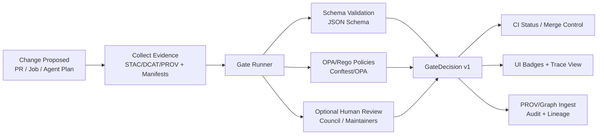

# 🛡️ MCP Gates — Domain Contracts (v1)


> [!NOTE]
> This directory defines **domain contracts** (meaning + shape of data) for **KFM policy gates** — not a specific implementation.
> These contracts exist so *any* Gate Runner (CI, local dev, agent executor, cloud job) emits **the same auditable structure**.

---

## 🧭 Why this exists

KFM relies on **automated policy gates** at key checkpoints (data ingestion, AI inference, content publication) to enforce quality, provenance, licensing, sensitivity handling, and AI citation rules. The minimum gate set includes schema validation, STAC/DCAT/PROV completeness, license presence, sensitivity classification, and provenance completeness — plus a hard rule that **Focus Mode outputs must include citations or refuse**. These are implemented in code and enforced via CI (e.g., Conftest policy tests).:contentReference[oaicite:0]{index=0}

This contract set provides:
- ✅ **Consistency**: every gate produces the same shape of decision output
- ✅ **Auditability**: each decision carries evidence refs, digests, and policy refs
- ✅ **Determinism**: results are reproducible from the same inputs + config
- ✅ **UI traceability**: the UI can surface gate status + provenance + citations consistently:contentReference[oaicite:1]{index=1}
- ✅ **Protocol alignment**: MCP (Master Coder Protocol) is documentation-first and reproducibility-focused:contentReference[oaicite:2]{index=2}

---

## 🗂️ Where this sits (repo mental model)

KFM’s repo structure explicitly includes an `mcp/` directory for **Master Coder Protocol documentation and resources**, including experiments, SOPs, glossary, and model cards.:contentReference[oaicite:3]{index=3}

```text
📦 mcp/
  🧭 gates/
    📜 contracts/
      🌐 domain/
        🧱 v1/   👈 you are here
```

> [!TIP]
> Treat gate contracts as **“protocol specs”**: versioned, testable, and reviewable like code — consistent with MCP’s reproducibility ethos.:contentReference[oaicite:4]{index=4}

---

## 📌 Contract principles (non-negotiable)

### 1) Evidence-first + provenance-first 🧾
Raw data is immutable evidence; transformations happen downstream and must be traceable. Every pipeline run produces a “catalog triplet” (STAC + DCAT + PROV) and **unsourced outputs are disallowed** (including AI narratives).:contentReference[oaicite:5]{index=5}

### 2) Deterministic + idempotent 🔁
Pipelines must be config-driven; same inputs + config ⇒ same outputs. Manual tweaks are disallowed; changes must be traceable via code/config.:contentReference[oaicite:6]{index=6}

### 3) Fail-closed posture 🚫
If checks can’t be performed or required metadata is missing, the default is to block/reject (e.g., missing provenance triggers CI failure).:contentReference[oaicite:7]{index=7}

### 4) Policy-as-code ⚖️
Governance checks run via **OPA/Rego + Conftest** against structured manifests and metadata; violations fail CI (gate stays closed).:contentReference[oaicite:8]{index=8}

### 5) Human-in-the-loop PR flow 👥
Automation can open PRs, but does not auto-merge — everything still goes through human review and CI gates.:contentReference[oaicite:9]{index=9}

### 6) “Nothing merges without oversight” ✅
QA is both automated and human-centered; CI can stop missing license metadata; formal review prevents unreviewed merges.:contentReference[oaicite:10]{index=10}

---

## 🧠 Terminology (v1)

| Term | Meaning |
|---|---|
| **Gate** | A checkpoint rule-set that evaluates a change (data, metadata, AI output, story node, artifact) and returns a decision. |
| **Gate Runner** | The executor that runs validations/policies and emits a `GateDecision`. |
| **Policy Pack** | The OPA/Rego rule library evaluated by Conftest/OPA in CI and automation. |
| **Evidence Manifest** | A structured ledger of “what evidence exists” and how it was produced/linked (see project’s evidence-first direction). |
| **Run Manifest** | Deterministic record of a pipeline run (inputs, outputs, tool versions, counts, digest), used for policy checks and provenance graphing.:contentReference[oaicite:12]{index=12} |
| **Review Gate** | A decision type that requires explicit human/council approval (especially for sensitive / sovereignty-related data).:contentReference[oaicite:13]{index=13} |

---

## 🔄 Lifecycle (how v1 contracts flow)



---

## 📦 v1 Core Contracts (conceptual)

> [!IMPORTANT]
> v1 is designed to be **language-agnostic**. Use JSON Schema for validation and optionally generate types for TS/Python/Go/etc.

### ✅ 1) `GateRef`
Minimum identifying info for “which gate ran”.

- `id` (string) — stable ID (`kfm.gate.<area>.<name>`)
- `version` (string) — gate implementation/policy version (not the contract version)
- `title` (string, optional)
- `policy_refs[]` (optional) — pointers to policy packages/rules

### ✅ 2) `SubjectRef`
“What is being evaluated?”

- `kind` (enum): `dataset | stac_item | dcat_record | prov_bundle | story_node | pulse_thread | concept_node | artifact | api_contract | simulation_run | ui_asset | other`
- `id` (string) — stable identifier (dataset id, story id, etc.)
- `paths[]` (string[], optional) — repo paths involved
- `labels{}` (object, optional) — tags like `domain`, `sensitivity`, `license`

### ✅ 3) `GateContext`
“Where/when/by whom did this run?”

- `run_id` (string) — unique run identifier (see Run Manifest):contentReference[oaicite:14]{index=14}
- `trigger` (enum): `ci | local | scheduled | agent | manual`
- `repo` (object): `{ commit_sha, pr_number?, branch? }`
- `actor` (object): `{ kind: human|bot|agent, id, display_name? }`
- `timestamps` (object): `{ started_at, finished_at }`
- `environment` (object, optional): runner host, container digest, etc.

### ✅ 4) `EvidenceRef`
“Show me what you used to decide.”

- `kind` (enum): `stac | dcat | prov | run_manifest | evidence_manifest | artifact | doc | dataset_bytes | telemetry | other`
- `uri` (string) — path/URL/OCI ref
- `digest` (string, optional) — e.g., `sha256:...`
- `role` (string, optional) — `primary_input`, `derived`, `supporting`
- `notes` (string, optional)

### ✅ 5) `PolicyRef`
“Which policy/rule fired?”

- `engine` (enum): `opa | jsonschema | custom | other`
- `package` (string, optional) — OPA package name
- `rule_id` (string, optional) — rule identifier
- `policy_version` (string, optional) — commit/tag of policy pack

OPA/Conftest policy gates are a first-class component of KFM’s governance automation.:contentReference[oaicite:15]{index=15}

### ✅ 6) `Violation`
A structured issue report.

- `code` (string) — stable machine code (e.g., `LICENSE_MISSING`)
- `message` (string) — human-readable summary
- `severity` (enum): `info | warn | error | critical`
- `policy` (`PolicyRef`, optional)
- `pointer` (string, optional) — JSON pointer to offending field
- `remediation` (object, optional): `{ summary, suggested_actions[], docs_ref? }`

### ✅ 7) `GateDecision`
The output contract.

- `contract_version` (string) — `kfm.mcp.gates.domain/v1`
- `gate` (`GateRef`)
- `subject` (`SubjectRef`)
- `context` (`GateContext`)
- `status` (enum): `PASS | WARN | FAIL | BLOCK | REVIEW_REQUIRED`
- `violations[]` (`Violation[]`)
- `evidence[]` (`EvidenceRef[]`)
- `artifacts[]` (optional) — outputs (tiles, model files, reports)
- `metrics{}` (optional) — counts, runtimes, etc.
- `decision_digest` (string, optional) — stable digest of the decision payload

---

## 🧾 Deterministic hashing (v1 guidance)

KFM proposes canonical JSON hashing (RFC 8785) for run manifests so the manifest contains its own digest and can act as an immutable run identifier / idempotency key.:contentReference[oaicite:16]{index=16}

**v1 recommendation**:
- canonicalize JSON for `GateDecision` (sorted keys, stable arrays where possible)
- compute `sha256` digest
- write into `decision_digest`
- treat `decision_digest` as immutable identifier for auditing and graph linking

---

## 🧪 Examples (v1)

### Gate Evaluation Request (conceptual)
```json
{
  "contract_version": "kfm.mcp.gates.domain/v1",
  "gate": { "id": "kfm.gate.ingestion.metadata", "version": "1.0.0" },
  "subject": {
    "kind": "dataset",
    "id": "dataset.example.hydrology.nhdplus",
    "paths": ["data/catalog/hydrology/nhdplus/item.json"]
  },
  "context": {
    "run_id": "run_2026_01_23T120000Z_abc123",
    "trigger": "ci",
    "repo": { "commit_sha": "deadbeef", "pr_number": 432 },
    "actor": { "kind": "bot", "id": "kfm-ci" },
    "timestamps": { "started_at": "2026-01-23T12:00:00Z", "finished_at": "2026-01-23T12:00:31Z" }
  },
  "evidence": [
    { "kind": "stac", "uri": "data/catalog/hydrology/nhdplus/item.json", "digest": "sha256:..." },
    { "kind": "dcat", "uri": "data/catalog/hydrology/nhdplus/dcat.json", "digest": "sha256:..." },
    { "kind": "prov", "uri": "data/provenance/hydrology/nhdplus/prov.jsonld", "digest": "sha256:..." }
  ]
}
```

### Gate Decision (FAIL)
```json
{
  "contract_version": "kfm.mcp.gates.domain/v1",
  "status": "FAIL",
  "gate": { "id": "kfm.gate.ingestion.license", "version": "1.0.0" },
  "subject": { "kind": "dataset", "id": "dataset.example.hydrology.nhdplus" },
  "violations": [
    {
      "code": "LICENSE_MISSING",
      "message": "Dataset must declare a license before publication.",
      "severity": "critical",
      "policy": {
        "engine": "opa",
        "package": "kfm.policy.data.license",
        "rule_id": "license_required",
        "policy_version": "policy-pack@deadbeef"
      },
      "pointer": "/dcat/license",
      "remediation": {
        "summary": "Add an SPDX-compatible license to DCAT + ensure STAC mirrors it.",
        "suggested_actions": ["Update DCAT record", "Re-run ingestion pipeline", "Re-open PR checks"]
      }
    }
  ],
  "evidence": [
    { "kind": "dcat", "uri": "data/catalog/hydrology/nhdplus/dcat.json" },
    { "kind": "prov", "uri": "data/provenance/hydrology/nhdplus/prov.jsonld" }
  ],
  "decision_digest": "sha256:..."
}
```

> [!NOTE]
> CI is explicitly expected to stop unlicensed datasets from going live (and more generally, fail closed on policy violations).:contentReference[oaicite:17]{index=17}:contentReference[oaicite:18]{index=18}

---

## 🧱 Recommended Gate Catalog (starter set)

These IDs map directly to documented governance requirements and pipeline checkpoints.

| Gate ID | Stage | What it enforces |
|---|---:|---|
| `kfm.gate.ingestion.schema` | ingest | JSON schema validity for config + metadata, sanity checks:contentReference[oaicite:19]{index=19} |
| `kfm.gate.ingestion.catalog_triplet` | ingest | STAC + DCAT + PROV must be present (catalog triplet):contentReference[oaicite:20]{index=20} |
| `kfm.gate.ingestion.license` | ingest | License presence / allow-list enforcement (fail closed):contentReference[oaicite:21]{index=21} |
| `kfm.gate.ingestion.sensitivity` | ingest | Sensitivity classification + handling requirements:contentReference[oaicite:22]{index=22} |
| `kfm.gate.ingestion.provenance` | ingest | Provenance completeness, reject missing provenance:contentReference[oaicite:23]{index=23} |
| `kfm.gate.publish.transactional_promote` | publish | Only promote to processed/catalog after validation; transaction-like completion (no half-baked catalog):contentReference[oaicite:24]{index=24} |
| `kfm.gate.ai.citations_required` | inference | Focus Mode must cite sources or refuse response:contentReference[oaicite:25]{index=25} |
| `kfm.gate.security.secrets_scan` | all | Reject obvious secrets in configs/metadata (policy-as-code):contentReference[oaicite:26]{index=26} |
| `kfm.gate.artifact.signed` | publish | OCI artifact must have valid Cosign signature + digest chain:contentReference[oaicite:27]{index=27} |
| `kfm.gate.review.council_required` | ingest/publish | Trigger council workflow for high-stakes/sovereignty data releases:contentReference[oaicite:28]{index=28} |
| `kfm.gate.privacy.query_audit` | access | Query auditing / inference controls when sensitive datasets are queried:contentReference[oaicite:29]{index=29} |
| `kfm.gate.simulation.governance` | sims | Simulation outputs inherit sensitivity; Focus Mode must not leak sensitive info indirectly:contentReference[oaicite:30]{index=30} |

> [!TIP]
> “Design Packs” may define domain-specific spec files (e.g., `MetricSpec`, `PreprocessSpec`) — consider gates that validate those specs and link them into provenance.:contentReference[oaicite:31]{index=31}

---

## 🧵 Domain extensions supported by this contract (examples)

These are KFM-specific domain objects that still fit `SubjectRef.kind` without changing the contract:

### 🗺️ Story Nodes
Story nodes are stored as a folder containing Markdown plus a JSON config file (machine-ingestible storytelling).

### 📍 Pulse Threads + 🧠 Conceptual Attention Nodes
Pulse Threads are described as geotagged “pulse” events and Conceptual Attention Nodes as ontological/semantic nodes in the knowledge graph; both emphasize evidence manifest linkage for trust.

---

## 🧬 PROV / Knowledge Graph alignment

KFM is mapping GitHub PR events into W3C PROV-O (PR as PROV Activity; commits as Entities; authors/reviewers as Agents), enabling lineage queries like “which code version produced this dataset and who reviewed it.”:contentReference[oaicite:34]{index=34}

**v1 recommendation**:
- A `GateDecision` SHOULD be ingestible as a PROV Activity:
  - `GateDecision` → `prov:Activity`
  - `subject` + `evidence` → `prov:used`
  - resulting artifacts → `prov:generated`
  - `actor` → `prov:wasAssociatedWith`

---

## 🧪 CI integration expectations

KFM’s governance model expects a policy engine (OPA/Rego + Conftest) to enforce allow/deny decisions during CI and automation workflows.:contentReference[oaicite:35]{index=35}

Also, OPA can be used to intercept runtime actions (deny publishing, deny ingestion) based on policies like license required, citation required, or “no deprecated endpoints.”:contentReference[oaicite:36]{index=36}

---

## 🔐 Supply chain hooks (OCI + Cosign)

Artifacts can be distributed via OCI registries and verified by immutable digests; Cosign signatures provide provenance and integrity (checked before use).:contentReference[oaicite:37]{index=37}

**v1 contract implication**:
- include `EvidenceRef.kind=artifact` with `uri` pointing to OCI reference + `digest`
- gate `kfm.gate.artifact.signed` returns `BLOCK` if signature missing/invalid

---

## 🧪 Versioning rules for `domain/v1`

- ✅ **Allowed without version bump**: adding optional fields, adding new `SubjectRef.kind` values (if treated as open enum), adding new `Violation.code` values
- ❌ **Breaking (requires v2)**:
  - renaming fields
  - changing meaning of existing fields
  - changing required/optional status of existing fields
  - changing decision status semantics

> [!NOTE]
> v13 documentation emphasizes “minimum CI gates” and version history discipline; treat this contract similarly (PR + review + changelog).:contentReference[oaicite:38]{index=38}

---

## 🧑‍🔬 Contributing (MCP-style)

When updating contracts:
1. Update this README (spec + rationale)
2. Update JSON Schemas (and generated types, if any)
3. Add/Update fixtures (PASS/WARN/FAIL examples)
4. Add/Update CI checks:
   - JSON schema validation
   - Conftest policy evaluation
   - determinism checks (stable hashing)

This mirrors MCP’s emphasis on protocol documentation, reproducibility, and continuous validation.:contentReference[oaicite:39]{index=39}:contentReference[oaicite:40]{index=40}

---

## 📚 Project References (used to shape v1)

### 🧱 KFM Core Architecture + Governance
- Kansas Frontier Matrix (KFM) – Comprehensive Architecture, Features, and Design.pdf :contentReference[oaicite:41]{index=41}
- Kansas Frontier Matrix (KFM) – Comprehensive Technical Documentation.pdf :contentReference[oaicite:42]{index=42}
- 🌟 Kansas Frontier Matrix – Latest Ideas & Future Proposals.docx.pdf :contentReference[oaicite:43]{index=43}

### 📥 Intake, Provenance, FAIR+CARE, and Policy Gates
- 📚 Kansas Frontier Matrix (KFM) Data Intake – Technical & Design Guide.pdf :contentReference[oaicite:44]{index=44} :contentReference[oaicite:45]{index=45}
- Additional Project Ideas.pdf :contentReference[oaicite:46]{index=46}
- Document Refinement Request - Pulse Threads and Conceptual Attention Node Documentation.pdf :contentReference[oaicite:47]{index=47} :contentReference[oaicite:48]{index=48}

### 🤖 AI + 🖥️ UI Overviews
- Kansas Frontier Matrix (KFM) – AI System Overview 🧭🤖.pdf :contentReference[oaicite:49]{index=49}
- Kansas Frontier Matrix – Comprehensive UI System Overview.pdf :contentReference[oaicite:50]{index=50} :contentReference[oaicite:51]{index=51}

### 🧪 MCP / Documentation Templates
- Kansas-Frontier-Matrix_ Open-Source Geospatial Historical Mapping Hub Design.pdf :contentReference[oaicite:52]{index=52}
- Scientific Method _ Research _ Master Coder Protocol Documentation.pdf :contentReference[oaicite:53]{index=53}
- MARKDOWN_GUIDE_v13.md.gdoc :contentReference[oaicite:54]{index=54}

### 💡 Concept Expansion / Future
- Innovative Concepts to Evolve the Kansas Frontier Matrix (KFM).pdf :contentReference[oaicite:55]{index=55} :contentReference[oaicite:56]{index=56}
- Kansas-Frontier-Matrix Design Audit – Gaps and Enhancement Opportunities.pdf :contentReference[oaicite:57]{index=57}

### 📚 Research Packs (PDF Portfolios / Supporting Libraries)
- AI Concepts & more.pdf :contentReference[oaicite:58]{index=58}
- Maps-GoogleMaps-VirtualWorlds-Archaeological-Computer Graphics-Geospatial-webgl.pdf :contentReference[oaicite:59]{index=59}
- Various programming langurages & resources 1.pdf :contentReference[oaicite:60]{index=60}
- Data Managment-Theories-Architures-Data Science-Baysian Methods-Some Programming Ideas.pdf :contentReference[oaicite:61]{index=61}
- Data Mining Concepts & applications .pdf :contentReference[oaicite:62]{index=62}

---

## ✅ “Definition of Done” for v1

- [ ] JSON Schema exists for `GateDecision`, `Violation`, `EvidenceRef`, `SubjectRef`, `PolicyRef`
- [ ] Fixtures: PASS/WARN/FAIL/BLOCK/REVIEW_REQUIRED
- [ ] CI validates schemas + runs Conftest against fixtures
- [ ] Gate decisions can be surfaced in UI + linked to provenance/citations
- [ ] Deterministic digest computed for decisions (optional but strongly recommended)

🧱 If it’s not **repeatable**, it’s not **MCP-compliant**.

