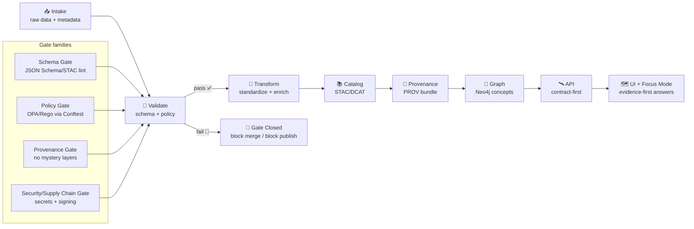

<!--
⚠️ AUTO-GENERATED DOC (v2 line)
Location: mcp/gates/contracts/domain/v2/_generated/README.md
Edit source specs (NOT this folder), then regenerate.
-->

# 🧩 KFM Domain Contracts v2 — _Generated_


> **🚫 Do not hand-edit anything in `_generated/`.**
>
> ✅ **Edit contract sources** in `../_source/` (or the closest non-generated directory), then re-run the generator.

📍 **You are here:** `mcp/gates/contracts/domain/v2/_generated/`

---

## 🎯 What this is

These are the **domain-level contracts** that keep Kansas Frontier Matrix (KFM) consistent across:

- 📥 **Intake & pipelines** (raw → work → processed → catalog → graph)
- 🧠 **AI / Focus Mode** (evidence-first answers + citations)
- 🛰️ **API** (contract-first REST/GraphQL boundaries)
- 🗺️ **UI** (maps, timeline, story nodes, layer provenance panel)
- 🚦 **Gates** (schema + policy + provenance + security)

Think of this folder as the **compiled “shape of truth”**: schemas, types, docs, and hashes produced from the human-authored specs.

---

## 🧭 Navigation

- [What’s in this folder](#-whats-in-this-folder)
- [Contract families](#-contract-families)
- [Design rules](#-design-rules)
- [Gates](#-gates)
- [Regenerating](#-regenerating)
- [Examples](#-examples)
- [Troubleshooting](#-troubleshooting)
- [References](#-references)

---

## 📦 What’s in this folder

This `_generated/` directory is built to be consumed by multiple runtimes and CI checks.

Typical artifacts include:

- 🧾 **Bundled JSON Schemas** (`*.schema.json`) — runtime + CI validation
- 🧰 **Generated types** (TypeScript/Python/etc.) — compile-time correctness
- 🧪 **Validators & fixtures** — predictable tests for gates
- 🧷 **Deterministic hashes / lockfiles** — drift detection + reproducibility

<details>
<summary><strong>🗂️ Example layout (generator-dependent)</strong></summary>

```text
mcp/gates/contracts/domain/v2/
├─ _source/                      # ✅ edit here (human-authored)
│  ├─ schemas/                    # canonical schemas + $defs
│  ├─ vocab/                      # controlled vocabularies (reviewed)
│  └─ README.md                   # design notes + changelog
└─ _generated/                   # ❌ do not edit (machine output)
   ├─ jsonschema/                 # compiled schemas (normalized/bundled)
   ├─ typescript/                 # TS types + runtime validators
   ├─ python/                     # Pydantic models / dataclasses
   ├─ docs/                       # field docs / rendered schema notes
   └─ README.md                   # (this file)
```

</details>

---

## 🧱 Contract families

KFM’s “domain” is broader than a single table or schema — it includes **metadata, provenance, policy inputs, story structures, and graph payloads**.

> Tip 💡: Search for the contract **`kind`** (or schema `$id`) rather than guessing file names.

### 1) 🗺️ Catalog & dataset metadata

Contracts that describe *what a thing is*, where it lives, and how it may be reused.

**Common invariants**
- Stable **`id`** (no “floating” identity)
- Explicit **`schema_version`** (no ambiguous parsing)
- Mandatory **`license`** (fail-closed if missing)
- Explicit **spatial** + **temporal** extents

**Representative shapes**
- `DatasetContract` — DCAT-ish dataset record (license, publisher, FAIR+CARE fields)
- `StacCollection` / `StacItem` / `StacAsset` — STAC structures for geospatial assets
- `DistributionOCI` — optional OCI distribution block (see “OCI artifacts” below)

> Federation-ready 🌾: the same catalog contracts are designed so other regions can adopt the same API and UI patterns without forking the world.

---

### 2) 🧬 Provenance, runs, and evidence

Contracts that make KFM **auditable** and **reproducible**.

**Representative shapes**
- `ProvBundle` — PROV-O JSON-LD (Entity/Activity/Agent) describing lineage
- `RunManifest` — “what ran, on what, with what versions, producing what outputs”
- `EvidenceManifest` — evidence wrapper for story claims + Focus Mode citations
- `DevOpsProvEvent` — PR/commit provenance (PR → PROV → graph)

**Notable patterns**
- 🔒 **Deterministic hashing**: canonical JSON (RFC 8785 style) → stable `canonical_digest`
- 🔁 **Idempotency**: `idempotency_key` derived from digests to safely retry ingest jobs
- 🧭 **No mystery layers**: a layer/story without provenance is not publishable

---

### 3) 🛡️ Governance, sensitivity, and policy-pack inputs

Contracts that power automated **policy gates** and human governance workflows.

**Representative shapes**
- `GovernanceCard` — required fields, allowed licenses, reviewer requirements
- `SensitivityLabel` — public/internal/restricted + cultural protocol tags
- `Waiver` — time-bound, reviewed exceptions (**no silent bypass**)

**Sensitivity-aware design**
- Some datasets must be **generalized** or **masked** (e.g., 10km rounding / fuzzed geometries)
- Access can be role-based (“public sanitized” vs “researcher approved”)

---

### 4) 🧠 Knowledge graph semantics

Contracts for the **graph layer** (Neo4j) and semantic navigation.

**Representative shapes**
- `GraphNode` / `GraphEdge` — stable IDs + typed relations
- `ConceptualAttentionNode` — curated “concept lens” for Focus Mode & exploration
- `PulseThread` — time-evolving narrative thread across entities/datasets/claims
- `StoryNode` — narrative unit tied to evidence + map state

---

### 5) 🌍 Geo, time, and rendering helpers

Contracts that keep GIS and UI predictable.

**Representative shapes**
- `Geometry` — GeoJSON geometry (or compatible wrapper)
- `TemporalExtent` — time range + resolution
- `MapLayerRef` — stable layer reference (style + source + provenance metadata)

> UI trust 🧾: the UI’s “Layer Info / Provenance Panel” depends on these shapes so every visible layer can show **source, license, and lineage**.

---

### 6) ⏱️ Real‑time + simulations (v2‑ready)

KFM treats streaming observations and simulation outputs as **datasets with provenance**, not special cases.

**Representative shapes**
- `Observation` — timestamped sensor/station reading (value + geometry)
- `StreamCheckpoint` — append-only windowing checkpoints
- `SimulationRun` — simulation manifest + output hashes + provenance links

---

### 7) 📦 OCI artifacts (distribution + signatures)

Some outputs can be packaged and shipped like code:

- content-addressed artifacts
- signed (e.g., Cosign)
- replicable across environments

This usually appears as a `DistributionOCI` block in catalog records.

---

## 🧠 Design rules

These rules make the contracts “gateable” and safe at scale:

- ✅ **Fail-closed defaults**  
  If something cannot validate, it should not merge, publish, or render.
- 🏷️ **Stable identity**  
  `id` must not change when files move.
- 🧾 **License required**  
  Missing or unknown license is a hard stop unless a reviewed waiver exists.
- 🧬 **Provenance required**  
  No story node, layer, model output, or dataset without lineage metadata.
- 🧩 **Contract-first boundaries**  
  Intake ↔ processing ↔ graph ↔ API ↔ UI communicate via typed contracts.
- 🧱 **Extensible, not chaotic**  
  New fields: add via v2 spec changes + generator (never ad hoc blobs).

---

## 🚦 Gates

KFM “gates” are automated inspectors used during ingestion, CI, AI inference, and publication.



### ✅ What gets enforced (representative)

- 🧾 **Schema validation**: contract conformance for metadata, configs, manifests
- 📚 **STAC/DCAT/PROV completeness**: required fields + link integrity
- ⚖️ **License presence**: no data without a known license
- 🏷️ **Sensitivity classification**: label + correct handling (mask/generalize/restrict)
- 🧬 **Provenance completeness**: inputs + processing steps declared
- 🧠 **Focus Mode citations**: AI refuses answers that can’t cite sources
- 🔐 **Security**: secret scanning, policy constraints, artifact signing verification

> The mindset: **“treat data with the same rigor as code”** ✅

---

## 🛠️ Regenerating

Generated outputs should be deterministic. If regeneration changes outputs, it should be explainable by a source change.

### ✅ Typical workflow

1. Edit schemas/vocab in `../_source/`
2. Run the generator
3. Run gates locally (schema + policy) until green
4. Commit source + generated diffs together

<details>
<summary><strong>🧪 Example commands (adjust to your repo tooling)</strong></summary>

```bash
# 1) Generate contracts (JSON Schema → language types, docs, etc.)
make contracts

# 2) Validate schemas
make contracts-validate

# 3) Run policy pack (OPA/Rego via Conftest)
conftest test -p tools/validation/policy path/to/contracts-or-data

# 4) Optional: full CI locally
make ci
```

</details>

### 🔁 Versioning rules

- `v2/` is a **major line**: breaking changes require a new major (keep older versions around)
- Within v2, bump `schema_version` semver-style
- New vocab terms require review (supports fail-closed governance)

---

## 🧪 Examples

### Example: dataset contract (DCAT-ish + FAIR/CARE)

```json
{
  "id": "usgs_historic_topo_1894",
  "title": "USGS Historical Topographic Map (Ellsworth County, 1894)",
  "description": "Digitized 1894 USGS topographic survey of Ellsworth County, Kansas.",
  "license": "Public Domain",
  "schema_version": "v2.3.0",
  "spatial": { "bbox": [-99.5, 38.3, -98.8, 38.9], "crs": "EPSG:4326" },
  "temporal": { "start": "1894-01-01", "end": "1894-12-31" },
  "provenance": {
    "source_url": "https://www.usgs.gov/historical-topo",
    "creator": "U.S. Geological Survey",
    "issued": "1894-03-15"
  },
  "sensitivity": { "level": "public" },
  "faircare": {
    "collective_benefit": "Preserves environmental and cartographic heritage of Kansas.",
    "authority_to_control": "Open",
    "responsibility": "Data Engineering & FAIR+CARE Council",
    "ethics": "Culturally neutral archival content"
  }
}
```

### Example: run manifest (pipeline ledger + deterministic digest)

```json
{
  "run_id": "2026-01-23T12:00:00Z__ingest_usgs_topo",
  "pipeline_version": "v1.2.0",
  "inputs": [
    { "dataset_id": "usgs_historic_topo_1894", "source_url": "https://www.usgs.gov/historical-topo" }
  ],
  "outputs": [
    { "artifact": "data/processed/usgs/topo_1894.cog.tif", "sha256": "..." }
  ],
  "tool_versions": { "gdal": "3.7.0", "python": "3.12.1" },
  "summary_counts": { "records_in": 1, "records_out": 1, "errors": 0 },
  "canonical_digest": "sha256:..."
}
```

### Example: PR → PROV (DevOps provenance snippet)

```json
{
  "@context": "https://www.w3.org/ns/prov.jsonld",
  "id": "kfm:prov:pr:1234",
  "type": "prov:Activity",
  "prov:used": ["kfm:git:commit:abcd1234"],
  "prov:wasAssociatedWith": ["kfm:agent:github:user:bartytime4life"],
  "prov:wasGeneratedBy": ["kfm:git:merge_commit:efgh5678"]
}
```

### Example: OCI artifact distribution (signed, reproducible pulls)

```yaml
distribution:
  oci:
    registry: ghcr.io
    repository: kfm/artifacts
    digest: sha256:0123...
    media_type: application/vnd.oci.image.manifest.v1+json
    signatures:
      - type: cosign
        issuer: sigstore
        subject: kfm-ci
```

---

## 🧯 Troubleshooting

### Common “gate closed” reasons 🚫

- **Missing `license`** → add SPDX license or use an approved waiver
- **Missing provenance** → attach at least a stub PROV bundle
- **Sensitive data without label/handling** → add `sensitivity` + generalize/mask rules
- **Broken links** → fix URLs or pin to archived sources
- **Secrets detected** → remove credentials and rotate keys

### Debug tips 🔍

- Validate a single JSON with the generated schema:
  - `jsonschema -i file.json schema.json` *(or your validator of choice)*
- Run policies in isolation with verbose output:
  - `conftest test -p tools/validation/policy -o table --all-namespaces path/`

---

## 📚 References

These contracts are distilled from KFM’s architecture + governance docs and its supporting reference library:

- 🧱 Architecture & gates: schema + policy + provenance enforcement, modularity, and federation mindset
- 🗺️ UI design: map + timeline + story nodes + provenance-first UX
- 🧠 AI system: Focus Mode evidence + citations, graph integration, W-P-E automation concepts
- 📥 Data intake: deterministic ingest patterns, idempotent upserts, audit trail manifests
- 🛡️ Ethics: FAIR + CARE, sensitivity-aware handling, cultural protocols & differential access
- 🌍 Geospatial references: GIS pipelines (PostGIS ↔ GeoJSON), WebGL/3D mapping considerations
- 🧰 Engineering references: CI/CD, clean architecture, supply chain security, cross-language tooling

---

<!-- End of file -->

