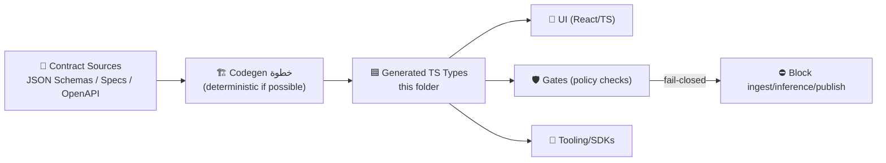

# 🧾 Domain Contracts v2 — _Generated_ TypeScript Types


> [!WARNING]
> **This directory is generated.**  
> ✅ Edit the **source contract definitions** (schemas/specs) instead → then re-run codegen.  
> ❌ Do **not** hand-edit files under `_generated/` (your changes will be overwritten).

---

## 📍 You are here

```text
mcp/gates/contracts/domain/v2/_generated/typescript/
```

This folder contains **TypeScript types generated from KFM Domain Contract v2**, used to keep:
- 🧠 **Gates** (policy checks / validation)  
- 🌐 **API layer** (DTO boundaries)  
- 🧭 **UI** (React/TypeScript client)  
…speaking the **same language**.

---

## 🧠 Why this exists (KFM philosophy in one page)

KFM is designed around:
- 🧱 **Clean Architecture boundaries** (Domain ↔ Services ↔ Adapters)
- 📜 **Contract-first interfaces** (schemas define what “valid” means)
- 🛡️ **Gatekeeping** (fail-closed validation at ingest/inference/publish)
- 🧾 **Provenance & traceability** (e.g., STAC/DCAT/PROV artifacts, citations, metadata)
- ♻️ **Reproducibility** (documentation-first + deterministic builds where possible)

In practice:
- The **Domain layer** defines *what the system is* (entities + rules).
- **Contracts** define *what crosses boundaries* (DTOs/specs/metadata).
- **Gates** enforce those contracts at the moments that matter (ingestion, AI inference, publishing).
- These generated TS types keep the **frontend, tooling, and gate code** aligned with the contract source-of-truth.

---

## 🧩 What gets generated here

Typical outputs you may see (varies by generator):
- 🟦 `*.ts` type definitions (`type`, `interface`, `enum`, discriminated unions)
- 🧰 “barrel” exports (often `index.ts`)
- 🧷 shared primitives (IDs, timestamps, GeoJSON shapes, provenance blocks, etc.)
- 🧪 optional runtime helpers (depends on tooling; TS types alone are compile-time)

> [!NOTE]
> **TypeScript types are compile-time only.**  
> Runtime validation still happens in **gates** (schema validators / policy pack) and in the **API layer** (e.g., Pydantic/OpenAPI).

---

## 🗺️ How it fits into `mcp/gates` (contracts + policy-as-code)

KFM treats “quality” and “trust” as **automated checkpoints**, not vibes.

### 🧷 Contracts are the “shape”
Contracts define the structure of domain objects and artifacts like:
- 🗺️ **Place**, 🗓️ **Event**, 📦 **Dataset**, 🔎 **Observation**, 📚 **StoryNode**
- 🧵 **Pulse Threads** and 🧠 **Conceptual Attention Nodes** (newer narrative/semantic units)
- 🧾 provenance blocks (STAC/DCAT/PROV-ish patterns), licenses, citations, sensitivity labels
- 🧪 pipeline specs/manifests (what ran, with what inputs, with what outputs)

### 🛡️ Gates are the “enforcer”
Gates validate contract compliance across key system boundaries:
- 📥 **Ingestion Gate**: schema sanity, checksums, licensing, basic metadata completeness
- 🤖 **Inference Gate**: “no unsourced answers”, bias/quality checks, provenance/citation requirements
- 📤 **Publishing Gate**: STAC/DCAT/PROV completeness, sensitivity rules, access controls

---

## 🔁 Generation pipeline (mental model)



---

## ✅ Quick usage (TypeScript)

> [!TIP]
> Use **type-only imports** so bundlers don’t try to ship generated “types” as runtime code.

```ts
// Example patterns (actual filenames/exports depend on your generator output)

import type * as DomainV2 from "./index"; // if a barrel export exists

// or (common codegen pattern: one file per schema)
import type { Place } from "./Place";
import type { Dataset } from "./Dataset";

// Great for asserting literals without losing inference:
const myPlace = {
  id: "place:kansas:fort_scott",
  name: "Fort Scott",
  // ...etc
} satisfies Place;
```

---

## 🛠️ How to regenerate (the only correct way to change this folder)

### 1) Edit the **source contracts**
Look “up” the tree for v2 contract sources, typically something like:
- `mcp/gates/contracts/domain/v2/` (schemas/specs)
- (sometimes) `mcp/gates/contracts/domain/v2/schemas/`
- (sometimes) `mcp/gates/contracts/domain/v2/specs/`

### 2) Run the repo’s codegen script
Because every repo wires codegen differently, use this approach:

```bash
# from repo root
# 1) discover scripts
cat package.json | rg -n "codegen|generate|contracts|_generated"

# 2) run the matching script (examples — adjust to your repo)
pnpm run contracts:domain:v2:gen
# or
npm run contracts:generate
# or
yarn contracts:gen
```

### 3) Verify gates & tests locally
```bash
# typical verification flow
pnpm run typecheck
pnpm run lint
pnpm run test
```

> [!IMPORTANT]
> Codegen should be **deterministic** (stable output ordering) to keep diffs clean and reviews meaningful.  
> If your generator supports it, prefer **canonical JSON ordering** + consistent formatting.

---

## 🧷 Compatibility & versioning rules (v2 contract hygiene)

### ✅ Safe within `v2` (non-breaking)
- Add **optional** fields with sensible defaults
- Add new enum values if consumers treat enums defensively
- Add new union variants if consumers use exhaustive checking with fallbacks
- Add new schemas/types without changing existing ones

### ❌ Breaking (requires a major bump → `v3`)
- Renaming/removing fields
- Changing field meaning (even if the type stays the same)
- Making optional fields required
- Tightening validation rules such that previously-valid data fails

> [!NOTE]
> If you must break compatibility, bump the contract version and keep a migration story:
> - `domain/v2 → domain/v3` mapping utilities
> - dual-read / dual-write (short-lived) when necessary
> - explicit changelog entries

---

## 🛡️ Gate expectations this folder supports

Even though this folder is “just types”, the broader system expects contracts to carry (or reference) the things gates enforce:

- 📜 **License present** (and respected)
- 🧾 **Provenance recorded** (STAC/DCAT/PROV style artifacts)
- 🧭 **Spatial/temporal metadata** (required for map + timeline UX)
- 🔐 **Sensitivity classification** (no output less restricted than its inputs)
- 📌 **Citations / evidence** for AI-generated narratives (fail if no source)
- 🧪 **Reproducibility hooks** (run manifests, digests, artifact IDs, telemetry IDs)

---

## 🧰 Troubleshooting

### “My generated files changed a lot, but I barely changed a schema”
- Ensure codegen uses deterministic ordering
- Confirm formatter/prettier versions are pinned
- Check for generator version changes

### “Frontend types don’t match API responses”
- Verify both are derived from the same **contract source-of-truth**
- Confirm API serialization matches schema (e.g., date formats, nullability)
- Add a contract test in gates to catch drift early

### “CI fails in the gate step after my schema change”
- Read the failing policy: it’s telling you which contract rule you violated
- Common failures: missing license/provenance, tightened validation, sensitivity rules

---

## 🔗 Related KFM docs (recommended reading)

If you’re changing contract sources, these documents typically explain *why* the rules exist and how to extend safely:

- 📚 **Master Guide / Architecture Blueprint** (patterns, artifacts, contract discipline)
- 🧭 **Data Intake Guide** (ingest → validate → normalize → store)
- 🤖 **AI System Overview** (Focus Mode, citation requirements, guardrails)
- 🛡️ **Policy Pack / Gate docs** (OPA/Conftest rule sets, release blockers)
- 🧪 **MCP docs** (documentation-first, reproducibility, experiment logs, SOPs)

---

## 🧷 TL;DR (printable rules)

- ✅ **Edit source contracts** → regenerate → commit
- ❌ Don’t hand-edit `_generated/`
- 🛡️ If gates fail, **fix the contract**, don’t bypass the gate
- 🧾 If it can’t be traced (provenance/citation), it shouldn’t ship

---

🧠 _“Contracts define truth. Gates protect truth. Types keep everyone honest.”_

