# 🧾 MCP Gate Contract Examples (KFM)


> [!TIP]
> This folder is **copy/paste-ready fixtures** 🧩 used by **MCP Gates** to validate “what enters the system.” 
> If it’s not representable as a contract, it doesn’t ship 🚫📦.

---

## 🎯 What this folder is

This directory holds **example “contracts”** (JSON / YAML / JSON-LD) that demonstrate **how KFM describes, validates, and governs artifacts** like:

- 📥 Ingestion runs (audit + reproducibility)
- 🗂️ Dataset metadata (STAC/DCAT profiles)
- ⛓ Provenance (W3C PROV / PROV-O JSON-LD)
- 🧾 Story Nodes (evidence-first narrative content)
- 🤖 Focus Mode outputs (answer-with-citations envelopes)
- 🧰 Supply-chain artifacts (OCI + signing)

These examples are meant to be:

- ✅ **Minimal-but-valid**
- 🧪 **Test fixtures** for CI gates
- 📚 **Living documentation** for contributors

---

## 🧠 Why “contracts” exist in KFM

KFM is built around a few non-negotiables:

- **Contract-first interfaces**: schemas define the boundary between components.
- **Provenance-first publishing**: anything visible in UI or Focus Mode is traceable.
- **Evidence-first narratives**: story claims must map to citations/evidence.
- **Fail-closed governance**: if validation can’t confirm compliance, the gate blocks the merge.

> [!IMPORTANT]
> The goal is **trust-by-construction** 🧱: maps, stories, AI answers, and exports all carry “the map behind the map” 🗺️➡️🧬.

---

## 🗂️ Where you are (folder map)

```text
mcp/
└─ 🚦 gates/
   └─ 📐 contracts/
      └─ 🧪 examples/
         └─ 📐 contracts/
            ├─ 📄 README.md                          # 👈 you are here 📌 What these “contract examples” are for + naming/versioning
            │                                        #   Use these as canonical sample payloads for docs, tests, and generators.
            ├─ 🧾🔐 run_manifest.example.json         # Example run receipt: commands, inputs/outputs, tool versions, checksums
            ├─ 🛡️🧾 governance_card.example.json      # Example governance “card”: review/approval/waiver metadata + owners
            ├─ 📎🧾 evidence_manifest.example.yaml     # Example evidence manifest: claims→citations→artifacts (+ digests/paths)
            ├─ 🎬🧾 story_node_frontmatter.example.yaml # Example Story Node frontmatter: ids, steps pointer, citations refs
            ├─ 🛰️🧾 stac_item.example.json             # Example STAC Item: assets, links, license/extent/time snapshot
            ├─ 🗂️🧾 dcat_dataset.example.jsonld        # Example DCAT Dataset/Distribution: discovery metadata + access links
            ├─ 🧬🧾 prov_bundle.example.jsonld          # Example PROV bundle: entities/activities/agents + derivations
            ├─ 🔗🧬🧾 prov_pr_activity.example.jsonld   # Example PR→PROV activity: commits/reviews → produced artifacts/receipts
            ├─ 🚦📥🧾 gate_input.example.json           # Example gate input envelope: what’s being validated + context pointers
            ├─ 🚦📤🧾 gate_result.example.json          # Example gate decision: pass/fail, findings, severities, pointers, waivers
            ├─ 📦🧾 oci_artifact_ref.example.json       # Example OCI artifact ref: registry/repo/digest, mediaType, annotations
            ├─ 🧳🧾 offline_pack_manifest.example.json  # Example offline pack manifest: included assets, checksums, versions
            └─ 🤖🧾 ai_answer_envelope.example.json     # Example AI answer envelope: citations, uncertainty, redactions, receipts
```

> [!NOTE]
> You may not have every file listed above yet — this README defines the **recommended fixture set** that keeps gates, docs, and tests aligned.

---

## 🧭 How MCP Gates use these examples

### ✅ Gate pipeline (high level)

```mermaid
flowchart LR; A[🔀 PR / Commit] --> B[📐 Schema validation]; B --> C[⚖️ Policy checks - OPA Conftest]; C --> D[🔐 Supply chain checks - OCI Cosign]; D --> E[📚 Catalog build - STAC DCAT]; E --> F[🧬 Provenance emit - PROV + run manifest]; F --> G[🗺️ Publish to UI + 🤖 Focus Mode];
```



### 🧩 What a “Gate” is

A **Gate** is an automated check that evaluates:
- **Schema correctness** (shape/required fields)
- **Governance correctness** (licenses, sensitivity, FAIR/CARE tags, etc.)
- **Safety/security** (no secrets, signed artifacts, no policy bypass)

Result: **pass ✅** or **block 🚫**.

---

## 📦 Contract Index (examples you can expect here)

| Example file | Format | What it models | Why it matters |
|---|---:|---|---|
| `run_manifest.example.json` | JSON | A pipeline run “receipt” 🧾 | Reproducibility, audit trail, idempotency |
| `governance_card.example.json` | JSON | Dataset ethical + policy metadata ⚖️ | FAIR/CARE, classification, allowed use |
| `evidence_manifest.example.yaml` | YAML | Evidence registry for claims 🔎 | Prevents “uncited story” merges |
| `story_node_frontmatter.example.yaml` | YAML | Story Node header + layers 🧵 | UI narratives remain grounded |
| `stac_item.example.json` | JSON | STAC Item/Collection 🗺️ | Catalog interoperability |
| `dcat_dataset.example.jsonld` | JSON-LD | DCAT Dataset entry 🗂️ | External catalog harvest + discoverability |
| `prov_bundle.example.jsonld` | JSON-LD | PROV activity/entity/agent graph ⛓ | Full lineage of derived outputs |
| `prov_pr_activity.example.jsonld` | JSON-LD | PR → PROV mapping 🧑‍💻➡️⛓ | DevOps transparency + traceability |
| `gate_input.example.json` | JSON | Standard policy input payload 🚦 | Deterministic gate evaluation |
| `gate_result.example.json` | JSON | Standard gate output report 📋 | Consistent CI reporting |
| `oci_artifact_ref.example.json` | JSON | OCI artifact pointer + digests 📦 | Binary artifacts stay verifiable |
| `offline_pack_manifest.example.json` | JSON | Mobile/offline pack inventory 📱 | Field use with integrity checks |
| `ai_answer_envelope.example.json` | JSON | Focus Mode answer-with-citations 🤖 | “No citation → no answer” enforcement |

---

## 🧪 Validating contracts locally (recommended)

> [!TIP]
> Pick **one** validation flow (Node + Ajv, Python + jsonschema, or a dedicated KFM CLI).  
> The key is: **schemas + policy gates** must both pass.

### 1) Schema validation (examples)

```bash
# Node/AJV (example)
npx ajv validate -s ../../schemas/run_manifest.schema.json -d run_manifest.example.json

# Python/jsonschema (example)
python -m jsonschema -i run_manifest.example.json ../../schemas/run_manifest.schema.json
```

### 2) Policy validation (OPA + Conftest)

```bash
# Example (paths may vary in your repo)
conftest test . \
  --policy ../../policy \
  --data   ../../data \
  --input  gate_input.example.json
```

### 3) Supply chain / signature validation (if applicable)

```bash
# Example (OCI artifact signatures)
cosign verify <artifact-ref>
```

---

## 📌 Example Contracts

### 🧾 `run_manifest.example.json` (pipeline run receipt)

> [!IMPORTANT]
> This contract is the “audit spine” 🦴 of KFM ingestion & processing.
> It records **inputs, outputs, toolchain, provenance pointers, and gate results**.

<details>
<summary><strong>🔽 Click to expand: run_manifest.example.json</strong></summary>

```json
{
  "actor": {
    "display_name": "GitHub Actions",
    "id": "github-actions",
    "type": "ci"
  },
  "canonical_digest": "sha256:3792d1771401a1050ad8d0b1ecf97b9e2176a96411aa0ef7ccc441b7de165a14",
  "created_at": "2026-01-23T00:00:00Z",
  "environment": {
    "arch": "x86_64",
    "container_image": "ghcr.io/kfm/pipelines/usgs-river-gauges:0.1.0",
    "os": "linux",
    "python": "3.12.0",
    "tools": {
      "gdal": "3.8.0",
      "geopandas": "0.14.0",
      "neo4j": "5",
      "postgis": "3.4"
    }
  },
  "git": {
    "commit": "0000000000000000000000000000000000000000",
    "dirty": false,
    "ref": "main",
    "repo": "github.com/bartytime4life/Kansas-Frontier-Matrix"
  },
  "governance": {
    "classification": "public",
    "faircare": {
      "authority_to_control": "Open",
      "collective_benefit": "Supports public situational awareness for Kansas river conditions (historic + near real-time).",
      "ethics": "No cultural restrictions; cite USGS as the authoritative provider.",
      "responsibility": "Data Engineering & FAIR+CARE Council"
    },
    "gates": [
      {
        "id": "schema-validation",
        "result": "pass"
      },
      {
        "id": "opa-conftest",
        "result": "pass"
      },
      {
        "id": "supply-chain-signature",
        "result": "pass"
      }
    ],
    "pii": false,
    "policy_pack": {
      "commit": "0000000000000000000000000000000000000000",
      "name": "kfm-policy-pack",
      "version": "0.1.0"
    },
    "restricted": false
  },
  "idempotency_key": "sha256:3792d1771401a1050ad8d0b1ecf97b9e2176a96411aa0ef7ccc441b7de165a14",
  "inputs": [
    {
      "id": "src.usgs.nwis.river_gauges",
      "kind": "manifest",
      "license": "public-domain",
      "retrieved_at": "2026-01-23T00:00:05Z",
      "sha256": "sha256:1111111111111111111111111111111111111111111111111111111111111111",
      "uri": "data/sources/usgs_nwis_river_gauges_manifest.json"
    }
  ],
  "metrics": {
    "errors": 0,
    "records_ingested": 1234,
    "warnings": 0
  },
  "outputs": [
    {
      "dcat_dataset": "data/catalog/dcat/usgs_nwis_river_gauges.dataset.jsonld",
      "id": "kfm.layer.rivers.usgs_gauges.realtime",
      "kind": "table",
      "prov_bundle": "data/provenance/run_2026-01-23T00:00:00Z__kfm-intake-usgs-river-gauges__001.prov.jsonld",
      "row_count": 1234,
      "stac_item": "data/catalog/stac/usgs_nwis_river_gauges.item.json",
      "uri": "postgis://kfm/river_gauge"
    }
  ],
  "pipeline": {
    "description": "Ingests USGS NWIS river gauge readings into PostGIS + catalog metadata (STAC/DCAT) with PROV lineage.",
    "kind": "ingest",
    "name": "kfm-intake-usgs-river-gauges",
    "owner": "Data Engineering & FAIR+CARE Council",
    "version": "0.1.0"
  },
  "run_id": "run_2026-01-23T00:00:00Z__kfm-intake-usgs-river-gauges__001",
  "schema": "kfm.run_manifest",
  "schema_version": "1.0.0",
  "steps": [
    {
      "command": "kfm validate data/sources/usgs_nwis_river_gauges_manifest.json",
      "ended_at": "2026-01-23T00:00:08Z",
      "name": "validate_source_manifest",
      "started_at": "2026-01-23T00:00:06Z",
      "status": "success",
      "tool": "kfm-cli"
    },
    {
      "command": "kfm fetch --manifest data/sources/usgs_nwis_river_gauges_manifest.json --out data/raw/usgs/",
      "ended_at": "2026-01-23T00:00:20Z",
      "name": "fetch_source_data",
      "started_at": "2026-01-23T00:00:08Z",
      "status": "success",
      "tool": "kfm-cli"
    },
    {
      "command": "python -m pipelines.usgs_river_gauges --load-postgis --update-neo4j",
      "ended_at": "2026-01-23T00:01:05Z",
      "name": "transform_and_load",
      "started_at": "2026-01-23T00:00:20Z",
      "status": "success",
      "tool": "kfm-pipeline"
    },
    {
      "command": "kfm catalog build --dataset usgs_nwis_river_gauges --emit-stac --emit-dcat --emit-prov",
      "ended_at": "2026-01-23T00:01:12Z",
      "name": "emit_catalog_and_prov",
      "started_at": "2026-01-23T00:01:05Z",
      "status": "success",
      "tool": "kfm-cli"
    }
  ]
}
```

</details>

#### 🔐 Canonical digest rule (recommended)

When editing manifests, recompute `canonical_digest` using **canonical JSON** (RFC 8785 / JCS).  
One practical approach:

1) Set `canonical_digest` + `idempotency_key` to empty strings  
2) Serialize with deterministic key ordering and no whitespace  
3) SHA-256 the UTF-8 bytes  
4) Store as `sha256:<hex>`

> [!WARNING]
> Never treat `canonical_digest` as “security” by itself — use it as tamper-evidence, and rely on **signatures** (Cosign / attestations) for authenticity.

---

### 🧠 `governance_card.example.json` (FAIR/CARE + classification)

```json
{
  "schema": "kfm.governance_card",
  "schema_version": "1.0.0",
  "dataset_id": "kfm.layer.rivers.usgs_gauges.realtime",
  "license": "public-domain",
  "classification": "public",
  "pii": false,
  "restricted": false,
  "faircare": {
    "collective_benefit": "Supports research and public awareness.",
    "authority_to_control": "Open",
    "responsibility": "Data Engineering & FAIR+CARE Council",
    "ethics": "Cite source; avoid misrepresentation."
  },
  "constraints": {
    "allowed_uses": ["research", "education", "public-display"],
    "disallowed_uses": ["deceptive-messaging", "privacy-invasive-aggregation"]
  }
}
```

---

### 🔎 `evidence_manifest.example.yaml` (evidence-first registry)

```yaml
schema: kfm.evidence_manifest
schema_version: 1.0.0

evidence:
  - evidence_id: ev_doc_0001
    kind: document
    title: "USGS NWIS Station Documentation"
    uri: "https://waterdata.usgs.gov/"
    license: "public-domain"
    notes: "Primary authority for gauge readings."

  - evidence_id: ev_dataset_0001
    kind: dataset
    dataset_id: "kfm.layer.rivers.usgs_gauges.realtime"
    stac_item: "data/catalog/stac/usgs_nwis_river_gauges.item.json"
    dcat_dataset: "data/catalog/dcat/usgs_nwis_river_gauges.dataset.jsonld"
    prov_bundle: "data/provenance/run_2026-01-23T00:00:00Z__kfm-intake-usgs-river-gauges__001.prov.jsonld"
```

> [!TIP]
> Story Nodes and Focus Mode outputs should reference `evidence_id` values (not free-form URLs), so gates can validate **resolvability** ✅.

---

### 🧵 `story_node_frontmatter.example.yaml` (UI narrative + map context)

```yaml
schema: kfm.story_node
schema_version: 1.0.0

id: story.ks.rivers.realtime_gauges
title: "Reading Kansas Rivers: Real-time Gauges"
summary: "How KFM surfaces river gauge readings with provenance, context, and citations."

time:
  mode: rolling
  hint: "latest"

map:
  bbox: [-102.051, 36.993, -94.588, 40.003]
  default_zoom: 6

layers:
  - layer_id: kfm.layer.rivers.usgs_gauges.realtime
    display_name: "USGS River Gauges (Live)"
    style_hint: "points"

claims:
  - claim_id: c1
    text: "The gauge readings shown are derived from USGS NWIS station observations."
    evidence_refs: [ev_doc_0001, ev_dataset_0001]
```

---

### 🗺️ `stac_item.example.json` (STAC for a geospatial asset)

```json
{
  "type": "Feature",
  "stac_version": "1.0.0",
  "id": "usgs_nwis_river_gauges",
  "properties": {
    "datetime": "2026-01-23T00:00:00Z",
    "title": "USGS NWIS River Gauge Readings (Kansas)",
    "license": "public-domain"
  },
  "geometry": null,
  "bbox": [-102.051, 36.993, -94.588, 40.003],
  "links": [],
  "assets": {
    "table": {
      "href": "postgis://kfm/river_gauge",
      "type": "application/x.postgis",
      "title": "PostGIS table backing the live gauge layer"
    }
  }
}
```

---

### 🗂️ `dcat_dataset.example.jsonld` (DCAT entry)

```json
{
  "@context": {
    "dcat": "http://www.w3.org/ns/dcat#",
    "dct": "http://purl.org/dc/terms/",
    "prov": "http://www.w3.org/ns/prov#"
  },
  "@id": "kfm:dataset/usgs_nwis_river_gauges",
  "@type": "dcat:Dataset",
  "dct:title": "USGS NWIS River Gauge Readings (Kansas)",
  "dct:license": "public-domain",
  "dcat:keyword": ["hydrology", "rivers", "real-time"],
  "prov:wasGeneratedBy": {
    "@id": "kfm:prov/run/run_2026-01-23T00:00:00Z__kfm-intake-usgs-river-gauges__001"
  }
}
```

---

### ⛓ `prov_bundle.example.jsonld` (provenance)

```json
{
  "@context": {
    "prov": "http://www.w3.org/ns/prov#",
    "xsd": "http://www.w3.org/2001/XMLSchema#"
  },
  "@graph": [
    {
      "@id": "kfm:prov/run/run_2026-01-23T00:00:00Z__kfm-intake-usgs-river-gauges__001",
      "@type": "prov:Activity",
      "prov:startedAtTime": { "@value": "2026-01-23T00:00:06Z", "@type": "xsd:dateTime" },
      "prov:endedAtTime": { "@value": "2026-01-23T00:01:12Z", "@type": "xsd:dateTime" },
      "prov:wasAssociatedWith": { "@id": "kfm:prov/agent/github-actions" },
      "prov:used": [
        { "@id": "kfm:prov/entity/src.usgs.nwis.river_gauges" }
      ],
      "prov:generated": [
        { "@id": "kfm:prov/entity/kfm.layer.rivers.usgs_gauges.realtime" }
      ]
    },
    {
      "@id": "kfm:prov/agent/github-actions",
      "@type": "prov:Agent"
    }
  ]
}
```

---

### 🧑‍💻 `prov_pr_activity.example.jsonld` (PR → PROV)

```json
{
  "@context": { "prov": "http://www.w3.org/ns/prov#" },
  "@graph": [
    {
      "@id": "kfm:prov/activity/pr/123",
      "@type": "prov:Activity",
      "prov:used": [{ "@id": "kfm:prov/entity/commit/abc123" }],
      "prov:wasAssociatedWith": [{ "@id": "kfm:prov/agent/user/jdoe" }]
    },
    { "@id": "kfm:prov/entity/commit/abc123", "@type": "prov:Entity" },
    { "@id": "kfm:prov/agent/user/jdoe", "@type": "prov:Agent" }
  ]
}
```

---

### 🚦 `gate_input.example.json` / `gate_result.example.json`

**Gate input** (standardized payload):

```json
{
  "schema": "kfm.gate_input",
  "schema_version": "1.0.0",
  "stage": "ci",
  "changed_files": [
    "data/catalog/stac/usgs_nwis_river_gauges.item.json",
    "data/catalog/dcat/usgs_nwis_river_gauges.dataset.jsonld",
    "data/provenance/run_2026-01-23T00:00:00Z__kfm-intake-usgs-river-gauges__001.prov.jsonld"
  ],
  "contracts_under_test": [
    "kfm.run_manifest",
    "kfm.governance_card",
    "kfm.story_node"
  ]
}
```

**Gate result** (machine-readable report):

```json
{
  "schema": "kfm.gate_result",
  "schema_version": "1.0.0",
  "status": "pass",
  "denies": [],
  "warnings": [],
  "meta": {
    "policy_pack": "kfm-policy-pack@0.1.0",
    "engine": "conftest",
    "executed_at": "2026-01-23T00:02:00Z"
  }
}
```

---

### 📦 `oci_artifact_ref.example.json` (binary artifact pointer)

```json
{
  "schema": "kfm.oci_artifact_ref",
  "schema_version": "1.0.0",
  "artifact": {
    "ref": "ghcr.io/kfm/data/usgs_nwis_river_gauges:2026-01-23",
    "digest": "sha256:2222222222222222222222222222222222222222222222222222222222222222"
  },
  "signing": {
    "cosign_required": true
  },
  "links": {
    "prov_bundle": "data/provenance/run_2026-01-23T00:00:00Z__kfm-intake-usgs-river-gauges__001.prov.jsonld",
    "stac_item": "data/catalog/stac/usgs_nwis_river_gauges.item.json",
    "dcat_dataset": "data/catalog/dcat/usgs_nwis_river_gauges.dataset.jsonld"
  }
}
```

---

### 📱 `offline_pack_manifest.example.json` (mobile/offline integrity)

```json
{
  "schema": "kfm.offline_pack_manifest",
  "schema_version": "1.0.0",
  "pack_id": "offline.ks.rivers.basics.v1",
  "created_at": "2026-01-23T00:00:00Z",
  "bbox": [-102.051, 36.993, -94.588, 40.003],
  "assets": [
    {
      "id": "tiles.rivers",
      "kind": "mbtiles",
      "uri": "data/offline/tiles/rivers.mbtiles",
      "sha256": "sha256:3333333333333333333333333333333333333333333333333333333333333333"
    },
    {
      "id": "story.rivers",
      "kind": "story",
      "uri": "data/stories/story.ks.rivers.realtime_gauges.json",
      "sha256": "sha256:4444444444444444444444444444444444444444444444444444444444444444"
    }
  ],
  "governance": {
    "classification": "public",
    "restricted": false
  }
}
```

---

### 🤖 `ai_answer_envelope.example.json` (Focus Mode answer-with-citations)

```json
{
  "schema": "kfm.ai_answer_envelope",
  "schema_version": "1.0.0",
  "question": "What’s the current water level at the Kansas River gauge in Topeka?",
  "answer": "As of 2026-01-23T00:00:00Z, the latest reading for the Topeka gauge is X (unit).",
  "citations": [
    { "evidence_id": "ev_dataset_0001", "note": "Derived from the USGS NWIS gauge dataset entry." }
  ],
  "governance": {
    "policy_checked": true,
    "classification": "public",
    "flags": []
  },
  "provenance": {
    "prov_bundle": "data/provenance/run_2026-01-23T00:00:00Z__kfm-intake-usgs-river-gauges__001.prov.jsonld"
  }
}
```

> [!IMPORTANT]
> Focus Mode is expected to **refuse** when it cannot cite a supporting dataset/document.  
> “No evidence → no answer” 🧱✅

---

## 🧑‍🔧 Adding a new example contract (DoD checklist)

- [ ] ✅ Uses `*.example.*` naming (`.json`, `.yaml`, `.jsonld`)
- [ ] ✅ Passes schema validation
- [ ] ✅ Passes policy gates (OPA/Conftest)
- [ ] ✅ Includes license + classification where relevant
- [ ] ✅ Links to STAC/DCAT and PROV (or explicitly explains why not)
- [ ] ✅ Uses stable IDs (`dataset_id`, `story_node_id`, `run_id`) and deterministic ordering
- [ ] ✅ Contains **no secrets**, tokens, private endpoints, or personally identifying information

---

## 📚 Design DNA (what these examples align to)

These examples reflect the broader KFM direction across:

- 🧭 AI & Focus Mode governance (citations, drift/bias monitoring, prompt security)
- 🗺️ UI principles (transparent provenance panels, story nodes, offline packs, AR hooks)
- 🧬 Data Intake discipline (STAC/DCAT/PROV, checksums, telemetry, reproducible runs)
- 🏗️ Architecture principles (bounded contexts, contract-first interfaces)
- 🧑‍🔬 Scientific Method / MCP mindset (documented steps, reproducible pipelines, traceable decisions)

---

## 🧷 Notes

- These fixtures should remain **stable**. If you need to evolve a contract:
  - bump `schema_version`
  - add migrations (if required)
  - update gates + examples together (all-or-nothing) 🔁

- Prefer **public-domain / synthetic** values for examples (hashes, commits, URIs).
  - Examples must be safe to ship in an open repo 🌍✅

