# 🛡️ Rego Gate Examples (OPA + Conftest)


**Path:** `mcp/gates/contracts/examples/gates/rego/README.md` 📍

> [!NOTE]
> These examples model **“policy gates”** as described in KFM docs: rules written in **Rego** and executed via **Conftest in CI** (and optionally via **OPA at runtime**) to enforce governance, provenance, and security. :contentReference[oaicite:0]{index=0}:contentReference[oaicite:1]{index=1}

---

## 📦 What lives here?

```text
mcp/ 🧩
└─ gates/ 🚦
   └─ contracts/ 📜
      └─ examples/ 🧪
         └─ gates/ 🚪
            └─ rego/ 🟦
               └─ README.md 👈 you are here
```

This README gives you:

- ✅ A **Gate Contract** you can standardize around (input/output shape)
- ✅ **Local run** commands (`conftest`, `opa eval`)
- ✅ Copy/paste **Rego examples** inspired by KFM’s real governance patterns:
  - License required
  - Provenance-first publishing
  - Pipeline ordering checks
  - API boundary enforcement
  - Secrets scanning
  - AI “citations required”
  - Artifact signing checks
  - Privacy/query auditing (runtime gate)

---

## 🧠 Why gates exist in KFM (and why MCP mirrors it)

KFM explicitly uses an **OPA Policy Pack** (Rego) executed by **Conftest** in CI so that if a rule is violated, **the PR fails** and the violation is reported. :contentReference[oaicite:2]{index=2}:contentReference[oaicite:3]{index=3}

KFM also treats governance as **non-negotiable** and “fail-closed” by default (missing provenance → reject). :contentReference[oaicite:4]{index=4}:contentReference[oaicite:5]{index=5}

And importantly: gates aren’t just CI theater. KFM notes OPA can also be consulted at **runtime** (e.g., before executing a Focus Mode answer, check content/privacy rules) and that updating policy can change system behavior without app code changes. :contentReference[oaicite:6]{index=6}

> [!IMPORTANT]
> KFM’s baseline “minimum gates” include **schema validation**, **STAC/DCAT/PROV completeness**, **license presence**, **sensitivity classification**, **provenance completeness**, and **Focus Mode citations**. :contentReference[oaicite:7]{index=7}

---

## 🧾 Gate Contract v1 (recommended)

KFM is built around a **contract-first + provenance-first** rule: anything visible in UI or Focus Mode must be traceable to cataloged sources; “no mystery layers.” :contentReference[oaicite:8]{index=8}

So MCP gates should standardize on a predictable contract too.

### ✅ Input (JSON)

Use a single JSON object as `input`:

```json
{
  "gate": {
    "id": "kfm-prov-001",
    "mode": "ci",
    "fail_closed": true,
    "version": "v1"
  },
  "context": {
    "repo": "Kansas-Frontier-Matrix",
    "ref": "refs/pull/123/head",
    "actor": { "type": "user", "id": "octocat" },
    "timestamp": "2026-01-23T00:00:00Z"
  },

  "changed_files": [
    { "path": "data/processed/rivers.csv", "action": "modified" },
    { "path": "data/graph/csv/rivers_nodes.csv", "action": "modified" }
  ],

  "documents": {
    "stac": [],
    "dcat": [],
    "prov": []
  },

  "artifacts": {
    "run_manifest": null,
    "oci": []
  },

  "ai": {
    "output": null
  },

  "governance": {
    "governance_card": {
      "allowed_licenses": ["CC-BY-4.0", "CC0-1.0", "Public Domain"],
      "require_providers": true,
      "require_sensitivity": true
    }
  }
}
```

🧩 Notes:
- KFM explicitly mentions Rego policies checking `input.changed_files` for path-based invariants. :contentReference[oaicite:9]{index=9}
- KFM also emphasizes data contracts (metadata JSON) + continuous integration checks. :contentReference[oaicite:10]{index=10}

### ✅ Output (Decision)

For Conftest-style gates, use `deny` and `warn`:

```rego
deny[msg] { ... }
warn[msg] { ... }
```

For runtime gates, you may additionally compute:

- `allow` (boolean)
- `obligations` (array of structured “must-do” actions: redact, require-review, attach-citation, etc.)

> [!TIP]
> Keep Conftest output **human-readable** by prefixing: `KFM-XXX-000: message…`  
> KFM docs explicitly show CI emitting messages like `KFM-PROV-001: ...`. :contentReference[oaicite:11]{index=11}

---

## ▶️ Run locally

### Option A: Conftest (CI-like)

```bash
# From repo root (example):
conftest test -p ./mcp/gates/contracts/examples/gates/rego ./path/to/inputs
```

### Option B: OPA eval (runtime-like)

```bash
opa eval \
  -d ./mcp/gates/contracts/examples/gates/rego \
  -i ./input.json \
  'data.mcp.gates'
```

> [!NOTE]
> KFM explicitly uses Conftest in CI to evaluate Rego against changed content (JSON, CSV, k8s config, etc.). :contentReference[oaicite:12]{index=12}

---

## 🧪 Example gates (copy/paste)

<details>
<summary><strong>🧷 Example 1 — KFM-PROV-001: Provenance-first publishing</strong></summary>

KFM’s intake docs describe a **provenance-first publishing rule**: if processed/graph outputs change, corresponding PROV (and typically STAC/DCAT) must also be updated; otherwise **deny**. :contentReference[oaicite:13]{index=13}

**policy.rego**
```rego
package mcp.gates.kfm_prov_001

default allow := true

# If processed or graph outputs change, require at least one PROV file change.
deny[msg] {
  touches_processed_or_graph
  not touches_prov
  msg := "KFM-PROV-001: Processed/graph outputs changed without matching PROV update."
}

touches_processed_or_graph {
  some f
  f := input.changed_files[_]
  startswith(f.path, "data/processed/") or startswith(f.path, "data/graph/")
}

touches_prov {
  some f
  f := input.changed_files[_]
  startswith(f.path, "data/prov/")
}

allow {
  not deny[_]
}
```

**input.json (example)**
```json
{
  "changed_files": [
    { "path": "data/processed/rivers.csv", "action": "modified" },
    { "path": "data/graph/csv/rivers_nodes.csv", "action": "modified" }
  ]
}
```

✅ Expected: **deny fires**.

</details>

---

<details>
<summary><strong>🧱 Example 2 — KFM-PIPE-002: Pipeline ordering (no bypassing catalogs)</strong></summary>

KFM describes a “pipeline ordering rule”: later-stage artifacts (e.g., graph CSV) shouldn’t appear without earlier-stage outputs / catalog sidecars (STAC/PROV). :contentReference[oaicite:14]{index=14}:contentReference[oaicite:15]{index=15}

**policy.rego**
```rego
package mcp.gates.kfm_pipe_002

deny[msg] {
  touches_graph
  not touches_stac
  not touches_prov
  msg := "KFM-PIPE-002: Graph changed but no STAC/PROV updates found (possible catalog bypass)."
}

touches_graph {
  some f
  f := input.changed_files[_]
  startswith(f.path, "data/graph/")
}

touches_stac {
  some f
  f := input.changed_files[_]
  startswith(f.path, "data/stac/") or startswith(f.path, "data/catalog/")
}

touches_prov {
  some f
  f := input.changed_files[_]
  startswith(f.path, "data/prov/")
}
```

</details>

---

<details>
<summary><strong>🚧 Example 3 — KFM-API-003: API boundary rule (UI must not talk directly to Neo4j)</strong></summary>

KFM notes an **API boundary rule**: if UI code attempts direct DB/graph access (e.g., Neo4j driver usage), policy should catch it and fail PR. :contentReference[oaicite:16]{index=16}

**policy.rego**
```rego
package mcp.gates.kfm_api_003

deny[msg] {
  some f
  f := input.changed_files[_]
  startswith(f.path, "ui/")  # adjust to your frontend root
  contains(lower(f.content), "neo4j")  # simplistic; use better signatures in real pack
  msg := sprintf("KFM-API-003: UI file %s references Neo4j directly (must go through API).", [f.path])
}
```

**input.json (example)**
```json
{
  "changed_files": [
    {
      "path": "ui/src/data/useGraph.ts",
      "action": "added",
      "content": "import neo4j from 'neo4j-driver';"
    }
  ]
}
```

</details>

---

<details>
<summary><strong>📜 Example 4 — KFM-LIC-010: License required (+ allowlist from “governance card”)</strong></summary>

KFM’s policy pack examples include: **“Every dataset must have a license.”** :contentReference[oaicite:17]{index=17}  
KFM also describes using a “governance card” JSON for allowed licenses and required metadata. :contentReference[oaicite:18]{index=18}

**policy.rego**
```rego
package mcp.gates.kfm_lic_010

deny[msg] {
  some d
  d := input.documents.dcat[_]
  not d.license
  msg := sprintf("KFM-LIC-010: Dataset %s missing license.", [d.id])
}

deny[msg] {
  some d
  d := input.documents.dcat[_]
  d.license
  allowed := input.governance.governance_card.allowed_licenses
  not d.license == allowed[_]
  msg := sprintf("KFM-LIC-010: Dataset %s has non-approved license: %s.", [d.id, d.license])
}
```

</details>

---

<details>
<summary><strong>🧬 Example 5 — KFM-SENS-011: Sensitivity classification + review flags</strong></summary>

KFM lists **sensitivity classification** as a minimum gate and gives examples like “Data covering sensitive areas must have a review flag.” :contentReference[oaicite:19]{index=19}:contentReference[oaicite:20]{index=20}  
KFM also states that Planner/Executor should refuse promoting changes unless sensitive content is redacted or approved. :contentReference[oaicite:21]{index=21}

**policy.rego**
```rego
package mcp.gates.kfm_sens_011

deny[msg] {
  some d
  d := input.documents.dcat[_]
  input.governance.governance_card.require_sensitivity
  not d.sensitivity.level
  msg := sprintf("KFM-SENS-011: Dataset %s missing sensitivity.level.", [d.id])
}

deny[msg] {
  some d
  d := input.documents.dcat[_]
  d.sensitivity.level != "public"
  not d.review.required
  msg := sprintf("KFM-SENS-011: Dataset %s is %s but review.required is not set.", [d.id, d.sensitivity.level])
}
```

</details>

---

<details>
<summary><strong>🔑 Example 6 — KFM-SEC-020: Prevent committing obvious secrets</strong></summary>

KFM explicitly mentions Rego-based scanning for secrets (AWS keys, JWTs, etc.) and failing the policy check unless whitelisted. :contentReference[oaicite:22]{index=22}

**policy.rego**
```rego
package mcp.gates.kfm_sec_020

# Very simple patterns; expand with your real library + allowlist.
aws_access_key := `AKIA[0-9A-Z]{16}`
jwt_like       := `eyJ[A-Za-z0-9_-]+\.[A-Za-z0-9_-]+\.[A-Za-z0-9_-]+`

deny[msg] {
  some f
  f := input.changed_files[_]
  is_text_file(f.path)
  re_match(aws_access_key, f.content)
  msg := sprintf("KFM-SEC-020: Possible AWS Access Key found in %s.", [f.path])
}

deny[msg] {
  some f
  f := input.changed_files[_]
  is_text_file(f.path)
  re_match(jwt_like, f.content)
  msg := sprintf("KFM-SEC-020: Possible JWT found in %s.", [f.path])
}

is_text_file(path) {
  endswith(path, ".json") or endswith(path, ".yml") or endswith(path, ".yaml") or endswith(path, ".env") or endswith(path, ".txt")
}
```

</details>

---

<details>
<summary><strong>🧠 Example 7 — KFM-AI-030: Focus Mode outputs must include citations</strong></summary>

KFM’s policy pack examples include **“AI outputs must include at least one citation.”** :contentReference[oaicite:23]{index=23}  
KFM also notes that if Focus Mode can’t provide a source, it becomes a policy violation causing refusal. :contentReference[oaicite:24]{index=24}

**policy.rego**
```rego
package mcp.gates.kfm_ai_030

deny[msg] {
  input.ai.output != null
  count(input.ai.output.citations) == 0
  msg := "KFM-AI-030: Focus Mode output missing citations."
}

# Optional: require provenance links for every cited entity id (shape depends on your system).
warn[msg] {
  input.ai.output != null
  some c
  c := input.ai.output.citations[_]
  not c.source_id
  msg := "KFM-AI-030-W: citation missing source_id (add provenance pointer)."
}
```

</details>

---

<details>
<summary><strong>📦 Example 8 — KFM-OCI-040: OCI artifacts must be signed (Cosign)</strong></summary>

KFM describes using **OCI registries** for data artifacts and **Cosign** signatures checked before use, plus policies like “all artifacts must be signed.” :contentReference[oaicite:25]{index=25}:contentReference[oaicite:26]{index=26}

**policy.rego**
```rego
package mcp.gates.kfm_oci_040

deny[msg] {
  some a
  a := input.artifacts.oci[_]
  not a.cosign.signature
  msg := sprintf("KFM-OCI-040: OCI artifact %s missing Cosign signature.", [a.digest])
}

deny[msg] {
  some a
  a := input.artifacts.oci[_]
  allowed := input.governance.allowed_signers
  not a.cosign.signer == allowed[_]
  msg := sprintf("KFM-OCI-040: OCI artifact %s signed by unapproved signer: %s.", [a.digest, a.cosign.signer])
}
```

</details>

---

<details>
<summary><strong>🧾 Example 9 — KFM-AUDIT-050: Run manifest must include canonical digest</strong></summary>

KFM describes producing a run manifest and using it as an artifact for policy checks, including JSON canonicalization (RFC 8785) and hashing for a stable digest/idempotency key. :contentReference[oaicite:27]{index=27}:contentReference[oaicite:28]{index=28}

**policy.rego**
```rego
package mcp.gates.kfm_audit_050

deny[msg] {
  input.artifacts.run_manifest != null
  not input.artifacts.run_manifest.canonical_digest
  msg := "KFM-AUDIT-050: run_manifest.canonical_digest missing (expected SHA-256 hex)."
}

deny[msg] {
  input.artifacts.run_manifest != null
  digest := input.artifacts.run_manifest.canonical_digest
  not re_match("^[0-9a-f]{64}$", lower(digest))
  msg := "KFM-AUDIT-050: canonical_digest must be 64-char SHA-256 hex."
}
```

</details>

---

<details>
<summary><strong>🕵️ Example 10 — KFM-PRIV-060: Query auditing / inference control (runtime gate)</strong></summary>

A privacy angle that pairs well with KFM’s “sensitivity classification” and redaction goals is **query auditing/inference control**: deny or modify queries that could disclose confidential information. :contentReference[oaicite:29]{index=29}

**policy.rego**
```rego
package mcp.gates.kfm_priv_060

default allow := true

deny[msg] {
  input.request != null
  input.request.kind == "query"
  input.request.privacy_risk == "high"
  msg := "KFM-PRIV-060: Query denied (high privacy risk)."
}

# Optionally, emit obligations your API/UI can enforce (redaction/generalization/suppression).
obligations[o] {
  input.request != null
  input.request.kind == "query"
  input.request.privacy_risk == "medium"
  o := {
    "type": "generalize",
    "field": "location",
    "precision": "county"
  }
}

allow {
  not deny[_]
}
```

</details>

---

## 🔄 How this fits the KFM “Detect → Validate → Promote” lifecycle

KFM explicitly describes CI as **Detect → Validate → Promote**, where policy gates run alongside tests/validation and block promotion on violation. :contentReference[oaicite:30]{index=30}

```mermaid
flowchart LR
  D[🔎 Detect change] --> V[✅ Validate - schema tests]
  V --> G[🚦 Policy Gates - Rego Conftest]
  G --> P[🚀 Allow - promote - merge deploy]
  G --> B[🧱 Deny - block + explain]
```



---

## 🗺️ UI + Runtime gating (why “obligations” matter)

KFM emphasizes that the **UI surfaces provenance and context** (layer info, citations, export attributions) and that UI is decoupled via well-defined APIs. :contentReference[oaicite:31]{index=31}

That’s a perfect fit for runtime OPA gates:

- UI requests something (layer toggle, export, AI narrative)
- API consults OPA
- OPA returns:
  - allow/deny
  - obligations (e.g., “generalize coordinates”, “hide attributes”, “require review”, “attach citations”)

KFM also logs AI outputs/decisions in an append-only governance ledger and exposes provenance to users. :contentReference[oaicite:32]{index=32}

---

## 🚀 Forward-looking gates (AR / digital twins / storytelling copilots)

KFM’s roadmap ideas include AR and hybrid 2D/3D storytelling experiences (e.g., “time-travel” map narratives). :contentReference[oaicite:33]{index=33}

If MCP supports these features, consider new runtime gates like:

- **AR overlay citation gate** (every overlay has provenance pointers)
- **Sensitive site AR redaction gate** (auto-fuzz precise locations)
- **Simulation disclaimer gate** (model outputs flagged as projections)

---

## 📚 Primary KFM references used (design grounding)

- Kansas Frontier Matrix – Comprehensive UI System Overview.pdf :contentReference[oaicite:34]{index=34}  
- 📚 Kansas Frontier Matrix (KFM) Data Intake – Technical & Design Guide.pdf :contentReference[oaicite:35]{index=35}  
- Innovative Concepts to Evolve the Kansas Frontier Matrix (KFM).pdf :contentReference[oaicite:36]{index=36}  
- 🌟 Kansas Frontier Matrix – Latest Ideas & Future Proposals.docx.pdf :contentReference[oaicite:37]{index=37}  

Also cited inline:
- “Policy Pack (OPA + Conftest)” and CI enforcement details :contentReference[oaicite:38]{index=38}:contentReference[oaicite:39]{index=39}
- Minimum gates list and Focus Mode citation rule :contentReference[oaicite:40]{index=40}
- Fail-closed posture and missing provenance rejection :contentReference[oaicite:41]{index=41}:contentReference[oaicite:42]{index=42}
- Provenance-first “no mystery layers” / contract-first approach :contentReference[oaicite:43]{index=43}

