# 🧪 MCP Gates & Contracts — Example Payloads 📦


> [!NOTE]
> This folder is **fixtures + living documentation** for how KFM payloads must look when passing through **policy gates** and **contract schemas** (schema-first + evidence-first + provenance-first).  
> If a payload can’t pass a gate, **it shouldn’t enter the system**. ✅➡️🚫 (Fail-closed)

---

## 🧭 What lives here?

`mcp/` in KFM is the **Methods, Controls & Processes** layer (internal governance + SOPs). This path specifically houses **example payloads** used to validate:

- **Contracts** (JSON Schema / typed models) ✅
- **Gates** (policy-as-code checks like OPA/Rego + Conftest) 🛡️
- **Evidence-first publishing** (STAC + DCAT + PROV “triplet”) 🧾🧾🧾
- **AI safety rules** (Focus Mode outputs must include citations or refuse) 🤖📚
- **Classification + ethics rules** (FAIR + CARE, sensitive data handling) ⚖️

These ideas are consistent across the KFM architecture + AI overview + data intake design docs. (See sources at bottom.) 📚

---

## 🧩 Quick Nav

- [📁 Suggested folder layout](#-suggested-folder-layout)
- [🧾 The Evidence Triplet](#-the-evidence-triplet-stac--dcat--prov)
- [🛡️ Gate expectations](#️-gate-expectations)
- [🏷️ Naming & versioning](#️-naming--versioning)
- [🧬 Recommended payload envelope](#-recommended-payload-envelope)
- [✅ How to validate locally](#-how-to-validate-locally)
- [➕ Adding a new payload (MCP workflow)](#-adding-a-new-payload-mcp-workflow)
- [🔐 Redaction & ethics checklist](#-redaction--ethics-checklist)
- [📚 Design sources](#-design-sources-project-files)

---

## 📁 Suggested folder layout

> [!TIP]
> Your actual payload set may differ, but **keeping categories consistent** makes gates/contracts easier to reason about and keeps CI deterministic.

```text
mcp/gates/contracts/examples/payloads/
├─ 🧱 ingest/                 # 🧱 Pipeline/run + intake fixtures (manifests, run_context, checksums, fetch receipts)
├─ 🧾 catalogs/               # 🧾 Evidence triplet fixtures: STAC/DCAT/PROV examples that must validate together
├─ 🕸️ graph/                  # 🕸️ Knowledge-graph fixtures (ingest payloads, node/edge batches, mutation receipts)
├─ 🤖 ai/                     # 🤖 Focus Mode fixtures (request/answer envelopes, citations, redaction notices)
├─ 🧭 ui/                     # 🧭 UI fixtures (layer registry, story node configs, timeline configs, offline packs)
├─ 🕵️ privacy/                # 🕵️ Privacy fixtures (query auditing, inference-control signals, sensitivity labels)
├─ 🔒 security/               # 🔒 Security fixtures (SBOMs, attestations, OCI refs, signature pointers)
└─ 🛰️ agents/                 # 🛰️ WPE fixtures (Watcher/Planner/Executor requests, plans, receipts, decisions)
```

---

## 🧾 The Evidence Triplet (STAC + DCAT + PROV)

KFM treats data as **publishable** only when the “evidence triplet” is present:

- **STAC** (asset-level geospatial catalog) 🗺️
- **DCAT** (dataset-level catalog + discoverability) 🧾
- **PROV** (how it was produced + lineage) 🧬

This triplet is described in the intake guide and is core to “evidence-first publishing.” The catalog pattern is also referenced in broader system docs and architecture principles. 📚

### 🔗 Relationship overview (mental model)

```mermaid
flowchart LR
  Raw[📥 Raw inputs] --> Pipe[⚙️ Pipeline Activity]
  Pipe --> Art[📦 Processed artifacts]
  Art --> STAC[🗺️ STAC Item/Collection]
  Art --> DCAT[🧾 DCAT Dataset/Distribution]
  Pipe --> PROV[🧬 PROV Activity/Entity/Agent]
  STAC --> KG[🕸️ Knowledge Graph]
  DCAT --> KG
  PROV --> KG
  KG --> UI[🧭 UI/API]
  KG --> AI[🤖 Focus Mode]
  AI --> UI
```



### ✅ What our example payloads should demonstrate

- **STAC payloads**: geometry/bbox, time coverage, assets, links, plus KFM-specific required fields (ex: `kfm:dataset_id`, `kfm:classification`)  
- **DCAT payloads**: dataset description, license, contact/attribution, distributions, links to STAC + artifacts  
- **PROV payloads**: pipeline run activity + associations to tools/agents + derived-from relationships to sources  

> [!IMPORTANT]
> Streaming / “real-time” data is still governed: it’s “many small datasets over time,” and policy requires provenance + classification before graph/UI use (and therefore before payloads are “publishable”). ⏱️🧬

---

## 🛡️ Gate expectations

KFM uses automated policy gates at **data ingestion**, **AI inference**, and **publication** time. Minimum gates described in v13 docs include checks for:

- **Schema validation** (contract compliance) ✅
- **STAC/DCAT/PROV completeness** (required metadata exists) 🧾
- **License presence** (no unknown license) 📜
- **Sensitivity classification** (and proper handling of sensitive data) 🏷️🔐
- **Provenance completeness** (inputs + processing declared) 🧬
- **AI citations requirement** (Focus Mode must cite sources or refuse) 🤖📚
- **Supply chain security** (signatures/attestations where applicable) 🔒
- **Privacy controls** (query auditing / inference control / differential privacy patterns) 🕵️

### “Fail closed” gate chain (illustrative)

```mermaid
flowchart TB; P[📦 Payload] --> S[✅ Schema Gate]; S --> M[🧾 Metadata Gate]; M --> L[📜 License Gate]; L --> C[🏷️ Classification Gate]; C --> V[🧬 Provenance Gate]; V --> A[🤖 AI Citation Gate - if AI output]; A --> X[🚀 Allowed to publish or use];
```



> [!WARNING]
> Many payload examples should exist in **pairs**:
> - ✅ **pass** example: minimal valid + realistic  
> - ❌ **fail** example: intentionally violates a single rule (so the gate error is obvious)

### 🧪 Common “fail” scenarios to keep fixtures sharp

| Gate | Typical fail payload reason | Why we keep it |
|---|---|---|
| Schema | missing required field / wrong type | contract-first enforcement |
| STAC/DCAT/PROV | missing linkage or required metadata | evidence-first publishing |
| License | absent/unknown license | legal + reuse safety |
| Classification | not labeled / mislabeled | safety + governance |
| Provenance | missing run activity or sources | auditability + trust |
| AI citation | answer has no citations | prevents hallucinated “facts” |
| Security | missing attestation / signature metadata | supply-chain trust |
| Privacy | query enables inference / privacy budget exceeded | protects sensitive info |

---

## 🏷️ Naming & versioning

### ✅ Recommended filename shape

Use filenames that communicate **intent + expected outcome** at a glance:

```text
<domain>.<kind>.<scenario>.<expected>.<spec>.json

Examples:
catalogs.stac_item.minimal.pass.kfm-v13.json
catalogs.dcat_dataset.missing_license.deny.kfm-v13.json
ai.focus_answer.no_citations.deny.kfm-v13.json
privacy.query_audit.inference_risk.deny.kfm-v13.json
```

### ✅ Recommended scenario vocabulary

- `minimal` / `typical` / `edge`
- `missing_<field>` / `invalid_<field>` / `bad_<rule>`
- `pass` / `deny` / `warn`

> [!TIP]
> Keep failure cases “single-cause” (one violation per payload) so it’s crystal-clear which gate triggered.

---

## 🧬 Recommended payload envelope

Some gates want to evaluate **context + payload** together (who, when, environment, intended use). If your runner supports it, use a light envelope:

```json
{
  "kind": "kfm.payload_fixture",
  "spec_version": "kfm-v13",
  "id": "fixture:catalogs:stac_item:ellis_co_1894_map:minimal:pass",
  "meta": {
    "scenario": "minimal",
    "expected": {
      "decision": "allow",
      "gates": ["schema", "metadata", "license", "classification", "provenance"]
    },
    "notes": "Small STAC Item demonstrating kfm:dataset_id + kfm:classification."
  },
  "context": {
    "environment": "ci",
    "actor": "contributor",
    "intended_use": "publish"
  },
  "payload": { "…": "your real STAC/DCAT/PROV/AI/etc object here" }
}
```

If your system expects **raw objects** (pure STAC / pure DCAT / pure PROV), that’s fine too—just keep fixtures *adaptable* and document assumptions in `meta.notes`.

---

## 🤖 AI payload notes (Focus Mode)

Focus Mode is explicitly designed to be **advisory, evidence-backed**, and **citation-required**. Your example payloads should cover:

- ✅ A “good” answer that includes:
  - **citations** pointing to catalog entries (DCAT/STAC) and/or documents
  - enough metadata to render “Why you should trust this” in the UI
- ❌ A “bad” answer that:
  - has **no citations** → must be denied/refused by policy gate

> [!IMPORTANT]
> If the AI cannot provide a source, that is a **policy violation** and it should refuse the answer.

Also include a fixture for “dynamic query” answers (real-time data) that still logs provenance of which reading was used. ⏱️🧬

---

## 🧭 UI & Story payload notes

The UI design emphasizes **inspectability**: users should be able to click a layer or story claim and see **where it came from**.

Your fixtures can include:

- Layer registry entries (how layers appear in map UI) 🗺️
- Timeline/event references ⏳
- Story node evidence manifests 📚
- “Data provenance tooltip” payloads (what the UI displays in a provenance panel) 🔍

### 🧾 Story Nodes: evidence manifests (strongly recommended)

Story Nodes should behave like “research paper mini-objects”:
- structured references
- checksums
- PROV links
- agent attribution (human/AI-assisted)

This supports auditing questions like “which stories used this dataset?” and enables graph traversal between claims and sources. 📌

---

## 🕵️ Privacy fixtures (query auditing + inference control)

KFM’s governance and security posture expects **privacy-aware behavior**, especially around sensitive datasets (PII, endangered sites, culturally sensitive locations, etc.).

Include fixtures that demonstrate:

- ✅ permitted queries (aggregated outputs, low inference risk)
- ❌ denied queries when inference risk is detected (query auditing / inference control)
- ✅ differential privacy style responses (optional) when appropriate

> [!NOTE]
> These fixtures don’t require implementing DP immediately—**but they set the contract shape** so gates and UI can evolve without breaking changes.

---

## 🔒 Security fixtures (supply chain + artifact provenance)

KFM plans for strong auditability and supply chain security:
- artifacts stored in standard ways (e.g., OCI-like distribution patterns)
- signatures + attestations (SBOM / in-toto provenance style)
- provenance attached to artifacts and referenced from catalogs

Fixtures here help ensure policies can enforce “trust before publish.” ✅🔏

---

## ✅ How to validate locally

> [!TIP]
> Exact commands vary by repo tooling, but the validation stack is usually:
> **(1) Schema validation** ➜ **(2) Policy gates** ➜ **(3) Expected decision checks**

### 1) Schema validation (contracts)

Options (pick what the repo standardizes on):

- `ajv` (JS/TS)
- Python `jsonschema`
- typed-model validation (Pydantic/Zod/etc.)

**Example (AJV):**
```bash
npx ajv validate -s mcp/gates/contracts/schemas/<schema>.json -d mcp/gates/contracts/examples/payloads/**/*.json
```

**Example (Python jsonschema):**
```bash
python -m jsonschema -i "mcp/gates/contracts/examples/payloads/<payload>.json" "mcp/gates/contracts/schemas/<schema>.json"
```

### 2) Policy gates (OPA / Conftest)

Policy packs are typically evaluated via Conftest over JSON/YAML inputs:

```bash
conftest test mcp/gates/contracts/examples/payloads -p tools/validation/policy
```

### 3) Expected decisions (golden tests)

Recommended patterns:
- embed expected outcome in `meta.expected`
- or store alongside as `<payload>.expected.json`

---

## ➕ Adding a new payload (MCP workflow)

This repo treats engineering + research like a scientific method loop (MCP): **hypothesis → test → evidence → iteration**. 🧪📈

### ✅ Contribution checklist

1. **Pick the contract** you’re targeting (or add a new one).
2. Add **one pass** and **one fail** payload:
   - pass = minimal realistic
   - fail = single-cause violation
3. Ensure fixtures include:
   - license 📜
   - classification 🏷️
   - provenance links 🧬
   - citations where required 🤖📚
4. Run validation locally (schema + gates).
5. Update any index docs if present.

### 🧰 “Done means…”

- [ ] Contract validates ✅  
- [ ] Gate results match expected outcome 🛡️  
- [ ] No sensitive data leaked 🔐 
- [ ] IDs are stable + deterministic where required ♻️  
- [ ] Failure cases are single-cause and readable 🧯  

---

## 🔐 Redaction & ethics checklist

KFM documentation emphasizes:
- classification tagging
- coordinate generalization for sensitive sites
- access control for restricted datasets
- CARE/Indigenous data sovereignty considerations where relevant

So in fixtures:

✅ **Do**
- use synthetic or heavily redacted examples
- fuzz/aggregate sensitive coordinates
- include classification tags consistently
- include license + attribution fields

🚫 **Don’t**
- include real secrets, keys, tokens
- include PII about living people
- include exact locations of sensitive sites unless explicitly permitted and the payload is marked/restricted

> [!WARNING]
> If you *must* model sensitive behavior, do it with **fake data** and a **deny** expected outcome.

---

## 📚 Design sources (project files)

<details>
<summary>🗂️ Click to expand — documents used to shape these payload conventions</summary>

### Core KFM architecture + governance
- Kansas Frontier Matrix (KFM) – Comprehensive Technical Documentation.pdf  
  :contentReference[oaicite:0]{index=0} :contentReference[oaicite:1]{index=1} :contentReference[oaicite:2]{index=2}
- Kansas Frontier Matrix (KFM) – Comprehensive Architecture, Features, and Design.pdf  
  :contentReference[oaicite:3]{index=3} :contentReference[oaicite:4]{index=4} :contentReference[oaicite:5]{index=5}
- Kansas Frontier Matrix (KFM) – AI System Overview 🧭🤖.pdf  
  :contentReference[oaicite:6]{index=6} :contentReference[oaicite:7]{index=7}
- Kansas Frontier Matrix – Comprehensive UI System Overview.pdf  
  :contentReference[oaicite:8]{index=8} :contentReference[oaicite:9]{index=9} :contentReference[oaicite:10]{index=10}

### Evidence-first intake + catalogs
- 📚 Kansas Frontier Matrix (KFM) Data Intake – Technical & Design Guide.pdf  
  :contentReference[oaicite:11]{index=11} :contentReference[oaicite:12]{index=12} :contentReference[oaicite:13]{index=13}

### Ideation + extensions (story nodes, artifacts, supply chain, WPE agents)
- 🌟 Kansas Frontier Matrix – Latest Ideas & Future Proposals.docx.pdf  
  :contentReference[oaicite:14]{index=14} :contentReference[oaicite:15]{index=15}
- Additional Project Ideas.pdf  
  :contentReference[oaicite:16]{index=16} :contentReference[oaicite:17]{index=17}
- Innovative Concepts to Evolve the Kansas Frontier Matrix (KFM).pdf  
  :contentReference[oaicite:18]{index=18} :contentReference[oaicite:19]{index=19}

### MCP methodology + audit guidance
- Scientific Method _ Research _ Master Coder Protocol Documentation.pdf  
  :contentReference[oaicite:20]{index=20}
- Kansas-Frontier-Matrix Design Audit – Gaps and Enhancement Opportunities.pdf  
  :contentReference[oaicite:21]{index=21} :contentReference[oaicite:22]{index=22}

### Supporting resource packs (PDF portfolios / references)
- AI Concepts & more.pdf  
  :contentReference[oaicite:23]{index=23}
- Data Managment-Theories-Architures-Data Science-Baysian Methods-Some Programming Ideas.pdf  
  :contentReference[oaicite:24]{index=24}
- Maps-GoogleMaps-VirtualWorlds-Archaeological-Computer Graphics-Geospatial-webgl.pdf  
  :contentReference[oaicite:25]{index=25}
- Various programming langurages & resources 1.pdf  
  :contentReference[oaicite:26]{index=26}

### Extra design inputs encountered in project files
- Kansas-Frontier-Matrix_ Open-Source Geospatial Historical Mapping Hub Design.pdf  
  :contentReference[oaicite:27]{index=27}
- Data Mining Concepts & applictions.pdf  
  :contentReference[oaicite:28]{index=28} :contentReference[oaicite:29]{index=29}
- MARKDOWN_GUIDE_v13.md.gdoc  
  :contentReference[oaicite:30]{index=30}
- Comprehensive Markdown Guide_ Syntax, Extensions, and Best Practices.docx  
  :contentReference[oaicite:31]{index=31}

</details>

---

## 🧾 Maintainer note

If you change a gate or contract, **update or add at least one fixture** here (ideally both pass & fail).  
These payloads are your **unit tests for governance**. 🛡️✅

---

