# 🧪 MCP Gate Contract Examples — Test Harness


> [!NOTE]
> You are in **`mcp/gates/contracts/examples/tests/`** — the **executable proof** that our contract examples match the **schemas + policy gates** that keep Kansas Frontier Matrix trustworthy.  
> “No stage may leapfrog or bypass a prior stage’s contracts or outputs.”:contentReference[oaicite:0]{index=0}

---

## 🧭 What is “MCP” here?

KFM treats **`mcp/`** as a **living knowledge base of methods + reproducible runs/experiments**, supported by templates and protocol docs (Master Coder Protocol framing).:contentReference[oaicite:1]{index=1}:contentReference[oaicite:2]{index=2}

These tests exist because MCP-style work needs **repeatability + verification**, not “it worked on my machine.”:contentReference[oaicite:3]{index=3}

---

## ✅ Why these tests exist

KFM is explicitly **contract-first & evidence-first**:

- Subsystems (pipelines, graph, APIs, UI) have **explicit contracts** (schemas, versioned API specs, clear boundaries).  
- **No mystery layers** are permitted — everything must be visible in code/policies/docs.:contentReference[oaicite:4]{index=4}

Policy enforcement is a **Policy Pack**:
- Stored under `tools/validation/policy/*.rego`
- Evaluated by **Conftest** in CI (and optionally at runtime via OPA).:contentReference[oaicite:5]{index=5}

And the system posture is **fail-closed**:
- Any violated rule **blocks merge/deploy** (no “warn-only” for hard guardrails).:contentReference[oaicite:6]{index=6}

So this folder provides:
- ✅ **Passing fixtures** (must remain valid over time)
- ❌ **Failing fixtures** (must keep failing, and for the **right** rule ID/message)

---

## 🧷 What we gate in KFM (high-level)

The canonical pipeline is *non-negotiable*:

**ETL → STAC/DCAT/PROV catalogs → Neo4j graph → APIs → UI → Story Nodes → Focus Mode**:contentReference[oaicite:7]{index=7}

Common gate categories include:
- **Schema validation + catalog completeness** (STAC/DCAT/PROV, license required, provenance completeness, sensitivity classification).:contentReference[oaicite:8]{index=8}
- **API boundary**: UI must not directly hit Neo4j/PostGIS; governed access goes through the API. (Often asserted via policy checks + architecture contracts.):contentReference[oaicite:9]{index=9}
- **Provenance-first publishing**: derived data changes require matching lineage updates (no silent edits).:contentReference[oaicite:10]{index=10}
- **Focus Mode** must cite sources, otherwise refuse (and must not leak sensitive content).:contentReference[oaicite:11]{index=11}:contentReference[oaicite:12]{index=12}

---

## 🗺️ How this folder fits (mental model)

```mermaid
flowchart LR
  A[📐 Contract schema - JSON Schema profiles] --> B[🧪 Examples - pass ✅ fail ❌]
  B --> C[⚖️ Gate evaluation - OPA Rego via Conftest]
  B --> D[🛠️ Custom validators - geo checksums link integrity]
  C --> E[✅ CI decision - PASS or FAIL ❌]
  D --> E
  E --> F[🚀 Promotion - Catalog + Graph + UI]
```



---

## 📁 Suggested layout (within `mcp/gates/contracts/`)

> [!TIP]
> The exact tree can vary — the key is that **examples are versioned** and **tests are deterministic**.

```text
mcp/gates/contracts/
├── 📐 schemas/                       # 📐 Versioned contracts (JSON Schema, profiles, shared $defs)
│   ├── 🎬📐🧾 kfm.storynode.v1.schema.json      # Story Node contract (steps/actions/citations/media refs)
│   ├── 🧬📐🧾 kfm.prov_bundle.v1.schema.json    # PROV bundle contract (entities/activities/agents + linkage rules)
│   └── ➕ …                                     # Additional schemas (run manifests, catalogs, artifacts, etc.)
├── 🧪 examples/                      # 🧪 Golden fixtures used for validation + docs + regression tests
│   ├── ✅ pass/                       # ✅ Fixtures that MUST pass (baseline compliant payloads)
│   │   ├── ✅🧾 storynode.minimal.pass.json     # Minimal valid Story Node (required fields + citations present)
│   │   └── ✅🧾 run_manifest.pass.json          # Valid run manifest (ids, timestamps, IO, hashes)
│   ├── ❌ fail/                       # ❌ Fixtures that MUST fail (ensures gates catch regressions)
│   │   ├── ❌🧾 storynode.missing_citations.fail.json # Missing citations → must be denied
│   │   └── ❌🧾 dataset.missing_license.fail.json     # Missing license → must be denied
│   └── 🧪 tests/                      # 👈 you are here 📌 Harness for running the fixture suite locally/CI
│       ├── 📄 README.md               # 📘 How to run tests (conftest + schema validation) and interpret failures
│       ├── ⚙️🧾 conftest.yaml          # (optional) Local conftest config (policy paths, output format, flags)
│       ├── 🧪🐍 test_examples.py       # (optional) Custom validators (link checks, semantic rules beyond JSON Schema)
│       └── 📝📄 fixtures.md            # (optional) Human notes: what each fixture is proving and why it exists
└── 🛡️ policy/                         # 🛡️ Optional mirror of gate rules (if not centralized under tools/validation/policy/)
    └── ⚖️📄 *.rego                     # Rego policies that evaluate these schemas/examples (deny-by-default)
```

---

## 🚀 Quick start: run the gates locally

### 1) Run policy gates (OPA/Rego) via Conftest

The KFM policy pack lives under `tools/validation/policy/*.rego` and is evaluated in CI by Conftest.:contentReference[oaicite:13]{index=13}

Typical commands (adjust paths to your repo root):

```bash
# from repo root (example)
conftest test mcp/gates/contracts/examples -p tools/validation/policy
```

### 2) Run schema checks

Depending on your tooling, you may validate examples against JSON Schema using `ajv`, `python -m jsonschema`, etc.

```bash
# example (python)
python -m jsonschema -i mcp/gates/contracts/examples/pass/storynode.minimal.pass.json \
  mcp/gates/contracts/schemas/kfm.storynode.v1.schema.json
```

### 3) Run custom validators (geospatial, checksums, link integrity)

KFM expects strong data hygiene (checksums, governed storage, valid geometries, etc.).:contentReference[oaicite:14]{index=14}:contentReference[oaicite:15]{index=15}

```bash
# example
python -m pytest mcp/gates/contracts/examples/tests -q
```

---

## 🧱 Contract test principles (non-negotiables)

### ✅ Contract-first means explicit boundaries

Contracts define the input/output “shape” between:
- data intake → catalogs
- catalogs → graph build
- graph → APIs
- APIs → UI/story rendering
- UI → Focus Mode answer surface:contentReference[oaicite:16]{index=16}

### 🔒 Fail-closed gates

KFM uses automated policy gates and **fails closed** when a rule is violated.:contentReference[oaicite:17]{index=17}

### 🧾 Provenance-first publishing

Examples that represent derived outputs should include the “evidence triplet” concept (catalog + lineage).:contentReference[oaicite:18]{index=18}

### 🕵️ Sensitivity + sovereignty

Gates must be able to enforce sensitivity classification and sovereignty guardrails (FAIR/CARE) where relevant.:contentReference[oaicite:19]{index=19}:contentReference[oaicite:20]{index=20}

---

## 🧪 Writing fixtures: what to include

### ✅ “Pass” fixtures should be:
- Minimal but complete (smallest valid object)
- Deterministic (no timestamps unless normalized)
- Safe (no secrets, no sensitive exact site coordinates unless explicitly allowed)

### ❌ “Fail” fixtures should:
- Fail for **one reason** (single violation) whenever possible
- Assert the **expected rule ID** (stable IDs, not brittle text matching)

KFM policy packs should emit **stable rule IDs** (e.g., `KFM-CAT-001`, `KFM-PROV-001`) and support time-bounded waivers in `waivers.yml` when necessary.:contentReference[oaicite:21]{index=21}

Example rule intent:
- `KFM-CAT-001`: processed data changed without matching DCAT update
- `KFM-PROV-001`: processed data changed without matching PROV update:contentReference[oaicite:22]{index=22}

---

## 🧩 Common contract targets (examples you’ll likely need)

### 1) 🧠 Focus Mode response envelope
Focus Mode must refuse if it can’t cite provenance-linked sources.:contentReference[oaicite:23]{index=23}

**Recommended test:** a fixture without citations must be denied by policy.

### 2) 🗞️ Story Node content + evidence manifest
Story Nodes are stored as governed Markdown + an evidence manifest; CI can validate citations and completeness.:contentReference[oaicite:24]{index=24}:contentReference[oaicite:25]{index=25}

**Recommended test:** missing evidence manifest → fail.

### 3) 🧬 PR/CI provenance (DevOps PROV)
KFM aims to represent PR activity in PROV terms (activity/entity/agent).:contentReference[oaicite:26]{index=26}

**Recommended test:** a PR provenance bundle missing `prov:wasAssociatedWith` → fail.

### 4) 🧾 Run manifest + canonical digest
A run manifest can be canonicalized (RFC8785) to compute a stable `canonical_digest` for idempotency. This is ideal for gating reproducibility and promotions.

**Recommended test:** same manifest → same digest; mutated manifest → different digest.

### 5) 🌍 Geospatial outputs are valid
Geospatial fixtures should validate geometry (e.g., GeoJSON validity / ST_IsValid-style constraints).:contentReference[oaicite:28]{index=28}

**Recommended test:** invalid polygon ring → fail.

---

## 🧯 Interpreting failures

### Policy failures (Conftest / Rego)
Expect output like:

- `deny[msg]` entries
- stable IDs in messages
- zero ambiguity on what to fix

> [!IMPORTANT]
> When a gate fails, treat it as a **kill switch**: the pipeline must halt on policy failure (especially in intake and agent-driven flows).:contentReference[oaicite:29]{index=29}:contentReference[oaicite:30]{index=30}

### Waivers
Waivers should be:
- explicit (what is waived, why)
- time-bounded (TTL / expiration)
- reviewed (no permanent “exceptions that become norms”):contentReference[oaicite:31]{index=31}

---

## 🧠 Why gates matter for future features

KFM’s roadmap includes richer UI and field workflows (AR overlays, time sliders, mobile-first data capture, etc.). These features increase the need for strict contracts so new surfaces don’t bypass provenance/sensitivity rules.:contentReference[oaicite:32]{index=32}:contentReference[oaicite:33]{index=33}

---

## 🧷 Security & privacy notes (design-aligned)

Even beyond KFM, data mining literature highlights that privacy protection can require **query auditing** and inference control (denying queries that could disclose confidential information). This aligns with using OPA-style gates for sensitive outputs and access paths.:contentReference[oaicite:34]{index=34}

---

## 📚 Sources & project files (clickable)

> [!NOTE]
> Some “library” PDFs are **PDF portfolios** and may require Adobe Reader/Acrobat to browse the embedded materials.:contentReference[oaicite:35]{index=35}:contentReference[oaicite:36]{index=36}

### Core KFM docs
- 📘 KFM Data Intake Guide — policy pack, rule IDs, evidence triplet, kill switch  
  :contentReference[oaicite:37]{index=37}
- 🧭 KFM AI System Overview — Policy Pack + Conftest, PR→PROV concept  
  :contentReference[oaicite:38]{index=38}
- 🧱 KFM Architecture, Features & Design — automated policy gates, fail-closed posture  
  :contentReference[oaicite:39]{index=39}
- 🧾 KFM Technical Documentation — storage/checksums, provenance + governance notes  
  :contentReference[oaicite:40]{index=40}
- 🗺️ KFM UI System Overview — Story Nodes, provenance in UI, contracts at the UI boundary  
  :contentReference[oaicite:41]{index=41}
- 🌟 Latest Ideas & Future Proposals — PR provenance, OCI artifacts, supply chain hardening ideas  
  :contentReference[oaicite:42]{index=42}
- 💡 Innovative Concepts — AR/time slider/mobile ideas that require strong gating  
  :contentReference[oaicite:43]{index=43}
- 🧰 Additional Project Ideas — run manifests, canonical digest, policy patterns  
  :contentReference[oaicite:44]{index=44}

### Reference libraries (portfolios)
- 🧠 AI Concepts library (portfolio)  
  :contentReference[oaicite:45]{index=45}
- 🌐 Maps / Google Maps / Virtual Worlds / Geospatial / WebGL library  
  :contentReference[oaicite:46]{index=46}
- 🗃️ Data Management / Architectures / Bayesian Methods library (portfolio)  
  :contentReference[oaicite:47]{index=47}
- 🧑‍💻 Programming Languages & Resources (portfolio)  
  :contentReference[oaicite:48]{index=48}

### Bundled research/support docs surfaced in the repo knowledge base
- 🧾 Master Guide v13 (repo structure + pipeline invariants)  
  :contentReference[oaicite:49]{index=49}
- 🧭 Open-source hub design (MCP framing, reproducible templates)  
  :contentReference[oaicite:50]{index=50}

---

## ✅ PR checklist for adding/adjusting contract examples

- [ ] Added/updated **schema** (versioned) and documented migration notes
- [ ] Added **✅ pass** fixture(s) + **❌ fail** fixture(s)
- [ ] Updated/added **policy tests** (Rego / Conftest) to make the rule executable
- [ ] Ensured failure uses a **stable rule ID** (not brittle text)
- [ ] No secrets / sensitive coordinates (unless explicitly governed)
- [ ] If a waiver is needed: time-boxed + justified + linked to issue

---

## 🧭 North Star

> “Every narrative claim can be traced to versioned evidence, and every derived data product has explicit lineage.”:contentReference[oaicite:51]{index=51}

Keep this suite ruthless, fast, and deterministic — it’s the guardrail that lets KFM scale without losing trust.

