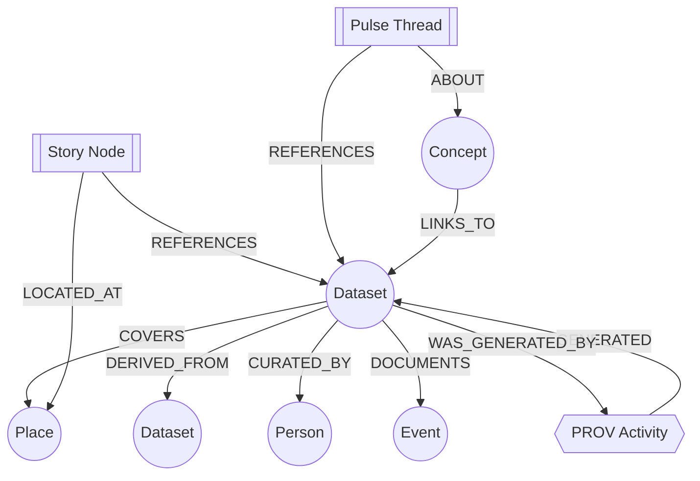

# 🧠🔗 Graph Contracts — MCP Gate Pack (Neo4j + PROV)


📍 **Path:** `mcp/gates/contracts/graph/`  
🎯 **Purpose:** Define + enforce **contract-first** rules for what is allowed to enter/leave the **KFM knowledge graph**.

---

> [!IMPORTANT]
> **Fail-closed by default.** If a graph change can’t prove **schema + provenance + sensitivity** compliance, it does **not** ship.

> [!IMPORTANT]
> **No mystery nodes.** If it can’t be traced to the “evidence triplet” (STAC/DCAT/PROV) or an approved provenance event, it does **not** exist in the official graph.

---

<details>
<summary>📚 Table of Contents</summary>

- [Why this exists](#why-this-exists)
- [Where this fits in the KFM pipeline](#where-this-fits-in-the-kfm-pipeline)
- [What this folder owns](#what-this-folder-owns)
- [Gate philosophy](#gate-philosophy)
- [High-level graph model](#high-level-graph-model)
- [Minimum gate set](#minimum-gate-set)
- [Contract surfaces](#contract-surfaces)
- [Validation responsibilities](#validation-responsibilities)
- [Operational health checks](#operational-health-checks)
- [Change workflow](#change-workflow)
- [Versioning and migrations](#versioning-and-migrations)
- [Sensitivity and cultural protocols](#sensitivity-and-cultural-protocols)
- [Federation readiness](#federation-readiness)
- [Related docs and reference library](#related-docs-and-reference-library)

</details>

---

## Why this exists

KFM treats the knowledge graph as a **semantic spine**: datasets, places, people, events, story content, AI outputs, and even DevOps provenance become queryable nodes/edges.

That’s powerful… and dangerous if the graph becomes a dumping ground.

This gate pack ensures:

- ✅ Every graph addition is **evidence-backed** (metadata + provenance), not vibes.
- ✅ The UI only talks to the graph via **governed APIs** (GraphQL/REST), never direct DB access.
- ✅ Sensitivity rules (FAIR/CARE, restricted coordinates, cultural protocols) are **enforced**, not “documented.”
- ✅ AI outputs (Focus Mode) are **citation-bound** and provenance-linked.

---

## Where this fits in the KFM pipeline

```mermaid
flowchart LR
  A[Raw/Work Data] --> B[ETL / Processing]
  B --> C[Evidence Triplet<br/>STAC + DCAT + PROV]
  C --> D[Graph Ingestion<br/>Neo4j Nodes/Edges]
  D --> E[Governed API<br/>FastAPI + GraphQL]
  E --> F[UI<br/>MapLibre/Cesium + Timeline + Stories]
  E --> G[Focus Mode (AI)<br/>Citations + Explainability]
```

**Contract intent:** the graph is not “another database.” It’s the **auditable knowledge layer** that must remain consistent, provenance-complete, and policy-compliant.

---

## What this folder owns

This directory is the **source of truth** for:

- 🧾 **Node contracts** (required properties, allowed labels/types, required provenance hooks)
- 🧷 **Relationship contracts** (allowed edge types, directionality, required endpoints)
- 🔐 **Sensitivity contracts** (classification, redaction/obfuscation rules, access tiers)
- 🧠 **AI output contracts** (citation requirements + provenance linkage for generated insights)
- 🧭 **Query contracts** (GraphQL depth/complexity guardrails; pagination expectations)
- 🧪 **MCP alignment artifacts** (how schema changes are documented/tested like experiments)

---

## Gate philosophy

### 1) Contract-first ✅
Graph shape is defined in **contracts**, not implicitly in “whatever got imported last week.”

### 2) Evidence-first 🧾
The “evidence triplet” (STAC/DCAT/PROV) is the minimum publishable unit. Graph nodes/edges must retain pointers back to the evidence.

### 3) Policy-as-code 🚦
OPA/Rego policies (run via Conftest in CI, and optionally at runtime) enforce compliance.

### 4) API boundary 🧱
The UI must not bypass the API to hit Neo4j/PostGIS directly. This keeps auth, policy, and audit centralized.

---

## High-level graph model

> [!NOTE]
> This is a **conceptual** view; exact labels/relationships are enforced by the contracts and may expand as KFM grows.



Key semantics (aligned with KFM’s stated direction):

- **CIDOC-CRM** → historical entities/events relationships  
- **OWL-Time** → temporal representation  
- **GeoSPARQL (or similar semantics)** → spatial relationships  
- **PROV-O** → lineage (what used what, who did it, when, and how)

---

## Minimum gate set

KFM v13’s “minimum gates” translate to **graph contract requirements** like:

- ✅ Schema validation (node/edge shape, required fields)
- ✅ STAC/DCAT/PROV completeness (evidence triplet present)
- ✅ License presence (no dataset enters graph without licensing clarity)
- ✅ Sensitivity classification (and correct handling of sensitive attributes)
- ✅ Provenance completeness (lineage isn’t optional)
- ✅ Focus Mode outputs require citations (or must refuse)

---

## Contract surfaces

This pack typically defines contracts for:

### 🧩 1) Node types
Examples (not exhaustive):

- `Dataset`
- `Place` / `Region` / `Watershed`
- `Event`
- `Person` / `Organization`
- `Document` / `MediaAsset`
- `StoryNode`
- `PulseThread` *(future-forward content type)*
- `Concept` *(conceptual attention / taxonomy hubs)*
- `ProvEntity` / `ProvActivity` / `ProvAgent`

### 🧷 2) Relationship types
Examples (not exhaustive):

- `COVERS`, `LOCATED_AT`
- `DERIVED_FROM`
- `CURATED_BY`
- `DOCUMENTS`, `MENTIONS`
- `BELONGS_TO_CONCEPT`, `CATEGORIZED_BY`
- `WAS_GENERATED_BY`, `USED`, `WAS_ASSOCIATED_WITH` (PROV)

### 🔐 3) Policy tags / access metadata
- `classification` (e.g., public/restricted/community)
- `access_protocol` (cultural protocol / TK label style gating)
- `obfuscation_level` (for generalized coordinates)

### 🧭 4) Query constraints (API-facing)
- GraphQL query depth limit
- Pagination required for list fields
- Allowlist/denylist for high-risk expansions (e.g., sensitive location edges)

---

## Validation responsibilities

### ✅ CI-time (static) checks
These should fail PRs fast:

- **Node CSV/JSON conforms** to allowed label/property sets
- **Relationship CSV/JSON conforms** to allowed edge sets
- **Referential integrity**
  - edges only point to known node IDs
  - required “back-pointers” exist (e.g., evidence IDs)
- **Evidence requirements**
  - dataset nodes must reference STAC/DCAT/PROV identifiers
- **License requirement**
- **Classification requirement**
- **Provenance requirement**
  - derived nodes must reference a PROV activity
- **AI output requirement**
  - generated answers/summaries must carry citations + provenance linkage

### 🟦 Runtime (API) enforcement
The API layer should enforce:

- authz checks by classification
- redaction/obfuscation rules (don’t leak restricted coordinates)
- query complexity limits (depth, breadth, expansion caps)
- audit logging of graph reads/writes (esp. sensitive access)

### 🧠 AI-specific enforcement (Focus Mode)
Focus Mode is allowed to use the graph for retrieval, but:

- it must attach citations to supporting sources
- it must refuse when citations cannot be produced
- it must record provenance for derived summaries when persisted (if persisted)

---

## Operational health checks

These are **ongoing gates** (nightly/weekly) to prevent long-term graph rot:

- 🧼 orphaned nodes (no inbound/outbound edges where expected)
- 🧷 broken lineage chains (derived nodes missing provenance edges)
- 🧾 evidence pointer integrity (STAC/DCAT/PROV IDs resolve)
- 🧭 concept hubs sanity (concept nodes connected to enough items to be meaningful)
- 📉 drift checks for real-time feeds / models (when applicable)
- 🧱 constraints/index presence (Neo4j uniqueness + key indexes)
- 🧩 “no mystery” policy (everything must map back to approved sources)

> [!TIP]
> Treat health checks like “unit tests for the knowledge graph.” A perfect import today can still decay over months without continuous checks.

---

## Change workflow

### ✅ Adding a new node or relationship (contract-first)
Checklist:

1. **Define the semantics**
   - What does this node *mean*?
   - What ontology concept does it map to (CIDOC-CRM / PROV / etc.)?
2. **Define required properties**
   - stable `id`
   - human label/title
   - evidence pointers (STAC/DCAT/PROV) where applicable
   - classification + access metadata
3. **Define provenance rules**
   - if derived: must reference a PROV activity
4. **Update ingestion mapping**
   - how does it get created from catalogs / docs / pipelines?
5. **Update API contract**
   - GraphQL type + resolver expectations
6. **Add/extend gates**
   - OPA/Rego rules + schema validators
7. **Add health checks**
   - ensure the new type doesn’t become an orphan sink
8. **Document the change (MCP-aligned)**
   - write an experiment note / design note describing why + how + validation evidence

---

## Versioning and migrations

### Contract pack versioning
Use SemVer-ish intent:

- **MAJOR:** breaking label/property changes, relationship direction changes, ID schema changes
- **MINOR:** additive node types, additive properties (non-breaking), new allowlisted edges
- **PATCH:** clarifications, stricter validation (when backwards compatible), documentation

### Migration principles
- prefer **stable IDs** (supports re-import, reconciliation, rollback)
- migrations must include:
  - forward migration steps
  - rollback plan (re-import previous snapshot, or Cypher rollback scripts)
  - updated gate tests + health checks

---

## Sensitivity and cultural protocols

KFM’s governance direction implies “openness with care”:

- **Classification is mandatory** (public vs restricted vs community-only)
- Sensitive coordinates may need **obfuscation/generalization**
- Cultural protocol tags (e.g., TK-label inspired restrictions) must be represented as explicit metadata
- Access rules are enforced by policy (not just UI hiding)

> [!IMPORTANT]
> **Graph contracts must prevent “accidental disclosure by traversal.”**  
> A query that expands from a public node into restricted geo-edges must be blocked or redacted at the API layer.

---

## Federation readiness

The contracts should support multi-instance operation:

- stable, namespaced IDs (avoid collisions across regions)
- serializable references (datasets/places/concepts referenced by IDs)
- portable “subgraph export” patterns (for offline packs or cross-instance sharing)

---

## Related docs and reference library

### 📌 Primary KFM docs (source of intent)
- KFM Data Intake (STAC/DCAT/PROV → graph → API boundary)
- KFM UI Overview (REST/GraphQL, provenance surfaced in UX)
- KFM AI Overview (graph-driven retrieval, policy pack, provenance in DevOps)
- KFM Architecture v13 (minimum gates, fail-closed philosophy, governance)
- KFM Technical Documentation (contract-first, “no mystery layers,” GraphQL/Neo4j roles)
- KFM Ideas / Proposals (DevOps → PROV integration, future ingestion patterns)
- Additional Project Ideas (Pulse Threads, Concept nodes, evidence manifests)
- Innovative Concepts (ethical governance patterns, differential access controls)

### 🧰 Supporting “implementation bookshelf”
- AI concepts / ML references (for RAG & evaluation patterns)
- data management & architecture references (for contracts + governance)
- geospatial/webgl resources (MapLibre/Cesium ecosystems, storytelling maps)
- programming language resources (GraphQL, TypeScript, Python, CI/CD patterns)

---

## TL;DR for contributors 🧩✅

- If you add data → you must add **STAC/DCAT/PROV**.
- If you add nodes/edges → they must satisfy **graph contracts**.
- If you change schema → update **OPA/Conftest gates** + **health checks**.
- If you ship AI-derived content → it must carry **citations + provenance** or **refuse**.
- If you touch sensitive info → classify + enforce **policy**, don’t “hope the UI hides it.”

🧠 The graph is KFM’s memory. Contracts keep it honest. 🔒
