# Provenance Contract ⛓️🧬  
<!-- mcp/gates/contracts/provenance/README.md -->

<p align="center">
  
  
  
  
  
</p>

> ✅ **Rule of the Frontier:** If it ships, it has provenance.  
> 🔒 This contract is enforced by MCP gates (CI + runtime policy). Missing/invalid lineage **blocks merge/publish/serve**.

---

## 🎯 Purpose

This folder defines the **Provenance Gate Contract** for the Kansas Frontier Matrix (KFM) and its **MCP** (Methods & Computational Experiments) layer.

The contract standardizes how we **represent, validate, and enforce lineage** for:

- 🗺️ **Datasets & map layers** (raw → processed → published)
- 🧪 **ETL runs, simulations, and analyses** (reproducible computation)
- 🧵 **Story Nodes / Pulse Threads** (claims → evidence manifests)
- 🤖 **Focus Mode answers** (citations required; AI outputs logged)
- 🔧 **DevOps actions** (PRs, approvals, rollbacks, provenance repairs)
- 📦 **Packaged artifacts** (e.g., OCI registry artifacts + signatures)

It is built around the **evidence triplet**: **STAC + DCAT + PROV**, plus a deterministic **run manifest**.

---

## 🧠 Core Principles (Non‑Negotiables)

### 1) Evidence‑First (No Mystery Layers) 🧾
- Every published layer must be traceable to source material and transformations.
- “Unknown origin” content is not allowed in the graph, UI, or AI responses.

### 2) Immutability & Trust Boundaries 🧱
- `data/raw/` is treated as **read‑only evidence**: never overwrite bytes.
- All transformations occur downstream (`data/work/`, `data/processed/`) and are recorded.

### 3) Deterministic, Config‑Driven ETL ♻️
- Same inputs + same config/code ⇒ same outputs (idempotent where possible).
- Manual edits to processed outputs are disallowed unless captured as a controlled activity.

### 4) Fail‑Closed Governance Gates 🔐
- If a check cannot be completed, the gate fails **closed** (blocks the change).
- Policies evolve via PR review; exceptions are explicit and versioned.

### 5) AI Is Advisory‑Only 🤝
- AI can suggest, summarize, draft — but provenance and publication remain **governed**.
- Focus Mode must **refuse** to answer if it cannot cite evidence.

---

## 🧩 What This Contract Controls

### Contract scope
This contract applies to **any publishable unit** (“artifact”) entering KFM systems:

- A dataset version (raw + processed + catalogs)
- A derived product (tileset, GeoParquet, model output, index map)
- A Story Node / Pulse Thread publication
- A Focus Mode answer (especially when cached/persisted)
- A computational run (MCP run) producing evidence artifacts
- A rollback / retraction / correction event

### Out of scope (for this contract)
- Full domain ontology semantics (handled by graph/ontology contracts)
- UI layout, theming, component behavior (handled by UI contracts)
- Access control/roles (handled by authz policies, though provenance must record agents)

---

## 📦 The Provenance Bundle (Required Artifacts)

A **Provenance Bundle** is the minimum set of files that makes an artifact:

- auditable ✅
- reproducible ♻️
- linkable across STAC/DCAT/PROV 🔗
- safe to publish under policy 🛡️

### ✅ Required files (minimum)
| File | Purpose | Notes |
|---|---|---|
| `prov.jsonld` | Machine‑readable lineage graph (W3C PROV‑O) | Must identify Activity/Entities/Agents |
| `run_manifest.json` | Deterministic execution record | Includes inputs, tool versions, counts, environment |
| `checksums.sha256` | Tamper evidence for bundle contents | Must include hashes for the above files |

### ⭐ Strongly recommended (policy may require by context)
| File | Purpose |
|---|---|
| `sbom.spdx.json` or `sbom.cdx.json` | Supply‑chain traceability for code/env |
| `attestation.intoto.jsonl` | In‑toto provenance / build attestation |
| `signature.(cosign|sigstore).json` | Artifact signing / chain of custody |
| `evidence_manifest.(yml|json)` | Narrative claim → evidence mapping (Story Nodes) |
| `catalog_refs.json` | Links to STAC item IDs + DCAT dataset IDs for this bundle |

---

## 🔗 Cross‑Layer Linkage (STAC + DCAT + PROV)

KFM treats **catalogs as published boundary artifacts**. This contract requires the **linkage** to be explicit.

### Required linkage expectations
At minimum, each bundle MUST allow the system to traverse:

1. **STAC** (spatial asset / item / collection)  
2. **DCAT** (dataset metadata, license, distributions)  
3. **PROV** (lineage: who/what/when/how)  
4. **Run manifest** (exact reproducible execution details)

### Practical rule of thumb
If a PR adds/changes **processed data**, it MUST also add/modify:

- a corresponding **STAC** entry,
- a corresponding **DCAT** entry,
- a corresponding **PROV** record,
- and the **run manifest + checksums** that tie everything together.

---

## 🧬 Provenance Data Model (PROV‑O, KFM Profile)

We use **W3C PROV‑O** concepts:

- **Entity**: a thing (file, dataset, recordset, tileset, answer, story)
- **Activity**: an action/process (ETL run, reproject, merge, generate answer)
- **Agent**: who/what did it (human, CI runner, service account, AI agent)

### KFM profile conventions (recommended)
To keep provenance queryable across the platform, we recommend a consistent ID scheme:

- Entity IDs: `urn:kfm:entity:<type>:<stable_id>@<version>`
- Activity IDs: `urn:kfm:activity:<pipeline_name>:<run_id>`
- Agent IDs: `urn:kfm:agent:<user_or_service>:<id>`

…and KFM extensions such as:

- `kfm:classification` / `kfm:sensitivity`
- `kfm:license_spdx`
- `kfm:run_id`
- `kfm:canonical_digest` (ties to run manifest hash)
- `kfm:source_urls` (where inputs originated)
- `kfm:policy_pack_version`

---

## 🧾 Run Manifest Requirements (Reproducibility Backbone)

A `run_manifest.json` MUST be sufficient to reproduce (or at least audit) the activity.

### Minimum recommended fields
```json
{
  "run_id": "RUN-2026-01-22T120000Z-ABCD",
  "pipeline": "kfm-etl-water-gauges",
  "started_at": "2026-01-22T12:00:00Z",
  "ended_at": "2026-01-22T12:05:12Z",
  "source_urls": ["https://example.gov/data.csv"],
  "inputs": [{"path": "data/raw/usgs/data.csv", "sha256": "…"}],
  "outputs": [{"path": "data/processed/usgs/gauges.parquet", "sha256": "…"}],
  "tool_versions": {"python": "3.12.1", "gdal": "3.8.4"},
  "summary_counts": {"records_in": 1200, "records_out": 1198, "errors": 2},
  "canonical_digest": "sha256:…",
  "idempotency_key": "sha256:…"
}
```

> 🧠 Why the digest fields matter:  
> Canonical JSON + SHA‑256 turns the manifest into a **self‑fingerprinting object** you can reference from PROV and the graph.

---

## ✅ Gate Checks (What the Provenance Gate Enforces)

> 🔒 **Fail‑closed by default**: if a check can’t be verified, the gate blocks.

### Gate check categories
| Category | Gate checks (examples) |
|---|---|
| Presence | Bundle contains required files |
| Schema | `prov.jsonld` and `run_manifest.json` are valid, parseable, and conform to profile/schema |
| Integrity | `checksums.sha256` matches actual file contents |
| Referential | PROV references valid Entity/Activity/Agent IDs; links to run manifest digest; catalog refs resolve |
| Governance | License present + approved; sensitivity/classification present; no secrets or disallowed terms |
| AI safety | Focus Mode outputs must include citations; AI activities are marked as AI‑assisted |
| Auditability | All publishable artifacts map to a PROV activity; rollback/retractions are explicit activities |

### Common “gate closed” failure reasons 🚫
- Missing `prov.jsonld` for a new/changed processed dataset
- No license metadata / invalid license identifier
- Run manifest missing `tool_versions` or cannot be hashed consistently
- PROV references an Entity that doesn’t exist (broken lineage chain)
- Checksums don’t match (tamper / accidental regeneration)
- Narrative/story references evidence that isn’t in the manifest

---

## 🗂️ Suggested Bundle Placement (KFM + MCP)

> ✅ This contract is enforced wherever provenance is stored — these are conventions for consistency.

### Data lifecycle bundles (KFM)
- `data/prov/<dataset_id>/<version>/...`  📦 (bundle directory)
- `data/catalog/stac/...`  🗺️ (STAC outputs)
- `data/catalog/dcat/...`  🧾 (DCAT outputs)
- `data/audits/<run_id>/run_manifest.json`  🧪 (run audits)

### Experiment/run bundles (MCP)
- `mcp/runs/<run_id>/provenance/...`  🧬  
- `mcp/runs/<run_id>/model_card.md`  🪪  
- `mcp/runs/<run_id>/artifacts/...`  📦  

---

## 🗺️ End‑to‑End Provenance Flow (Canonical Pipeline)

```mermaid
flowchart LR
  Raw["data/raw (immutable) 🧱"] --> Work["data/work ♻️"]
  Work --> Proc["data/processed ✅"]
  Proc --> Catalog["STAC + DCAT 📚"]
  Catalog --> Prov["PROV (prov.jsonld) ⛓️"]
  Prov --> Graph["Neo4j Evidence Graph 🔗"]
  Graph --> API["Contracted APIs 🧩"]
  API --> UI["Map UI + Layer Provenance 🔎"]
  UI --> Story["Story Nodes / Pulse Threads 🧵"]
  Story --> Focus["Focus Mode 🤖"]
  Focus --> Ledger["Governance Ledger 📜"]
```



---

## 🧵 Story Nodes & Evidence Manifests (Narrative Provenance)

Narrative content is treated as **machine‑ingestible storytelling**.

### Required behavior
- Every claim in a Story Node MUST map to evidence references.
- Evidence MUST resolve to cataloged items/entities (datasets, documents, images).

### Recommended file
`evidence_manifest.yml` (or JSON) accompanying the Story Node.

Example (minimal):
```yaml
story_id: SN-1951-FLOOD-TOPEKA
version: 1.0.0
claims:
  - id: C1
    text_span: "…"
    evidence:
      - entity: "urn:kfm:entity:dataset:usgs_water_levels@2026.01"
        locator: "dcat:dataset:USGS-NWIS"
      - entity: "urn:kfm:entity:doc:topeka_archive_letter_1951@1"
        locator: "stac:item:doc-1951-001"
```

---

## 🤖 Focus Mode (AI) Provenance Rules

Focus Mode is governed like any other subsystem.

### Hard rules
- **No citations → no answer.**
- AI‑generated suggestions MUST be marked as AI‑assisted and logged.
- Answers based on dynamic queries (e.g., real‑time readings) MUST still record:
  - the input entities used (with timestamps),
  - the agent,
  - the activity that produced the answer.

### Recommended PROV pattern for AI answers
- Entity: the question (or request)
- Activity: “answer_generation”
- Entities used: cited datasets/docs + any dynamic query results
- Entity generated: the answer (persisted record, if stored)
- Agent: AI system + supervising user (if applicable)

---

## 🔧 DevOps, Rollbacks, and Provenance Repair

The contract supports **transparent undo**:

- Rollbacks are modeled as explicit PROV Activities.
- Retracted datasets/layers remain in lineage but marked as superseded/retracted.
- “Provenance repair” is allowed only as governed, auditable maintenance work.

> 🧯 If you need to fix provenance after the fact: **add a repair activity**; don’t rewrite history.

---

## 🛠️ How to Comply (Contributor Checklist)

### When you add/change processed data ✅
- [ ] Raw inputs saved in `data/raw/` (immutable)
- [ ] Transformations are code/config driven
- [ ] Run manifest generated + hashed
- [ ] PROV record references run manifest digest and inputs/outputs
- [ ] STAC + DCAT updated and cross‑linked
- [ ] Checksums file matches bundle contents
- [ ] License + sensitivity tags present
- [ ] CI gates pass (schema + policy + integrity)

### When you publish narrative content 🧵
- [ ] Evidence manifest exists and resolves
- [ ] Claims have citations
- [ ] Any AI assistance is explicitly marked

### When you publish AI outputs 🤖
- [ ] Every claim has citations
- [ ] Output is logged/traceable
- [ ] OPA/runtime policy accepts the response

---

## 🧷 Versioning & Compatibility

- This contract SHOULD follow **SemVer**.
- Profile/schema changes that break consumers require a **major** bump.
- Policy changes that tighten enforcement may be minor/patch, but should be announced.

### Recommended IDs
- Contract ID: `mcp.gates.contracts.provenance`
- Profile ID: `kfm-prov` (with explicit version tag)

---

## 📚 Standards & References (External)

- **W3C PROV‑O** (entities, activities, agents)
- **STAC** (spatial cataloging)
- **DCAT** (dataset cataloging)
- **RFC 8785** (JSON Canonicalization Scheme)
- **SPDX / CycloneDX** (SBOM formats)
- **in‑toto / SLSA** (supply chain attestations)

---

## 🧯 Troubleshooting

<details>
<summary><strong>“Gate closed: missing provenance for changed data/processed output”</strong></summary>

- Ensure a bundle exists for the dataset version you changed.
- Add/update `run_manifest.json`, `prov.jsonld`, and `checksums.sha256`.
- Confirm PROV `used` references include the raw inputs and config/code plan.

</details>

<details>
<summary><strong>“Gate closed: checksums mismatch”</strong></summary>

- Recompute the SHA‑256 hashes after generating outputs.
- Ensure no tooling auto-formats JSON post-hash (canonicalize first).

</details>

<details>
<summary><strong>“Gate closed: Story Node evidence does not resolve”</strong></summary>

- Verify each referenced dataset/doc exists in catalogs.
- Use stable IDs and ensure the correct version is cited.

</details>

---

## 🧭 See Also (Inside This Repo)

> 🗂️ These pointers assume the canonical v13 layout.

- `docs/MASTER_GUIDE_v13.md` (canonical pipeline + governance invariants)
- `data/raw/README.md` (trust boundary rules)
- `data/prov/` (published provenance store)
- `schemas/` (STAC/DCAT/PROV/story schemas)
- `src/pipelines/` (ETL code and deterministic transforms)
- `src/graph/` (ingest lineage into Neo4j)
- `web/` (Layer Provenance UI + citations display)
- `docs/reports/story_nodes/` (governed narrative content)
- `mcp/` (runs, notebooks, model cards, experiment tracking)

---

## ✅ Definition of Done

This contract is “done” when:

- A contributor can add a dataset/run/story and pass the gate on the first try ✅
- The graph can ingest provenance without guessing or manual patching 🔗
- The UI can display “Layer Provenance” for any active layer 🔎
- Focus Mode can cite evidence or refuses safely 🤖
- Rollbacks and repairs are transparent and auditable 🧯

---
