# 01 — Data Intake Gate 📥🧾


> **Goal:** Turn *any* raw source into **governed, reproducible, auditable** KFM-ready artifacts — by passing it through a chain of **Gates** that enforce the KFM invariants:
> - ✅ **Raw is immutable**
> - ✅ **ETL is deterministic + idempotent**
> - ✅ **Nothing is “published” until the Evidence Triplet exists (STAC + DCAT + PROV)**
> - ✅ **No downstream layer can bypass the governed API boundary**
> - ✅ **Classification/sensitivity propagates end-to-end** 🔒

---

## 🧭 What this example demonstrates

This example is a reference implementation of the **KFM Data Intake Pipeline** expressed as an **MCP Gate** workflow:

- 📥 **Raw ingest** with `source.json` + `checksums.sha256`
- 🚦 **Basic validation (“ingestion gate”)** + telemetry ledger (append-only NDJSON)
- 🧪 **Deterministic transforms** into standardized outputs
- 🛰️ **Catalog emission** (the “evidence triplet”: STAC + DCAT + PROV)
- 🕸️ **Graph ingestion readiness** (catalogs → graph; no “mystery nodes”)
- 🔐 **Policy-as-code** (OPA/Rego via Conftest; fail-closed; secrets scanning)
- 🧩 **Downstream consumption** patterns (API → UI → Story Nodes → Focus Mode)

---

## 📌 Table of contents

- [Quickstart](#-quickstart)
- [Pipeline at a glance](#-pipeline-at-a-glance)
- [Folder layout](#-folder-layout)
- [Gate chain](#-gate-chain)
- [Contracts](#-contracts)
- [Artifacts](#-artifacts)
- [Policy hooks](#-policy-hooks)
- [UI + Focus Mode consumption](#-ui--focus-mode-consumption)
- [Extensions](#-extensions)
- [Troubleshooting](#-troubleshooting)
- [Reference docs used](#-reference-docs-used)
- [Appendix: PDF portfolio extraction](#-appendix-pdf-portfolio-extraction)

---

## ⚡ Quickstart

> This folder is an **example**. Your repo may already have a “gate runner” CLI.
> Use the snippets below as the *expected behavior* and *expected outputs* for any runner you wire up.

### Option A — Run with a generic runner (suggested convention)

```bash
# from repo root
cd mcp/gates/examples/01-data-intake

# run the example against a dataset intake spec
# (replace the command with your repo's actual runner)
python -m mcp.gates.run \
  --example 01-data-intake \
  --config ./datasets/example.dataset.yml \
  --out ./out
```

### Option B — Validate outputs only (CI-friendly)

```bash
# Validate schemas + policy pack + catalog link integrity
python -m mcp.gates.validate --root ./out
conftest test ./out --policy ../../../policy
```

---

## 🗺️ Pipeline at a glance

```mermaid
flowchart LR
  A["External Sources 🌍"] --> B["Raw Snapshot 📥\nsource.json + checksums.sha256"]
  B --> C["Ingestion Gate 🚦\nquick validate + telemetry"]
  C --> D["ETL Work 🧪\n(data/work)"]
  D --> E["Processed Outputs 📦\n(data/processed)"]
  E --> F["Evidence Triplet 🛰️\nSTAC + DCAT + PROV"]
  F --> G["Graph Ingestion Ready 🕸️\nNeo4j bulk import or API sync"]
  G --> H["Governed API 🔐\ncontracts + redaction"]
  H --> I["Map UI 🗺️\nReact + MapLibre (+ Cesium)"]
  I --> J["Story Nodes 📖\n(governed narratives)"]
  J --> K["Focus Mode 🤖\n(evidence-linked answers)"]
```



💡 **Key invariant:** No stage may consume data that hasn’t passed the previous stage’s formal outputs and checks.

---

## 🧱 Folder layout

This example writes everything into `./out/` so it’s safe to run locally.  
In a full KFM repo, these structures typically map to top-level `data/*` directories.

```text
mcp/gates/examples/01-data-intake/
├─ README.md 📘
├─ datasets/
│  └─ example.dataset.yml 🧾
├─ fixtures/
│  └─ sample_input.csv 🧪
└─ out/  (generated) 🏗️
   ├─ data/
   │  ├─ raw/<domain>/<dataset_id>/<run_id>/        📥
   │  │  ├─ source.json
   │  │  ├─ checksums.sha256
   │  │  └─ <original files...>
   │  ├─ work/<domain>/<dataset_id>/<run_id>/       🧪
   │  └─ processed/<domain>/<dataset_id>/<version>/ 📦
   ├─ stac/
   │  ├─ collections/<collection_id>.json 🛰️
   │  └─ items/<item_id>.json            🛰️
   ├─ catalogs/
   │  └─ dcat/<dataset_id>.jsonld        🧭
   ├─ prov/
   │  └─ <run_id>.prov.jsonld            🧾
   ├─ audits/
   │  └─ <run_id>/run_manifest.json      🧾
   └─ telemetry/
      └─ intake.ndjson                   📈
```

---

## 🚦 Gate chain

Think of each Gate as a **hard contract boundary** with a pass/fail result, plus emitted artifacts.

| Gate | Name | Why it exists | Minimum outputs |
|---:|---|---|---|
| 00 | **Contract Gate** 🧾 | Enforce required dataset fields (ID, license, sensitivity, contacts, etc.) | validated config |
| 01 | **Fetch + Receipt Gate** 🌐 | Pull raw bytes (or record pointer/receipt) in a reproducible way | receipt, raw bytes |
| 02 | **Raw Snapshot Gate** 📥 | Make raw immutable & tamper-evident | `source.json`, `checksums.sha256` |
| 03 | **Ingestion Validation Gate** 🚦 | Catch corrupt/malformed data early + log telemetry | ledger entry + sanity checks |
| 04 | **Deterministic ETL Gate** 🧪 | Normalize, reproject, clean, chunk (idempotent) | `data/work/*`, `data/processed/*` |
| 05 | **Evidence Triplet Gate** 🛰️ | No publishing without catalogs + lineage | STAC + DCAT + PROV |
| 06 | **Policy Gate** 🔐 | Governance + FAIR/CARE + secrets scanning (fail-closed) | policy report |
| 07 | **Promote/Publish Gate** 🚀 | “Transactional” publish: either all artifacts land, or nothing does | final outputs |

---

## 🧾 Contracts

### 1) Dataset intake spec (example)

Your dataset intake YAML is the **human-friendly contract**. Keep it small, explicit, versioned.

```yaml
# datasets/example.dataset.yml
dataset_id: kfm.example.hydro.river_gauges
domain: hydro
version: "2026-01-23"
title: "Example River Gauges (Demo)"
description: "Demo dataset for the 01-data-intake gate chain."

source:
  kind: file
  path: "./fixtures/sample_input.csv"
  # If kind=http, include url + headers strategy (no secrets committed)

license:
  spdx: "CC-BY-4.0"
  attribution: "Example Provider"

sensitivity:
  classification: public   # public | sensitive | confidential | restricted
  notes: "No sensitive attributes."

processing:
  crs_target: "EPSG:4326"
  output_formats:
    - geojson
    - geoparquet
  steps:
    - kind: parse_csv
    - kind: normalize_columns
    - kind: validate_geometry
    - kind: reproject

catalog:
  stac:
    collection_id: "kfm.hydro.river_gauges"
  dcat:
    publisher: "Kansas Frontier Matrix (KFM)"
    themes: ["hydrology", "monitoring"]
```

### 2) `source.json` (raw provenance stub)

At raw ingest time, we store **just enough** to prove what was fetched, how, when, and under what constraints.

```json
{
  "dataset_id": "kfm.example.hydro.river_gauges",
  "retrieved_at": "2026-01-23T00:00:00Z",
  "method": "local_file_copy",
  "source": {
    "kind": "file",
    "path": "./fixtures/sample_input.csv"
  },
  "license": {
    "spdx": "CC-BY-4.0",
    "attribution": "Example Provider"
  },
  "sensitivity": {
    "classification": "public"
  },
  "checksums": {
    "sha256": {
      "sample_input.csv": "..."
    }
  }
}
```

### 3) `checksums.sha256` (tamper evidence)

```text
# checksums.sha256
<sha256>  sample_input.csv
```

---

## 📦 Artifacts

### ✅ “Evidence Triplet” is the publishing boundary

This is the single most important rule in KFM-style intake:

- **STAC** → describes geospatial assets (extent, time, checksums, assets)
- **DCAT** → describes dataset discovery metadata (publisher, license, distributions)
- **PROV** → describes lineage (inputs, processing activities, agents)

> If the triplet doesn’t exist, the dataset is **not** considered part of the platform.

---

## 🔐 Policy hooks

This example is designed to be compatible with a **Policy Pack** (OPA/Rego via Conftest) that:

- fails closed (PR blocked if policy fails) 🚫
- enforces required metadata (license, provider, sensitivity)
- blocks secrets from being committed (regex scans / allowlist)
- enforces **classification propagation** (outputs cannot be less restricted than inputs)

### Minimal policy expectations (human-readable)

- ✅ Every dataset must declare a **license** and **attribution**
- ✅ Every dataset must declare a **sensitivity classification**
- ✅ Every published dataset must have **STAC + DCAT + PROV**
- ✅ No artifacts are promoted if a gate fails
- ✅ No credentials or tokens are committed anywhere

---

## 🗺️ UI + Focus Mode consumption

### UI trust contract (“the map behind the map”) 🧭

Once a dataset passes all gates:

- the **UI loads it via the governed API** (never direct graph queries)
- the **legend / layer info** can show **Source + License** (from DCAT)
- a **Layer Info / Provenance panel** can show where it came from + how it was prepared

### Focus Mode (evidence-linked answers) 🤖

When the assistant answers a question, it should:

- **cite** the exact datasets / catalog records used
- refuse if it can’t support the answer with evidence
- optionally surface explainability (why the answer was produced, what relationships mattered)

---

## 🧬 Extensions

### 1) Streaming / rapid updates ⏱️

Treat streaming as “many small datasets over time”:

- append-only ingest (no silent rewrites)
- checkpoint/rollups (daily/hourly) as stable artifacts
- still emit at least a **stub provenance record** before UI display

### 2) OCI artifact distribution (fast + signed) 📦🔏

For large artifacts (PMTiles, GeoParquet, COGs):

- push artifacts to an OCI registry (ORAS)
- sign with Cosign
- reference immutable digests from STAC/DCAT
- attach PROV as a referrer/attestation

> This is how you get content-addressable, reproducible distribution without stuffing git with huge binaries.

### 3) Graph health checks 🕸️✅

Automate detection of:
- orphan nodes (missing links between STAC/DCAT/PROV)
- ingestion lag (SLA breaches for streaming sources)
- suspicious hubs or broken provenance chains

### 4) Watcher → Planner → Executor agents 👀🧠⚙️

If you’re automating intake:
- **Watcher** detects new data
- **Planner** prepares a change *only if policy allows*
- **Executor** runs gates + attaches attestations (SBOM/SLSA) + opens a PR (never auto-merge)

---

## 🧯 Troubleshooting

### “My dataset exists, but it’s not visible in the UI”
Checklist:
- Did STAC + DCAT + PROV get generated? 🛰️
- Did policy pass (fail-closed)? 🔐
- Did graph ingestion run (if your UI needs graph discovery)? 🕸️
- Is the dataset classification restricting it? 🔒

### “I need to add a new domain”
Follow the canonical lifecycle pattern:
- `raw/` → `work/` → `processed/` → catalogs → graph → API → UI → story/focus  
…and keep domain data isolated under its own folder.

---

## 📚 Reference docs used

These are the project docs this example aligns with (and is meant to operationalize):

### Core KFM specs 📘
- **📚 Kansas Frontier Matrix (KFM) Data Intake – Technical & Design Guide** (raw ingest, ingestion gate, evidence triplet, telemetry)
- **Kansas Frontier Matrix (KFM) – Comprehensive Architecture, Features, and Design** (layering, hybrid PostGIS + graph, standards, governance)
- **Kansas Frontier Matrix (KFM) – Comprehensive Technical Documentation** (API/UI structure, MapLibre/Cesium notes)
- **Kansas Frontier Matrix – Comprehensive UI System Overview** (UI transparency, provenance surfacing, offline packs)
- **Kansas Frontier Matrix (KFM) – AI System Overview 🧭🤖** (Focus Mode citations + explainability)
- **🌟 Kansas Frontier Matrix – Latest Ideas & Future Proposals** (Watcher/Planner/Executor, FAIR/CARE enforcement, supply chain attestations)
- **Innovative Concepts to Evolve the Kansas Frontier Matrix (KFM)** (forward-looking extensions)
- **Additional Project Ideas** (OCI artifact distribution, canonical run manifests, policy gate patterns)

### Research binders (PDF portfolios) 📚
These are “deep reference” portfolios containing embedded books/notes:
- **AI Concepts & more.pdf** 🤖
- **Maps-GoogleMaps-VirtualWorlds-Archaeological-Computer Graphics-Geospatial-webgl.pdf** 🗺️
- **Various programming langurages & resources 1.pdf** 🧰
- **Data Managment-Theories-Architures-Data Science-Baysian Methods-Some Programming Ideas.pdf** 🗄️

---

## 🧷 Appendix: PDF portfolio extraction

Some project PDFs are **portfolios** (a single PDF that contains embedded PDFs).  
If you want to inspect what’s inside:

```bash
python - << 'PY'
from pypdf import PdfReader

paths = [
  "AI Concepts & more.pdf",
  "Maps-GoogleMaps-VirtualWorlds-Archaeological-Computer Graphics-Geospatial-webgl.pdf",
  "Various programming langurages & resources 1.pdf",
  "Data Managment-Theories-Architures-Data Science-Baysian Methods-Some Programming Ideas.pdf",
]

for p in paths:
  r = PdfReader(p)
  atts = list(r.attachment_list)
  print(f"\n== {p} ==")
  print("attachments:", len(atts))
  for a in atts[:12]:
    print(" -", a.name)

PY
```

> Tip 🧠: If you want extraction-by-topic (e.g., “geoprocessing”, “google maps”, “bayesian”), build a small script that filters attachment names and exports only those into `docs/research/extracted/`.

---

