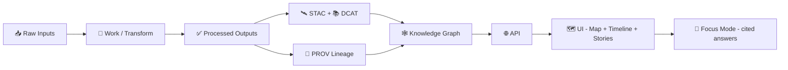

# 🧪 Fixtures — Example `01-data-intake` (Gate Playground)


> [!IMPORTANT]
> This folder is the **test bench** for proving *data intake rules* with **small, deterministic fixture packs**.  
> If a dataset (even a toy one) can’t pass **license + metadata + provenance** requirements here, it doesn’t get to “graduate” into real ingestion.

---

<details>
<summary>📌 Table of Contents</summary>

- [🎯 Why fixtures exist](#-why-fixtures-exist)
- [🗂️ Fixture pack contract](#️-fixture-pack-contract)
- [🔁 Pipeline mental model](#-pipeline-mental-model)
- [🧾 Boundary artifacts](#-boundary-artifacts)
- [🛡️ Governance & policy gates](#️-governance--policy-gates)
- [🧬 Fixture types we want coverage for](#-fixture-types-we-want-coverage-for)
- [📦 Adding a new fixture pack](#-adding-a-new-fixture-pack)
- [🧰 Helpful geospatial conversion recipes](#-helpful-geospatial-conversion-recipes)
- [🧠 AI/analysis fixtures](#-aianalysis-fixtures)
- [🧷 Troubleshooting](#-troubleshooting)
- [📚 Reference docs that shaped this contract](#-reference-docs-that-shaped-this-contract)

</details>

---

## 🎯 Why fixtures exist

KFM-style ingestion is not “just load files” — it’s **managed promotion**:

- 📥 Raw → 🧪 Work → ✅ Processed  
- 🛰️ STAC + 📚 DCAT + 🔗 PROV must exist **before** anything can safely feed the graph/API/UI
- 🧾 Policies behave like tests: a failed license/provenance/sensitivity rule blocks “publishing”

These fixtures are designed to **force the contract** early — *before* we scale up with real data, streaming feeds, OCR corpora, or AI-derived layers.

> [!NOTE]
> The core premise: a “living atlas” only stays trustworthy if every layer can answer **“where did this come from?”** and **“what changed?”** — with receipts.

---

## 🗂️ Fixture pack contract

Each fixture is a **self-contained directory** (a “fixture pack”) with:

- ✅ tiny inputs (safe to commit)
- ✅ deterministic expected outputs
- ✅ integrity hashes
- ✅ run metadata (so failures are debuggable and reproducible)

### 📁 Suggested layout (per fixture pack)

```text
fixtures/ 🧪
└─ 🧩 <fixture-id>/                     # 🧩 One end-to-end fixture bundle (inputs → expected outputs + receipts)
   ├─ 📄 README.md                      # 📘 What this fixture proves, how to run it, and what “success” means
   ├─ 📥 input/                         # 📥 Inputs for the fixture (keep tiny, deterministic, license-cleared)
   │  ├─ 🧾 sources/                    # 🧾 Source descriptors (where data came from, license, retrieval notes)
   │  │  └─ 🧾 source.json              # Source contract (id, URL/URI, license, timestamps, checksums/pointers)
   │  └─ 📦 raw/                        # 📦 Small raw sample files (immutable snapshot boundary)
   │     └─ 📦 <small-sample-files…>    # Tiny artifacts only (no large rasters/tiles; use pointers/receipts instead)
   ├─ ✅ expected/                      # ✅ Expected outputs (golden results used for regression testing)
   │  ├─ 🧼 processed/                  # 🧼 Expected processed artifacts (normalized/cleaned outputs)
   │  │  └─ ✅ <expected-processed-outputs…>
   │  ├─ 🛰️ stac/                       # 🛰️ Expected STAC metadata (collection + item snapshots)
   │  │  ├─ 🧾 item.json                # STAC Item referencing produced assets + roles/links
   │  │  └─ 🧾 collection.json          # STAC Collection describing the dataset/product
   │  ├─ 📚 dcat/                       # 📚 Expected DCAT discovery metadata (dataset + distributions)
   │  │  └─ 🧾 dataset.jsonld           # DCAT Dataset/Distribution record (license/access/links)
   │  ├─ 🔗 prov/                       # 🔗 Expected provenance/lineage bundle (PROV-O JSON-LD)
   │  │  └─ 🧬🧾 lineage.jsonld          # PROV entities/activities/agents connecting inputs → outputs
   │  ├─ 🛡️ policies/                   # 🛡️ Expected policy evaluation outputs (OPA/Conftest results)
   │  │  └─ 🧪🧾 results.json            # Pass/fail + findings (codes/severities) for this fixture
   │  └─ 🕸️ graph/                      # 🕸️ Expected graph import artifacts (optional)
   │     └─ 🕸️📄 import.cypher          # Cypher import script or expected mutation statements
   └─ 🏃 run/                           # 🏃 Run receipts for reproducing/verifying this fixture
      ├─ 🧾🔐 run_manifest.json          # Run manifest: commands, params, tool versions, IO, digests, timestamps
      └─ 🔐📄 checksums.sha256           # sha256 sums for input/expected artifacts (tamper detection)
```

### ✅ Minimal required files

| Path | Required | What it proves 🧪 |
|---|---:|---|
| `input/sources/source.json` 🧾 | ✅ | Source URL / license / expected schema (metadata-as-code) |
| `input/raw/*` 📦 | ✅ | Immutable raw sample (tiny) |
| `expected/processed/*` 🧼 | ✅ | What the pipeline *should* produce |
| `expected/stac/*` 🛰️ | ✅ | Spatial/temporal catalog boundary artifact |
| `expected/dcat/*` 📚 | ✅ | Dataset-level catalog boundary artifact |
| `expected/prov/*` 🔗 | ✅ | Lineage boundary artifact (inputs → activity → outputs) |
| `run/run_manifest.json` 🧾 | ✅ | Reproducible run record for the gate |
| `run/checksums.sha256` 🔐 | ✅ | Tamper evidence + deterministic verification |
| `expected/policies/*` 🛡️ | ⛳ optional | Policy outcomes (license/sensitivity/provenance-first) |
| `expected/graph/*` 🕸️ | ⛳ optional | Downstream semantic registration (Neo4j import) |

> [!TIP]
> If your runner currently expects different filenames, keep the **conceptual contract** intact (inputs + expected outputs + hashes + run record), then map paths in code.

---

## 🔁 Pipeline mental model

These fixtures mirror the intended system flow:



Key idea: **nothing “publishes” without the boundary artifacts** (catalog + provenance).

---

## 🧾 Boundary artifacts

### 🛰️ STAC (asset-level)

Use STAC Items/Collections to describe:

- 📍 spatial extent (bbox/geometry)
- ⏳ temporal coverage (datetime/start/end)
- 📦 assets (COG/GeoParquet/GeoJSON/etc)
- 🏷️ license + attribution + lineage pointers

### 📚 DCAT (dataset-level)

DCAT is the “catalog front door”:

- dataset title/description
- themes/tags
- publisher/source
- distribution links (files/API)
- access constraints / sensitivity markers

### 🔗 PROV (lineage)

PROV ties it together:

- **Entities**: raw files, processed outputs, derived artifacts
- **Activities**: transform steps (OCR, reproject, aggregate, tile, model run)
- **Agents**: pipeline tool, contributor, (optionally) AI model/system

> [!IMPORTANT]
> Derived/AI outputs (OCR corpora, simulated rasters, AI-predicted layers) are **first-class datasets**: they must live like any other processed output (cataloged + provenanced), not as “misc files.”

---

## 🛡️ Governance & policy gates

Fixtures must explicitly test the rules we want to enforce:

### ✅ License & attribution (FAIR)

- Every fixture must declare:
  - license identifier (or “unknown” that triggers failure)
  - attribution text
  - source URL(s) / archive reference(s)

### 🔐 Sensitivity / access constraints (CARE)

Include at least one fixture scenario that exercises:

- redaction/obfuscation ✅
- “restricted” classification ✅
- safe defaults (deny-by-default) ✅

> [!WARNING]
> Never put real sensitive info in fixtures. Use synthetic data, coarse aggregation, or anonymized samples.

### 🧾 Provenance-first publishing

Even streaming/real-time examples should have at least **stub provenance** before being treated as displayable data.

---

## 🧬 Fixture types we want coverage for

A healthy fixture library covers the platform’s real shape — not just happy paths.

| Fixture type | Example inputs 📥 | Expected outputs ✅ | Gate behaviors to prove 🧪 |
|---|---|---|---|
| 🗺️ Vector | GeoJSON/CSV | cleaned GeoJSON/GeoParquet + STAC/DCAT/PROV | schema checks, bbox/time extent, naming |
| 🛰️ Raster (scanned map) | small TIFF/PNG | COG + STAC asset metadata | georef metadata, tiling/overviews, lineage |
| 📄 Document/OCR | PDF/text snippet | extracted text + entities + PROV | evidence artifact treatment, traceability |
| ⏱️ Streaming snapshot | NDJSON/CSV “tick” | STAC item per tick + DCAT feed + stub PROV | “many small datasets” pattern, timestamp immutability |
| 🧪 Simulation result | small raster/table | processed outputs + catalog + PROV activity | promotion only after validation (transaction semantics) |
| 🔐 Sensitive dataset | synthetic points | redacted output + policy result | CARE checks, access constraints enforced |
| 🧵 Story/evidence (optional) | markdown + manifest | validated manifest + PROV links | citation discipline + auditability |

---

## 📦 Adding a new fixture pack

### 1) Pick an ID 🏷️

Use stable, sortable IDs:

- `f01_vector_basic`
- `f02_raster_cog_min`
- `f03_doc_ocr_stub`
- `f04_stream_tick`
- `f05_sensitive_redaction`

### 2) Add the source manifest 🧾

Your `input/sources/source.json` should include (at minimum):

- `source_url`
- `retrieved_at` (ISO-8601)
- `license`
- `expected_schema` (human description or machine schema ref)
- `notes` (optional)

> [!TIP]
> When real datasets are large, the manifest can be the “source of truth” and fixtures can store only tiny representative samples.

### 3) Add tiny raw data 📦

- Keep raw samples **small** (ideally KB–few MB)
- Treat raw as immutable (append-only philosophy)

### 4) Define expected outputs ✅

Your `expected/` folder should reflect:

- processed outputs (cleaned, reprojected, transformed)
- STAC/DCAT/PROV “boundary artifacts”
- optional policy evaluation outcomes

### 5) Add integrity hashes 🔐

Create/update `run/checksums.sha256` including **all** relevant files.

### 6) Add run metadata 🧾

`run/run_manifest.json` should capture:

- fixture ID
- toolchain versions (when relevant)
- input/output digests
- policy pack version/digest (if applicable)
- timestamps + determinism notes

> [!NOTE]
> A strong pattern is to use **canonical JSON** before hashing (e.g., RFC 8785 JSON Canonicalization Scheme) so digests are stable across formatting.

### ✅ Definition of Done (fixture PR checklist)

- [ ] `input/sources/source.json` has license + URL + retrieved_at
- [ ] `input/raw/` contains only safe, tiny samples
- [ ] `expected/processed/` matches what the pipeline should output
- [ ] STAC + DCAT + PROV exist and reference each other meaningfully
- [ ] `run/checksums.sha256` verifies all relevant files
- [ ] `run/run_manifest.json` documents how/why outputs were produced
- [ ] If sensitive: redaction present + policy expectations included
- [ ] If AI-derived: provenance includes model/tool + parameters (as feasible)

---

## 🧰 Helpful geospatial conversion recipes

These are convenient when *building* fixtures locally (keep outputs tiny).

### 🛰️ Convert GeoTIFF → COG (Cloud-Optimized GeoTIFF)

```bash
gdal_translate \
  -co TILED=YES \
  -co COPY_SRC_OVERVIEWS=YES \
  input.tif output_cog.tif
```

### 🗺️ Convert Shapefile → GeoJSON

```bash
ogr2ogr -f GeoJSON output.geojson input.shp
```

### 🧼 Reproject a raster

```bash
gdalwarp -t_srs EPSG:4326 input.tif output_4326.tif
```

> [!TIP]
> Prefer EPSG:4326 for small interop fixtures unless a test specifically targets projection behavior.

---

## 🧠 AI/analysis fixtures

If a fixture includes OCR, NER/geoparsing, or model inference outputs:

- Treat outputs as **datasets** (not “notes”)
- Store them under `expected/processed/`
- Catalog them (STAC/DCAT) and trace them (PROV)
- Label them as derived/AI-generated to preserve transparency

Optional (but excellent): include a tiny `model_card.md` 📄 or equivalent metadata for the model/tool used.

---

## 🧷 Troubleshooting

### “Why does this gate care about metadata so much?” 🤔

Because downstream components (graph, API, UI, Focus Mode) depend on the catalog/provenance boundary artifacts to:

- show attributions in UI layers
- enable time slider behavior (temporal extent)
- allow “map behind the map” inspection
- let an AI assistant cite sources rather than hallucinate

### “My fixture is too big” 📦

- Shrink it (crop raster, sample rows, simplify geometry)
- Store **only** manifests and tiny representative samples in fixtures
- For large artifacts, use an external artifact store (e.g., OCI registry/LFS) and keep hashes + pointers here

---

## 📚 Reference docs that shaped this contract

These concepts and requirements are aligned with the broader KFM system design:

- 🏗️ Architecture flow: Raw → ETL → Catalog/Provenance → Graph → API → UI → Focus Mode  
- 🛰️ “STAC + DCAT + PROV” as required publishing boundary artifacts  
- 🧪 Managed promotion + transactional pipeline semantics (avoid half-baked catalog states)  
- 🧾 Evidence-first narratives and manifests (optional fixture type)  
- 🛡️ Policies as tests (FAIR/CARE enforcement)  
- 🧰 Practical geospatial tooling (GDAL/OGR/QGIS/PostGIS)  
- 🔬 Reproducibility patterns (run logs, immutable raw data)

> [!NOTE]
> Keep this README “contract-first.” If the runner implementation evolves, update the *mapping*, not the principles.

